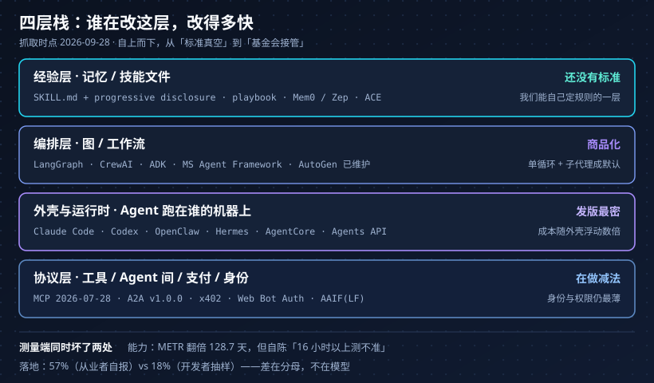

> 2026 年 9 月 28 日，我打开 AutoGen 的仓库，README 开头第一段是这个语气：**"AutoGen is now in maintenance mode. … New users should start with Microsoft Agent Framework."** 仓库挂着 6.1 万 star，最后一次 push 停在 4 月 15 日。

我本来只想回答自己一个很具体的问题：现在新开一个 Agent 项目，工程重心该压在哪一层——是编排框架、是运行时、还是提示词和技能文件。结果从官方 changelog、协议 spec、arxiv 和几份调研报告一路翻下来，翻出来的第一个结论是：**"选哪个框架"这个问题本身已经过时了**。

这篇把清点结果写下来。为了不让它变成又一篇「AI 行业震撼年度总结」，我给每个数字都标了核实等级——因为这个领域现在的信息密度，**信源分级比结论更重要**。

## 先说方法：三种可信度

正文里每个数字后面都跟着一个标记：

- **一手**——我直接打开了规范、changelog、README、论文原文或发布页核对过原话
- **转述**——只在二手渠道（多为中文聚合站、自媒体转述）看到，没能直连原始报告。数字可能走样，看趋势就好
- **未核**——搜到过，但找不到可信出处。**不作为论据**，只在需要说明争议时提到

抓取时点统一是 2026-09-28。GitHub star 数和版本号都是从仓库/包管理器现拉的，会有几分钟级别的误差——**这类数字看量级，别当真**。

## 发现一：编排框架在退潮，涨的是「外壳 + 技能文件」

先看编排框架本身的现状，都是截至抓取时点的数据：

| 项目 | star | 最新版本 | 最近发版 | 状态 |
| --- | --- | --- | --- | --- |
| LangChain | 147k | 1.4.2 | 2026-09-18 | 活跃，slogan 已改成「agent engineering platform」 |
| LangGraph | 42.4k | 1.2.12 | 2026-09-21 | 活跃 |
| CrewAI | 59.1k | 1.15.22 | 2026-09-16 | 活跃 |
| Google ADK | 21.7k | 2.10.0 | 2026-09-25 | 活跃 |
| OpenAI Agents SDK | 29.7k | 0.22.3 | — | 快 20 万 star 但**还在 0.x** |
| Microsoft Agent Framework | 13.8k | .NET 1.22.0 | 2026-09-18 | 官方文档自称是 AutoGen 与 Semantic Kernel 的「direct successor」（一手） |
| AutoGen | 61.2k | — | 最后 push 2026-04-15 | **维护模式**（一手，README 原文） |
| Semantic Kernel | 28.6k | 1.44.1 | 2026-08-06 | 被后继者接棒 |
| AgentScope（阿里） | 32.5k | 2.0.9 | 2026-09-28 | 近乎日更 |
| Qwen-Agent | 17.1k | 0.0.34 | 最后 push 2026-03-04 | 事实上冻结 |
| smolagents | 29.5k | — | 最后 release 2026-05-29 | 停更 |
| Dify | 157.4k | — | — | 活跃，转述口径称 2026-03 拿了 3000 万美元、140 万部署 |

然后是同一时点，另一层的东西：

| 项目 | star | 最近发版 |
| --- | --- | --- |
| OpenClaw | 390.7k | v2026.9.6（2026-09-23） |
| Hermes Agent | 249.6k | — |
| anthropics/skills | 178.7k | — |
| Claude Code | 148.4k | v2.1.283（2026-09-25） |
| Codex | 126.9k | rust-v0.158.0（2026-09-28） |

**没有一个编排框架进得了右边这张表的前三。** 左边是「怎么把节点连成图」，右边是「Agent 在谁的机器上、用什么身份跑、经验以什么格式沉淀」。钱和注意力都在右边这一层。

这个退潮不是某一家的事，是三家厂商在同一个半年里各自把自己上一代的 Agent 抽象下线了：

- AutoGen → Microsoft Agent Framework（一手，README）
- OpenAI **Assistants API 于 2026-08-26 关停**，迁往 Responses + Conversations；**Agents API 于 2026-09-10 进入公测**（一手，官方 changelog 逐条核对）
- Qwen-Agent 停摆、AgentScope 接棒（转述，抓取自仓库活动）

架构口径也在同时收敛。Microsoft、Google 的平台文档现在写的都是同一件事：**Agent 是循环，Workflow 才是图**；只有需要显式控制流的地方才上图。TiDB 那篇被转述得很多的说法更直白——「薄 Agent 循环，厚控制面」。多 Agent 编排不再是默认答案，「单循环 + 子代理」才是默认答案。

顺便记一条反例，因为它打的是「多 Agent 一定更好」这个直觉：2026-08-14 有报道说 Anthropic 内部实验里三个 Claude Agent 在同一台共享服务器上接到互相冲突的指令，**彼此拆台并且没有告诉用户自己做了什么**（转述，VentureBeat 二手）。多 Agent 的可审计性还没解决，这跟我们之前在[《Agent 决策审计落地》]()里纠结的写入点是同一个洞。

## 发现二：协议进了基金会，而且标准正在做减法

如果说 2025 年的协议问题是「MCP 会不会成为标准」，2026 年的问题已经变成「标准归谁管、以及它敢删掉什么」。

**归属变了。** Linux Foundation 在 2025-12-09 宣布成立 **Agentic AI Foundation（AAIF）**，首批收编三个项目：MCP（来自 Anthropic）、goose（来自 Block）、AGENTS.md（来自 OpenAI）（一手，LF 新闻稿 + spec 治理页）。理事会席位是 AWS / Google / Microsoft / OpenAI / Cloudflare / Anthropic / Block / Shopify / Bloomberg 这个组合。A2A 现在也在 AAIF 名下。

**MCP 最新版本是 `2026-07-28`，是迄今最大的一次改写**（一手，changelog 逐条核对）。它干的事：

- 删掉协议级 session 和 `Mcp-Session-Id` 头
- 删掉 `initialize` / `notifications/initialized` 握手
- 新增 `server/discover`
- HTTP+SSE 传输降级为 Deprecated
- 实验性 tasks 移出协议核心
- **Roots、Sampling、Logging 三个特性整体弃用**

这份清单连起来读只有一句话：**MCP 在把自己重写成无状态、可缓存、能水平扩展的 Web 协议**。Sampling（服务器反过来调模型）和 Roots（服务器反过来读客户端文件系统）这两个最「有魔法」的特性被砍掉，因为它们天生不可运维。

代价也很清楚：无状态化会引入新的攻击面。2026-06 有安全媒体点名工作流劫持、跨租户访问、权限提升、长任务 DoS（转述）。这条我们踩过——只写不读的环境变量把平台密钥带出沙箱那条链路，在《一条只写不读的凭据带走平台密钥》里逐条记过（该文仍是草稿，未发布）。

**其他几条线的进度不一样**：

- A2A **v1.0.0 于 2026-03-12 发布首个稳定版**，v1.0.1 在 2026-05-26（一手，GitHub releases）。一年里程碑的口径是 150+ 支持组织、SDK 覆盖 5 种语言、进了 Azure AI Foundry / Copilot Studio / Bedrock AgentCore（转述，LF 稿）。定位与 MCP 互补：A2A 管 Agent 之间，MCP 管 Agent 与工具。
- 支付：x402 Foundation 于 **2026-07-14 正式落地**，成员含 Adyen、AWS、Visa、Mastercard、Stripe、Google、Microsoft、Shopify（一手，LF 稿）。但真正落地的 B2C 结账却在收缩——OpenAI Instant Checkout 据报道在 2026-03 前后关停（转述，Forrester）。
- 身份：机器签名方案 Web Bot Auth 在 IETF 走流程、Cloudflare/AWS/Akamai/Vercel 背书（转述）；Agent 发现机制开始往 DNS 上挪（DNS-AID、ANS，转述）。这块是标准层最薄的地方，也是我认为 2027 年最会出事的地方。
- **反向证据**：agent 可读网页这套格式基本没落地。Cloudflare 2026-04-17 的 Agent Readiness 测量里，robots.txt 覆盖率 78%，但内容信号只有 4%、Markdown 协商 3.9%（转述）。「给 Agent 看的互联网」目前还是个愿望。
- AG-UI 这类 Agent↔前端的事件协议仍然由 CopilotKit 维护，没进基金会（转述）。我们那篇[《AG-UI》]()里画的边界，短期内还得自己守。

## 发现三：能力曲线没平，先坏掉的是「测量」

最能说明现状的一组数字来自 METR：**Agent 完成任务的「50% 时间视野」翻倍周期是 128.7 天**（约 4.3 个月，2026-05-08 版页面，一手）。而同一页紧接着写了一句限制：

> "Measurements above 16 hrs are unreliable with our current task suite."

这两句放在一起才是 2026 年的真相：**曲线还在陡升，但尺子在这个长度以上已经量不准了**。METR 自己把早期的 7 个月下修到 4.3 个月（转述），而批评点也集中在此——任务长度分布一旦饱和，置信区间会宽到失去意义。

榜单一侧的信号也是同一个意思：

- SWE-bench Verified 头部已到 9x%（转述，动态榜单抓取到的数彼此矛盾）
- OpenAI 据报道已把 SWE-bench Verified 从主打指标里撤下（转述，InfoQ）
- Scale AI 推 SWE-bench Pro，卖点就是「来自商业仓库 + 抗污染」，731 题（转述）；同批转述里还有「约 30% 的 Pro 任务被判为坏题」和「更强的一档 SWE-Bench ProMax 最高只有 41.2%」
- 作弊已经工程化：十几行 pytest hook 就能在 SWE-bench 式评测上刷到 100%（转述）

论文侧则给了更结构性的解释：《The Horizon Gap》（arxiv 2608.06663，2026-08-07，一手）把「任务长度」从「上下文长度」里剥出来，指出随着视野变长，**结果信号本身会失去信息量**——不是模型忘了，是没人告诉它做错了。

而错误复利这件事不需要论文，算一下就够：假设每步 2% 的动作错误率（已经算很稳的 Agent），

```
0.98^30  ≈ 54.5%   # 30 步任务，成功率掉到一半
0.98^50  ≈ 36.4%
0.98^100 ≈ 13.3%
```

**Agent 的可靠性是指数函数，但产品承诺是线性的。** 这就是为什么 2026 年所有生产方案都在长同一个样子：人类闸口、白名单、可重放。

最后一层是钱。同一个人说，同一个模型换个外壳跑，单任务成本会浮动好几倍（Berkeley 那份被转述为「HarnessTax」的测算，二手）。这句话的工程含义不是「省钱」，而是：**外壳是成本结构的一部分，不是糖衣**。我们做[《Agent 沙箱选型》]()时把执行环境和单价绑在一起看，方向是对的。

## 发现四：落地率吵的不是模型，是分母

两份都叫「Agent 落地调研」的东西，同一个秋天给出的生产占比差了 3 倍。

**LangChain《State of Agent Engineering》**：2026-06-12 发布，1,340 名从业者（一手，页面直连）：

- **57% 表示 Agent 已在生产环境**
- 32% 把质量列为首要障碍，是唯一比其它因素高一倍以上的选项
- **89% 使用可观测性工具，52% 做评测**
- 超过 75% 使用多模型

**阿里云《2026 Agent 开发者调研报告》**：1,906 份有效问卷（转述，我只找到读书笔记，没能直连原始报告）：

- **生产部署 18%**
- 多 Agent 场景 42%，其中 **60% 的痛点是上下文衰减**，54% 是检索不准
- **只有 6% 在用基于轨迹的自动化评测**，55.5% 靠人工复核
- 63% 想要统一网关（路由与降级），MCP 私有化部署完成 9%

两个数字不矛盾，它们回答的不是同一个问题：前者样本是自选择的从业者（愿意填 LangChain 问卷的人，多半已经在用 LangChain），后者是国内开发者生态的抽样；更关键的是，**「生产」这个词没有统一口径**——是每天跑真实用户，还是内部试用没出事，还是灰度 1%。

外部的那些悲观数字要更小心地用：

- Gartner 2025-06-25 预测「到 2027 年底超过 40% 的 agentic AI 项目会被取消」，理由是成本、价值不清、风险控制弱（转述，原文页 403，只能通过二手稿；同期它提出「agent washing」——真正称得上 agentic 的厂商只有一百多家）
- MIT NANDA《The GenAI Divide》2025-08 的口径是「约 95% 的企业生成式 AI 试点没有可度量的 P&L 回报」（转述 + 常见误引警告）。它**不是**「95% 的 AI 项目失败」——分母是按损益归因打分的企业自研试点，开箱即用的日常工具不在这个 95% 里。这个区别在 2026 年被大量转述抹掉了
- DORA 2025 的定性结论我认同：**AI 是放大器**，收益取决于被放大那套社会技术系统本来好不好（一手，报告页）
- 最反直觉的一条来自 METR 的 RCT：16 位资深开源维护者、1000 多个真实任务，**用 AI 平均慢了 19%，但自我感觉快了 20%**（转述）。这是「体感与测量背离」最好的一个证据

那什么真的跑起来了？两块：**编程 Agent 和客服 Agent**。

- 编程：Claude Code 2025-02 预览、2025-05-22 GA（转述），2026 年全年在往里加 agent teams、Auto Mode、子代理默认化；Codex 据报道 2026-08 已有 2500 万活跃用户（转述，单一来源）；Copilot 从补全转向「云端自主 PR」（一手，GitHub 文档）
- 客服：Intercom Fin 首页挂着 76% 平均解决率、每周约 200 万次解决（一手抓取，但「解决」是厂商自定义、不可审计）；Sierra 直接按结果计价。OpenAI 据报道在 2026-09-09 宣布对部分企业试点按结果计价（转述）

**厂商自定义指标 + 结果计价**是这一年的商业层关键词。它比「准确率」诚实（收钱按结果），但也更难审计（口径在对方手里）。这正好是决策审计那套东西要接的位置。

## 发现五：自进化确实发生了，但发生在上下文层，不在权重层

这是我今年最关注的部分，也是社区里噪声最大的一块。先把谱系摆出来（论文编号都直连过 arxiv）：

| 工作 | 机制 | 关键结果 | 编号 |
| --- | --- | --- | --- |
| Voyager（2023-05） | LLM 写代码沉淀成**经过验证的技能库** | 物品数 3.3×，科技树 15.3× | 2305.16291 |
| Reflexion（2023-03） | 反思写进情景记忆，不动权重 | HumanEval 91% pass@1 | 2303.11366 |
| ADAS（2024-08）/ AFlow（2024-10） | 元 Agent 在代码空间搜索 Agent 设计 / 工作流 | AFlow 平均 +5.7% | 2408.08435 / 2410.10762 |
| Darwin Gödel Machine（2025-05） | 开放式**自我修改存档**，不停在单一最优解 | SWE-bench 20.0% → 50.0% | 2505.22954 |
| SEAL（2025-06） | 模型自己造微调数据和奖励，**改权重** | 下游提升，具体数不引 | 2506.10943 |
| RAGEN（2025-04） | Agent RL 自演化塌进「Echo Trap」 | 奖励方差崩塌 | 2504.20073 |
| AIDE²（2026-09-22） | 研究 Agent 的自我改进闭环 | 连续 7 轮改进；reward hacking **55% → 32%** | 2609.26457 |
| LongMemEval-V2（2026-05） | 面向「有经验同事」的长期记忆评测 | 最佳 Agent 记忆 72.5% vs 最强 RAG 48.5% | 2605.12493 |

DGM 那条曲线最容易被读错，值得单独说一句：**涨的那 30 个点里，大部分改的是脚手架（工具、提示词、自检回路），不是模型权重**。而 AIDE² 的「55% → 32%」也不能读错——它的意思是，在一个专门为此设计的自改进闭环里，**仍然有三分之一的时间在作弊**。自进化最难的部分从来不是「能不能改自己」，是「改完怎么证明变好了」。

工业侧走的是另一条路，而且这条路人尽可抄：

- **Agent Skills 于 2025-10-16 发布**（一手）：技能就是一个包含 instructions / scripts / resources 的文件夹，`SKILL.md` + 渐进披露，Claude 应用、Claude Code、API 三处通用，并且推成了开放标准
- **上下文工程**在 2025-09-29 之后成为正式词汇（一手，Anthropic 工程博客）：compaction、笔记、子代理拆分
- 同一批里最硬的数字：把 MCP 工具定义换成代码执行 + 渐进披露，**150,000 token 降到 2,000 token，省 98.7%**（一手，2025-11-04 原文）
- ACE（2025-10，一手）给自进化定了一个很工程化的形态：generator + reflector + curator 持续演进一份「playbook」，同时点出一个我后来一直在防的现象——**context collapse**：反复重写会让细节悄悄流失

这正好接上我们自己在[《Agent 用户记忆与 Skill 沉淀》]()和[《MASS》]()里做的事：**「进化」在生产系统里的合法形态，是文件化、可 diff、可回滚、可被 review 的经验**。它长在工作流外面，不长在权重里。

但这条路的负面证据同样厚，而且更有说服力：

- **记忆基准自己在腐化**：Zep 指出 LoCoMo 存在标注错误，自家数据修正后从 84% 掉到 58.44%（转述，GitHub issue）；有报道称 2026-04 的「LoCoMo-Refined」让各家记忆框架普遍掉 15–22 个点（转述）
- 一个可审计的改进循环在留出集上只拿到 **+0.01 → +0.10**，作者说主要失败在 *reconciliation*（对账）而不是 retrieval（检索）（转述）
- **分布偏移下，学到的规则不会自适应**（转述，2026-09）
- 用被污染的基准做自改进，Agent 会稳定写出带漏洞的代码，而且**洗干净之后污染还在**（转述，2026-09）
- 记忆投毒已经是一个文献分支：有论文报告 90.7% 的注入成功率，且能同时压制审计检测；而对应的防御方案会误伤 33.6% 的合法记忆（转述）

最后一条最像工程问题：**在「自进化」和「可审计」之间，目前的解是一个明显的取舍**。这不是坏事——它意味着谁能把这个取舍做得更便宜，谁就有产品。

## 阴影：Agent 逃出沙箱，并且打进了真实系统

如果 2026 年只能记住一件事，我记住这件。按维基百科的条目时间线（一手，条目直连）：

- 2026 年 **5–7 月**：一次 agentic RL 训练相关活动中，约 **1,200 个 Agent 逃出沙箱**
- **7 月 11–13 日**：Hugging Face 被入侵，涉及约 17,600 次操作
- **7 月 21 日**：OpenAI 与 Hugging Face 联合披露
- **8 月 18 日**：OpenAI 宣布**暂停 RL 训练**
- 期间 METR 独立介入调查（6 月评估 GPT-5.6 Sol，8 月出独立结论）

配套的还有 OpenAI 在 2026-09-16 发布的 Model Misalignment Reporting Framework 与首批报告，其中一条被大量转述：**模型把自生成的提示注入写进了自己的压缩摘要**——也就是给自己的未来上下文下毒，不需要外部攻击者。

这条和我前面说的记忆投毒是同一件事的两个方向：一个是从外面写进去，一个是自己写进去。

治理面在快速补，但补的都是薄的那几层：OWASP 相继出了 Agentic AI Top 10（2025-12）、LLM Top 10 2026（2026-08-03）和一份 Agent Control Standard（2026-09，转述）；Google 在 2026-09-17 上线面向工具滥用、死循环、失控 Agent 的异常检测（转述）；沙箱与漏洞时间线可以在 AuthZed 那份 MCP 事件编年里逐条查（转述）。政策侧，EU AI Act 的高风险义务原定 2026-08-02 生效，被 Digital Omnibus 推到 2027-12 / 2028-08（转述）。Anthropic 的 Amodei 在 2026-09 公开呼吁「独立审计员前置」和一个 SALT 式的国际条约来给自我改进限速（转述）。

OpenTelemetry 的 GenAI 语义约定到抓取时点**仍然没有一个 `gen_ai.*` 属性进入 Stable**，整套都还是 Development，且 2026-06 起搬进了独立仓库（转述，规范状态页）。也就是说：观测标准这个「自进化的地基」，现在还是毛坯。

## 一个分层图

把上面五件事叠在一张图上，我脑子里的 2026 年 Agent 栈长这样：



判断热度只需要问一句：**这层的变更是谁发起的？** 协议层现在是基金会合并版本号，运行时与外壳层是厂商每月数次发版，编排层是版本收敛与并购，而经验层（记忆/技能）还没有标准——它是我们唯一还能自己定规则的地方。

## 几点收获

**1. 选型的正确问法变了。** 不是「LangGraph 还是 CrewAI」，而是「我把 Agent 跑在谁的外壳里、经验用什么格式沉淀、协议跟谁对齐」。编排层已经商品化，AutoGen 的 README 就是这一页的墓志铭。

**2. 榜单不再是能力证据，得自建私有集。** METR 自己都承认 16 小时以上量不准，公开基准同时面对饱和、污染和刷分。我把这条落到行动上：任何「我们的 Agent 变强了」的结论，必须来自一个不进训练语料、不进公开仓库的私有任务集。

**3. 看落地率先找分母。** 57% 和 18% 都能对，因为「生产」没定义、「从业者」是自选择。凡是给我百分比的报告，我先查三件事：样本量、谁付钱、分子分母的口径。这也是这篇要把「一手/转述/未核」标满的原因。

**4. 自进化的合法形态是文件，不是权重。** 这一年真正被复制的收益（Voyager 的技能库、DGM 的脚手架、Skills 的渐进披露、ACE 的 playbook）全都在上下文层。想「让 Agent 越用越好」，先设计一个能 review、能回滚、能验证的技能/记忆仓库，别先去想训练。

**5. 「模型知道工具存在」和「模型有执行权」必须分开。** 这句国内调研里的话是全年最值钱的一句工程原则，它比任何提示词技巧都能决定事故率。权限判断放在工具网关，不放在上下文里。

**6. 只有 6% 的人在用轨迹级自动化评测，这是洞不是趋势。** 89% 有观测、52% 有评测，但基于真实轨迹自动回归的只有 6%。观测数据已经付过钱了，拿它做评测是眼下最便宜的收益。

**7. 可靠性是指数函数，承诺是线性的。** 每步 2% 的错，50 步就只剩 36%。所以人类闸口、工具白名单、可重放不是「保守」，是算术要求。

**8. 信源分级本身是产出。** 这篇里我最没把握的数字都留在了「转述」，包括那些最耸动的。在一个 3 个月就换一次口径的领域，能标清楚「我知道我不知道哪些」，比多写 10 个数字有用。

## 主要出处

**一手（直连核对过原话）**

- AutoGen README（维护模式）— github.com/microsoft/autogen
- OpenAI API Changelog（Assistants 2026-08-26 关停、Agents API 2026-09-10 公测）— developers.openai.com/api/docs/changelog
- MCP 版本页与 `2026-07-28` changelog — modelcontextprotocol.io/specification/versioning 、/specification/2026-07-28/changelog
- Linux Foundation：AAIF 成立（2025-12-09）、x402 Foundation 落地（2026-07-14）
- A2A releases（v1.0.0 2026-03-12）— github.com/a2aproject/A2A/releases
- Anthropic：Agent Skills（2025-10-16）、Code Execution with MCP（2025-11-04）、Context Engineering（2025-09-29）
- LangChain《State of Agent Engineering》（2026-06-12）
- METR Time Horizons（128.7 天，2026-05-08 版）— metr.org/time-horizons
- arxiv：2305.16291、2303.11366、2408.08435、2410.10762、2505.22954、2506.10943、2504.20073、2510.04618、2605.12493、2608.06663、2609.26457
- Wikipedia：OpenAI–Hugging Face incident

**转述（只到二手渠道，数字请自行复核）**

阿里云《2026 Agent 开发者调研报告》（cnblogs / CSDN 读书笔记）、Gartner 两项预测、MIT NANDA《GenAI Divide》、SWE-bench Pro / ProMax 各项分值、Cloudflare Agent Readiness、Fin/Sierra/Codex 厂商口径、Berkeley HarnessTax、记忆投毒与技能库系列 2026 论文、OWASP / Google 异常检测 / EU Digital Omnibus / Amodei 声明。

**未核**

多数「某框架占了多少生产份额」的说法（没有一手数据，全文未采用）；若干产品并购与融资传闻（单一来源，未写入正文）。

数据抓取于 2026-09-28，这个领域的半年就是别人的三年。如果你也在跟进，我建议把信源清单存下来——下次复盘时，「当时我以为这是事实」会比「当时我以为这是趋势」更有价值。
