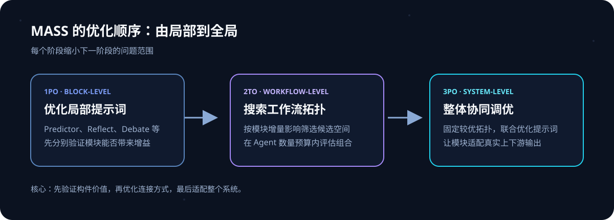
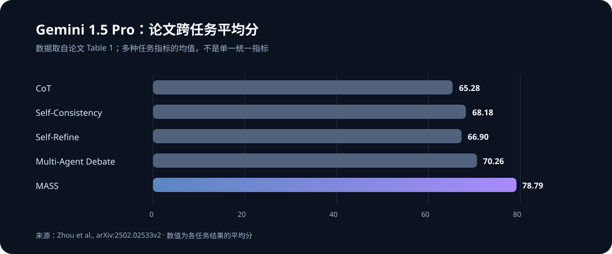

多智能体系统很容易让人产生一种直觉：一个 Agent 不够，就再加几个；答案不稳定，就让它们辩论；流程效果不好，就换个拓扑试试。问题在于，Agent 的提示词、角色分工和消息流彼此牵连。一个提示词写得含糊，可能让整个链路都跟着偏；一个看起来复杂的拓扑，也可能只是多花了调用成本。

ICLR 2026 论文 [Multi-Agent Design: Optimizing Agents with Better Prompts and Topologies](https://arxiv.org/abs/2502.02533)提出了 **MASS（Multi-Agent System Search）**。它的主张很直接：提示词和拓扑要放在同一套设计流程里优化，但不要一上来就把所有变量同时交给搜索。先打磨局部 Agent，再组合工作流，最后回到整体提示词做协同调整。

这篇论文最值得带走的，不是某一种“万能多 Agent 拓扑”，而是一种搜索顺序：**先让模块变得可靠，再让模块组成系统，最后让系统中的模块彼此适配。**

## 多智能体设计为什么不只是“多加几个模型”

一个多智能体系统至少有两类关键设计变量：**提示词**决定每个 Agent 要做什么、收到什么信息、输出什么格式；**拓扑**决定哪些 Agent 被加入、它们串行还是并行、输出怎样传递和汇总。

这两个变量相互影响。举例来说，反思 Agent 要读预测 Agent 的回答，再指出错误并给出修改建议。若预测 Agent 输出没有清晰结构，反思 Agent 的工作就会变难；若拓扑把反思结果送回预测 Agent 多轮迭代，那么两个 Agent 的提示词也必须适配这种循环。孤立地调其中一边，可能得到局部看起来合理、整体却不工作的系统。

### 两个常见捷径都不可靠

**第一种捷径是增加 Agent 数量。** 多个模型并行回答再投票，确实可能减少单次采样的偶然错误，但代价是更多推理 token 和延迟，而且如果所有 Agent 都受同一种提示词缺陷影响，票数增加并不能修好错误方向。

**第二种捷径是先挑复杂拓扑。** Debate、Reflect、Aggregate 等模块听起来都很有用，实际效果却取决于任务。论文在 HotpotQA 的分析中发现，在所测的模块里只有 Debate 带来约 3% 的增益，其他模块未能改善甚至会拖累结果。多一个环节，就多一份调用、上下文传递和误差传播的机会。

因此，设计问题不是“能不能把更多 Agent 接起来”，而是“哪些模块在当前任务上有增量价值，以及它们需要怎样的提示词和连接方式”。

## MASS：从局部提示词到整体工作流的三阶段搜索

MASS 把搜索拆成三段。前一段产生的提示词或拓扑会成为后一段的条件，逐步缩小问题范围。



### 阶段一：先优化单个构件（1PO）

论文先对基础 Predictor（预测者）优化提示词，再逐个优化搜索空间里的其他 Agent 构件。这里的“提示词优化”不只是润色指令，还会联合优化 instruction 和 few-shot 示例。像 Debate 这样的模块，则在最小可用配置下优化：用两个 Predictor 配一个 Debator，先确认这类协作单元是否能工作，再考虑扩展规模。

这么做的目的，是避免拿一组未经验证的手工提示词直接组成复杂系统。否则，系统效果差时，很难判断是拓扑有问题，还是其中某个 Agent 本来就没有把自己的任务做好。

### 阶段二：带着局部结果搜索拓扑（2TO）

接着，MASS 比较各个构件相对于基线预测者的**增量影响**。论文用验证集上的表现变化估计某个设计维度是否值得纳入搜索，并把影响较大的模块以更高概率保留在候选空间里；同时限制系统可包含的 Agent 数量，避免搜索预算失控。

这是 MASS 的一个关键选择：它不是在庞大的组合空间中平均地碰运气，而是先用局部实验估计哪些构件值得组合，再对更有希望的配置进行采样和评估。候选工作流按预先定义的构建规则组织，减少等价排列带来的冗余。

需要区分的是，增量影响是一种**搜索启发式**，不是模块价值的普遍定理。它由特定数据、模型和验证指标估计；换任务或换底座模型，权重和排名都可能变化。

### 阶段三：对最佳工作流做整体提示词优化（3PO）

阶段二找到表现较好的拓扑后，MASS 不会认为局部最优提示词已经足够。它把选出的整个多智能体系统作为一个整体，再对其中的提示词进行联合优化。

原因在于，模块单独表现好，不代表放进工作流后仍然最合适。下游 Agent 接收的是上游实际生成的内容，而不是研究者理想中的标准答案；输出格式、信息完整度和协作目标都会影响彼此。最后这轮优化负责把提示词调整到“在当前拓扑里合作”的状态。

可以把三个阶段简写为：

```text
先把 Agent 模块调好 → 再搜索如何连接 → 最后按整条工作流协同调提示词
```

## 搜索空间里有哪些 Agent 模块

论文把多智能体流程表示为一组可组合构件，而不是让搜索器任意生成程序。核心构件包括：

| 构件 | 在工作流中的作用 | 常见形式 |
| --- | --- | --- |
| Aggregate | 并行生成多个预测，再汇总 | Self-Consistency、多数投票 |
| Reflect | 检查已有回答并提出修订 | Self-Refine、反思循环 |
| Debate | 多个 Agent 读取彼此观点并更新答案 | 多智能体辩论 |
| Summarize | 分阶段压缩长上下文 | 面向长文档的摘要链 |
| Tool-use | 按需插入工具调用 | 检索、代码执行 |

同一个构件也带有可以调整的参数，例如并行 Agent 数、反思轮数、辩论轮数；工具调用则可作为开关纳入设计。论文还用预定义的构建顺序组织流程，以较小的搜索空间换取更可控的组合与复现。

这也意味着 MASS 并非“给模型一张白纸，让它发明任意 Agent 架构”。它优化的是研究者定义好的**可定制搜索空间**。搜索空间选错了，搜索算法无法凭空补上缺失的模块；空间过宽，则实验成本和验证负担都会上升。

## 实验说明了什么

论文在数学推理、长上下文问答和代码任务上评测 MASS，包括 MATH、DROP、HotpotQA、MuSiQue、2WikiMQA、MBPP、HumanEval 和 LiveCodeBench 的输出预测子任务。主要实验使用 Gemini 1.5 Pro / Flash，并在附加实验里检查 Claude 3.5 Sonnet 和 Mistral Nemo 等不同底座模型。核心结果报告三个评测运行的均值与标准差。

以 Gemini 1.5 Pro 为例，论文表格给出的跨任务平均分如下。指标包含准确率、F1 和 pass@1 等不同度量，作者报告了每个数据集的对应指标后再计算平均，因此它适合看整体趋势，不应被理解为单一统一指标。



MASS 平均为 **78.79**，表中 Multi-Agent Debate 为 **70.26**，CoT 为 **65.28**。各个单项也不是 MASS 全面领先：例如 2WikiMQA 上 AFlow 为 76.51，高于 MASS 的 73.34。因此更准确的结论是，MASS 在论文所测的整组任务和比较方法中取得了更高的总体平均，并在多个任务上表现突出；这不意味着它在每种任务、每项指标、每个模型上都是赢家。

### Token 效率和拓扑筛选同样重要

论文还比较了提示词优化与“保持默认提示词、增加 Agent 数量”等做法。其分析显示，在 MATH 实验中，经过提示词优化的单 Agent 更能以较少推理 token 提升表现；再在这个基础上扩展并行采样，扩展曲线比直接堆默认 Agent 更好。另一方面，拓扑分析显示，有正向影响的构件只占整个设计空间的一部分。

这里的“效率”主要是**推理阶段的 token 与效果关系**。它不等于构建 MASS 的全流程免费：自动提示词优化、候选工作流采样和验证集评估都需要额外调用。论文也对推理成本作了可比控制，但真实部署的延迟、吞吐量和价格仍取决于模型、并行策略、缓存以及任务流量。

## 这篇工作的价值与边界

### 有价值的地方：它把优化顺序也当成设计的一部分

MASS 的贡献不只是“优化提示词”或“搜索拓扑”，这两类工作此前都有人做。更有启发的是把它们放进一个有顺序的闭环：先局部测量模块价值，再用这些信息缩小拓扑搜索范围，最后针对整体系统重新调提示词。它让多 Agent 设计从凭直觉堆角色，变成可以记录指标、比较候选、逐步缩小范围的实验过程。

### 需要谨慎的地方：基准上的高分不等于生产环境收益

论文主要在有明确指标和可重复输入的基准数据上优化。真实产品里的目标可能同时包括正确率、延迟、成本、用户体验、隐私约束和可审计性；只对一个验证指标做优化，未必能满足这些约束。

此外，实验中的模型版本是 Gemini 1.5、Claude 3.5 Sonnet 等特定版本。模型能力、API 行为和价格变化后，最优提示词与拓扑也可能改变。MASS 的搜索空间、验证集以及构件模板仍需要人为定义，论文结果不能直接外推为“自动搜索会替你完成系统设计”。

## 工程上怎么借鉴 MASS

如果要把这个思路用于自己的 Agent 工作流，可以先从一个小型、可验证的任务开始：

1. **确定单一评估目标。** 例如答案准确率、代码测试通过率，或带成本上限的质量得分。不要一开始混合多个互相冲突的目标。
2. **为模块定义输入、输出和成功条件。** 保证每个 Agent 的职责能单独评估，尤其要固定交接格式。
3. **先测模块增量。** 比较无模块基线与加入模块后的表现，同时记录调用数、token、延迟；没有稳定增益的模块先不进入组合搜索。
4. **限制候选空间。** 只搜索少量有理由尝试的拓扑，预先规定最大 Agent 数和轮数，并保留简单基线。
5. **留出未参与优化的测试集。** 提示词在验证集上反复试，很容易适配验证样本；最终结果应在独立测试集上复核。
6. **最后再做整体优化。** 用工作流真实传递的中间结果测试，而非把理想化答案喂给下游 Agent。

这套流程最适合任务边界清晰、存在可自动计算的评估指标、且单次错误成本足以证明额外调用合理的场景。若任务本身很简单，单 Agent 已经满足质量与可靠性要求，多智能体搜索增加的复杂度可能没有回报。

## 总结：先证明构件有用，再证明组合更好

MASS 给多智能体系统设计提供了一条可操作的路线：优化单个 Agent 的提示词，基于构件的实测影响筛选拓扑，再对选中的整体工作流做联合提示词优化。实验支持“提示词质量和拓扑选择都重要”这一判断，但没有证明多 Agent 在所有任务上都值得使用。

我对这篇论文的概括是：**Agent 数量是配置，工作流是结构，提示词是协作协议；三者需要一起评估，但可以分阶段优化。** 真正值得复制的，是这条带有预算、验证集和消融意识的设计流程，而不是照搬某个榜单上分数最高的拓扑。

## 参考资料

- Zhou et al., [Multi-Agent Design: Optimizing Agents with Better Prompts and Topologies](https://arxiv.org/abs/2502.02533)，arXiv:2502.02533，v2 发布于 2026-01-31，发表于 ICLR 2026。
- 论文 HTML 全文：[arXiv HTML](https://arxiv.org/html/2502.02533)。实验数字、方法描述和限制均以论文正文及附录为准。
- 视频解读：[B 站：MASS——交错优化多智能体系统的提示词与拓扑](https://www.bilibili.com/video/BV19MYX6WEaL/)。
