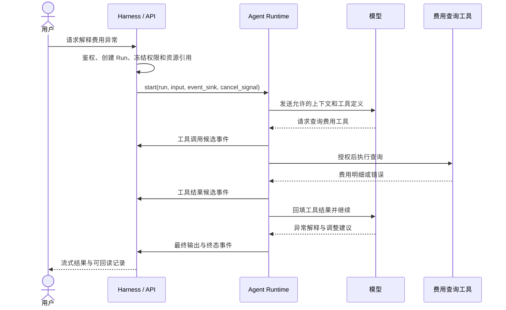

用户说：“查询这票货的费用，解释异常，并生成一份待确认的调整建议。”模型可以决定调用什么工具，但模型本身不会验证用户是否有权查看这票货，也不会替你处理工具超时、断线重连、重复提交或进程崩溃。负责把一次模型决策变成受控执行过程的部分，就是 **Agent Runtime**。

这篇文章把 Runtime 当成工程概念来解释。它没有全行业统一的产品边界：有的框架把模型循环、工具和会话都叫 Runtime；有的平台把队列、沙箱、恢复和审批也纳入 Runtime。讨论具体系统时，必须说清楚它实际承担哪些职责。

## 一、先给出准确的定义

**Agent Runtime 是执行一次 Agent 任务的控制循环及其运行环境。** 它接收任务输入和被授权的能力，调用模型，解析模型输出，调度工具或其他 Agent，将执行结果送回模型，并在成功、失败、取消、暂停或预算耗尽时结束本次运行。

最小循环如下：

```text
输入与授权上下文
  → 调用模型
  → 判断输出：最终回答 / 工具请求 / 委派 / 需要批准
  → 执行动作并取得结果
  → 更新本次运行状态
  → 再次调用模型，直到满足终止条件
```

OpenAI Agents SDK 的 `Runner` 就实现了这类循环：模型返回最终输出时结束；返回工具调用时执行工具并继续；发生 handoff 时切换执行 Agent 并继续。实际产品通常还要在它外面加上自己的权限、任务持久化和业务审计。[官方运行机制](https://openai.github.io/openai-agents-python/running_agents/)

### 与普通模型调用的差别

| 能力 | 一次模型 API 调用 | Agent Runtime |
|---|---|---|
| 决定回复文字 | 可以 | 可以，通过模型完成 |
| 根据模型意图执行工具 | 调用方自行编写 | Runtime 负责调度与回填 |
| 多轮工具循环 | 调用方自行编写 | Runtime 管理循环与终止 |
| 取消、审批、恢复 | 调用方自行设计 | 视 Runtime 能力而定 |
| 权限、成本、审计 | 模型不负责 | Runtime 或外层平台负责 |

所以“接上 LLM API”只是一个部件；Agent Runtime 的核心问题是**谁控制下一步执行，以及错误发生后系统处于什么状态**。

## 二、五个容易混淆的对象

| 名称 | 它回答的问题 | 货运场景例子 |
|---|---|---|
| 模型（Model） | 如何生成判断或下一步意图？ | 判断应查询费用明细 |
| Business Agent | 谁负责某类稳定业务任务？ | 报价 Agent、单证审核 Agent |
| Runtime | 一次任务怎样逐步执行？ | 调模型、调工具、回填结果、结束 Run |
| Adapter | 怎样接入某个具体 Runtime？ | 将外部执行器事件转为平台统一事件 |
| Harness / 平台 | 多个 Agent 怎样被统一治理？ | 身份、授权、路由、Run、审计、预算 |

在企业平台的一种常见设计中，Business Agent 是稳定身份；模型、Adapter、endpoint 和外部 Runtime 是可替换的绑定。两个 Business Agent 可以共用一个 Runtime，却保留不同任务契约、知识、Skill、负责人和历史。换 Runtime 也不应抹掉 Agent 的业务身份。

这里的“Runtime”也不要与**模型推理服务**混为一谈。推理服务负责运行模型并返回 token；Agent Runtime 负责决定何时请求推理、如何处理工具结果和何时停止。一个 Agent Runtime 可以调用远程模型推理服务，也可以调用本地模型。

## 三、一次真实 Run 怎样执行

仍以货运费用任务为例。下图描述的是一种合理的企业系统分工，不表示所有框架都内置了这些步骤。



逐步看，有六个关键点：

1. **创建 Run**：为这一轮工作分配稳定身份。会话（Conversation/Thread）可包含多个 Run；一个 Run 也可能包含多次模型调用。不要把“一个聊天窗口”“一条消息”和“一次 Run”混为一谈。
2. **冻结本轮可用资源**：平台先解析用户身份、数据权限、Skill 版本和工具范围。模型只能在授权边界内建议动作；不能靠生成文本扩大权限。
3. **执行模型循环**：Runtime 调模型，识别最终回答、工具调用、委派或暂停信号。每一轮都应有轮数、时间或费用上限。
4. **执行工具**：工具参数需要校验，读写操作需要不同授权。查询失败可以按策略重试；“创建调整单”这类外部副作用不能盲目重放。
5. **产出事件**：文本增量、工具开始/完成、错误与终态由 Runtime 报告，再由平台排序、持久化并交付前端。
6. **确定终态**：成功、失败、取消和中断含义不同。进程停止不等于业务动作被撤销；取消信号发出也不等于外部工具已经停止。

## 四、Runtime 内部最少有哪些模块

### 1. 执行循环与状态机

一个简单实现可以是 `while` 循环，但状态仍要明确：

```python
# 教学伪代码：展示职责，不是可直接运行的 SDK 示例。
async def execute(run, model, tools, policy, emit):
    state = await load_or_create_state(run)
    while True:
        policy.check_deadline_turns_and_budget(state)
        response = await model.call(state.model_input(), tools.allowed_for(run))
        await emit("model.completed", safe_metadata(response))

        if response.is_final:
            await emit("run.succeeded", {"output_ref": save_output(response)})
            return
        if response.requests_tool:
            call = policy.validate_tool_call(run, response.tool_call)
            result = await execute_with_timeout_and_approval(call)
            state.append_tool_result(call.id, result)
            await emit("tool.completed", safe_metadata(result))
            continue
        if response.requests_handoff:
            await delegate_under_policy(run, response.target)
            continue
        raise UnsupportedModelOutput()
```

模型决定“建议做什么”，Runtime/平台决定“是否允许、怎样执行、何时结束”。这一分工是安全边界。

### 2. 状态与上下文

Runtime 至少要知道当前输入、已发生的模型和工具结果、使用的 Agent 配置，以及终止条件。长期运行还要考虑哪些状态能持久化。**聊天历史、Run 状态、用户长期记忆是三种不同的数据**：聊天历史帮助续谈；Run 状态帮助恢复这次执行；长期记忆跨任务存在并需要独立授权和纠错。

把全部历史聊天直接塞回模型既昂贵，也可能带入过期权限或不相关信息。较稳妥的方式是按本次任务和当前授权组装 ContextPack，记录实际引用与版本。若暂停后恢复，应明确哪些输入沿用快照、哪些权限必须重新校验。

### 3. 工具调度与副作用

工具执行不只是 `functions[name](args)`。Runtime 或其外层平台需要回答：参数是否符合 schema？用户是否有权访问目标对象？是否允许联网？工具超时后能否重试？工具已提交业务数据但响应丢失怎么办？

对有副作用的操作，应使用业务幂等键和执行前授权校验。**“队列至少一次投递”不能推导出“业务动作恰好执行一次”**。恢复时要能区分“未开始”“已经提交但未收到结果”和“已确认完成”。敏感动作可暂停等待用户批准，批准应绑定具体动作和参数；参数改变后需重新判断批准是否有效。[官方 human-in-the-loop 示例](https://openai.github.io/openai-agents-python/human_in_the_loop/)

### 4. 调度、隔离与资源限制

Agent Runtime 不必天然等于沙箱。沙箱是它可能使用的一种执行环境。读取数据库的业务 Agent 可以运行在服务进程里；Coding Agent 执行 shell、安装依赖、修改文件时，通常需要更强的进程、文件系统、网络与密钥隔离。

当任务变长或用户增加，还要有队列、Worker、并发上限、租约、心跳、取消传播和预算。此时 Runtime 可以拆成控制面与执行面：控制面保存 Run、调度和策略，执行面在 Worker/沙箱中做模型与工具循环。系统不应因某个 Worker 退出而丢失所有任务事实。

## 五、取消、重试和恢复：最能检验 Runtime 的地方

### 取消不是“把 HTTP 连接关掉”

用户离开页面与取消任务是不同动作。取消应有明确命令和状态：平台接收请求、通知执行器、执行器停止可停止的工作、记录外部动作是否已真正停止，最后写入终态。如果外部系统不支持取消，就应如实报告，不要把“已发送取消请求”显示成“已取消成功”。

### 重试要区分层级

| 重试对象 | 常见触发 | 主要风险 |
|---|---|---|
| 模型调用 | 限流、超时 | 重复计费或不同输出 |
| 只读工具调用 | 网络暂时故障 | 结果可能已变化 |
| 写入工具调用 | 响应丢失 | 重复创建业务记录 |
| 整个 Run | Worker 崩溃 | 重放已完成步骤和副作用 |

因此“失败后重试一次”不是完整策略。需要保留每次 attempt 的原因、输入版本、已完成动作和幂等身份。对于无法安全重放的动作，应进入待核对或人工处理状态。

### 持久化也不等于恢复

保存聊天记录只能证明“知道过去说了什么”。真正的恢复还要知道执行到哪个步骤、哪些工具已成功、哪些回调可能重复、当时用的是哪个 Agent/Skill/权限快照。LangGraph 的持久化机制区分线程内的 checkpoint 与跨线程的 store，checkpoint 可用于中断后继续和故障恢复；但外部写入工具是否能安全重放，仍需由业务系统设计幂等与核对机制。[LangGraph 持久化文档](https://docs.langchain.com/oss/python/langgraph/persistence)

## 六、Tracing 与事件日志在 Runtime 中的位置

一次 Agent Run 需要两类容易混淆的记录：

- **业务执行事件**：Run 创建、工具调用、批准、终态等可审计事实，常需可靠持久化、顺序号和权限控制。
- **观测 Trace**：模型/工具步骤的耗时、父子关系、token 和错误，帮助定位慢点、失败点与成本。

二者可以关联，也可以由同一组可靠事件投影出诊断视图，但不能默认认为一条采样 Trace 就能承担完整业务审计。Trace 可能被采样、丢弃或限期删除。敏感的 prompt、源码、邮件和工具结果也不应为了排障而默认全文写入观测系统。进一步阅读本站的 [Agent Tracing 基础]()。

## 七、一个平台设计示例：Runtime、Adapter、Harness 如何分工

可以为不同执行器定义一个最小的执行适配接口，例如 `start(run, input, event_sink, cancel_signal)` 与 `cancel(run_id)`。Adapter 包装实际执行器，把来源事件映射为统一的 Run 事件；平台的 Run/Event 层负责持久化、序号、查询与 SSE 交付。这样业务 Agent 身份就不依赖某个执行器的事件格式。这里是说明边界的设计示例，并非通用标准接口。

```text
Business Agent 目录：这是谁、负责什么、当前绑定哪个 Runtime
Harness Core：谁能调用、可用哪些资产、创建哪个 Run、保存什么事实
Runtime Adapter：怎样启动该来源、怎样翻译事件和取消信号
实际 Runtime：怎样调用模型、执行工具、维护循环
Run/Event 投影：怎样回读、流式展示、追踪和审计
```

一个具体的排障问题是：如果某 Runtime 只报告“工具 A 完成”，没有稳定调用 ID，就不能可靠地区分两次并行调用的同名工具。Adapter 应报告来源能力不足，而不是按工具名或完成顺序猜测父子关系。这是设计 Agent Run tracing 时必须处理的运行事实完整性问题。

### 最容易犯的边界错误

1. **把模型当 Runtime**：以为换模型就能解决任务恢复、工具授权或重复写入。
2. **把 Adapter 当 Runtime**：接口能翻译事件，不代表来源真的支持取消、恢复或子 Agent。
3. **把业务身份绑定到 Runtime**：换底层框架后，历史 Agent 身份、评测基线和组织规则全部丢失。
4. **把日志当状态**：日志能辅助排障，不能可靠判定一次业务动作是否已经提交。
5. **把多 Agent 当成多个 Prompt**：真实委派需要独立的子任务身份、权限衰减、预算和结果归属。

## 八、怎样判断一个 Runtime 是否“能用于生产”

拿一项真实业务任务做验收，比看功能列表有效：

| 问题 | 需要看到的证据 |
|---|---|
| 执行过程能解释吗？ | 模型轮次、工具调用、输入来源和终态可按 Run 还原 |
| 越权能被挡住吗？ | 构造跨用户、禁用工具、过期资源访问，均在实际调用前失败 |
| 重复请求安全吗？ | 同一幂等请求不产生两个 Run 或两次业务写入 |
| Worker 崩溃怎么办？ | 重启后能判定已完成与待处理步骤，不盲目重放副作用 |
| 取消是否真实？ | 能区分取消已请求、执行器已停止和外部动作无法取消 |
| 成本可控吗？ | 轮数、token、时间、工具费用有上限并可归属任务 |
| 能替换底层实现吗？ | 换 Runtime 后业务 Agent 身份、权限与历史保持稳定 |

如果现在只能做“模型调用工具再返回答案”，那是一个可用的**执行循环**。当上述证据逐步齐备，它才成为能承担企业任务的 Runtime 与运行平台。

## 九、建议的学习和动手顺序

1. **先写最小循环**：一个模型、两个只读工具、最大轮数和最终输出。观察每轮输入与工具结果如何变化。
2. **加入状态机**：明确 queued、running、waiting_approval、succeeded、failed、cancelled 等状态及合法转换。
3. **加入事件与回读**：每个 Run 有稳定 ID、按序事件，刷新页面仍能看到已完成步骤。
4. **注入故障**：让模型超时、工具响应丢失、Worker 退出；验证重试和副作用边界。
5. **接第二个 Runtime**：通过 Adapter 转成同一套 Run/Event 契约，验证业务 Agent 身份不随底层变化。
6. **再做委派和路由**：让父子 Run 有独立身份与权限，证明子任务确实执行，而不是仅在 Prompt 中声称委派。

学完后应该能回答一个具体问题：**某次 Agent 失败时，是模型判断错、工具返回错、权限拒绝、Runtime 中断，还是平台恢复策略出了问题？** 能沿着一次 Run 给出证据，就真正理解了 Agent Runtime。

## 参考资料

- [OpenAI Agents SDK：Running agents](https://openai.github.io/openai-agents-python/running_agents/)
- [OpenAI Agents SDK：Human-in-the-loop](https://openai.github.io/openai-agents-python/human_in_the_loop/)
- [LangGraph：Persistence](https://docs.langchain.com/oss/python/langgraph/persistence)
