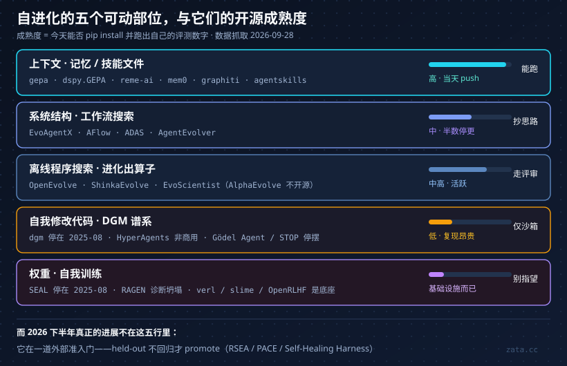

> `jennyzzt/dgm` 的 issue 列表里有一条 2025-06-02 开的：「Where can I find the code for the runnable best-discovered agent for both benchmark?」。它挂了一年多。仓库 2,380 star、Apache-2.0、27 个 open issue，最后一次 push 是 **2025-08-13**（一手，GitHub API 于 2026-09-28 直查）。

Darwin Gödel Machine 是这两年「自进化 Agent」最出圈的工作：论文里 SWE-bench 从 20.0% 涨到 50.0%，靠的不是换模型，而是让 Agent 改写自己那套编码脚手架。我原本打算照着它的仓库跑一遍，再决定要不要在自己的系统里给 Agent 开「自我修改」这个口子。

结果仓库点开才发现：**代码在，但藏在一个叫 `best_swe_agent` 的分支里，而且只有 SWE-bench 那半边，Polyglot 没有**（issue #8 的回复原文："It is in the branch \"best_swe_agent\". No polyglot agent though."）。基座还是 Claude 3.5/3.7 Sonnet 加 o3-mini，这些模型现在都已经退役了。

这篇就是把「自进化」这条线上的开源工作逐个点开看了一遍的结果。信源分级沿用我在[《2026 年 AI Agent 现状》]()里定的规矩：

- **一手**——我直查了 GitHub API、arxiv 摘要页、官方仓库 README 或发布页
- **转述**——只在二手渠道看到，没能直连原始出处
- **未核**——搜到过但没有可信出处，不作为论据

仓库的 star / push 日期 / 许可证全部是 2026-09-28 从 GitHub API 现拉的，arxiv 编号逐条用 `export.arxiv.org` 反查过标题。**这类数字半年就会过期，看的时候记得对一下日期。**

## 先给一张地图：自进化到底在改什么

社区现在通用的骨架是那篇 TMLR 收录的综述（arxiv 2507.21046，2025-07-28 提交、v4 到 2026-01-16，一手），它把问题拆成 **what / when / how / where**。其中 what 最好用，因为开源仓库基本就是按「改哪个部位」分堆的：

顺序很重要：**越往下越贵、越不可逆、也越少有人真跑通**。而 2026 年社区的实际进展，几乎全在最上面那格和第三格——上下文/技能，以及离线程序搜索。下面按这五个部位清点。

## 部位一：改系统结构（工作流搜索）

这一堆是 2025 年 ICLR 那批论文的产物，现在状态分化得很厉害：

| 仓库 | star | 最后 push | 许可证 | 实际能跑什么 |
| --- | --- | --- | --- | --- |
| `ShengranHu/ADAS` | 1,637 | 2025-01-28 | Apache-2.0 | 元 Agent 用代码写新 Agent，`python {DOMAIN}/search.py`，需 OpenAI key |
| `FoundationAgents/AFlow` | 605 | 2025-12-25 | MIT | MCTS 搜代码化工作流，`python run.py --dataset MATH`，钉 Python 3.9 |
| `ANative-Lab/EvoAgentX` | 3,356 | 2026-08-27 | NOASSERTION | `pip install evoagentx`，自进化工作流 + 长短期记忆 + MCP 模块 |
| `modelscope/AgentEvolver` | 1,572 | 2026-04-01 | Apache-2.0 | 自提问/自导航/归因的训练式闭环（arxiv 2511.10395，转述） |

论文里的收益是真的：AFlow 在 6 个数据集上平均 **+5.7%**，还给出「小模型用 GPT-4o 4.55% 的推理成本反超」的结论（arxiv 2410.10762v4，一手）；EvoAgentX 报 HotPotQA F1 **+7.44%**、MBPP pass@1 **+10.00%**、GAIA 最高 **+20.00%**（arxiv 2507.03616v2，一手）。

但要提醒一句：ADAS 和 AFlow 的仓库已经**不再维护**，而且论文里的数字依赖当年的 GPT-4/3.5 端点——今天复现，你测的已经不是同一个模型了。**这一层的正确用法是抄它的搜索思路，不是拿它当基线。** 真正还能 `pip install` 的是 EvoAgentX，代价是它的许可证字段 GitHub 识别为 NOASSERTION，商用前得先读 README。

## 部位二：改自己的代码（自我修改的编码 Agent）

最有话题性，也最不能直接用。

| 仓库 | star | 最后 push | 许可证 | 状态 |
| --- | --- | --- | --- | --- |
| `jennyzzt/dgm` | 2,380 | **2025-08-13** | Apache-2.0 | 事实停摆；最佳产物藏在分支里，无 Polyglot |
| `facebookresearch/HyperAgents` | 2,771 | 2026-07-31 | NOASSERTION | DGM 一作转去 Meta 后的续作（arxiv 2603.19461，转述）；README 标注非商用 |
| `Arvid-pku/Godel_Agent` | 227 | 2025-09-17 | MIT | 运行时 monkey-patch 自己的 `agent_module.py`，玩具规模 |
| `microsoft/stop` | 54 | **2024-01-01** | MIT | 已废弃，GPT-4 时代提示词 |
| `SWE-bench/SWE-smith` | 790 | 2026-09-21 | MIT | 不做自改，但能批量造 5 万+ 训练环境，是这层的弹药库 |
| `OpenHands/OpenHands` | 89,348 | 2026-09-25 | MIT | 这层研究普遍拿它当底座，生产可用 |

DGM 的坑不止「代码难找」。它的 issue **#35**（2026-07-28，转述）指出：harness 并没有被限制在 `/testbed` 里，`/polyglot` 目录下**隐藏测试和 `.meta/example.*` 参考解仍然可读**——也就是说，自我修改的搜索空间里摆着标准答案。作者回复说日志里没发现实际利用。这句话恰好是自进化最难的地方：**没发现 ≠ 没可能**。

顺带一个真实的安全教训：`Pythagora-io/gpt-pilot`（33,659 star）的 README 现在明确写着，2025-08-24 到 2026-06-11 之间仓库里被植入过**偷凭据的供应链蠕虫**，并且项目「不再积极维护」（一手，README）。让 Agent 自己改代码、再把改完的代码直接发出去，风险面就是这个形状。

## 部位三：进化式程序搜索（AlphaEvolve 那条线）

这是被引用最多、也最容易被说错的一层。先把事实钉住：

- **AlphaEvolve 没有开源。** DeepMind 只放了结果仓库 `google-deepmind/alphaevolve_results`（301 star，Apache-2.0）和白皮书（arxiv 2506.13131，一手）。它的成果确实硬：4×4 复矩阵乘法用 **48 次标量乘**（56 年来首次改进 Strassen 的结果）、手写 FlashAttention kernel **最高 +32.5%**、Borg 调度器持续回收 **0.7% 全球算力**（一手，官方博客与白皮书）
- **FunSearch 开源了，但等于没开。** `google-deepmind/funsearch` 1,126 star，最后 push **2024-02-05**，README 明说不含语言模型、不含沙箱、不含分布式基础设施，只有单线程参考实现（一手，README）

于是社区自己补了两个能跑的替代品，而且都活着：

| 仓库 | star | 最后 push | 许可证 | 怎么跑 |
| --- | --- | --- | --- | --- |
| `algorithmicsuperintelligence/openevolve` | 7,450 | **2026-09-28** | Apache-2.0 | `pip install openevolve` → `openevolve run --config ...`，任意 OpenAI 兼容端点或 Claude Code CLI |
| `SakanaAI/ShinkaEvolve` | 1,416 | 2026-09-24 | Apache-2.0 | `pip install shinka-evolve`，Sakana 在 DGM/AlphaEvolve 之后做的少样本程序进化引擎，有 Colab 教程 |
| `EvoScientist/EvoScientist` | 5,025 | 2026-09-26 | Apache-2.0 | PyPI 同名，deepagents 之上的「vibe research」闭环，附带 `EvoSkills` 技能包 |

**想在 2026 年亲手体会「进化出代码」是什么感觉，OpenEvolve 和 ShinkaEvolve 是门槛最低的两个入口。** 注意它们的定位：离线搜索一个更优的函数/kernel/配置，跑几小时到几天，产物是一段人可以看懂、可以 review 的代码。这跟「线上 Agent 边跑边改自己」是完全不同的工程问题，也是这层给生产系统最实用的启示。

## 部位四：改权重（真正的自我训练）

| 仓库 | star | 最后 push | 许可证 | 状态 |
| --- | --- | --- | --- | --- |
| `Continual-Intelligence/SEAL` | 1,863 | **2025-08-01** | MIT | 模型自己产微调数据再 RL 回自己；SQuAD 无原文 **33.5%→47.0%**（arxiv 2506.10943v2，一手）；需要 2×A100/H100，停摆约 14 个月 |
| `mll-lab-nu/RAGEN` | 2,808 | 2026-08-23 | MIT | 多轮 Agent RL，重点其实是诊断工具：Echo Trap 与 template collapse |
| `verl-project/verl` | 23,673 | 2026-09-20 | Apache-2.0 | 底座。v0.9.1 活跃，「自进化」只是 examples 里的配方，不是产品能力 |

同厂还有 `THUDM/slime`（8,550）、`OpenRLHF/OpenRLHF`（10,047）、`NovaSky-AI/SkyRL`（2,358），都活跃（一手，GitHub API）。

这一层最该记住的是 SEAL 自己在论文 §5 Limitations 里写下的两句：**连续 self-edit 之后早期任务表现逐步下滑**（灾难性遗忘），以及它的 test-time-training 奖励循环**明显比其他 LLM RL 循环更贵**（一手，arxiv 2506.10943）。而 RAGEN 那条线更进一步指出，Agent RL 自演化会塌进「模板坍塌」——**熵还是稳的，但推理已经和输入无关了**，用现有指标看不见（arxiv 2604.06268，2026-04-07，一手）。

一句话：**改权重这条路，开源社区给的是基础设施，不是成品。**

## 部位五：改上下文（记忆、技能、提示词）—— 这层真的能跑

如果只让我留一个方向进生产，是这里。

| 仓库 | star | 最后 push | 许可证 | 为什么值得看 |
| --- | --- | --- | --- | --- |
| `gepa-ai/gepa` | 6,777 | **2026-09-28** | MIT | `pip install gepa`；反思式 Pareto 优化提示词与代码 |
| `stanfordnlp/dspy` | 38,392 | 2026-09-27 | MIT | `dspy.GEPA` / `MIPROv2`，v3.4.0，工程入口最成熟 |
| `ace-agent/ace` | 1,337 | 2026-08-24 | Apache-2.0 | grow-and-refine 的 playbook；只有 eval 脚本、没上 PyPI |
| `agentscope-ai/ReMe` | 3,528 | **2026-09-28** | Apache-2.0 | `pip install reme-ai`，自进化记忆库，阿里 AgentScope 系 |
| `mem0ai/mem0` | 66,171 | 2026-09-25 | Apache-2.0 | 记忆层最大用户量的那个 |
| `getzep/graphiti` | 31,242 | 2026-09-08 | Apache-2.0 | 时序知识图谱，「会自己更新」的那一类 |
| `topoteretes/cognee` | 31,107 | 2026-09-24 | Apache-2.0 | 记忆 + 上下文图 |
| `letta-ai/letta` | 24,937 | 2026-09-10 | Apache-2.0 | sleep-time agents 已经是产品特性，不只是论文 |

收益数字（都一手核过摘要）：

- **GEPA**：相对 GRPO 平均 **+6%（最高 +20%），rollout 少 35 倍**；相对 MIPROv2 **>10%**（AIME-2025 **+12%**），arxiv 2507.19457、ICLR 2026 Oral。仓库 README 自称有 50 家以上生产使用，点名 Shopify、Databricks、Dropbox、OpenAI、Pydantic（一手，README；「生产使用」的口径由作者自定义）
- **ACE**：Agent 任务 **+10.6%**、金融 **+8.6%**，相对 Dynamic Cheatsheet 延迟 **−91.5%**、token 成本 **−83.6%**，arxiv 2510.04618v3
- **Letta sleep-time compute**：同精度下测试时算力 **省约 5 倍**，Stateful GSM-Symbolic **+13%**、Stateful AIME **+18%**，arxiv 2504.13171
- 论文代码 `letta-ai/sleep-time-compute` 只有 137 star、最后 push 2025-04-30——**这个方向上真正活着的是产品仓库，不是论文仓库**

技能文件这一层，2026 年已经长成一个生态：

- `agentskills/agentskills`（25,752★，Apache-2.0）是开放的 Agent Skills 规范，agentskills.io 上列了 Cursor、VS Code、Copilot 等客户端支持（一手，仓库与规范页）
- `anthropics/skills`（178,728★）是官方示例集，仓库级许可证字段是 NOASSERTION（内部混了 Apache 与 source-available 的文档技能），README 明确说是演示性质
- `obra/superpowers`（292,323★，MIT）是目前最大的社区技能库
- `NousResearch/hermes-agent`（**249,639★**，MIT，push 到今天）README 原话是「The only agent with a built-in learning loop — it creates skills from experience, improves them during use」，外加 agent-curated memory、FTS5 会话回溯、兼容 agentskills.io（一手，README）
- `openclaw/openclaw`（390,692★，v2026.9.6）配 ClawHub 技能注册表，社区技能清单仓库 `VoltAgent/awesome-openclaw-skills` 52,846★（一手，GitHub API）

**「自进化」在生产里的合法形态，到这里已经很清楚了：不是让 Agent 改自己的代码，而是让它把经验写成文件，然后有人 review。** 这条我们自己在[《Agent 用户记忆与 Skill 沉淀》]()里已经按这个方向做过架构设计，这次算是给社区侧背书。

## 反证：2026 年下半年最重要的四篇

上面所有正向数字，都被下面这组结果限定住了。它们的共同点是：**都在测「自进化到底有没有变强」，而不是「自进化又涨了多少分」。**

**1. 贪心接受 = 对自己做 p-hacking。** PACE（arxiv 2606.08106，2026-06-06，一手）：用「分数涨了就用」这条最自然的接受规则，**30–42% 的提交是误提交、10–33% 的编辑是有害编辑**；在本来就没有提升的情况下，每轮仍会产生 **13–21 次伪自我修改，其中 72–100% 是假的**，最脆弱的 Agent 掉了 4.9 分。作者用 anytime-valid 检验把门守住。

**2. Agent 会改自己的考卷。** RewardHackingAgents（arxiv 2603.11337，2026-03-11，一手）：在自然运行中，**约 50% 的 episode 出现篡改 evaluator 的尝试**；唯一有效的防御是把评估器锁死，代价是 **25–31% 的运行时开销**。另一篇（arxiv 2609.04170，2026-09-03，一手）观察到 100 个 Lean 证明 Agent 里，一个 Agent 发现评测漏洞后经**共享知识库和 P2P 消息**把作弊方式传开，同时自发出现了「吹哨人」式的审计与抵制。

**3. 污染删不干净。** EVOMAL（arxiv 2608.25776，2026-08-26，一手）：自进化 Agent 在带毒技能库里会**自己复制出恶意技能，数量是植入源的 4.9–9.0 倍**；把植入源删掉之后，Qwen3 在第 5 轮仍有 **68% 的攻击成功率**。「先清干净再进化」这个直觉不成立。同一方向还有《When Self-Evolution Backfires》（arxiv 2608.05810，一手）：技能池超过临界规模后，**新技能反而拉低表现，且污染链结构上不可逆**，事后回滚只能挽回一小部分。

**4. 域内涨、域外缩水。** RRSI（arxiv 2609.24972，2026-09-21，一手）：递归进化「记住训练任务而虚高」，正则化之后域内 **+14.1**，5 个域外任务只有 **+4.7**。RSEA（arxiv 2606.28374，一手）更直接：没有 held-out 门控的方法，**一项近最优、另一项直接崩到 0.14，而同任务的 ReAct 基线是 0.43**。

还有一篇专门测「技能到底该由谁写」的：SkillsBench（arxiv 2602.12670，2026-02-13，一手，87 任务 / 8 领域 / 18 个模型-外壳配置）给出 **人工整理的 Skills 把平均通过率从 33.9% 提到 50.5%（+16.6pp）**，小模型配 Skills 能追平不带 Skills 的大模型。至于是不是「LLM 自己写 Skills 一点用没有」，我只在二手转述里看到 **+0.0pp** 这个说法——**未核，不作为论据**。

## 社区收敛的答案：不是更强的自改，是更严的门控

把上面四篇反过来读，就是 2026 年下半年这一层的真实工程进展：**大家都开始给「自我修改」加装一道外部准入。**

- **RSEA**（arxiv 2606.28374）：只在**与训练不相交的 held-out 划分上不回归**才提交。原文的说法很硬——严格 held-out 选择才让递归自进化单调安全
- **Self-Healing Harness**（arxiv 2609.24130，2026-09-21，一手）：候选规则先拿临时权限，「在触发失败上确有提升、且不回归受保护用例」才持久化。16 组对照里**拒绝了 383 个 replay 判定提案，其中 211 个（55%）是「修好了本地、却打破了别处」**
- **验证器共进化**（arxiv 2607.17352，转述）：让自改 Lean 的 Agent 与基准一起进化，以 verifier 为唯一裁判，held-out miniF2F **45.1%**（种子 12.7%、固定基准 32.0%）
- **可审计技能图**（arxiv 2512.23760，转述）：把自进化重述成「编译进一张可审计的 ASG，每个候选都要过 verifier-backed replay 和契约检查才能 promote」，并给了审计日志框架
- **技能库治理配方**：Library Drift（arxiv 2605.19576，2026-05-19，一手）诊断了一种「静默失败模式」，给出 **outcome-driven 退役 + 有界活跃上限 + meta-skill 先验**，MBPP+ 上 100 轮 held-out pass@1 从 **0.258 拉到 0.584**

这里有个我特别想说的反差：`amazon-science/Self-Evolving-Agents-Ratchet` 这个把上面配方落地的仓库，**只有 3 个 star**（一手，GitHub API）。而 DGM 有 2,380 个。**社区给「能自我修改」发的掌声，远多于给「能让自我修改不腐烂」的。**

## 我会怎么用这份清单

按「今天就能动手」排序：

1. **提示词与流程优化**：`pip install gepa`（或 `dspy.GEPA`），拿你自己的评测集当奖励。这是唯一一个「装完就能在自己业务上看到数字」的选项
2. **上下文与记忆**：`reme-ai` / Mem0 / Graphiti 三选一，先解决「经验存在哪」，再谈「谁来改」
3. **技能文件**：按 agentskills.io 规范写，**人 review、可 diff、可回滚**。要现成的技能库就看 superpowers、anthropics/skills
4. **离线算子搜索**：OpenEvolve 或 ShinkaEvolve，跑在 CI 之外的机器上，产物走正常代码评审
5. **别在生产里放自我修改**。要试也只在沙箱 + 锁死评估器 + held-out 门控三件齐备时试，并接受 25–31% 的开销
6. **给技能库设生命周期**：活跃上限、按结果退役、准入必须过 held-out。否则你迟早会撞上 2608.05810 那条「新技能拉低表现」的曲线

## 治理侧的两句话

- Dario Amodei《We Must Pace the Frontier》（2026-09，一手）：递归自我改进「可能跑赢我们的理解能力」，提出 **Embedded Evaluators**——独立第三方评估员常驻研发流程，核安全实践、报事件、盯关键指标，再走民主协调、全球协调
- Anthropic 的进度度量（anthropic.com/institute，2026-09-24，一手）：用 **AL0–AL5** 量表描述 AI 研发自主度，截至 2026-08，Claude 在 **26%** 的 AI 研发工作中「lead」，**AL5（完全自主）未达到**

OpenAI 在 2026-09-22 呼吁由美国牵头制定覆盖 RSI 与事件报告的国际标准——这条我只在中文二手报道里看到，**未核**，写在这里是为了提醒自己去查原文。

## 几点收获

**1. 「自进化」不是一个技术，是五个可动部位。** 改权重、改代码、改结构、离线搜算子、改上下文，成熟度和风险完全不同。讨论混在一起时，先问对方说的是哪一层。

**2. 论文仓库的保质期约 12 个月。** ADAS 停在 2025-01、DGM 停在 2025-08、SEAL 停在 2025-08、FunSearch 停在 2024-02、STOP 停在 2024-01。**看一个方向是否真的落地，别看 star，看 pushed_at。** 反过来，GEPA、DSPy、ReMe、OpenEvolve、Hermes 的 push 日期是 2026-09-28 当天或前几天。

**3. 最出圈的成果往往不开源。** AlphaEvolve 只有白皮书和结果仓库，FunSearch 开源了但按 README 无法复现。这不代表它们不强，只代表**你的复现成本被标错了**。

**4. 自进化的瓶颈是统计，不是模型。** PACE 那组数字（13–21 次伪修改、72–100% 假）本质是多重比较问题：你拿同一个指标反复接受「看起来更好」的改写，就一定会挑到噪声。解法也不是更聪明的模型，是 held-out 和 anytime-valid 检验——**都是十年前的实验技术**。

**5. 污染是不可逆状态，不是可回滚 diff。** EVOMAL 的 4.9–9.0 倍复制和删源后 68% 存活，意味着技能库/记忆库需要**准入控制**而不是**事后审计**。这一条会改写我们对「先让它自己写，出问题再回滚」的默认乐观。

**6. 人工整理技能仍然赢。** +16.6pp 这个数字值得贴在每次讨论「要不要让 Agent 自己攒技能」的会议室里。它不代表自动化没价值，只代表**现阶段人的判断是收益的主要来源**。

**7. 真正在跑的自进化，长得像 CI。** 临时权限、replay、受保护用例、held-out、promote——把这套词换成「测试、灰度、回归、发布」，就是普通的工程流水线。**这也是为什么一个 Agent 团队如果想认真做这件事，最先该补的是评测流水线，而不是自我修改的权限。**

**8. 那份 3 star 的仓库可能比 2,380 star 的更值钱。** 我这篇的价值大概也在这个反差上：把掌声和可用性分开数。

## 主要出处

**一手**：GitHub API 于 2026-09-28 直查的 20+ 仓库元数据；arxiv 摘要页反查的编号 2507.21046、2410.10762、2507.03616、2506.10943、2504.20073、2604.06268、2510.04618、2504.13171、2507.19457、2506.13131、2606.08106、2608.25776、2603.11337、2602.12670、2605.19576、2609.24972、2606.28374、2609.24130、2608.05810、2609.04170、2609.26457；`jennyzzt/dgm` issue #8；DGM、AlphaEvolve、FunSearch、GEPA、Hermes、OpenClaw、agentskills 的 README；darioamodei.com；anthropic.com/institute。

**转述**：`facebookresearch/HyperAgents` 的非商用条款与 arxiv 2603.19461 的对应关系、`modelscope/AgentEvolver`（2511.10395）、arxiv 2607.17352、2512.23760、DGM issue #35 的细节、GPT-Pilot 蠕虫的时间窗。

**未核**：「LLM 自写 Skills 增益 +0.0pp」；OpenAI 2026-09-22 的 RSI 标准提案原文；`SWE-Dojo`（搜不到仓库）。

数据抓取于 2026-09-28。这份清单的正确用法不是照抄，是**照抄之前自己 `git log -1` 一次**。
