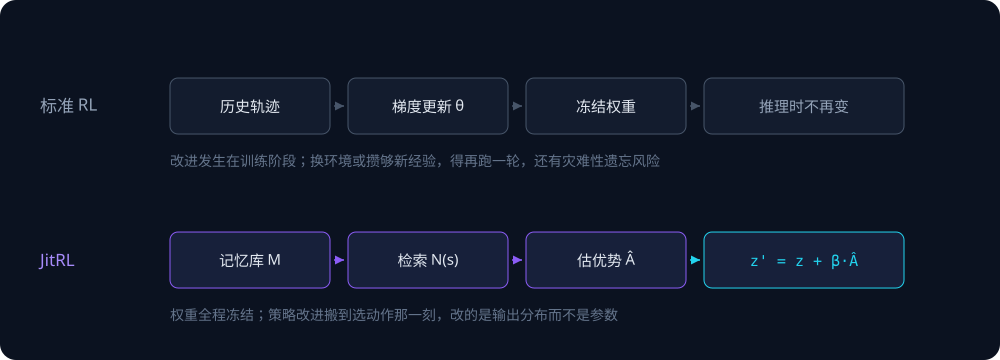
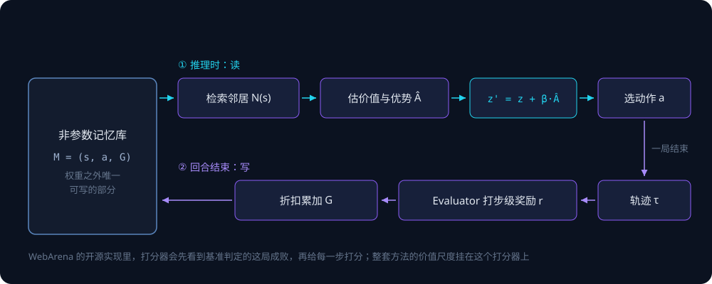
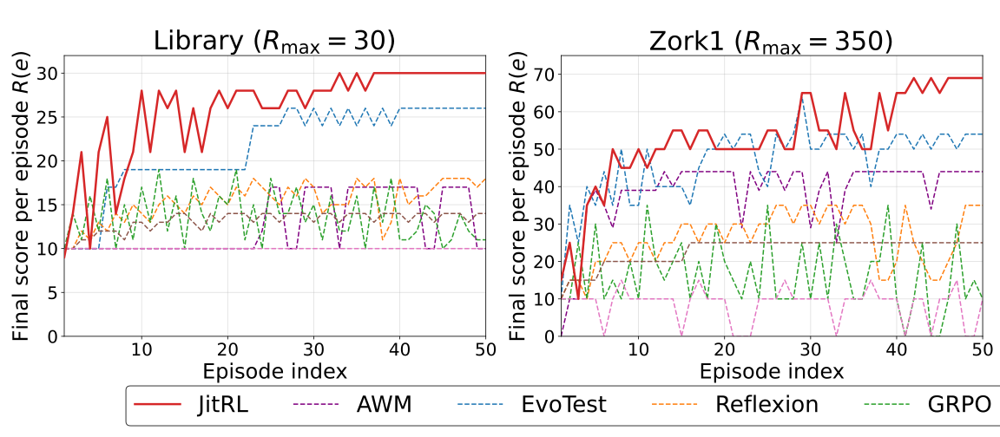
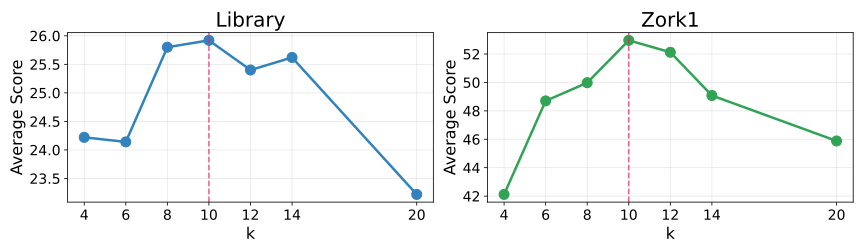
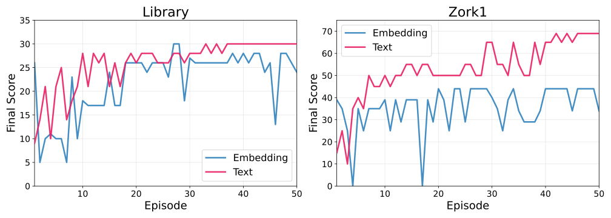

任务是在电商后台「找到客户评价」。模型列出几个候选动作并各自打分，排前两位的是 `click(CATALOG)` 0.90 和 `click(MARKETING)` 0.70：按直觉，评价该挂在商品目录下面。JitRL 查了一遍过去的经验，把这两个分数改成 0.40 和 1.40，agent 转去点了 Marketing，这个后台的评价管理确实在 Marketing 菜单下。整个过程没有更新模型的任何参数。

这个案例来自新加坡国立大学团队的 JitRL（Just-In-Time Reinforcement Learning）论文。它主张冻结模型权重，把强化学习的策略改进挪到推理时做：在网页任务基准 WebArena 和文字冒险游戏 Jericho 上，成绩超过同类的免训练方法，也超过需要训练的 WebRL，花费低 30 倍以上。

我对照论文读了作者开源的代码（提交 143d221，只读，没有运行）。第一节用开头的案例把机制走一遍，回答分数是怎么改出来的；第三节回答论文没交代清楚的一件事：写进记忆的每一步分数是谁打的，打分时知道什么。先给结论：

- 机制在公平对照里成立，但领先幅度比正文表格小。同基座（Llama 3.1 8B）、同样 5 次尝试，JitRL 比在线训练的 WebRL 平均高 5.7 个点，在 Admin 站点低 10 个点；正文里 60.00 对 46.06 的差距，混进了基座和尝试次数两处不对等。
- 代码和论文影响最大的出入在打分环节。WebArena 的默认流程里，给每一步打分的 LLM 事先就被告知这一局按标准答案判定是成功还是失败，论文把这一环写成 agent 的「自我反思」。
- 能不能搬进生产，主要取决于两件事：有没有可靠的成败信号，同类任务会不会反复出现。两条都不满足时，论文里的提升很难照搬。

## 一、机制：记忆不进提示词，直接改候选动作的分数



*▲ 常规强化学习用历史轨迹算梯度、改权重，训练完的模型在推理时固定不变；JitRL 的权重全程冻结，经验存进记忆库，到选动作那一刻才拿来调整输出。图：本文依据论文图 1 绘制*

先给三个术语一句直觉解释：

- logit：模型给每个候选打的原始分，经过 softmax 变成被选中的概率，分越高越可能被选。
- 优势（advantage）：某个动作的预期回报比这个状态下的平均水平高多少。正值说明比平均好，负值说明在拖后腿。
- KL 约束：限制新策略离原策略不能太远。JitRL 用它推出更新公式，本节第三小节再讲。

JitRL 每走一步做四件事：

1. **检索邻居。** 把当前状态和记忆库里的历史状态比相似度，取排在前 k 位的记录，论文默认 k = 10。WebArena 里的状态是去掉 ID 的网址加上最近几步动作。
2. **算两个平均。** 邻居们的平均回报，当作这个状态的价值 V；其中做过同一个动作的那部分邻居，平均回报当作这个动作的价值 Q。
3. **算优势。** 优势 A = Q − V，再除以所有候选里优势绝对值的最大值，缩放到 −1 到 1 之间。
4. **改分数再选。** 把缩放后的优势乘上系数 β，加到原来的分数 z 上，再按新分数的 softmax 采样动作：

$$z'(s,a) = z(s,a) + \beta \cdot \tilde{A}(s,a)$$

回到开头的案例：Catalog 的分数被扣了 0.50，Marketing 加了 0.70。按这个公式读，记忆里在相似页面点 Catalog 的轨迹，平均回报低于邻居均值；点 Marketing 的高于均值，差距大到足以翻转模型原来的排序。

候选集不只来自模型。记忆里在相似状态下做过、这次模型却没提的动作，也会被加进候选，原始分数记为 0，靠优势去竞争（论文附录 F）。反过来，模型提了而记忆里从没出现过的动作，以概率 λ 拿到「邻居均值加一个探索奖励」，否则 Q 直接记 0。WebArena 上 λ 只有 0.05，所以多数时候新动作的 Q 就是 0：邻居均值为正时它被往下压，均值为负时反而被往上抬。

### 写入：每局结束才写，每一步的分由 LLM 评估器打

记忆库是一张三元组表：状态、动作、这一步之后的折扣回报 G。每局结束后，一个基于 LLM 的评估器（论文叫 Evaluator）读完整条轨迹，给每一步打一个分 r。WebArena 的评分区间是 −3 到 +3：+3 的定义是「明显有用，并且你确定」，0 是「判断不了、没有实际效果，或效果马上被撤销」（附录 G）。Jericho 沿用游戏本身的计分尺度。然后从每一步往后做折扣累加：

$$G_t = \sum_{u \ge t} \gamma^{\,u-t}\, r_u$$

γ 是折扣因子，决定一步的功劳能往前传多远。WebArena 取 0.1，几乎只看眼前这一步；Jericho 取 0.5，要照顾更长的因果链。



*▲ JitRL 的读写闭环：推理时检索邻居、估优势、改分数；一局结束后由评估器给每一步打分，折扣累加后写回记忆库。底部那行说明来自第三节的代码核对。图：本文依据论文图 2 绘制*

### 理论：保证了什么，离实验有多远

论文的定理 4.1 说，在「最大化期望优势，同时用 KL 约束不偏离原策略」这个目标下，最优策略有闭式解：

$$\pi^*(a \mid s) \propto \pi_\theta(a \mid s)\, \exp\big(\beta A(s,a)\big)$$

两边取对数，就是上面第 4 步的更新。这个闭式解在强化学习里早有先例，REPS、AWR、AWAC 都从同一个目标出发，论文没有引用它们。JitRL 的新意在于把这一步从训练期挪到推理时：不用梯度去逼近这个分布，每次选动作时直接算出来。

定理 4.2 和 4.3 证明，记忆估出的价值和优势会收敛到真实值，前提是每个动作被试过的次数趋于无穷、邻居数趋于无穷且只占记忆的一小部分、策略漂移趋于零（附录 C）。这是渐近意义上的保证。实验里每个 WebArena 任务只试 5 次，Jericho 每个游戏 50 局，离「无穷」很远。何况定理针对的是论文里的更新形式，不是默认代码的实际行为，两者的差别见第三节。

## 二、证据：换成同基座，领先缩小但还在

### 对免训练同行：总分领先 5.6 个点，Shopping 贡献最多

WebArena 主实验用 Gemini-2.5-flash，每个任务连续尝试 5 次，前面的经验可以用于后面。Avg 是 5 次的平均成功率，衡量学得多快；Final 是第 5 次的成功率，衡量学到最后的水平。下表节选论文表 1 的总体成功率（%）：

| 方法 | Avg | Final | Final − Avg |
|---|---|---|---|
| Static（不带记忆） | 35.63 | 36.30 | +0.67 |
| Memory | 41.36 | 43.00 | +1.64 |
| Reflexion | 41.08 | 42.12 | +1.04 |
| AWM | 39.37 | 40.32 | +0.95 |
| EvoTest | 39.24 | 42.49 | +3.25 |
| JitRL | 46.98 | 51.35 | +4.37 |

JitRL 的 Avg 比第二名 Memory 高 5.62 个点，Final 高 8.35 个点。分站点看，领先主要来自 Shopping：JitRL 的 Avg 是 41.67，这个站点上分数最高的基线是 Reflexion 的 30.83，差 10.84 个点；其余四个站点的领先只有 1.5 到 3.3 个点。

论文写的「Shopping 比 Static 高 73.2%」是相对增幅（41.67 对 24.06），绝对差是 17.6 个点。论文把这里的大幅领先归因于结构化站点的轨迹复用率高，表 6 也显示 Shopping 上用到的记忆有 62% 来自其他任务，五个站点里最高。

换一个基座模型，结论不变。论文在 Admin 和 Reddit 两个站点上换了 GPT-5-mini 和 DeepSeek-V3.2（表 4），两个模型、两个站点、Avg 和 Final 一共 8 格，JitRL 赢了 7 格；输的那格是 DeepSeek-V3.2 在 Reddit 上的 Avg，54.42 对 Reflexion 的 55.04。

只能检索其他任务的记忆时（表 5），JitRL 在五个站点仍排第一，但四个站点的领先缩到 0.5 到 1.6 个点，Shopping 还有 5.2 个点。和允许用同任务记忆的表 1 相比，它比其他记忆方法多出来的优势，主要在同一任务反复做时兑现。

### 和训练方法比：60 对 46 里有两处不对等

论文正文表 2 在 WebArena-Lite 上比 Final。这 165 个任务没有参与 WebRL 的训练，结果是 SFT 23.0、WebRL 46.06、JitRL 60.00。这个差距里混着两处不对等。

**不对等一：基座。** SFT 和 WebRL 用的是 WebRL 作者放出的 Llama-3.1-70B 检查点，JitRL 用的是 Gemini-2.5-flash，两个基座本身的能力差多少，表里分不出来。

**不对等二：尝试次数。** JitRL 的 Final 是同一任务第 5 次尝试的成功率，前 4 次的轨迹和成败都已写进记忆；WebRL 是训练好的固定检查点，没有在这 165 个任务上边试边学的机会。

论文在正文里提了一句，把同条件对照放进了附录 I：两边都用 Llama 3.1 8B Instruct，每个任务都给 5 次尝试，前几次的轨迹 JitRL 存进记忆，WebRL 拿去做在线强化学习更新。表 12 的 Final 成功率（%）如下：

| 站点 | WebRL | JitRL |
|---|---|---|
| Admin | 38.89 | 28.57 |
| GitLab | 23.53 | 30.00 |
| Map | 9.68 | 20.00 |
| Reddit | 50.00 | 53.33 |
| Shopping | 17.39 | 36.96 |
| 平均 | 27.27 | 32.97 |

平均领先 5.7 个点，不到正文差距（13.9 个点）的一半；Admin 上反而落后 10.32 个点。论文的解释是，梯度方法在样本很少的在线场景里难以稳定收敛，记忆检索没有这个问题。这组数据能支持的结论是：每个任务只有几次尝试时，JitRL 比在线训练的 WebRL 学得快。它不说明 JitRL 能胜过一个训练充分的 WebRL。

### Jericho：领先更明显，GRPO 那一行也换了基座

Jericho 是一组经典文字冒险游戏，agent 输入文字指令，拿游戏分数。每个游戏连续玩 50 局，Avg 是 50 局的平均分，Final 是最后一局的得分。每个游戏上分数最高的基线都是 EvoTest，和 JitRL 对比如下（论文表 3，「Avg / Final」）：

| 游戏 | EvoTest | JitRL |
|---|---|---|
| Library | 21.5 / 26 | 25.9 / 30 |
| Zork1 | 46.8 / 54 | 53.0 / 69 |
| Zork3 | 2.6 / 4 | 3.1 / 5 |

Library 和 Zork1 上，JitRL 的 Avg 分别高 4.4 和 6.2 分，Zork1 的 Final 高 15 分。Zork3 上各方法都只有个位数得分，差距说明不了太多。

表 3 里还有一行 GRPO，用的是针对每个游戏单独训练的 Qwen3-32B 检查点，JitRL 和其他基线用的都是 Gemini-2.5-flash。拿上一小节的尺子量，Zork1 上 53.0 对 16.2 的差距同样混着基座差异，不能直接读成推理时优化胜过梯度训练。



*▲ Library（左）和 Zork1（右）上各方法 50 局的得分曲线。红色实线是 JitRL；紫、蓝、橙、绿虚线依次是 AWM、EvoTest、Reflexion、GRPO；棕色虚线是 Memory，粉色虚线是 Static。Zork1 上 GRPO 在 0 到 35 分之间来回，最后一局 10 分。图：论文图 3，arXiv:2601.18510，CC BY 4.0*

### 消融：改分数比塞进提示词好，只测了两个站点

论文的消融实验（表 8）把同样检索出来的记忆写进提示词，和直接改分数对比（Avg，%）：

| 站点 | 写进提示词 | 改分数 | 差 |
|---|---|---|---|
| Admin | 49.46 | 52.31 | +2.85 |
| Reddit | 53.02 | 57.64 | +4.62 |

这组数据直接回答了「改分数这一步本身有没有用」，但只测了两个站点，也没有报告 Final。另外，49.46 和 53.02 恰好分别等于表 1 里 AWM 在 Admin、Memory 在 Reddit 的 Avg，是巧合还是填表时串了行，论文里看不出来。

### 成本：30 倍比的是一次训练和一次评测

论文表 9 的成本：Static 200 美元，Memory、Reflexion、AWM、EvoTest 在 220 到 250 美元之间，JitRL 290 美元，WebRL 约 9900 美元。

两边的计价口径不同。WebRL 的 9900 美元是附录 M 估算的一次完整训练：70B 模型，2 个节点共 16 张 H200，跑 154 小时，按每小时 64 美元计，不含之后的推理开销。JitRL 的 290 美元是跑完这一轮评测的 API 账单，包括每局结束后评估器打分的调用，部署之后这笔钱随任务量持续发生。「低 30 倍」对应的是训练一次、评测一次的场景，任务量上去以后，两条成本曲线的斜率不同。

和免训练同行比，JitRL 多花 40 到 70 美元（贵 16% 到 32%），换来 5.6 到 7.7 个点的 Avg 提升。做技术选型时，这笔账比和 WebRL 的对比更有参考价值。

## 三、代码：打分器在打分前已经知道这局成没成

以下基于作者仓库 [liushiliushi/JitRL](https://github.com/liushiliushi/JitRL/tree/143d22185d95fbf633a0befe6861d5e8b732543b) 的提交 143d221（2026-07-21，仓库只有这一个提交）。我只读了代码，没有运行，文中行号都指这个提交。

### 成败来自标准答案，论文写成自我反思

论文第 4.1 节这样描述评估器：长轨迹的功劳分配很难，所以「利用 agent 的自我反思能力」，每局结束后由一个基于 LLM 的评估器给轨迹打步级奖励。只读论文，会以为评估器手里只有这条轨迹。

WebArena 的默认流程是这样的：

1. 一局结束后，`run.py` 调用 `evaluate_trajectory_direct`，按任务配置里的标准答案判定成败（[run.py L795–832](https://github.com/liushiliushi/JitRL/blob/143d22185d95fbf633a0befe6861d5e8b732543b/WebArena/run.py#L795-L832)）。判定方式随任务类型变化：比对网址，用浏览器打开页面检查元素，或者让 LLM 对照参考答案判断回答对不对（[evaluate_trajectory.py L50–167](https://github.com/liushiliushi/JitRL/blob/143d22185d95fbf633a0befe6861d5e8b732543b/WebArena/autoeval/evaluate_trajectory.py#L50-L167)）。
2. 判定结果作为 `success` 传进 `end_episode`，再原样交给负责逐步打分的评估器（[cross_episode_memory.py L779–790](https://github.com/liushiliushi/JitRL/blob/143d22185d95fbf633a0befe6861d5e8b732543b/WebArena/memory_agents/utils/cross_episode_memory.py#L779-L790)）。
3. 评估器的提示词里直接写着这一局的结果（[utils.py L1210–1220](https://github.com/liushiliushi/JitRL/blob/143d22185d95fbf633a0befe6861d5e8b732543b/WebArena/memory_agents/utils/utils.py#L1210-L1220)）：

```python
    else:
        # When not evaluating success, we can use the known success value for scoring
        user_prompt = f"""Score each action based on the WEBPAGE RESULT it produced, NOT on whether the action itself seems reasonable.

{task_goal_section}
==========================================
FINAL TASK RESULT: {"SUCCESS ✓" if success else "FAILURE ✗"}
==========================================

IMPORTANT: Consider the final result when scoring each step.
- This task {"SUCCEEDED - reward actions that led to useful webpage results" if success else "FAILED - penalize actions that led to wrong webpage results"}
```

用标准答案判定成败，本身不算作弊。在强化学习的设定里，环境给的成败就是奖励信号：WebRL 训练时由结果奖励模型（ORM）判断成败，Jericho 的游戏分数也来自环境。问题出在两个地方：

1. **说法。** 论文把这一环写成 agent 的自我反思，没有交代评估器事先知道外部判定的结果。读者会以为 JitRL 靠模型自己就能判断每一步的好坏，实际上它的价值尺度挂在一个外部判定上。
2. **迁移。** 生产环境通常没有标准答案。代码里有一个 `--use_llm_success_eval` 开关，改由 LLM 自己判断成败（[run.py L352–356](https://github.com/liushiliushi/JitRL/blob/143d22185d95fbf633a0befe6861d5e8b732543b/WebArena/run.py#L352-L356)），默认关闭，论文也没有报告打开它之后的成绩。

同一把尺子还要量到基线上：JitRL 拿到了外部判定的成败，基线有没有？`run.py` 里留着 evotest、reflexion 等基线的分支（[L1046–1055](https://github.com/liushiliushi/JitRL/blob/143d22185d95fbf633a0befe6861d5e8b732543b/WebArena/run.py#L1046-L1055)），看起来基线当时走的是同一套运行框架，Reflexion 分支的注释还写着它用到了前几轮的评测状态。但 `--agent_type` 只放开了 `memory` 一个选项（[L225–230](https://github.com/liushiliushi/JitRL/blob/143d22185d95fbf633a0befe6861d5e8b732543b/WebArena/run.py#L225-L230)），基线的实现没有放出来，它们各自怎么用这个成败，查不到。Jericho 目录带了 Static 和 AWM 两个基线，它们和 JitRL 一样拿到游戏分数，那边不存在这个问题。

### 更新规则：加在 0 到 1 的分数上，取最大值

论文的更新是「logit 加上 β 倍的归一化优势，再按 softmax 采样」。WebArena 的默认代码是下面几行（中文注释为本文所加）：

```python
# jitrl_agent.py L337-340：只要存在正优势，全部除以最大的那个正优势
positive_advs = [adv for adv in adv_values if adv > 0]
if positive_advs:
    max_positive = max(positive_advs)
    normalized_advantages = {action: adv / max_positive for action, adv in action_advantages.items()}

# L377-378：加在 0 到 1 的「概率」上，系数写死为 1
normalized_prob = option_data.get('normalized_prob', 0)
corrected_logprob = normalized_prob + 1 * normalized_advantage

# L1130：取修正后分数最大的候选，不采样
best_corrected_option = max(updated_options_with_logits.items(), key=lambda x: x[1].get('corrected_logprob', float('-inf')))
```

和论文相比，有四处不同：

1. **加在概率上。** 两个环境默认都用 verbalized 模式：让模型自报 0 到 100 的置信度，代码除以 100 当概率用（[WebArena 的换算](https://github.com/liushiliushi/JitRL/blob/143d22185d95fbf633a0befe6861d5e8b732543b/WebArena/memory_agents/jitrl_agent.py#L1044-L1053)；Jericho 的[默认值](https://github.com/liushiliushi/JitRL/blob/143d22185d95fbf633a0befe6861d5e8b732543b/Jericho/main.py#L64-L65)和[换算](https://github.com/liushiliushi/JitRL/blob/143d22185d95fbf633a0befe6861d5e8b732543b/Jericho/src/jitrl_agent.py#L707-L718)）。论文说会把置信度转换成 logit，代码里没有这一步；Jericho 的 token 模式也只是对 logprob 取指数，得到的同样是概率。论文表 7 三个案例里，两个选项的原始分加起来都超过 1，更像各自报出的置信度。
2. **归一化方式不同。** 论文公式 25 除以所有候选优势绝对值的最大值，结果落在 −1 到 1 之间。代码只要存在正优势，就除以最大的那个正优势：排第一的正优势动作固定得到 +1，负优势动作可能低于 −1。
3. **β 没有给出。** 论文的两张超参表（表 10、表 11）都没有列 β。WebArena 代码写死为 1，Jericho 代码按局数从 1 涨到 1.5（[jitrl_agent.py L377–383](https://github.com/liushiliushi/JitRL/blob/143d22185d95fbf633a0befe6861d5e8b732543b/Jericho/src/jitrl_agent.py#L377-L383)）。
4. **取最大值，不采样。** 论文的算法按 softmax 采样，两个环境的代码都直接取修正后分数最大的候选（[Jericho 的写法](https://github.com/liushiliushi/JitRL/blob/143d22185d95fbf633a0befe6861d5e8b732543b/Jericho/src/jitrl_agent.py#L771)）。

四处叠在一起，后果很直接。只要记忆里有动作的优势为正，排第一的那个修正后至少是 1.0；优势不为正的候选，修正后不超过它原来的置信度，也就不超过 1.0。所以除了恰好打平，被选中的总是优势为正的动作，哪怕模型这一步根本没提它：记忆独有的动作以 0 分进入候选，加 1 就是 1.0，模型自己打分最高的候选只要优势不为正，置信度再高也赢不了。论文的公式是「用记忆温和地修正模型」，默认代码的行为更接近「有成功先例就照着做」。

### 超参：论文和默认代码有五处对不上

| 参数 | 论文 | 默认代码 |
|---|---|---|
| β（优势系数） | 未给出 | WebArena 为 1；Jericho 从 1 涨到 1.5 |
| α（探索奖励） | 5 | 两个环境都是 1 |
| λ（Jericho 探索率） | 探索概率 0.65 | 0.65 是公式里的指数，实际概率在 0.05 到 0.8 之间自适应 |
| k（WebArena 邻居数） | 10 | 截断那行被注释掉，超过相似度阈值的全用；阈值随步数从 0.8 降到 0.7 |
| Jericho 步数上限 | 60 | 50 |

对应代码：WebArena 的 [λ 和 α](https://github.com/liushiliushi/JitRL/blob/143d22185d95fbf633a0befe6861d5e8b732543b/WebArena/memory_agents/jitrl_agent.py#L306-L308)、[k 截断](https://github.com/liushiliushi/JitRL/blob/143d22185d95fbf633a0befe6861d5e8b732543b/WebArena/memory_agents/utils/cross_episode_memory.py#L604)、[动态阈值](https://github.com/liushiliushi/JitRL/blob/143d22185d95fbf633a0befe6861d5e8b732543b/WebArena/memory_agents/utils/cross_episode_memory.py#L451-L460)；Jericho 的[探索概率](https://github.com/liushiliushi/JitRL/blob/143d22185d95fbf633a0befe6861d5e8b732543b/Jericho/src/jitrl_agent.py#L139-L231)和[步数上限](https://github.com/liushiliushi/JitRL/blob/143d22185d95fbf633a0befe6861d5e8b732543b/Jericho/main.py#L20)。



*▲ 检索邻居数 k 对 Library（蓝）和 Zork1（绿）的影响：k 在 8 到 14 之间表现平稳，太少或太多都会掉分。这组实验做在 Jericho 上；WebArena 的开源实现没有按 k 截断。图：论文图 4，arXiv:2601.18510，CC BY 4.0*

### 复现前要知道的六件事

1. **模型版本说法不一。** README 说论文结果来自 OpenRouter 上的 `google/gemini-2.5-flash-preview-09-2025` 快照，这个快照已经下线（[README L152–154](https://github.com/liushiliushi/JitRL/blob/143d22185d95fbf633a0befe6861d5e8b732543b/README.md?plain=1#L152-L154)）；作者 7 月 14 日在 [issue #1](https://github.com/liushiliushi/JitRL/issues/1) 里的回复则说，论文结果都是用 gemini-2.5-flash 跑的。两处说法对不上，复现时没法确定该对齐哪个模型。
2. **测试脚本的默认值不是论文协议。** `test_webarena_lite.py` 默认每个任务只跑 1 次（[L697](https://github.com/liushiliushi/JitRL/blob/143d22185d95fbf633a0befe6861d5e8b732543b/WebArena/test_webarena_lite.py#L697)），成功一次就跳过剩下的重复（[L3–6](https://github.com/liushiliushi/JitRL/blob/143d22185d95fbf633a0befe6861d5e8b732543b/WebArena/test_webarena_lite.py#L3-L6)），步数上限 25（[L695](https://github.com/liushiliushi/JitRL/blob/143d22185d95fbf633a0befe6861d5e8b732543b/WebArena/test_webarena_lite.py#L695)）。论文是 5 次尝试、步数上限 10，复现时要显式传 `--repeat 5 --no_early_stop --max_steps 10`。
3. **README 结果表对不上论文。** README 列的 Jericho 成绩里有论文没测过的 Detective，Zork1 写的是 35.2 到 52.8；WebArena-Lite 写的是 Gemini-2.5 从 25.3% 到 34.7%（[README L248–266](https://github.com/liushiliushi/JitRL/blob/143d22185d95fbf633a0befe6861d5e8b732543b/README.md?plain=1#L248-L266)），论文里都找不到对应数字。
4. **站点识别写死了端口。** 记忆的状态键带着站点名，代码按端口号认站点（[utils.py L39–46](https://github.com/liushiliushi/JitRL/blob/143d22185d95fbf633a0befe6861d5e8b732543b/WebArena/memory_agents/utils/utils.py#L39-L46)），这套端口和 README 建议的部署端口（[L113–118](https://github.com/liushiliushi/JitRL/blob/143d22185d95fbf633a0befe6861d5e8b732543b/README.md?plain=1#L113-L118)）对不上。照 README 部署，Admin 和 GitLab 都会被认成 `unknown_site`，其余站点名字错位但仍各自唯一。网址路径还能区分开大部分记录，影响有限。
5. **Jericho 缺依赖不报错。** 向量检索依赖 faiss 和 OpenAI 的嵌入接口。没装 faiss 时只打印一条警告，检索直接返回空列表（[L11–14](https://github.com/liushiliushi/JitRL/blob/143d22185d95fbf633a0befe6861d5e8b732543b/Jericho/src/cross_episode_memory.py#L11-L14)、[L380–382](https://github.com/liushiliushi/JitRL/blob/143d22185d95fbf633a0befe6861d5e8b732543b/Jericho/src/cross_episode_memory.py#L380-L382)）；没设 `OPENAI_API_KEY2` 时，取嵌入的函数打印警告后返回 None（[openai_helpers.py L130–134](https://github.com/liushiliushi/JitRL/blob/143d22185d95fbf633a0befe6861d5e8b732543b/Jericho/src/openai_helpers.py#L130-L134)）。两种情况程序都会接着跑完，跑出来的已经不是论文里的方法，不翻日志看不出来。

第六件影响结果本身：折扣回报的累加有 bug。两个环境的代码都是这样写的（WebArena [L562–569](https://github.com/liushiliushi/JitRL/blob/143d22185d95fbf633a0befe6861d5e8b732543b/WebArena/memory_agents/utils/cross_episode_memory.py#L562-L569)，Jericho [L437–440](https://github.com/liushiliushi/JitRL/blob/143d22185d95fbf633a0befe6861d5e8b732543b/Jericho/src/cross_episode_memory.py#L437-L440)）：

```python
for u, step_reward in enumerate(future_rewards):
    llm_step_score = step_data.get('llm_step_score', 0)  # 当前这一步的分
    ...
    discount = self.gamma ** u
    discounted_return += discount * (step_reward if (step_reward != 0 and step_reward != None) else llm_step_score)
```

`future_rewards` 是从当前步往后每一步的分数。遇到 0 分的后续步骤，代码拿当前这一步的分数顶上。假设某一步打了 +3，后面两步都是 0，γ = 0.5：正确的回报是 3，代码算出 3 + 1.5 + 0.75 = 5.25。

WebArena 的 γ 是 0.1，这个 bug 带来的放大约一成；Jericho 的 γ 是 0.5，后面跟着一长串 0 分时接近翻倍。评估器给 0 分的含义是「判断不了或没效果」，这类步骤在长轨迹里并不少见。高分步骤后面跟着一串 0 分时，它的回报被放大，优势跟着被高估；负分步骤同理被放大成更负。

## 四、能不能用：先回答谁来判定成败

搬进自己的系统之前，至少要满足三个条件：

- **有可靠的成败信号。** JitRL 学到的东西基本都来自评估器给的分，WebArena 默认代码里的评估器参考了标准答案。你的场景里要有对等的东西：测试是否通过、订单状态、工单是否关闭、页面上能检查的终态。拿不到的话，先单独验证 LLM 自己判断成败的准确率。
- **同类任务会反复出现。** 只能用其他任务的记忆时，JitRL 在五个站点里有四个领先不到 1.6 个点；任务结构高度重复的 Shopping 还领先 5.2 个点。任务各不相同时，更简单的记忆方案差不多够用。
- **能拿到每个候选的分数。** 要么模型开放 logprob，要么让模型自报置信度。论文给了两种变体，但没有分别报告它们的成绩。

成本上，每局要多调一次评估器给所有步骤打分，论文报告的账单比 Static 高 45%（290 对 200 美元）。

### 不整套用，也有三处可以抄

- **状态键。** WebArena 把网址里的数字 ID 换成占位符，再拼上最近几步动作，作为检索用的状态。代码注释里的例子是 `/admin/customer/edit/123/` 改写成 `shopping_admin/admin/customer/edit/ID`，换一个客户也落到同一个键上，经验可以在同类页面之间复用（[utils.py L9–24](https://github.com/liushiliushi/JitRL/blob/143d22185d95fbf633a0befe6861d5e8b732543b/WebArena/memory_agents/utils/utils.py#L9-L24)）。
- **动作归一化。** `click('1240')` 里的元素编号每次加载都可能变，代码把它改写成 `click(<combobox[Sort by:]>)` 这种「元素类型加可见文本」的形式再存进记忆；取回时在当前页面找不到对应元素就跳过（[jitrl_agent.py L257–284](https://github.com/liushiliushi/JitRL/blob/143d22185d95fbf633a0befe6861d5e8b732543b/WebArena/memory_agents/jitrl_agent.py#L257-L284)）。
- **按文本重叠检索。** 相似度用 Jaccard，即两段文本的词集合交集除以并集。WebArena 先按网址过滤，再算 Jaccard；Jericho 先用向量召回，再用 Jaccard 重排。论文附录 K 比较过状态的两种表示：结构化的文字摘要和稠密向量。向量版本在 Zork1 上起伏很大，论文的解释是向量会把描述相似、位置不同的状态判成相似，取回错的记忆。



*▲ 粉线是文本状态（默认），蓝线是嵌入状态。Zork1 上嵌入版本最高约 44 分，中途两次跌到 0；文本版本最后一局到 69 分。图：论文图 5，arXiv:2601.18510，CC BY 4.0*

### 上线前要补的防护

- **准入控制。** 按第三节的分析，一条回报足够高的记录只要被检索到，对应动作在相似状态下几乎一定会被选中，模型自己没提这个动作也一样。被投毒或者被评估器打错分的记录，会直接变成行为。自进化 agent 的研究里已经有现成的攻击：EVOMAL 实验中，agent 会自己复制出恶意技能，数量是植入源的 4.9 到 9.0 倍，删掉植入源之后，Qwen3 在第 5 轮的攻击成功率仍有 68%（详见[《Agent 自进化开源盘点：什么能跑，什么在腐烂，什么被门控救回来》](/p/self-evolving-agents-open-source-audit/)）。写入记忆之前，至少要校验来源和打分依据。
- **淘汰与隔离。** 记忆库只追加不删除，唯一的清理手段是整库清空（[cross_episode_memory.py L93](https://github.com/liushiliushi/JitRL/blob/143d22185d95fbf633a0befe6861d5e8b732543b/WebArena/memory_agents/utils/cross_episode_memory.py#L93)）。存储格式是 pickle（[读](https://github.com/liushiliushi/JitRL/blob/143d22185d95fbf633a0befe6861d5e8b732543b/WebArena/memory_agents/utils/cross_episode_memory.py#L64)、[写](https://github.com/liushiliushi/JitRL/blob/143d22185d95fbf633a0befe6861d5e8b732543b/WebArena/memory_agents/utils/cross_episode_memory.py#L90)），加载来路不明的记忆文件，等于允许它执行任意代码。
- **按场景调参。** 论文里两个环境的超参差别很大：γ 0.1 对 0.5，相似度阈值 0.8 对 0.95，步数上限 10 对 60，探索率 0.05 对 0.65。换到新场景，这些都要重新调，论文只给了 k 的敏感性实验。
- **许可证。** 仓库里没有 LICENSE 文件，默认保留所有权利。商用或复制代码之前，先向作者确认授权。

## 五、查过论文、代码和 issue 之后仍没有答案的问题

1. 不告诉评估器成败时，JitRL 还剩多少提升？代码有 `--use_llm_success_eval` 开关，论文没有报告这组成绩。
2. WebArena 的四个基线，以及附录 I 里在线训练的 WebRL，有没有拿到同样的成败信号？运行框架里有基线的分支，实现没有放出来；附录 I 也没写两边各用什么判定成败。
3. Static 连试 5 次、至少成功一次的比例（pass@5）是多少？在知道成败的协议下，只要能把之前的一次成功照着重放，Final 就能逼近这个数，它是衡量 JitRL 学到多少的自然参照。
4. 论文的数字对应哪套配置？β 取多少，α 是表里的 5 还是代码里的 1，用的是 token 还是 verbalized 变体，模型是哪个 Gemini 版本。
5. 评估器的打分和人工判断一致吗？论文没有测量。

## 六、结论：记忆能替代梯度，替代不了裁判

JitRL 把一个已有的闭式解搬到了推理时。在同类任务反复出现、每次尝试后都知道成败的小样本条件下，它比在线梯度训练起效快，同基座对照里赢了 WebRL 5.7 个点。默认代码比论文公式激进，实际是一条「有成功先例就照着做」的规则；它能学到什么，上限由评估器决定，而 WebArena 的评估器在打分前已经知道标准答案的判定。

如果你的场景有测试结果、交易状态这类可靠的成败信号，同类任务又会反复出现，可以先抄状态键、动作归一化和文本重叠检索这三样，配上准入控制，再决定要不要上整套改分机制。如果成败只能靠 LLM 自己判断，先等一组不给评估器标准答案的成绩，或者在自己的一小批任务上测出来。

记忆能替代梯度，替代不了裁判。

## 出处

- 论文：Yibo Li、Zijie Lin、Ailin Deng、Xuan Zhang、Yufei He、Shuo Ji、Tri Cao、Bryan Hooi，[Just-In-Time Reinforcement Learning: Continual Learning in LLM Agents Without Gradient Updates](https://arxiv.org/abs/2601.18510)，arXiv:2601.18510v1，2026-01-26，CC BY 4.0。本文引用了正文第 1 到 6 节和附录 A、B、C、E、F、G、H、I、K、M。
- 代码：[liushiliushi/JitRL](https://github.com/liushiliushi/JitRL)，提交 143d221（2026-07-21），文中行号都指这个提交。另读了 issue #1 到 #3。未合并的分支 `codex/single-forward-decisions` 不在本文范围内。
- 图：图 3、图 4、图 5 取自论文（CC BY 4.0）；两张机制示意图依据论文图 1、图 2 绘制。
- 线索：B 站「Lau博士的云组会」的视频[《不训一个参数！准实时强化学习：JitRL【论文精读】》](https://www.bilibili.com/video/BV1rtHW6oEGw/)。视频和另一篇精读都称它为 ICML 2026 论文，arXiv 页面上只有模板自带的关键词「Machine Learning, ICML」，没有录用信息，本文不采用这个说法。
- 相关：[《Agent 自进化开源盘点：什么能跑，什么在腐烂，什么被门控救回来》](/p/self-evolving-agents-open-source-audit/)。
