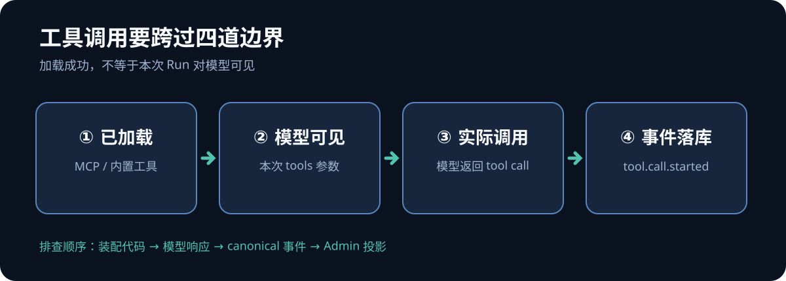
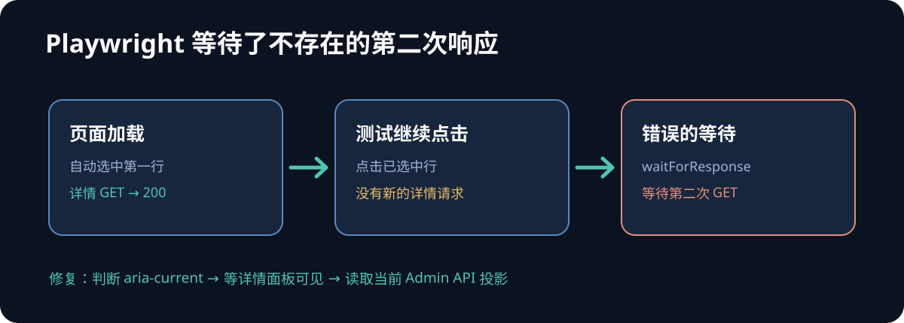
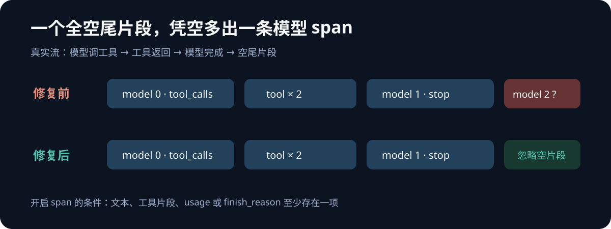

一次 Agent 执行轨迹验收中，后端启动日志显示 MCP 服务已登记、5 个工具已加载，但两次真实 Run 都是 `succeeded`、`model.call.started=2`、`tool.call.started=0`。当时最容易下的结论是「模型选择了直接回答」。这个判断太快了：测试提示词点名的工具虽然加载成功，却已被运行时从**模型可见的工具列表**中移除。

后来改用真正可见的只读工具，调用发生了，轨迹却多出一条约 3 ms 的模型 span。最终又发现，流结束后的全空片段被当成新一轮模型调用。修正这两个边界后，真实浏览器里看到的树才是预期的 **1 个 Run 根、2 次模型调用、2 次同名工具调用**。

这次经历给我的核心提醒是：**「工具已加载」「模型能调用」「工具实际被调用」「轨迹正确记录」是四个不同的事实，必须分别取证。**

## 一、零工具调用，先确认工具是否对模型可见

初始提示词要求调用 `query_fcl_rates`。Runner 启动时确实加载了包含它的 MCP 工具，但业务流程会在上游查询与写入工具都可用时，把 `query_fcl_rates` 和 `save_fcl_rates` 从模型工具列表里移除，只留下受控的同步入口。这样做是为了让写入流程由服务端编排，避免模型自行拼接查询和写入请求。

因此，`mcp_tools=5` 只能证明工具从 MCP 服务加载到了 runner；它不能证明某个工具进入了本次 Run 的 `create_deep_agent(..., tools=...)`。这次测试一直催模型调用一个不可见工具，零调用并不能归咎于模型决策。



排查时我会按这四层逐项核对：

| 边界 | 应看的证据 | 这次的结果 |
| --- | --- | --- |
| MCP 加载 | 服务登记、加载日志 | 服务可用，工具已加载 |
| 本次 Run 装配 | 传给 Agent 的最终工具列表及授权过滤 | `query_fcl_rates` 被有意隐藏 |
| 模型输出 | 真实模型响应中的 tool call | 隐藏工具没有调用 |
| 持久事件 | `tool.call.started/completed` 与调用 ID | 初始 Run 均为 0 |

验证目标要选**本次确实暴露给模型**、同时不会产生业务副作用的工具。我换成 `derive_fcl_row_ids`：它为给定 FCL 业务行生成稳定 ID，是只读工具。提示词明确提供两条不同业务行，要求分别调用同一工具，不允许模型自行编造 ID。

这一步产生了两个独立的 `tool_call_id`，也让「同名工具调用不能按工具名互相覆盖」有了真实入口证据。它验证的是内置只读 Tool，**没有据此声称 MCP 工具已经被真实调用**。

## 二、测试挂起，可能是等了一次永远不会发生的请求

Playwright 用例最初在 Admin 详情页静默等待约 15 分钟。后端日志显示详情 GET 已返回 200，于是「网络请求卡住了」看起来也很合理。但浏览器 trace 里最后一个未完成的动作是 `waitForResponse`。

原因是列表加载后自动选中了第一条 Run，并立即请求详情。测试又注册了一个等待详情响应的监听器，再点击这条**已经选中**的行。点击不会触发第二次请求，监听器等待的其实是一件不会发生的事。



修法不是把测试总超时调大，而是按页面状态断言：若目标行尚未选中则点击；随后等待真实详情面板可见，并通过 Admin API 读取当前投影。浏览器内的 `fetch` 也加上明确的 `AbortController` 超时。这里的经验是，遇到挂起应查看**最后一个未结束的浏览器动作**，再对照网络日志；后端请求成功不代表测试等待的那一次请求存在。

## 三、多出一条模型 span，要回到原始流片段

换用可见工具后，真实 Run 先得到 3 条 model span 和 2 条 tool span。第三条 model span 约 3 ms、`finish_reason=null`，既没有可解释的文本，也没有新的工具调用。投影层如实展示了事件；问题发生在更早的流转事件边界。

共享的 `ModelCallTracker` 原先只要收到 `AIMessageChunk` 就开启模型调用。部分兼容流在 `stop` 后还会给出一个全空尾片段；上一轮已关闭，这个片段便被误记成下一轮。修复条件改为：片段至少含文本、工具调用片段、usage 或完成原因，才可开启模型调用。全空尾片段不再生成 span，并补了回归测试。



修复后，在真实 Assistant 页面提交请求，经过 public 代理、Run API、真实模型、工具、事件落库，再用全新的 Admin 浏览器上下文刷新详情，最终观察到：

```text
Run root
├─ model turn 0 · finish_reason=tool_calls
│  ├─ derive_fcl_row_ids · tool_call_id A
│  └─ derive_fcl_row_ids · tool_call_id B
└─ model turn 1 · finish_reason=stop
```

两次工具调用的 ID 不同，均归属首轮模型；Admin API 的节点集合与 DOM 一致，刷新后节点 ID、顺序和状态不变。相关 Playwright 流程通过，后端全量测试为 983 passed。Token 用量在这次真实 Run 中仍为空，这是独立的待处理观测，不能用漂亮的轨迹树把它掩盖。

## 四、把验证结论写成分层证据

这次排查里，有三种「通过」很容易被混为一谈：

1. **契约测试通过**：可以证明投影算法如何处理同名工具、未知父级和重复事件。
2. **真实入口不变量通过**：可以证明真实浏览器、认证、API、数据库和 DOM 串起来后没有断链。
3. **目标形状通过**：需要真实 Run 确实产生预期的模型与工具事件，且截图与 API、事件流相互对得上。

最初两个 Run 只有 root + 2 model，第二层的大部分断言可通过，第三层却没有达到。后来出现 3 model + 2 tool，工具配对有了证据，精确形状仍不对。只有过滤空尾片段并再次跑完整链路后，才同时拿到 2 model + 2 tool。这些中间结果都应该保留在证据报告里，而不是用最后一次成功覆盖排查历史。

我的验收顺序现在会这样安排：先确认本次 Run 的最终可见工具集；再取原始事件与终态；随后检查 Admin API 投影和浏览器 DOM；最后做全新浏览器刷新，并把截图的验证层级与尚未覆盖的边界写清楚。若页面测试挂住，先定位未完成的 Playwright 动作；若 span 数量异常，先看原始流与事件生成，不急着改投影算法。

工具调用没有发生时，问题未必在模型；轨迹多出节点时，问题也未必在页面。把每一道边界的证据拆开，才能知道该改提示词、运行时装配、流式事件转换，还是测试本身。
