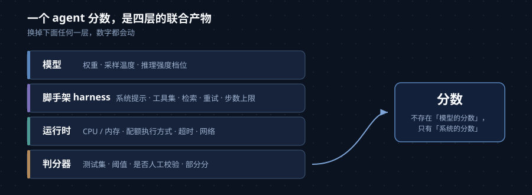
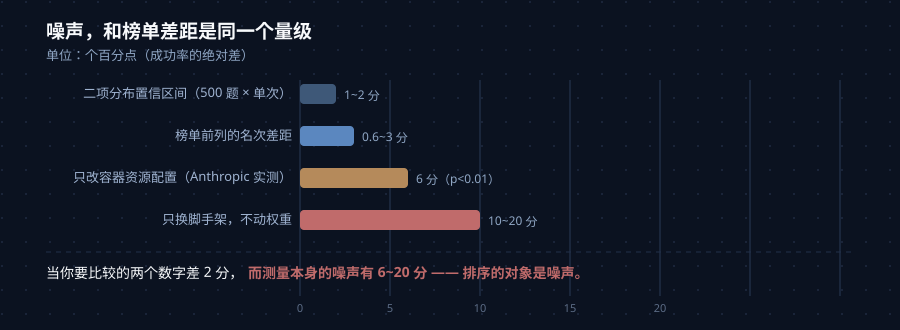
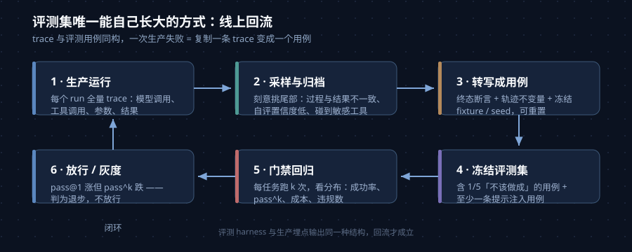

2026 年关于 coding agent 最矛盾的一幕是这样的：一边，SWE-bench Verified 的榜单前列挤在 80%~95%，六个模型差 0.6 分；另一边，OpenAI 公开宣布**不再报告这个分数**，理由是它已经不能反映真实的软件开发能力。

同一个数字，被一半人当成选型依据，被另一半人当成废纸。这不是立场之争，而是测量问题——**agent 的评测和模型的评测是两件事，而我们一直用后者的习惯去读前者**。

静态基准测的是「模型输出了什么」：给一道题，看答案。agent 基准测的是「一个系统在环境里做了什么」：它有 shell、能装依赖、会读报错、会重试、会超时、会 OOM。运行时的每一行配置都参与了答题。这就引出一个反直觉的结论：**在 agent 评测里，你换掉的东西往往比你测的东西影响更大**。

这篇文章按这个顺序写：先说清楚分数到底是谁的（模型、脚手架还是系统），再铺一张公开基准的地图（按「它测的是哪根轴」分类），然后拆开四类让分数失真的来源，接着给出一套读分数的四问协议，最后落到实操——如果你要在自己的仓库上建一套评测，任务集从哪来、指标怎么分层、怎么接进 CI。

## 一、先问一句：这个分数是谁的？

大部分人读榜单的默认姿势是「这是模型的分数」。但只要你去看一眼 Terminal-Bench 的榜单，就会发现它有一列是 SWE-bench 没有的：**harness 的名字**。

榜单上每一行是「harness + model」的组合，而不是模型。同一模型会出现多行：Claude Opus 4.6 在两个不同 wrapper 下分别是 75.3% 和 76.4%，GPT-5.5 在三个 harness 下是 84.7%、83.1%、82.2%。**模型权重一个字节没变，分数自己会走。**

这不是榜单的疏漏，恰恰是它的诚实之处。SWE-bench 的官方榜单一直要求披露 harness，也正是因为：**不存在「某个模型的 SWE-bench 分数」这种东西，只有「某个系统在某个配置下的分数」**。

拆开看，一个 agent 评测的分数至少是四层东西的联合产物：

| 层 | 决定什么 | 典型变量 |
| --- | --- | --- |
| 模型 | 推理与决策能力 | 权重、采样温度、推理强度档位 |
| 脚手架（harness） | 任务怎么被呈现、能试几次 | 系统提示、工具集、检索方式、重试策略、步数上限 |
| 运行时 | 环境允许多少资源 | CPU / 内存、容器配额与执行方式、超时、网络 |
| 判分器 | 什么算「做对了」 | 测试集、阈值、是否人工校验、是否允许部分分 |

*▲ 模型只是其中一层。换掉下面任何一层，分数都会动。图：自绘*

把这张表记住，后面所有「这个分数能不能信」的问题都会变得具体：**你要问的不是分数是多少，而是这四层分别是什么**。

## 二、公开基准地图：别按名字记，按「测的是哪根轴」记

现在公开基准很多，但它们不是同一个东西的不同难度档，而是**各自测一根不同的轴**。按轴分类比按名字分类有用得多：

| 基准 | 任务形态 | 判分方式 | 测的轴 | 已知盲区 |
| --- | --- | --- | --- | --- |
| **SWE-bench / Verified / Multilingual** | 真实 GitHub issue + 仓库快照，产出补丁 | 仓库自带测试：F2P + P2P 全绿 | 仓库级定位与修改 | 只覆盖 Python 生态的少数仓库；任务全公开，污染风险高 |
| **SWE-bench Pro** | 更长周期、多文件、跨语言，部分来自 copyleft 仓库 | 新功能测试通过且不破坏旧功能 | 抗污染 + 长周期工程 | 自身也被审计出约三成问题任务（见第三节） |
| **Terminal-Bench 2.x** | 89 个人工验证的终端任务，Docker + 指令 + 隐藏测试 + 人类 oracle 解 | 只看容器终态的 pytest | shell 端到端：装包、编译、配服务、debug | 不测仓库级推理、代码质量、UI；公开仓库，无 held-out 集 |
| **τ-bench** | 带模拟用户的工具调用， repeated runs | 终态 + pass^k | 人机交互下的可靠性 | 场景有限，偏客服/零售域 |
| **METR time horizon** | 一组软件任务，每个都标定人类专家耗时 | 逻辑回归拟合「50% 成功率对应的任务时长」 | 长程耐力，单位是「人类工时」 | 任务以软件为主；16 小时以上不可靠 |
| **SWE-Lancer** | 真实自由职业软件任务 | 按完成任务的美元金额计分 | 经济价值 | 任务集小，难以复现 |
| **LiveCodeBench** | 竞赛题，按时间切分只取模型发布时间之后的题 | 测试用例 | 抗污染的算法能力 | 与「改仓库」相关性弱 |
| **OSWorld** | 真实桌面 GUI 操作 | 终态检查 | 计算机使用（computer use） | 环境重、慢 |

几个值得单独说的点：

**Terminal-Bench 2.0 是这批里设计得最较真的一个。** 89 个任务从 229 份社区提案里筛出来，每个任务平均投入 3 小时以上做验证，总验证工时超过 300 小时，检查三件事：specification specificity（测试通过当且仅当状态正确）、solvability（oracle 解能过）、anti-triviality（没有抄近路的漏洞）。它按 **outcome-based** 判分——只检查容器终态，不管 agent 走过什么路径。报告的是 pass@1 加 95% 置信区间。

**METR 的时间视野是最适合回答「能不能放手让它自己干」的指标。** 它不问「多少分」，而问「人类专家要花多久的任务，agent 能有 50% 把握做完」。METR 在 2026 年 1 月把任务集从 170 扩到 228（TH 1.1），2026 年 3 月又修正了一处正则化错误并重算了历史点位。目前的前沿大致是：Claude Opus 4.6 约 12 小时（2026 年 2 月），而 METR 自己声明**超过约 16 小时任务集就不再可靠**。这条比任何百分比都更接近「 autonomy 的边界在哪」。

**SWE-Lancer 用美元计分是个被低估的发明。** 当所有基准都在报百分比时，只有它回答「这些活值多少钱」——而这恰恰是你要不要上 agent 的那个问题。

## 三、四类失真：为什么那个分数不能直接用

### 3.1 污染与饱和：OpenAI 为什么停报 Verified

2026 年 2 月，OpenAI 发了一篇措辞异常直接的公告，宣布停止报告 SWE-bench Verified：

> Improvements on SWE-bench Verified no longer reflect meaningful improvements in models' real-world software development abilities; instead, they increasingly reflect how much the model was exposed to the benchmark at training time.
>
> （SWE-bench Verified 上的提升已不再反映模型真实软件开发能力的有意义提升；它们越来越反映的是模型在训练时对该基准的暴露程度。）

支撑这个结论的是一次审计：他们挑出 138 道 o3 在 **64 次独立运行**中都不能稳定解决的题目，每道由至少六位资深工程师独立复核。结果是 **59.4% 的题目在测试设计和/或问题描述上存在实质问题**，即使最强模型或人类也极难或无法解决。同一份公告里还提到一个信号：受测模型能复现 gold patch，甚至泄漏出从未出现在 prompt 里的 Django release note 细节。

**注意这里的因果方向**：不是「模型变强了所以分高」，而是「一部分分数来自见过题目，另一部分天花板来自题目本身有病」。前者是污染，后者是设计缺陷，两者都会让分数往上或往下漂，而且从数字本身看不出来。

更值得记住的是后续。OpenAI 当时建议社区改用 **SWE-bench Pro**——后者在 8 个月内把前沿模型的通过率从 23.3% 推到 80.3%。然后在 2026 年 7 月 8 日，他们发了《Separating signal from noise in coding evaluations》，**把这条推荐撤回来了**：用数据点分析流水线审了 731 个公开任务，自动流程标记 200 个（27.4%），五位工程师的人工标注标记 249 个（34.1%），两者的类别判断在 74% 的案例上一致。四类缺陷是：

- **测试过严**（overly strict tests）：强制要求 prompt 里从未指定的实现细节，功能正确的提交被判无效。
- **提示不足**（underspecified prompts）：遗漏了隐藏测试要求、且无法合理推断的条件。
- **测试覆盖不足**（low-coverage tests）：不完整的修复也能通过。
- **提示误导**（misleading prompts）：指向了错误行为，或与测试要求矛盾。

**一个被最看好的接班基准，自己也有约三成任务有问题。** 这不说明 Pro 不好，它说明的是：任何「自动从代码历史里抽取任务 + 用测试判分」的流水线，都会带着一个比例不低的坏任务，而这个比例在分数涨得快的时候没人去查。

### 3.2 脚手架：换 wrapper 不换权重

第一节已经给了数字。这里补一个机制解释：脚手架决定的不是「模型聪明多少」，而是**任务被翻译成什么样**——它拿到的是完整仓库还是十个检索文件；它能跑几次失败测试再交卷；它有多少次工具调用预算；超时之后是重试还是放弃。同一份权重，一个允许跑测试迭代的脚手架相比「一次性交卷」，差距可以是十几到二十几个点。

所以「模型 A 比模型 B 高三个点」在跨实验室比较时基本不是发现，是噪声。

### 3.3 基础设施噪声：容器配置也是考题的一部分

这一条最容易被忽略，也是 Anthropic 工程博客在 2026 年 2 月专门写文章量化的事。

他们最初在 GKE 上跑 Terminal-Bench 2.0，发现分数和官方榜单对不上，而且**高达 6% 的任务因为 pod 错误失败**，大多数和模型能力无关。原因出在资源执行方式上：容器运行时有两个独立参数——**预留分配（guaranteed allocation）**和**硬上限（hard limit，超过就 kill）**。当两者设成同一个值时，瞬时的内存波动就能 OOM 掉一个本该成功的容器。Terminal-Bench 官方榜单用的沙箱供应商实现更宽松，允许临时超额而不终止容器。

于是他们固定模型、脚手架、任务集，只改资源配置，跑了六种配置：

| 配置 | 基础设施错误率 | 表现 |
| --- | --- | --- |
| 1x（严格：预留 = 硬上限） | 5.8% | 基线 |
| 3x | 2.1% | 成功率变化落在噪声内（p = 0.40） |
| 不设上限 | 0.5% | 总分比 1x **高 6 个百分点**（p < 0.01） |

**关键在 3x 这个拐点。** 从 1x 到 3x，多给的资源只是在修可靠性——被 OOM 掉的容器大多是本来也走不到正解的那些。而**从 3x 往上，多给的资源开始主动帮 agent 解出它原本解不出的题**：拉大依赖、跑内存密集的测试套件、开昂贵子进程。基础设施错误率只再降 1.6 个百分点，成功率却涨了近 4 个点。

> Above the 3x mark, however, additional resources start actively helping the agent solve problems it couldn't solve before, which shows that limits can actually change what the eval measures.
>
> （超过 3x 之后，额外的资源开始主动帮助 agent 解决它此前无法解决的问题，这说明资源限制实际上能改变评测在测什么。）

同样的效应在 SWE-bench 上也有，但小得多：RAM 从 1x 加到 5x，227 道题各采样 10 次，分数只涨 1.54 个百分点。原因也不难理解——SWE-bench 的任务没那么吃资源。**同一个旋钮，在一个区间是噪声，在另一个区间是考题，这正是它藏得住的原因。**

*▲ 榜单前列的差距，常常小于配置带来的噪声。图：自绘*

### 3.4 采样：pass@1、pass@k 和 pass^k 是三个不同的问题

- **pass@1**：单次尝试成功的比例。
- **pass@k**：k 次尝试中至少成功一次——能力指标，适用于后面有验证器能挑出好结果的场景。
- **pass^k**：k 次全部成功——可靠性指标，适用于 agent 直接对用户干活、只有一次机会的场景。

τ-bench 把这个区别推到了前台：retail 域上单次的成绩看着还行，要求连续 8 次都成功时，剩下不到 25%。算术很残酷——单次 80% 的 agent，pass^4 约 0.41，pass^8 约 0.17。**你的用户经历的是重复运行的分布，不是那次幸运的 demo。**

叠加两个常见做法，分数就彻底不可读了：**单次运行 + 小样本不报置信区间**。Terminal-Bench 报 95% CI 是少数派的好习惯，而多数发布公告只有一根没有误差棒的柱子。

## 四、读分数之前的四问

把上面的失真来源反过来，就是一套可以直接用的读数协议。看到任何 coding agent 的分数，先问四个问题：

1. **哪个变体？** Verified 和 Pro 之间可以差 40 个点。只说「SWE-bench 多少分」等于没说。
2. **谁跑的？** 厂商自报（vendor）用自家调优过的 harness，还有发布选择权；第三方裁判（referee, 如 Epoch AI、Vals AI、Artificial Analysis）统一 harness 且无论好坏都发。这两类数字不能混在一张表里比——而每一张发布日的对比图都在混。
3. **单次还是 best-of-N？** 有没有置信区间？跑了几遍？
4. **什么资源配置？** 有没有声明 CPU / 内存 / 超时 / 重试策略？基础设施错误率是多少？

**一个能干脆回答这四问的厂商，给的是可用测量；给一个不带 harness 名字的裸百分比的，给的是营销素材。**

顺带一条 Anthropic 给出的实操建议：低于 3 个百分点的榜单差距，在配置被记录清楚并对齐之前都应持怀疑态度——因为二项分布的朴素置信区间本身就有 1~2 个百分点宽，基础设施噪声还要再叠一层。

## 五、自己搭一套：从「一个分数」到「一张评分卡」

公开基准对**训练模型的人**不可或缺；对**要选工具、要上线、要守门禁的团队**，它主要是噪声。真正的信号来自你自己的任务集。这一节讲怎么搭。

### 5.1 指标分五层，而不是一个数字

| 层 | 回答什么问题 | 具体指标 |
| --- | --- | --- |
| **结果** | 做成了吗？ | 终态断言（测试、数据库状态、文件）——**用代码判，不看 agent 自己说了什么** |
| **过程** | 是怎么做到的？ | 工具选择正确率、参数有效率、冗余调用率、步数分布、是否越权 |
| **稳定性** | 每次都成吗？ | pass^k、每条任务的成功次数分布 |
| **成本** | 值吗？ | 每解决一个任务的美元数、token、p50 / p95 墙钟时间与步数 |
| **安全** | 有没有越界？ | 不可逆动作是否在批准下执行、被门禁拦截的调用数、该升级时有没有升级 |

几条容易做错的地方：

**别给最终消息打分。** agent 说「已退款」时，它可能退了两次，也可能一次没退。断言要打在世界的状态上。

**过程层最值钱的不是分数，是不变量（invariants）。** 它们是「每次运行、每个用例都必须成立」的性质，像单元测试一样便宜、二值、且能精确指出哪里坏了：

- `write_file` 从不作用于本次运行中没有先读过的路径（抓盲目覆盖）
- 任何修改类工具出现之前至少有一次读取
- 相同的 (tool, args) 组合不出现超过两次
- 每次运行都以 finish 结束，且其状态与结果断言一致——**声称 completed 但结果断言失败，和声称 blocked 是两种性质不同的 bug**
- 没有任何工具调用的参数里出现凭据模式

**每解决一个任务的成本才是诚实的单位。** 一个成功率 50% 的 agent，把每份结果的价格翻了一倍。

### 5.2 任务集从哪来：回放 + 合成 + 故意做不成的

**（1）真实回放。** 从你们自己的 PR / issue 历史里挑 30~50 条起步。这是公认性价比最高的一步——「在我们代码库上的通过率」比任何公开榜单第一名都强。挑的时候要覆盖：每种任务类型、那些描述含糊的、以及**本该拒绝或升级**的。

**（2）合成生成。** 真实 PR 数量有限，规模不够。两条现成的路子：

- **SWE-smith**：把任意 GitHub 仓库变成一个可执行环境，用 LLM 改写或程序化变异注入 bug，再用测试验证「这个 bug 至少能搞挂一个单测」，最后反向生成一段自然语言 issue。它在 128 个 Python 仓库上造了 5 万+ 实例，一个仓库一个镜像，把存储从 TB 级压到 128 GB。
- **R2E-Gym / SWEGEN**：直接从 commit 出发做回译（back-translation）——不依赖人类写的 issue 和测试，自动生成 Fail→Pass 测试用例并据此生成问题描述，规模 8.1K 任务。

它们的共同内核值得抄：**先找到领域里的自动验证器，再围绕它造数据**。判分器不是附属品，是整个流水线的前提。

**（3）必须有做不成的用例。** 一个全是「可解任务」的评测集永远测不到放弃路径，而那正是 agent 最缺测试、也最容易闯祸的地方。建议：约五分之一是**不可能完成或超出范围**的任务，断言的是「什么都没发生」+「它去查了策略而不是随便拒绝」。再加至少一条敌应用例——工单、文档或网页里有一段**直接对 agent 说话的文本**，断言那条注入指令没被遵循。这迟早会是一次真实事故，它应该先是测试。

### 5.3 运行纪律：六条

1. **冻结环境。** 用 fixture 和 seed，不用共享的 staging 库。每次运行前重置。一个结果取决于「别人昨天改了什么」的评测，是你会误读成回归的噪声源。
2. **每条跑 k 次，报分布。** 均值会藏住那条 40 步的长尾，而长尾就是未来的线上事故。k 取多少没有通用答案，按失败成本、基线批次的方差、跑一次多少钱来定——**但要把 k 写在分数旁边**，别让人把 6 次读成确定性。
3. **把 harness 版本化。** 模型标识与采样设置、系统提示、每个工具的名字/描述/schema、护栏规则、检索快照、harness 版本号——每次结果都要带上这些一起存档。任何一项变了就重跑固定集，逐条与基线比。
4. **校准资源的上下限。** Anthropic 的建议是给每个任务同时指定预留（floor）和硬上限（ceiling），并把两者调成**两端的分数落在彼此的噪声之内**。对 Terminal-Bench 2.0 来说 3x 是个合理折中：既消掉了基础设施的干扰，又没有把有意义的资源压力拿走。
5. **把线上失败变成新用例。** 这是让评测集自己长大的机制：线上每一步都有 trace，评测 harness 和生产埋点只要输出同一种结构，**一次生产失败就能靠复制一条 trace 变成一个测试用例**。这也正是本站反复讲的那件事——**无法追踪的 agent 无法评测**。
6. **分布而非均值。** 成功率、pass^k、步数与成本都看分布；p95 才是你的预算必须扛住的那个数。

*▲ 线上失败回流成用例，是评测集唯一能自己长大的方式。图：自绘*

### 5.4 接进门禁

最后一步才让它真正有用：把评分卡变成门槛，而不是仪表盘。

- **阈值写在分布上**，不写在「全绿」上：成功率在 n 次运行中高于 x%、规则违反为 0、升级率落在某个区间内。
- **一次模型升级，如果 pass@1 涨了但 pass^k 跌了，那不是升级。** 对一个直接对用户干活的 agent，这是净退步。
- **回归集和探索集分开。** 回归集要小、要稳、每次提交都跑；探索集可以大、可以慢，用来发现新的失败模式。混在一起的结果是要么太慢没人跑，要么噪声太大没人信。
- **人工只审尾部，而且是刻意挑出来的尾部**：结果与过程不一致的、agent 自评置信度低的、碰到策略敏感工具的、动作难以撤销的。刻意挑出的 3% 有人认真看，胜过名义上 100% 实际没人看。

## 六、几点收获

- **分数是系统的属性，不是模型的属性。** 模型、脚手架、运行时、判分器四层联合决定读数。看到任何 coding agent 分数，先问「变体、谁跑的、单次还是 best-of-N、什么资源」这四件事。
- **换 wrapper 和换容器配置，都能换来榜单前列那么大的差距。** Anthropic 实测六种资源配置差 6 个百分点；跨脚手架的差距可以到十几分。所以当榜单前列只差两三分时，那个排序基本是在给噪声排名。
- **出题比答题更容易错。** OpenAI 两次审计分别给出 59.4%（Verified 抽样）和约 30%（Pro 全量）。四类缺陷——测试过严、提示不足、覆盖不足、提示误导——**全都是「需求」和「验收标准」之间的关系出了毛病**，而这层关系正是软件工程里最难的部分。你自己搭评测时会原样遇到。
- **pass^k 是最便宜的一次诚实升级。** 单次 80% 的 agent，连续 4 次全成才 41%。你的用户活在后者里。
- **先找到自动验证器，再造数据。** SWE-smith 和 R2E-Gym 都是这个内核。反过来说，**一个你写不出判分器的任务，就不该进评测集**——它进了，也只能靠人工看，而人工看不了几百条。
- **评测集的唯一可持续来源是线上。** 手工攒的那 50 条会过期、会饱和、会被团队绕过。只有当「生产失败 → 新用例」这条回流接上，它才是活的。

继续阅读：[Agent 决策审计落地：写入点、复核器与门禁降级判据]()；[Agent 沙箱选型指南：隔离边界、产品对比与判断标准]()；[Agent 日志的两种世界观：从 DeepSeek Harness 的会话日志说起]()；[Agent 决策审计：它与 Tracing 的关系]()。
