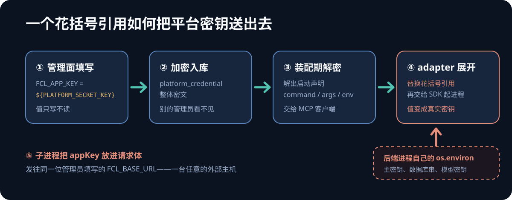

排查从一行第三方库的源码开始。`langchain-mcp-adapters` 0.3.2 在启动 stdio MCP 子进程之前，会把声明里每个环境变量的值过一遍替换：

```python
_BRACED_VAR_RE = re.compile(r"\$\{([^}]+)\}")

def _expand_env_vars(value: str) -> str:
    return _BRACED_VAR_RE.sub(lambda m: os.environ.get(m.group(1), m.group(0)), value)
```

这段代码本身没有问题，它甚至相当克制：只认花括号写法，裸 `$VAR` 原样保留，免得把含美元符号的密码改坏；找不到的变量保持原样，还会打一条警告。

问题在于 `os.environ` 是谁的环境。它是**后端进程自己的**。

而在我们的平台上，这个 env 由管理员在管理后台填写，加密存进数据库，存进去之后连平台自己都读不回来——响应里只给一个「已配置」的布尔值。三件事叠在一起，一个本来用来放上游凭据的表单字段，就变成了读取宿主进程密钥的接口。

## 一、漏洞不在某一行代码里，在三件事的叠加

平台支持管理员登记本地 stdio MCP server：填命令、参数和一组环境变量，平台按声明起一个子进程。其中一类连接是 FCL 报价接口，它的 server 代码会把 `FCL_APP_KEY` 和 `FCL_APP_SECRET` 放进请求体，发往 `FCL_BASE_URL`。

于是攻击路径只需要两步填表：

- `FCL_APP_KEY` 填 `${PLATFORM_SECRET_KEY}`
- `FCL_BASE_URL` 指向一台自己的 HTTPS 主机



*▲ 从管理面填表到外部主机收包，中间四步都是平台的正常流程，只有第四步的展开动作是意外的。图：自绘*

这条链路有三个让它变严重的性质：

1. **值可由管理员填写**。命令有 ops 白名单、环境变量键有拒绝名单（`PATH`、`LD_PRELOAD` 这些），但**值**一直被当成不透明的凭据，没人检查它长什么样。
2. **凭据只写不读**。这是为保护密钥做的设计，此处反向生效：其他管理员在界面上只看得到「已配置」，看不到里面写的是一个引用。想审计得去翻密文库。
3. **目的地也由同一个人填**。密钥被展开成明文之后，还需要有人把它送出去——而送往哪里，恰好也是这张表单上的字段。

能拿的不止 `PLATFORM_SECRET_KEY`。`DATABASE_URL`、`MODEL_API_KEY`，凡是在后端进程环境里的，填对名字就能带走。

这个洞此前被一个更大的洞盖着：平台还有一个通用 stdio 类型，允许管理员登记 `python -c`。能执行任意代码的路径存在时，这条引用展开的路只是「另一种更安静的写法」。但通用类型迟早要收掉，收掉之后它就是剩下的那条。**排查时不能因为「还有更大的洞」就跳过小洞**，二者的修复时机不一样。

## 二、两道防线挂在同一个判定上

第一反应是在写入时拒绝：值里出现 `${` 就报错。这没错，但只做这一层会留一个缺口——**写入校验管不到库里已经有的行**。规则上线之前写进去的连接、脚本或迁移直接插入的数据，都不会再经过表单。

所以判定要挂两处：写入点和消费点。


*▲ 两个调用点共用一个函数。左边拒绝新数据，右边兜住存量数据。图：自绘*

实现上只有一个函数 `validate_stdio_env_values_literal(env_values)`：扫一遍值，命中就抛错，错误信息**只列键名不回显值**（值本身可能就是一段真实凭据）。两个调用点的处置不同：

| 调用点 | 命中后的动作 | 为什么这样处置 |
| --- | --- | --- |
| 连接管理用例（写入） | 返回 400，一行都不落库 | 新数据还没进系统，直接挡在门外最省事 |
| 连接目录装配（消费） | 只跳过该条 + 打日志 | 存量数据已经在库里，抛异常会让整份目录不可用 |

消费点为什么不抛异常，值得单独说一句。装配这一步是把库里所有启用的连接解析成 server 声明，一次读全部。如果在这里抛出去，调用方看到的是「连接目录读取失败」，按既有的降级逻辑会认为当前没有任何登记 server——**一条脏数据会让所有管理员登记的 MCP 工具一起消失**。跳过单条、日志沿用既有的 `registered_server_unavailable` 关键字，排障的人不需要记第二套话术。

写入点那边还有一个前置确认：管理后台和本地种子脚本是两条写入路径，但它们都经同一个用例入口。**先 grep 确认这一点，再决定校验放哪里**——如果它们各写各的，一处校验就会漏掉一整条路径。我后来直接拿种子脚本的函数跑了一次带引用的凭据，确认被拒、零行写入。

复用的边界也在这里：两个点共用同一个函数，而不是照着写第二份。安全判定写两份的后果是它们迟早会漂移，而漂移的那一份通常是没人看的那一份。

## 三、顺手推翻的两条断言

修的过程中翻文档，看到这么一句：

> 启动方式为 `exec` 直启（不经过 shell），子进程环境 = 父进程环境 + 声明里的 `env`。

如果这句是真的，那问题比展开严重得多——不用写任何引用，子进程本来就拿着后端的全部环境变量。代码注释里还有另一句相关的：「传空字典会清空子进程继承的环境」。

两句都不对。翻 lockfile 锁定的 MCP SDK 源码，它对子进程环境只做一件事：取一组固定的默认变量，再叠加声明里的 env。POSIX 下这组默认变量是 `HOME`、`LOGNAME`、`PATH`、`SHELL`、`TERM`、`USER`。而传空字典和不传的分支，最终结果完全相同。

读源码还不够，我起了三个真实子进程，让它们把自己的 `os.environ` 写进文件：


*▲ 三种声明方式的实测结果。哨兵变量只有通过花括号引用才进得去。图：自绘*

实测子进程只拿到 `HOME`、`LOGNAME`、`PATH`、`SHELL`、`USER`（我的运行环境里本来就没有 `TERM`），外加 macOS 自己塞的两个本地化变量。三种声明方式下，后端专有的变量一个都没继承。

这个结果把结论反过来推紧了一层：既然没有整体继承，**`${VAR}` 展开就是后端环境变量进入子进程的唯一路径**——堵住它，这条外带链路就断了。

这类关于依赖行为的断言有个共同特征：它们在 review 里几乎不会被质疑（谁会去核对一句描述第三方行为的注释？），却会随依赖升级悄悄失效，而且错了会直接误导安全判断。我现在的做法是，凡是文档或注释里写「某某库会/不会做某事」，都要对照 lockfile 锁定版本的源码核实，并写明依据的模块或符号。

## 四、先跑红，再核对红得对不对

测试是在改生产代码之前写的，先在未修复的代码上跑一遍——这次红色运行就是负控。8 条用例红了 7 条，剩下一条是防误伤的：值里有裸 `$` 的正常凭据必须照常保存，它修复前后都该是绿的。

但「红了」不等于「红对了」。逐条核对失败原因才是这一步的价值：有的是该抛错没抛（写入路径），有的是存量连接照样进了声明（装配路径），有的是 HTTP 返回 201 而不是 400（真实入口）。原因对不上号的红色，往往是脚手架错了，不是被测行为错了。

真正的教训在健康对照上。我的端到端用例里放了两条连接：一条正常的、一条带引用的，断言「只有正常那条被启动」。第一版跑出来是这样的：

```text
A. declared servers: ['healthy', 'legacy']
A. loaded tools: {}
```

两条都没加载出工具。原因是 FCL server 启动时强制校验三个必填环境变量，而我只给了 `FCL_APP_KEY`，两个子进程都直接退出了。这种情况下**对照组自己就是死的**：修复之后「坏连接起不来」照样成立，红绿都不再有判别力。补全环境变量后，正常那条真的把两个工具加载出来了，断言才有意义。

证明密钥进不去，用的是哨兵：在后端进程里设一个内容唯一的环境变量，在 adapter 交给 SDK 的那个边界上记录每次启动参数。修复前，那条存量连接带着展开后的哨兵值被启动；修复后，只剩正常连接，且值是原样的字面量。哨兵法的好处是断言可以写成「这个字符串没有出现在任何一次启动参数里」，比逐字段比对更难糊弄过去。

顺带一提，红色阶段有一行数据漏进了测试库——真实库用例的残留哨兵直接把它揪出来了，连表名和主键都列好了。这类护栏平时存在感为零，出事时省下的是一整轮排查。

## 五、门禁红了，先证明不是你

交付前两次「失败」都不是这次改动引起的，判断方法值得记下来。

**第一次是文档构建。** `mkdocs build --strict` 挂了，报两个断链警告。改了文档的人看到这个，第一反应总是自己写坏了链接。验证方式是导出一份干净的 `HEAD` 副本单独构建：

```bash
git archive HEAD | tar -x -C /tmp/head-export
```

同样两条警告，一字不差——既有问题，与本次无关。这里特意不用 `git stash`：同一仓库的多个 worktree 共享同一个 stash 栈，另一个会话的改动可能被我弹出来。

**第二次是 CI 全红。** PR 上三个 check 全挂。但每个 job 的步骤数是 0、耗时两秒，这个形状本身就说明 job 根本没跑起来。读 check-run 的 annotation 拿到了原话：

```text
The job was not started because recent account payments have failed
or your spending limit needs to be increased.
```

是 Actions 的账单问题，默认分支最近三次运行也是同一原因。这种情况下唯一正确的动作是在 PR 里写明、以本地门禁结果为准、把账单交给有权限的人，而不是改代码去讨好一个根本没执行的检查。

## 总结

- **凭据字段的危险不在于它存了什么，而在于它在谁的进程里被解释。** 用户可写、最终交给第三方库或子进程的值，先确认那个库会不会对它做变量展开或模板渲染。
- **安全判定要同时挂在写入点和消费点**，两处调用同一个函数。写入校验只拦得住新数据，存量行、脚本和迁移都会绕过它。
- **消费点命中时 fail-closed，但只跳过那一条。** 让一条脏数据把整个能力拖垮，是另一种可用性事故。
- **文档和注释里描述第三方行为的句子要对照锁定版本核实**，拿不准就实测一次。这类断言最少被质疑，也最容易过期。
- **负控不只要红，还要红得对**：逐条核对失败原因，并单独确认「本该正常工作」的对照组在当前环境真的能跑通。
- **门禁失败先分清是不是自己引入的**：干净副本复现是最快的判别方式；CI 全红时先看 job 的步骤数和 annotation。
