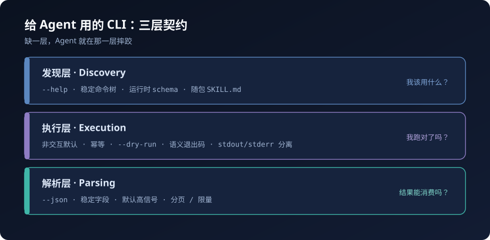
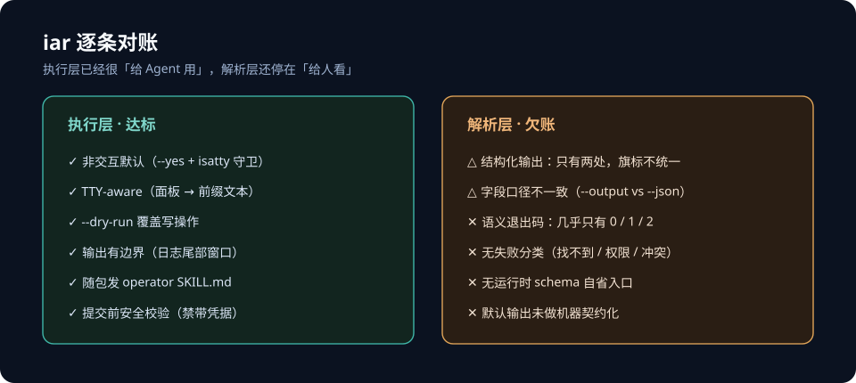

「给 Agent 写工具」这件事最近被讲得很多，但话题大多停在 prompt 和 tool schema 那一层。真正每天被 Agent 敲下去的，其实是 CLI——它没有 schema 的仪式感，却承担了绝大多数「让模型去操作一个系统」的活。

我维护一个叫 iar 的 Agent 编排器（仓库名 keda）。它自己就是跑 agent 的，顺手还随包发了一个 operator skill，教 Claude、Codex 这些外部 agent 怎么用它。所以很长一段时间里，我默认它已经够「给 Agent 用」了。

直到有人问我一句：你这个 CLI，算 agent-friendly 吗？

我不想凭感觉回答，于是把这一代公开的 CLI 设计原则翻了一遍，再拿 iar 逐条对账。结果有点意外：它不是不合格，而是**只对了一半**——「跑得起来」那半边做得很扎实，「让调用它的 Agent 更容易成功」那半边，还停在「给人看」。

这篇文章不写结论清单，写这次对账的过程：这代共识长什么样、iar 哪几条真的达标、哪三条是硬缺口，以及一个我差点抄错的「正确废话」。

## 一、这代共识，收敛得比想象中快

翻完一圈，真正有分量的其实是这几份：

- **Anthropic《Writing effective tools for agents》**：最常被点名的一条是「不要 1:1 包 API」（*"a common error we've observed is tools that merely wrap existing software functionality or API endpoints"*），以及错误信息要 specific & actionable，而不是一句 opaque error code。
- **Google / Justin Poehnelt《You Need to Rewrite Your CLI for AI Agents》**：Agent DX ≠ Human DX。给出 raw JSON payload 优先、运行时 schema 自省、field mask 控制 context、input hardening（Agent 会 hallucinate 出 `../.ssh` 这种路径）、以及 **ship SKILL.md 而不只是命令**。
- **Agent-First CLI 的 16 条原则**：Structured Output、Semantic Exit Codes、Machine-Readable Help、Non-Interactive Default……
- **Agent CLI Guide 的 10 条**：noun-verb 命令树、long flag 优先、stdout=数据 / stderr=消息、TTY-aware、语义退出码表。
- **AXI benchmark（425 次实测）**：agent-optimized CLI 在成功率、成本、延迟上全面压过 MCP 包装（100% / $0.050 / 15.7s vs 87% / $0.148 / 34.2s）。

来源五花八门，但可以压成三条轴——**发现层、执行层、解析层**：



- **发现层**：Agent 得知道你能做什么。`--help`、稳定命令树、运行时 `schema`、随包 skill。
- **执行层**：Agent 得能稳定地把命令跑对。非交互默认、幂等、`--dry-run`、语义退出码、stdout/stderr 分离。
- **解析层**：Agent 得拿到能消费的结果。`--json`、稳定字段、默认高信号、分页/限量。

三条轴缺一条，Agent 就在那一层摔跤。

## 二、拿 iar 逐条对账

先说好消息。iar 在执行层其实做得很靠前，有几条甚至比很多自称 agent-friendly 的工具扎实：

- **非交互默认**：`--yes` 到处都是，交互只发生在 `sys.stdin.isatty()` 为真时。
- **TTY-aware**：交互终端里 daemon 会显示仿多列的实时面板；一旦重定向到文件或 CI，同一个命令自动退化成加 `[issue #N]` 前缀的纯文本行。
- **输出有边界**：`iar logs` 默认只给尾部窗口（约 64 KiB）+ `--lines`，明确不从头倾泻整份日志——这一条对应的是「别把 500 行塞进 Agent 的上下文窗口」。
- **随包发 skill**：`iar init` 会把 operator skill 装到每个检测到的 agent 的用户级 skills 目录，还会保护用户已改过的同名文件。这正好是 Poehnelt 说的「ship SKILL.md, not just commands」。

但把「解析层」摊开，画风就变了。整个仓库里能吐 JSON 的地方只有两处：`iar issue list --output json` 和 `iar agent … --json`。两处旗标名不同、序列化方式不同、返回结构也不同。剩下 `registry list`、`daemon status`、`worktree path`、`loop list` 这些，要么没有机器输出，要么只能靠正则去啃人类表格。

退出码更简单：除了极少数用法错误返回 `2`，几乎**所有失败都塌缩成 `1`**。调用方分不清「仓库没注册」和「网络超时」和「参数写错了」——只能回过头去 parse stderr 的自然语言。

第三条缺口是没有自省入口。Agent 想知道某条命令接受哪些参数、哪些是枚举、默认值是多少，只能读 `--help`，或者依赖 skill 里手写的命令表；CLI 一演进，那张表就开始漂移。

对账结果大概是：

| 维度 | 共识要求 | iar 现状 | 判定 |
|---|---|---|---|
| 非交互默认 | 禁交互 prompt | `--yes` + isatty 守卫 | ✅ |
| TTY-aware | 非 TTY 自动退化 | 面板 → 前缀文本 | ✅ |
| `--dry-run` | 写操作必备 | init/run/workflow 等全覆盖 | ✅ |
| 输出有边界 | 默认限量 | 日志尾部窗口 | ✅ |
| 随包 skill | ship SKILL.md | operator skill 自动装 | ✅ |
| 结构化输出 | **每条**产数据的命令 | 只有两处，旗标不统一 | ⚠️ |
| 语义退出码 | 0/1/2/3/4/5/10 | 基本只有 0/1/2 | ❌ |
| 运行时自省 | `schema` / `--describe` | 无 | ❌ |

一句话：**执行层已经是「给 Agent 用」的写法了，解析层还停在「给人看」的写法。**



## 三、最该补的三样

### 1. 让 stdout 变成纯数据

资料里唯一被称为「无例外」的一条：**如果命令返回的是数据，就应该有稳定的机器可读格式；成功结果写 stdout，警告、进度、错误写 stderr。**

为什么值得较真？因为 Agent 的解析是脆的。只要 stdout 里混进一个 spinner、一行 `WARNING`、一个 ANSI 色码，下游的 `jq` 就会崩：

```bash
# 人类友好模式：表格
iar issue list --repo-id keda

# Agent 模式：stdout 只有数据，可以直接 pipe
iar issue list --json --repo-id keda | jq '.[] | select(.state=="open") | .number'
```

iar 的问题不是「没有 JSON」，而是「JSON 是零散的例外」。真正要补的是一个**统一出口**：同样的 `--json`（`--output json` 为等价别名），同样的 stdout/stderr 分工，同一种序列化口径。

### 2. 退出码是 Agent 看到的第一信号

命令跑完，Agent 拿到的第一个信号不是 stderr 里的文字，而是退出码。可现在的 `1` 是一个「万能垃圾桶」——什么错都是它。于是 Agent 要么放弃自己判断，要么去猜自然语言。

资料给出的语义码表其实很朴素：

| 退出码 | 含义 | Agent 该做什么 |
|---|---|---|
| 0 | 成功 | 继续下一步 |
| 1 | 未分类失败 | 读 stderr |
| 2 | 用法错误 | 改参数后重试 |
| 3 | 未找到 | 换个目标 |
| 4 | 无权限 / 未鉴权 | 停下来报告缺凭据 |
| 5 | 冲突 / 已存在 | 跳过或改为更新 |
| 10 | dry-run 通过 | 可以真正执行了 |

这里有个现实约束：扩展退出码属于**对外契约的行为变更**。只判断「是否非零」的脚本无害，但假设「任何非零都等于 1」的脚本会受影响。所以我的做法是——只在「有明确类别」的失败点启用新码，其余继续返回 `1` 兜底，并在 `--help` 和 release note 里把码表摊开。宁可小步，也不一次把面铺大。

### 3. 让 CLI 自己描述自己

Agent 没法 Google 你的文档。把 API 说明塞进 system prompt 又贵、又会过期——文档站上的版本，和此刻真正装的 CLI 早就不是一份东西了。

更好的做法是让命令自己回答自己：

```bash
iar schema --json | jq '.commands[] | select(.name=="issue list") | .options[] | select(.name=="--output")'
# { "name": "--output", "type": "choice", "enum": ["table", "json"], "default": "table", "required": false }
```

关键在于**从真实命令树运行时派生**，而不是维护一份静态 schema 文件。静态文件必然随着 CLI 演进漂移，派生则零维护——schema 是什么样，取决于你此刻真的装了哪个版本。

## 四、一个我差点抄错的地方：不做「非 TTY 自动切 JSON」

几份原则里都写着同一条：**非 TTY 时自动切 JSON**，颜色、分页、交互 prompt 全部关掉。听上去很对，我差点直接照抄。

但它对一个已经有大量用户的 CLI 是个陷阱。iar 有相当多人把 `iar …` 的输出接进管道和脚本。一旦「非 TTY 自动 JSON」上线，这些脚本会在**无人察觉**的情况下换掉输入——今天还能被 `grep` 的表格，明天变成一坨 JSON，脚本静默地错，比大声地报错难查得多。

所以我替 iar 定的规矩是：**机器模式必须显式声明**。不传 `--json` / `--output json`，永远是给人看的输出；要机器格式，自己说清楚。

代价是 Agent 得记住加旗标。但这恰恰是 operator skill 该干的事——把「机器消费一律 `--json`」写成不变量，等于替 Agent 记住了。**默认行为不动，是比「聪明地自动切换」更高的优先级。**

## 五、CLI 还是 MCP？

对账过程中总有人问：既然都给 Agent 用了，为什么不直接上 MCP？

AXI 那组 425 次实测给了一个反直觉的答案：agent-optimized CLI 在成功率（100% vs 87%）、成本（$0.050 vs $0.148）、延迟（15.7s vs 34.2s）三个维度全面领先 MCP 包装。原因也直白——每个 MCP tool 的 schema 定义本身就要吃掉几百 token，调用还多一层 round-trip；而 CLI 天生能 pipe、一次 bash 调用就能串起多个操作。

更准确的理解不是二选一，而是分工：

- **CLI 是执行接口**：先把底层能力做成稳定、可组合、可脚本化的命令。
- **MCP 是分发与治理接口**：当工具多到 Agent 一次记不住、或者运行环境根本不给 shell 时，再补一层。

所以这次我给 iar 排的顺序是：**先把 CLI 的机器契约做对，MCP 留到真正需要「无 shell 环境」时再评估。**

## 几点收获

- **「给 Agent 用」不是一种风格，是三层可检查的契约**。发现层、执行层、解析层——缺一层，Agent 就在那层摔。只凭「我们有 skill、有 MCP」就自称 agent-native，通常只覆盖了发现层的一角。
- **执行层容易达标，解析层最容易欠账**。非交互、dry-run、TTY 退化这些，写起来体感强、见效快；`--json` 统一、退出码分类、schema 自省这些「契约类」的活，不写也不会立刻出事——直到某个 Agent 在半夜因为一个 `1` 猜错了方向。
- **最难的不是抄原则，是判断哪条原则对你不适用**。「非 TTY 自动 JSON」就是典型：它对全新 CLI 是优点，对已有用户的老 CLI 是兼容性地雷。原则是坐标，不是圣旨。
- **能让 Agent 自己省事的，是稳定，不是聪明**。统一旗标、稳定字段、可区分退出码、可自省的命令树——这些东西一点都不性感，但它们决定了调用方第几次尝试能成功。
- **CSV 级的口径能救很多争论**。这次真正让我敢下判断的，是 AXI 那组实测数字；在「CLI vs MCP」这种各有道理的争论里，一组可复现的 benchmark 比十篇立场文章都管用。
