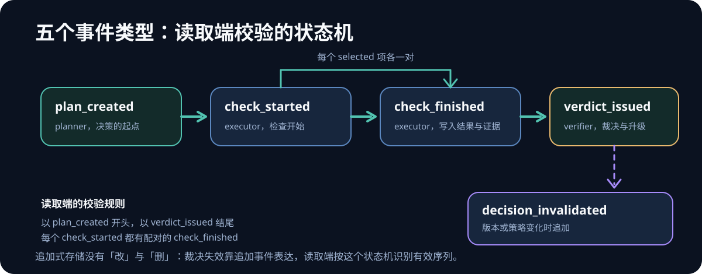
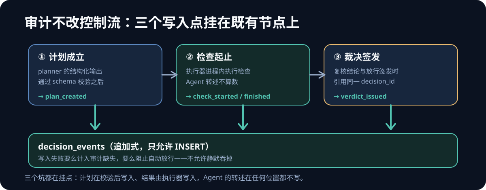

一份能用的决策审计，第一版可以只有六行 JSONL。还是[上一篇]()里那个改数据库连接配置的例子——Agent 选中了单元测试和真实数据库冒烟，这次把事件流补全：

```json
{"seq":1,"decision_id":"dec-42","event_type":"plan_created","actor":"planner",
 "source_revision":"a1b2c3","detail":{"checks":[
   {"check_id":"unit-tests","disposition":"selected"},
   {"check_id":"real-db-smoke","disposition":"selected"}]}}
{"seq":2,"decision_id":"dec-42","event_type":"check_started","actor":"executor",
 "detail":{"check_id":"unit-tests"}}
{"seq":3,"decision_id":"dec-42","event_type":"check_finished","actor":"executor",
 "detail":{"check_id":"unit-tests","result":"passed","exit_code":0,
   "evidence_ref":"runs/17/logs/pytest-1"}}
{"seq":4,"decision_id":"dec-42","event_type":"check_started","actor":"executor",
 "detail":{"check_id":"real-db-smoke"}}
{"seq":5,"decision_id":"dec-42","event_type":"check_finished","actor":"executor",
 "detail":{"check_id":"real-db-smoke","result":"unavailable","reason":"无预发凭据"}}
{"seq":6,"decision_id":"dec-42","event_type":"verdict_issued","actor":"verifier",
 "detail":{"verdict":"escalate","missing_boundaries":["连接池真实行为"]}}
```

字段比设计篇的记录少一些——`run_id`、`attempt_id`、`occurred_at`、`trace_id` 都还在，这里略去不展。第六行就是这套东西的价值：冒烟拿不到凭据时，裁决不是"通过"，是升级。事后任何人拿着 `dec-42` 都能回答：当时计划跑什么、实际跑到哪、缺了什么、为什么没放行。

设计篇把"该记什么"讲清了：身份模型、计划/执行/裁决分离、`history_complete`。这篇接着回答落地时真正卡住的三件事——**写入点挂在哪、复核器怎么不变成第二个 Agent、什么条件下才允许它影响放行。**我的判断放在前面：存储本身一晚上就能写完，卡人的从来是这三件。

## 一、先说不建什么

动手前先划掉三个"看起来该做"的东西。审计的第一死因不是记得不准，是被绕过——系统一重，团队总有办法绕过它。

| 做重了的信号 | v1 的做法 |
|---|---|
| 起一个独立的审计服务 | 一张追加式表，执行进程内直接写 |
| 把原文（prompt、源码、终端输出）存进审计 | 只存引用与摘要，原文走受控存储 |
| 上线即接管放行、替换现有门禁 | 先与固定门禁并行，只记录分歧 |

第三条是全文最重要的边界。设计篇说决策审计让"自选验证深度"的自由度可复核，但可复核不等于可放行——从"并行记录"走到"参与放行"，中间隔着第五节那套判据，判据没满足之前，记录再完整也不构成授权。

## 二、最小数据契约：一张只允许 INSERT 的表

DDL 以 SQLite 3 为准，换 PostgreSQL 只需要改触发器写法：

```sql
CREATE TABLE decision_events (
    seq             INTEGER PRIMARY KEY AUTOINCREMENT,
    event_id        TEXT    NOT NULL UNIQUE,   -- 幂等键，由业务身份拼出
    decision_id     TEXT    NOT NULL,
    run_id          TEXT    NOT NULL,
    attempt_id      TEXT,
    event_type      TEXT    NOT NULL CHECK (event_type IN
        ('plan_created','check_started','check_finished',
         'verdict_issued','decision_invalidated')),
    actor           TEXT    NOT NULL,
    source_revision TEXT    NOT NULL,
    policy_version  TEXT    NOT NULL,
    trace_id        TEXT,
    occurred_at     TEXT    NOT NULL,
    detail          TEXT    NOT NULL            -- JSON，自带 detail_schema_version
);
CREATE INDEX idx_events_decision ON decision_events(decision_id);

CREATE TRIGGER no_update BEFORE UPDATE ON decision_events
BEGIN SELECT RAISE(ABORT, 'append-only'); END;
CREATE TRIGGER no_delete BEFORE DELETE ON decision_events
BEGIN SELECT RAISE(ABORT, 'append-only'); END;
```

追加式不是审美偏好，它换来两个便宜：没有 UPDATE，历史就不可改；完整性验证退化为检查"存在且有序"（第六节展开）。触发器挡的是自己人手滑，真正的防线在读取端。

五个事件类型各自的写入责任：

| event_type | 谁写 | 必填 detail | 记录的事实 |
|---|---|---|---|
| plan_created | planner | checks（每项含 disposition 与 reason） | 决策的存在起点 |
| check_started | executor | check_id | 某项检查开始执行 |
| check_finished | executor | check_id、result、evidence_ref | 执行器观察到的结果 |
| verdict_issued | verifier / 放行器 | verdict、依据摘要 | 对计划与证据的裁决 |
| decision_invalidated | 平台 | 失效原因、新 revision | 旧裁决作废 |

两个容易写错的字段。`occurred_at` 用写入方本地时钟就行，排序靠 `seq`，时钟只负责展示——分布式环境里别指望时钟可排序。`detail` 里必须带 `detail_schema_version`：追加式意味着旧记录永远不会迁移，演进只能靠新版本号，读取端按版本解释。

事件不是随便堆的，读取端会按一个状态机校验它们：



*▲ 图：自绘*

## 三、写入点：审计不改变控制流，只挂在三个钩子上

决策审计在 Runtime 里没有自己的环节。它不参与循环，不加延迟，只挂在三个既有节点的出口上：



*▲ 图：自绘*

| 写入点 | 挂在哪 | actor | 写什么 | 不写什么 |
|---|---|---|---|---|
| 计划成立时 | planner 的结构化输出通过 schema 校验之后 | planner | plan_created | 模型原始 token 流 |
| 检查起止时 | 执行器进程内，每项检查的前后 | executor | check_started / check_finished | Agent 对结果的转述 |
| 裁决签发时 | verifier 出结论、放行器动动作 | verifier | verdict_issued | 覆盖 planner 的记录 |

三个坑都在挂的位置上。

**计划写入要在 schema 校验之后。**校验之前写，Agent 输出里每段格式垃圾都进审计表。审计表被噪声淹没后没人再信它——这比没有审计更糟。

**check_finished 只能由执行器写。**这是设计篇"Agent 承诺和执行器事实分开"的实现面：Agent 在上下文里说"测试通过了"不算数，执行器进程里那行代码写下的才算。执行器与 Agent 同进程时，至少保证写入点在执行函数内部，而不是在 Agent 转述的文本后面。

**审计写不进去时，决策还能不能继续？**按阶段分两说。v1 的并行阶段，写入失败只把该 attempt 计为"审计缺失"，让缺失率本身成为统计指标；到了将来接管的阶段，写不进审计的 attempt 一律不允许自动放行。哪种都可以，唯独不能静默吞掉失败。

写入器是全文最简单的代码，唯一值得注意的是幂等键——由业务身份拼出来，重试同一个动作不会写进两条：

```python
def append_event(conn, decision_id, run_id, event_type, actor,
                 source_revision, policy_version, detail,
                 attempt_id=None, trace_id=None, key_suffix=""):
    event_id = f"{decision_id}:{event_type}:{key_suffix}"  # 确定性幂等键
    conn.execute(
        "INSERT OR IGNORE INTO decision_events "
        "(event_id, decision_id, run_id, attempt_id, event_type, actor,"
        " source_revision, policy_version, trace_id, occurred_at, detail)"
        " VALUES (?,?,?,?,?,?,?,?,?,?,?)",
        (event_id, decision_id, run_id, attempt_id, event_type, actor,
         source_revision, policy_version, trace_id,
         datetime.now(timezone.utc).isoformat(),
         json.dumps(detail, ensure_ascii=False)),
    )
    conn.commit()
```

幂等键的取法和[全景手册]()对工具调用的要求同源：按业务身份（`decision_id + event_type + key_suffix`）去重，不按请求 ID。检查类事件里 `key_suffix` 就是 `check_id`，同一项检查反复重试，`check_started` 只落一条。

## 四、复核器：规则在前，模型在后

复核器最大的落地风险，是写成"再跑一个 Agent 看一遍"——那就成了第二个 planner，共享同样的盲点，还多付一遍模型钱。把复核拆成两层，规则层不花钱，不过就升级：

```python
def verify_decision(events, pending_revision):
    plan = first_of(events, "plan_created")      # 缺它，整份记录无效
    checks = {e["detail"]["check_id"]: e["detail"]
              for e in events if e["event_type"] == "check_finished"}

    missing = [c["check_id"] for c in plan["detail"]["checks"]     # 规则一
               if c["disposition"] == "selected" and c["check_id"] not in checks]
    not_passed = [cid for cid, d in checks.items()                 # 规则二
                  if d["result"] != "passed"]
    stale = plan["source_revision"] != pending_revision            # 规则三
    unexplained = [c["check_id"] for c in plan["detail"]["checks"] # 规则四
                   if c["disposition"] == "skipped" and not c.get("reason")]

    if missing or not_passed or stale or unexplained:
        return escalate(missing, not_passed, stale, unexplained)
    return model_coverage_review(plan, events)  # 规则全过，才问模型覆盖面
```

四条规则各自挡一种"结果是绿的、判断仍然错"：**规则一**挡"计划写了但没跑完"；**规则二**挡 `unavailable`、`failed` 被当通过——开场例子里冒烟拿不到凭据，裁决只能 escalate，就是这条在起作用；**规则三**挡"检查的是 A、要合并的是 B"；**规则四**挡跳过不留理由。规则四其实应该在 `plan_created` 写入时就被 schema 拦下，复核器再查一遍，是因为写入端校验会随时间漂移，读取端要有独立的防线。

规则层全过，才进第二层。模型复核只回答规则回答不了的问题：**计划对风险事实的覆盖面**。"改了连接池配置，计划里却没有真实数据库冒烟"这类漏边界，规则查不出来，模型或人可以。第二层的产出同样是一条 `verdict_issued`，`actor=verifier`，引用同一个 `decision_id`，不覆盖任何旧记录。verdict 只需要两个值：支持放行、升级人工——"拦截"不是它的职责，规则层已经拦了。

防共享盲点的最低成本做法：verifier 的提示词版本、甚至模型路由，都和 planner 不同，且两者的 `policy_version` 都写进了记录。事后能看出"同一个模型自己复核自己"这种结构缺陷。

## 五、降级判据比记录格式更重要

并行阶段的目标不是"验证审计好用"，是**把固定门禁和决策审计放在同一批任务上，量化它们在哪儿不一致**。每个 attempt 两边各有结论，落在四个象限：


| | 固定门禁拦下 | 固定门禁放行 |
|---|---|---|
| **决策审计放行** | 漏报候选——最危险的象限，逐条人工复检 | 一致放行，正常交付，抽样复核 |
| **决策审计拦截** | 一致拦截，抽查确认拦截理由 | 误报候选——计入审计的误拦成本 |

分歧统计一条 SQL 就够：`gate_outcomes` 记固定门禁结果，`audit_outcomes` 从 `verdict_issued` 聚合出 `passed`（verdict 为"支持放行"）：

```sql
SELECT g.gate_name,
       COUNT(*)                                        AS attempts,
       SUM(g.blocked AND a.passed)                      AS audit_missed,
       SUM(NOT g.blocked AND NOT a.passed)              AS audit_false_block
FROM gate_outcomes g
JOIN audit_outcomes a USING (attempt_id)
GROUP BY g.gate_name;
```

（SQLite 3 的布尔求和写法；PostgreSQL 换成 `COUNT(*) FILTER (WHERE …)`。）

什么时候允许决策审计接管某个固定门禁？三个条件必须**同时**满足，并且要写进试点协议、带上样本量下限：

1. **漏报候选归零**。人工逐条复检这个象限，没有一条真实漏网。样本量下限按该门禁的历史拦截率反推——拦得越少的门禁，需要越长的并行期。
2. **误报候选率不高于固定门禁自己的误拦率**。否则不是升级，只是把可见的脚本误报换成不易发现的判断误报。
3. **分歧可归因**。每条分歧都能落到具体原因：策略版本差、检查覆盖差、环境不可用。归因不出的分歧占比高，说明记录本身还不可复核——先修记录，别谈接管。

三个条件连续 N 轮（N 写进协议）同时满足，才把**这一项**门禁从阻断降为提示，逐项降、不打包。迁移链完整性这种失误代价极高的规则，可能永远不该降。

并行期里 `decision_invalidated` 同样要写：待合并分支更新导致 `source_revision` 变化、`policy_version` 升级，都追加一条失效事件。放行器只认"verdict 绑定的 revision 等于当前待放行的 revision"。

判据比记录格式重要，这句话值得单独一段：**没有判据的并行记录，只是一份更贵的日志。**

## 六、审计存储自身会坏：读取端怎么认账

设计篇提过 `history_complete`，落到读取端是一个便宜的校验函数：拿一个 `decision_id` 的事件序列，检查它以 `plan_created` 开头、以 `verdict_issued` 结尾、每个 `check_started` 都有配对的 `check_finished`：

```python
def history_complete(events):            # events 已按 seq 排序、按 decision_id 过滤
    types = [e["event_type"] for e in events]
    if not types or types[0] != "plan_created":
        return False
    if "verdict_issued" not in types or "decision_invalidated" in types:
        return False
    started = {e["detail"]["check_id"] for e in events
               if e["event_type"] == "check_started"}
    finished = {e["detail"]["check_id"] for e in events
                if e["event_type"] == "check_finished"}
    return started <= finished
```

注意校验按 `decision_id` 分组做，不按全局 `seq`——并发之下全局 `seq` 本来就有空洞，完整性是每个决策自己的性质。

校验不过，这个 decision 的证据就当不存在：放行器走"无审计"路径（人工或固定门禁），并把"无审计放行"本身记下来。沉默缺失被误读成通过，是审计存储最坏的失败方式，宁可显式降级。

单机 SQLite 的丢失风险要诚实写进 v1 的边界：它没解决多副本，靠的是这张表很小（一次决策几 KB）、全量备份便宜、备份脚本可以拿校验函数自检。真正占空间的是 evidence 原文，那是另一套保留策略——审计表只存 `evidence_ref` 和摘要，本来就不该跟着膨胀。

## 七、我的判断

- v1 的合理成本上限是**一两周**。做的过程中一旦发现要起独立服务、要改现有 CI 的控制流，说明做重了，回第一节的表对照。
- 决策审计改变的不是风险本身，是漏报的**可发现性**：没有它，"Agent 跳过了该跑的检查"只能在事故后追查；有了并行期，漏报候选在统计表里按周可见。
- 反过来，如果 Agent 只提建议、放行始终由人或固定规则拍板，trace 加审批日志就够了。这套东西的成本，只在放行权真的开始转移时回本。

## 速查：落地顺序与每步的完成判据

| 步骤 | 交付物 | 完成判据 |
|---|---|---|
| 1. 建表 | DDL + 追加式触发器 | UPDATE / DELETE 被 ABORT |
| 2. 写入点 | 三个钩子 + 幂等写入器 | 同一事件重试只落一条 |
| 3. 读取校验 | 按 decision_id 的完整性函数 | 缺头、缺尾、缺配对的序列被判无效 |
| 4. 规则复核器 | 四条确定性规则 | 任一不过即 escalate，不进模型层 |
| 5. 并行运行 | 分歧四象限统计 | 每个门禁的漏报/误报候选都有数 |
| 6. 判据与降级 | 写进试点协议的三个条件 | 逐项降级，永不打包 |

一句话收尾：**先让它记录分歧，再让它参与放行——降级判据写清楚之前，决策审计只是一份更贵的日志。**

## 延伸阅读

- [Agent 决策审计：它与 Tracing 的关系]()——设计篇：身份模型、记录字段与决策、Trace 的边界
- [Agent 生产工程全景手册：从 Runtime 到业务闭环]()
- [Agent Tracing 基础：Trace、Span 与 OpenTelemetry 埋点]()
