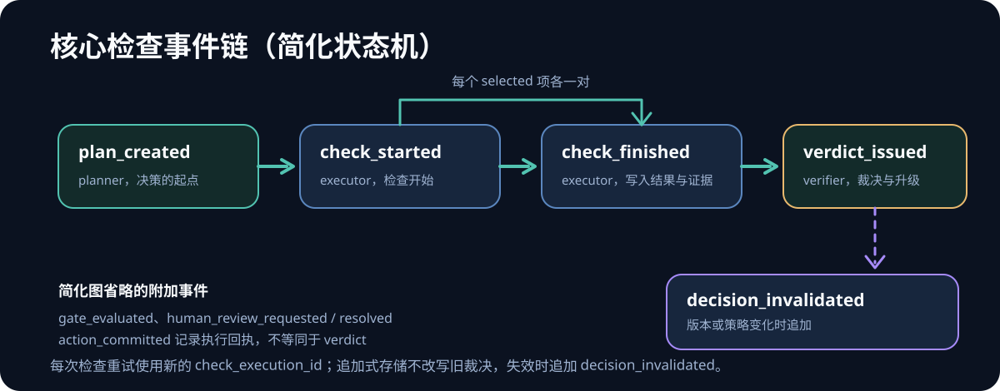
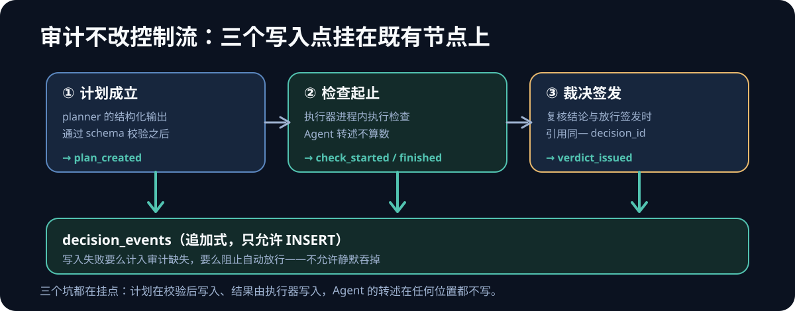
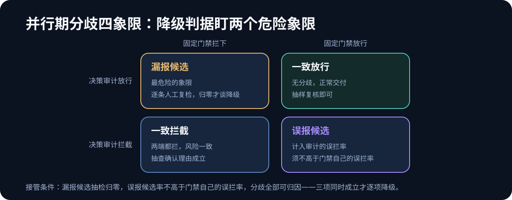

一份能用的决策审计，第一版可以只有六行 JSONL。还是[上一篇]()里那个改数据库连接配置的例子——Agent 选中了单元测试和真实数据库冒烟，这次把事件流补全：

```json
{"seq":1,"decision_id":"dec-42","event_type":"plan_created","actor":"planner",
 "source_revision":"a1b2c3","detail":{"checks":[
   {"check_id":"unit-tests","disposition":"selected"},
   {"check_id":"real-db-smoke","disposition":"selected"}]}}
{"seq":2,"decision_id":"dec-42","event_type":"check_started","actor":"executor",
 "detail":{"check_id":"unit-tests","check_execution_id":"unit-tests-try-1"}}
{"seq":3,"decision_id":"dec-42","event_type":"check_finished","actor":"executor",
 "detail":{"check_id":"unit-tests","check_execution_id":"unit-tests-try-1",
   "result":"passed","exit_code":0,
   "evidence_ref":"runs/17/logs/pytest-1"}}
{"seq":4,"decision_id":"dec-42","event_type":"check_started","actor":"executor",
 "detail":{"check_id":"real-db-smoke","check_execution_id":"real-db-smoke-try-1"}}
{"seq":5,"decision_id":"dec-42","event_type":"check_finished","actor":"executor",
 "detail":{"check_id":"real-db-smoke","check_execution_id":"real-db-smoke-try-1",
   "result":"unavailable","reason":"无预发凭据"}}
{"seq":6,"decision_id":"dec-42","event_type":"verdict_issued","actor":"verifier",
 "detail":{"verdict":"needs_human_review","missing_boundaries":["连接池真实行为"]}}
```

字段比设计篇的记录少一些——`run_id`、`attempt_id`、`occurred_at`、`trace_id` 都还在，这里略去不展。第六行就是这套东西的价值：冒烟拿不到凭据时，裁决不是“通过”，而是转人工复核。事后任何人拿着 dec-42 都能回答：当时计划跑什么、实际跑到哪、缺了什么、为什么没放行。

设计篇把“该记什么”讲清了：身份模型、计划/执行/裁决分离、`history_complete`。这篇接着回答落地时真正卡住的几件事——**写入点挂在哪、复核器怎么不变成第二个 Agent、什么条件下才允许它影响放行。**我的判断放在前面：表和 JSON 很快就能写完；真正决定审计是否可信的，是事件从哪里来、失败时怎样处理，以及门禁降级是否有统计依据。

## 一、先说不建什么

动手前先划掉三个“看起来该做”的东西。审计的第一死因不是记得不准，是被绕过——系统一重，团队总有办法绕过它。

| 做重了的信号 | v1 的做法 |
|---|---|
| 起一个独立的审计服务 | 在现有 Run/执行仓储旁边落一份规范化事件流 |
| 把原文（prompt、源码、终端输出）全部复制进审计 | 存结构化事实、证据引用和摘要；原文走有访问控制与保留期的证据存储 |
| 上线即接管放行、替换现有门禁 | 先并行影子评估，只记录分歧并做独立复核 |

第三条是全文最重要的边界。设计篇说决策审计让“自选验证深度”的自由度可复核，但可复核不等于可放行——从“并行记录”走到“参与放行”，中间隔着第六节的证据和风险判据。判据没满足之前，记录再完整也不构成授权。

## 二、把执行事实、决策裁决和 Trace 分开

先分清三种数据各自回答什么问题：

| 层 | 回答的问题 | 典型内容 | 能不能单独授权放行 |
|---|---|---|---|
| Run 事件流 | Runtime 实际执行了什么？ | 输入已接收、模型调用、工具开始/完成、Run 终态 | 不能；它只证明系统记录到哪些执行事实 |
| 决策审计 | 为什么选择这些检查？证据是否满足策略？谁签发了什么裁决？ | 计划、检查尝试、固定门禁结果、策略版本、裁决和失效原因 | 只有放行器按明确策略校验后才能 |
| Trace | 哪个步骤耗时、父子调用如何关联、请求经过哪些组件？ | trace/span ID、时长、错误和低敏属性 | 不能；Trace 是诊断与观测信号 |

Trace ID 可以把一条审计记录和一次 Run 联系起来，但 Trace 不等于审计账本。Trace 可能被采样、导出失败或按成本策略保留较短时间；审计裁决则需要稳定身份、策略版本、连续性检查和明确的缺失处理。OpenTelemetry 也把事件/日志与 Trace 定义为互补信号，而不是重复用途；它建议把详细事件放在日志或 span event 中，并显式关联到创建它的 span。[OpenTelemetry instrumentation guidance](https://opentelemetry.io/docs/concepts/instrumentation/libraries/)

相邻工程 `../ai-assistant` 里有一套值得借鉴的 Canonical Agent Run 实现；它是执行事件与 Trace 投影的底座，**不是已经落地的决策审计**。代码主要在 `src/backend/core/shared/models/agent_run_policy.py`、`src/backend/infrastructure/persistence/repos/agent_run_repo.py`、`src/backend/composition/agent_harness_wiring.py` 和 `src/backend/core/agent/harness/trace_use_cases.py`：

- `EVENT_PAYLOAD_KEYS` 为每种事件定义允许字段，`validate_event_candidate` 拒绝未知事件类型、目录外字段和一部分敏感字段名；状态迁移也在持久化前由 Core 校验。
- `append_event` 先锁定 Run 行，再按 `last_event_seq` + 1 分配 Run 内序号，在同一个数据库事务里追加事件并更新 Run projection。事件表用 (`run_id`, seq) 作为主键，同时保留 `schema_version`、`occurred_at`、`recorded_at`、快照摘要、载荷摘要和 trace/span ID。
- 创建请求用主体范围的幂等键摘要和请求摘要去重：同一键、同一请求返回既有 Run；同一键换了请求内容则报冲突。这个“请求幂等”与“事件投递幂等”是两种身份，不能混成一个键。
- `persist_candidate` 只把已经提交的事件交给 Trace sink；Trace sink 的异常被隔离，不回滚已提交的 Run 事件，也不改变 Run 终态。`AgentTraceUseCase` 再从数据库事件重建 Trace 诊断树，并对缺少开始/结束事件、重复终态、父级不明等情况给出诊断。

这套实现让我更愿意把“候选事件由 Runtime 提供、序号与状态迁移由仓储统一裁决”作为本文的写入模板。它目前没有本文要加的 `plan_created`、门禁影子对照、`verdict_issued` 等决策层事件；不要把执行轨迹的存在误写成已经有了决策复核。

开源项目也呈现出相似的分层，但侧重点不同：

| 项目 | 可借鉴的实现 | 对决策审计的含义 |
|---|---|---|
| Temporal | Worker 用持久化的 Event History 重放 Workflow，恢复到上次历史状态后再推进；任务重试和业务执行失败也有不同语义。[Temporal Tasks](https://docs.temporal.io/tasks) | 用历史事件恢复控制状态；外部副作用必须有幂等键，不能假设重放只会发生一次 |
| LangGraph | `interrupt()` 依赖持久化 `checkpointer` 和稳定 `thread_id`；人工审批后可以恢复。但恢复时节点会从头执行，所以中断前的副作用必须安全重放或移到审批之后。[LangGraph interrupts](https://docs.langchain.com/oss/python/langgraph/interrupts) | 人工复核不是挂起一个协程就结束；必须保存待审上下文、审批身份和可恢复状态 |
| Open Policy Agent | Decision Log 包含 `decision_id`、策略 bundle revision、输入、结果和 Trace 关联，并支持按字段脱敏；上传限流时可能丢弃日志事件。[OPA Decision Logs](https://www.openpolicyagent.org/docs/management-decision-logs) | 策略决定要绑定版本并做隐私处理；遥测日志的缓冲/丢弃语义不等于硬门禁账本的持久性 |
| OpenTelemetry | 把日志、事件和 Trace 关联，用于排障与性能分析。[OpenTelemetry instrumentation guidance](https://opentelemetry.io/docs/concepts/instrumentation/libraries/) | 把 Trace ID 当关联键，不把 span 当批准凭证 |

## 三、最小数据契约：事件按决策局部排序

DDL 仍以 SQLite 3 展示，但序号改成**每个 decision 内递增**。单一全局 AUTOINCREMENT 既不能表达某个 decision 是否缺事件，又容易让读者误以为全库序号连续就是审计完整。多进程部署时，PostgreSQL/MySQL 在事务里锁定 decision head 行；SQLite 要用 `BEGIN IMMEDIATE` 或原子递增并取回新序号，别让多个写入器各自先读 `MAX(seq)+1` 再写。

```sql
CREATE TABLE decision_heads (
    decision_id     TEXT NOT NULL PRIMARY KEY,
    run_id          TEXT NOT NULL,
    last_seq        INTEGER NOT NULL DEFAULT 0,
    status          TEXT NOT NULL,
    source_revision TEXT NOT NULL,
    policy_version  TEXT NOT NULL
);

CREATE TABLE decision_events (
    decision_id       TEXT    NOT NULL,
    seq               INTEGER NOT NULL CHECK (seq > 0),
    event_id          TEXT    NOT NULL UNIQUE,
    idempotency_key   TEXT    NOT NULL,
    run_id            TEXT    NOT NULL,
    attempt_id        TEXT,
    event_type        TEXT    NOT NULL CHECK (event_type IN
        ('plan_created','gate_evaluated','check_started','check_finished',
         'verdict_issued','human_review_requested','human_review_resolved',
         'decision_invalidated','action_committed')),
    actor_type        TEXT    NOT NULL,
    actor_id          TEXT,
    source_revision   TEXT    NOT NULL,
    policy_version    TEXT    NOT NULL,
    detail_schema_version INTEGER NOT NULL,
    occurred_at       TEXT    NOT NULL,
    recorded_at       TEXT    NOT NULL,
    trace_id          TEXT,
    span_id           TEXT,
    payload_checksum  TEXT    NOT NULL,
    detail            TEXT    NOT NULL,
    PRIMARY KEY (decision_id, seq),
    UNIQUE (decision_id, idempotency_key)
);

CREATE INDEX idx_events_run ON decision_events(run_id, seq);
CREATE INDEX idx_events_type ON decision_events(event_type, recorded_at);

CREATE TRIGGER no_update BEFORE UPDATE ON decision_events
BEGIN SELECT RAISE(ABORT, 'append-only'); END;
CREATE TRIGGER no_delete BEFORE DELETE ON decision_events
BEGIN SELECT RAISE(ABORT, 'append-only'); END;
```

`decision_heads` 是可更新的投影，只用来分配序号和快速判定当前状态；审计事实仍以 `decision_events` 为准。一个 decision 的 `source_revision` 和 `policy_version` 要冻结，不能通过更新 head 把旧裁决改成“适用于新版本”；版本变化时追加失效事件并创建新的 decision。每次事件写入要在**同一个事务**里锁定 head、校验转移、追加事件并更新 `last_seq`/status。不能一边成功写事件、一边没更新 head，也不能先更新状态、再异步补事件。

五个最核心的事件类型各自承担不同事实：

| `event_type` | 谁写 | 必填 detail | 记录的事实 |
|---|---|---|---|
| `plan_created` | planner 的结构化输出通过 schema 校验后 | plan_hash、每项 check 的 disposition/reason | 本次决策准备验证什么 |
| `gate_evaluated` | 固定门禁执行器 | `gate_id`、`policy_revision`、outcome、`evidence_ref` | 固定规则在同一输入上的结果 |
| `check_started` / `check_finished` | 检查执行器 | `check_id`、`check_execution_id`、result、`evidence_ref` | 检查是否真正执行以及观察到什么 |
| `verdict_issued` | 确定性复核器或授权的人类复核者 | verdict、`policy_version`、`evidence_manifest_hash`、reason_codes | 谁基于哪个版本的证据作出裁决 |
| `decision_invalidated` / `action_committed` | 版本校验器 / 放行器 | 失效原因或已提交动作引用 | 裁决何时失效，或放行结果是否真正落地 |



*▲ 图：自绘*

`check_id` 代表“计划中的检查类型”，`check_execution_id` 代表“某一次真实执行”。一个检查超时后重跑，是新的 `check_execution_id`，必须保留两次尝试；同一次事件因网络重试而重复投递，才复用原 `idempotency_key`。否则用 `decision_id` + `event_type` + `check_id` 去重，会把重试历史抹掉。

还要把两个时间分开。`occurred_at` 是生产者认为动作发生的时间，`recorded_at` 是数据库接受事件的时间。并发场景按事务提交的 seq 定序；时间戳用于展示与延迟分析，不负责裁决因果。`detail_schema_version` 也不能省：追加式历史不做原地迁移，读取端要按版本解释旧载荷。

数据契约要明确哪些内容不能进事件。保存 `policy_version`、源码或配置快照的 checksum、证据引用和结构化原因码，通常比复制完整 prompt、思维链、命令输出更安全。允许字段名单只是第一道边界：像 arguments、content 这样的合法字段仍可能装着凭据、个人数据或隐藏推理。OPA 的日志实现会在导出前按 JSON Pointer 删除或替换敏感字段，并标注已擦除/遮盖路径；同样的字段级脱敏、访问控制和保留期，也该放进自己的审计契约里。checksum 能证明两个值是否相同，但没有保存原始内容就不能据此恢复内容。

追加式触发器能挡住应用误操作，但不能对抗拥有数据库写权限的管理员。需要防内部篡改时，还要用独立只写数据库角色、定期导出到不同信任域、WORM 存储或外部签名摘要；单表触发器和普通哈希都不是数字签名。

## 四、写入点：Runtime 钩子采集事实，放行器签发许可

决策审计不应该另起一条 Agent 循环。把写入挂到三组已有边界上：



*▲ 图：自绘*

| 写入点 | 挂在哪 | actor | 写什么 | 不写什么 |
|---|---|---|---|---|
| 计划成立时 | planner 输出通过版本化 schema 校验之后 | planner / orchestrator | `plan_created`，记录源版本、计划摘要、检查清单 | 模型原始 token 流 |
| 检查执行时 | 执行器真实调用每项检查的前后 | executor | 每次 `check_started` / `check_finished`，含唯一 `check_execution_id` | Agent 对结果的转述 |
| 复核与动作边界 | 复核器签发结论；放行器实际执行发布/合并/写操作之前 | verifier / gate / human | `verdict_issued`、人工审批、`action_committed` 或失效事件 | 由模型自行宣称“检查足够” |

三个坑都在挂的位置上。

**计划要在 schema 校验之后写。**校验之前，格式垃圾和缺字段的部分计划都会混进审计记录。通过 schema 后也不能立刻写成 `allow`：计划只证明 Agent 提出过哪些检查，不证明它们都被执行。

**`check_finished` 必须由执行器写。**这是“Agent 承诺”和“执行器事实”分开的实现面：Agent 在上下文里说“测试通过了”不算数，实际启动进程、拿到退出码和证据引用的执行器才有资格写结果。若 Runtime 与执行器在同一进程，至少把写入放在检查函数内部，不要接在模型复述之后。

**重试要既幂等又可见。**同一个事件因网络超时重发，使用稳定的 `idempotency_key`；生产者要连同事件内容和 `occurred_at` 一起保留，确保重投的是原事件。数据库发现已有同键事件时，比较 payload checksum，相同则返回已有事件，不同则报冲突。一次新的检查尝试要生成新 `check_execution_id` 和新事件身份。用 `INSERT OR IGNORE` 静默吞掉冲突，会把“重放了一条旧事件”和“同一键被拿去写了另一件事”混为一谈。

仓储侧可以写成下面的伪代码。关键不是 Python/SQLAlchemy 的具体 API，而是锁、校验、分配序号、写事件和更新投影位于一个事务里：

```python
def append_event(session_factory, decision_id, idempotency_key, candidate):
    validate_event_candidate(candidate)

    with session_factory.begin() as session:
        head = lock_decision_head(session, decision_id)

        existing = find_by_idempotency_key(
            session, decision_id, idempotency_key
        )
        if existing is not None:
            if existing.payload_checksum != checksum(candidate):
                raise IdempotencyConflict(idempotency_key)
            return existing

        transition = validate_transition(head.status, candidate)
        seq = head.last_seq + 1
        event = build_event(
            decision_id=decision_id,
            seq=seq,
            idempotency_key=idempotency_key,
            candidate=candidate,
        )
        session.add(event)
        head.last_seq = seq
        head.status = transition.next_status

    # 离开事务块后已经提交；外部投影失败不能伪装成回滚
    return event
```

真实工程中的 AgentRunRepository.`append_event` 也是先锁住 Run 行，再分配本地序号并原子更新事件与 Run projection；其创建入口另外用请求摘要判断重复请求是否内容一致。这比仅在 detail 中写一个全局 seq 更容易处理多个 Runtime 并发回报事件。

事件提交后的外部导出要按用途选失败策略。Trace sink、指标和调试日志是旁路，可以像相邻工程那样在 canonical event 提交后 best-effort 投影，失败只记遥测缺口；如果外部系统承担法定审计或放行证据，就不能套用这个 fail-open 策略。需要可靠异步投影时，用 transactional outbox 或从 canonical 表按游标补读，并对消费者做幂等；不要在数据库提交与消息发送之间留一个无告警的丢失窗口。

还有一个常被忽略的“检查—执行”竞态：`verdict_issued` 后，代码、策略或目标环境可能马上变化。放行器实际动作前要重新核对 `source_revision`、`policy_version`、evidence manifest hash，并确认批准凭证未过期、未被消费。若发布/写入发生在另一个系统，用一次性许可 ID、幂等动作键和回执事件串起“批准→提交”；不能靠一条早先的绿色日志代替动作时的授权检查。

## 五、复核器：规则在前，模型只找覆盖缺口

复核器最大的落地风险，是写成“再跑一个 Agent 看一遍”——那就成了第二个 planner，共享同样的盲点，还多付一遍模型钱。先用确定性规则检查记录是不是可用、授权前提有没有满足，再把真正需要语义判断的问题交给模型或人：

```python
def verify_decision(events, head, current_subject):
    stream = validate_history(events, head)
    if not stream.complete:
        return verdict("indeterminate", reasons=stream.errors)

    if head.source_revision != current_subject.source_revision:
        return verdict("invalidated", reasons=["source_revision_changed"])

    if head.policy_version != current_subject.policy_version:
        return verdict("invalidated", reasons=["policy_version_changed"])

    missing = missing_selected_checks(events)
    incomplete = unfinished_check_executions(events)
    unavailable = unavailable_required_checks(events)
    failed = failed_required_checks(events)

    if missing or incomplete:
        return verdict("indeterminate", reasons=missing + incomplete)
    if failed:
        return verdict("deny", reasons=failed)
    if unavailable:
        return verdict("needs_human_review", reasons=unavailable)

    hard_rule_errors = evaluate_hard_rules(events, current_subject)
    if hard_rule_errors:
        return verdict("deny", reasons=hard_rule_errors)

    return coverage_review_packet(events, current_subject)
```

返回状态至少要区分四种，不要只用 `passed`: bool：

- `allow`：所有不可降级规则通过，证据完整，版本与当前目标一致。
- `deny`：存在确定的规则违反或检查失败。
- `needs_human_review`：检查不可用、语义覆盖不确定，或模型复核提出未解决分歧。
- `indeterminate`/invalidated：历史缺失、状态非法、策略或源码版本变化；不能自动放行。

规则层至少挡住四类“结果是绿的、判断仍然错”：计划选中的检查没有完成；检查失败/不可用被当成通过；执行的 revision 和当前待放行 revision 不一致；被跳过的检查没有原因或授权记录。每次重试都按 `check_execution_id` 配对，不能把某次旧的 `passed` 配给一次新的失败尝试。读取端对事件重新执行同一套状态机，避免只信任写入端一次性校验。

语义复核只回答规则回答不了的问题，例如“改了连接池配置，计划里却没有真实数据库冒烟”。给模型的是经过脱敏的差异摘要、风险类别、选中检查、证据引用和版本摘要，不给工具权限，也不允许它改写检查结果。模型只输出结构化覆盖意见与 reason code；超时、输出 schema 错误、模型拒绝回答都变成 `needs_human_review`，不能折算成 `allow`。

每次模型复核应记录 provider/model 标识、模型或路由版本、提示模板 hash、输入证据 manifest hash、输出 schema 版本、完成/超时状态和最终 verdict。只把模型换成不同厂商不代表独立复核：两者仍可能共享相同输入偏差和语义盲区。高危规则应由确定性约束或人类授权兜底，模型意见用于发现覆盖缺口，而不是替代控制权。

人工复核也要能复现。把等待状态持久化，记录复核者身份、批准/拒绝、理由码、批准时看到的 `source_revision` 与 evidence manifest hash。恢复执行时重新校验这些摘要，再越过副作用边界。LangGraph 的 interrupt/checkpointer 展示了如何暂停和恢复；它同时提醒，恢复会从中断节点开头重跑，所以中断前的副作用需要幂等，或移到审批之后。[LangGraph interrupt rules](https://docs.langchain.com/oss/python/langgraph/interrupts)

## 六、门禁从阻断降为提示：先有真值，再谈零漏报

并行期不是让两个系统各自给个结论，然后把较顺眼的一方当真值。它的目标是把固定门禁和决策审计放在同一批、同一 `source_revision`、同一任务上下文和环境上比较，再独立判定分歧。两边实际运行的检查集合和 evidence manifest 可以不同；那正是要测量的覆盖差异，不能为了配对而过滤掉。



| | 固定门禁拦下 | 固定门禁放行 |
|---|---|---|
| **决策审计放行** | 审计放行、基线拦截候选——优先人工判定是否漏报 | 双方放行；仍需抽样复核 |
| **决策审计拦截** | 双方拦截；核对依据是否正确 | 审计拦截、基线放行候选——评估误拦成本 |

下面这条 SQL 统计的是**意见不一致候选**，不是实际漏报或误报。没有 ground truth 时，audit_pass_baseline_block 不能叫“已漏报”，它只表示候选审计和基线门禁给了不同结论。这里的 subject_digest 是两边共有的任务输入、目标对象与执行环境摘要；两边自己的证据清单仍单独记录：

```sql
SELECT g.gate_id,
       g.policy_version AS baseline_policy_version,
       a.policy_version AS audit_policy_version,
       COUNT(*) AS paired_attempts,
       SUM(CASE
             WHEN g.outcome = 'block' AND a.outcome = 'allow'
             THEN 1 ELSE 0 END) AS audit_pass_baseline_block,
       SUM(CASE
             WHEN g.outcome = 'allow' AND a.outcome = 'block'
             THEN 1 ELSE 0 END) AS audit_block_baseline_pass,
       SUM(CASE
             WHEN a.outcome IN ('unavailable', 'indeterminate')
             THEN 1 ELSE 0 END) AS audit_indeterminate
FROM gate_outcomes g
JOIN audit_outcomes a
 ON a.attempt_id = g.attempt_id
 AND a.gate_id = g.gate_id
 AND a.source_revision = g.source_revision
 AND a.subject_digest = g.subject_digest
GROUP BY g.gate_id, g.policy_version, a.policy_version;
```

这类配对表应保证每个 gate/attempt/revision/subject digest 和策略版本组合只有一条 baseline 与一条 candidate 结果，否则 JOIN 会把重复记录放大成虚假样本量。各自的 evidence manifest hash 仍要保存，用于复查它们具体依据了什么。

分歧样本要由不知道哪套方案作出结论的复核者打标签，至少标成 `unsafe`、`safe`、`unknown`，并保留复核依据。评估指标的分母是独立标注的真实风险样本，而不是全部 Agent 运行数：

- **漏报率** = truth=`unsafe` 且候选审计 `allow` 的数量 / truth=`unsafe` 样本数。
- **误拦率** = truth=`safe` 且候选审计 block 的数量 / truth=`safe` 样本数。
- `unknown`、证据不全和 `unavailable` 单独统计，不塞进通过或失败分母。

“并行期没发现漏报”不是“真实漏报率为零”。如果在 n 个独立、具有代表性的真实风险样本中观察到零次漏报，95% 单侧上界可用 3/n 近似；更精确地可用 1 - 0.05^(1/n)。因此，300 个风险样本零漏报，仍只大致说明上界低于 1%；要把上界压到 0.1%，约需 3000 个这样的样本。这个近似只适用于零事件且样本近似独立、具有代表性；非零漏报或极少样本时，报告精确二项置信区间，不要用“本周 N 次都没出事”代替风险上界。[Hanley & Lippman-Hand, JAMA 1983](https://jamanetwork.com/journals/jama/articlepdf/385438/jama_249_13_031.pdf?resultClick=1)

Agent 任务容易相关：同一 PR 的十次重试不是十个独立风险样本。同一任务、同一代码变更或同一组织里的重复运行应按风险事件聚类，避免通过增加重试次数虚增样本量。统计计划应在影子期开始前确定窗口、分层方式、目标上界和停止规则；不要每天查看结果，一旦好看就提前宣布达标。

也不是所有门禁都能降级。身份认证、租户隔离、权限边界、密钥泄露、数据删除/迁移、不可逆外部写入等硬不变量，应始终由确定性机制或人工二次确认兜底。可试点的是有清楚适用范围、有独立后备控制、可以从失败中恢复的质量门禁。把“某一项门禁”的 ID、策略版本和任务范围写进试点协议，禁止一条质量指标顺手覆盖整组安全策略。

允许某项固定门禁从阻断变提示，建议同时满足以下条件：

1. **范围被固定。** 写明具体 gate、policy version、仓库/任务类型、风险分层和仍然保留的硬阻断项；每个样本都能确认决策所针对的 revision 和证据。
2. **分歧被独立判定。** 所有高危分歧逐条复核；`unknown`、`unavailable` 和审计缺失没有被计成放行。
3. **漏报风险上界低于预先批准的风险预算。** 以独立标注的 `unsafe` 样本为分母，按单侧置信区间判断；样本量由可接受上界推导，不用一个通用的“N 轮”数字。
4. **误拦成本可接受。** 在 `safe` 样本上和原门禁比较误拦率、人工复核成本与耗时；没有真值标签时，不声称模型优于基线。
5. **变更能撤回。** 指定负责人、观察期、自动回滚条件。出现一例高危漏报、审计连续性异常、版本漂移或不可用率越线，立即恢复阻断并重查影响范围。

迁移按“离线标注集 → shadow（不影响动作） → 单项门禁提示模式（先保留原阻断） → 只对批准的试点范围逐步取消该项阻断”推进。每次只降一项门禁，身份、权限等 hard gate 始终阻断。到哪一阶段、观察多久、什么现象回滚，都要事先写明；不要把候选对照数据直接接到生产放行器。

## 七、审计存储自身会坏：读取端怎么认账

读取端必须按 `decision_id` 还原事件序列，且按实际 head 校验连续性。一个更接近生产的 `history_complete` 至少要检查：

1. 事件数与 head 的 `last_seq` 相等，序号从 1 到 `last_seq` 连续，不重复。
2. 每个事件的 `event_type`、schema version、必填字段和 payload checksum 都通过验证。
3. 状态迁移合法；计划最多一次生效，失效后不能继续沿用旧 verdict。
4. 每个 `check_execution_id` 有一条开始事件和一个终态；终态不能早于开始，也不能用别次执行的 `passed` 配对。
5. 最终 `verdict_issued` 的 revision、policy version、evidence manifest hash 与当前待执行动作完全一致。

```python
def history_complete(head, events):
    if not events or events[0].event_type != "plan_created":
        return False
    if len(events) != head.last_seq:
        return False
    if [e.seq for e in events] != list(range(1, head.last_seq + 1)):
        return False
    if not all(valid_schema_and_checksum(e) for e in events):
        return False
    if not legal_event_state_machine(events):
        return False
    if not has_current_verdict(head, events):
        return False
    if not all_check_executions_closed(events):
        return False
    if has_unresolved_invalidation(events):
        return False
    return True
```

`history_complete` 只说明事件流结构完整、当前裁决存在且与 head 对得上，不等于授权通过。放行器还要要求当前 verdict 明确为 `allow`，并在动作边界重新比较源码、策略和证据摘要。

Temporal 的 Event History 说明了另一项关键做法：状态从记录下来的事件恢复，Workflow 代码重放历史时不再重复执行已记录操作；每次活动任务的执行仍需要幂等处理。[Temporal task replay](https://docs.temporal.io/tasks) 对审计读取端来说，意味着状态投影可以重建，裁决和外部副作用则必须作为事件或引用持久保存。历史重放期间不要重新调用 LLM“补一个 verdict”，也不要重跑发送邮件、发布或数据库写入；模型结果本身和外部动作回执都是新的事实事件。

校验不过，这个 decision 的证据就当不存在：放行器走“无审计”路径，使用未降级的固定门禁或人工复核，并计入审计缺失指标。沉默缺失被误读成通过，是审计存储最坏的失败方式。

| 故障 | 影子评估阶段 | 参与放行阶段 |
|---|---|---|
| canonical 审计事件写入失败 | 固定门禁照常工作；记录缺失计数并告警 | 返回 `indeterminate`，禁止自动放行 |
| Trace / 遥测导出失败 | 只计遥测投影缺口；从 canonical event 补读 | 仍以 canonical 审计为准；导出缺口告警 |
| verifier 超时、schema 错误或异常 | 标记 `indeterminate`，不进入通过样本 | 升级人工或阻断 |
| 源 revision / policy / evidence hash 变化 | 结束当前配对样本，重建新决策 | 旧 verdict 失效，重新复核 |
| 事件缺序、checksum 不符、检查未闭合 | 从有效统计样本中剔除，单独记数据质量事故 | 禁止自动放行 |

单机 SQLite 的丢失风险要诚实写进 v1 边界：它适合单进程或低并发试点，不解决多副本扩展。上生产前定义备份、恢复演练、保留期和访问范围。需要外部投影可靠送达时用 outbox 或游标补读；需要防篡改时把摘要锚定到不同信任域。证据原文则有独立保留策略——审计事件存 `evidence_ref`、checksum 和必要摘要，不随运行次数膨胀。

## 八、我的判断与落地顺序

- v1 的合理成本上限是一两周，但前提是已有 Runtime 提供稳定的事件钩子与执行器事实。做着做着发现要起一套全新的 Agent 循环，先检查是否可以复用现有 Run/Event 仓储。
- 决策审计改变的不是风险本身，而是漏报的可发现性和授权责任的可追溯性。并行期要回答“分歧是谁标注、证据能否复查”，而不是只产出一张好看的通过率面板。
- 如果 Agent 只提建议、最终放行一直由人或固定规则拍板，Trace 加审批日志通常已经够用。只有当 Agent 逐步影响放行权，版本绑定、证据校验和降级统计才值得单独建账本。
- 本地 Run 事件实现可以直接复用事务追加、状态机、稳定序号、schema `allow`list、摘要和 Trace 投影的思路；还需要另外设计决策计划、检查尝试、shadow outcomes、真值标注与门禁授权回执。

| 步骤 | 交付物 | 完成判据 |
|---|---|---|
| 1. 定义契约 | 事件目录、schema 版本、状态机、敏感字段规则 | 未知事件/字段、非法转移和不允许的数据在入口被拒绝 |
| 2. 建立身份 | decision/run/attempt/check_execution 身份与 revision/hash 绑定 | 每条证据和 verdict 都能还原到唯一执行尝试 |
| 3. 事务写入 | 幂等 append API、局部序号、DB 追加权限 | 同事件重投返回同一记录；换 payload 冲突；新尝试另留记录 |
| 4. 建复核器 | 确定性完整性与 hard rule 校验，模型仅给覆盖意见 | 缺证据、版本变化、未知结果都不能变成 `allow` |
| 5. 做影子评估 | baseline/candidate 同输入配对记录和独立标注集 | 分歧数、真值漏报/误拦率、置信上界分别可查询 |
| 6. 准备故障路径 | 写入失败、导出失败、模型超时和 stale verdict 的状态 | 每个错误都有指标与明确的 fail-`safe` 行为 |
| 7. 单门禁渐进迁移 | 预先批准的样本门槛、提示期、回滚开关 | 只降一个 gate；硬不变量仍阻断；回滚能快速恢复 |

一句话收尾：**先让它记录分歧，再让它参与放行；零次观察到漏报不是零风险，门禁降级必须绑定真值、样本上界和可撤回方案。**

## 延伸阅读

- [Agent 决策审计：它与 Tracing 的关系]()——设计篇：身份模型、记录字段与决策、Trace 的边界
- [Agent 生产工程全景手册：从 Runtime 到业务闭环]()
- [Agent Tracing 基础：Trace、Span 与 OpenTelemetry 埋点]()
- [Temporal Tasks](https://docs.temporal.io/tasks)——历史重放、任务重试和幂等副作用
- [LangGraph interrupts](https://docs.langchain.com/oss/python/langgraph/interrupts)——持久化暂停、人工复核与恢复语义
- [OPA Decision Logs](https://www.openpolicyagent.org/docs/management-decision-logs)——决策 ID、策略 revision、字段脱敏和异步日志投递
- [OpenTelemetry instrumentation guidance](https://opentelemetry.io/docs/concepts/instrumentation/libraries/)——Trace、日志与事件的分工
- [Hanley & Lippman-Hand, JAMA 1983](https://jamanetwork.com/journals/jama/articlepdf/385438/jama_249_13_031.pdf?resultClick=1)——零观察事件时如何解释风险上界
