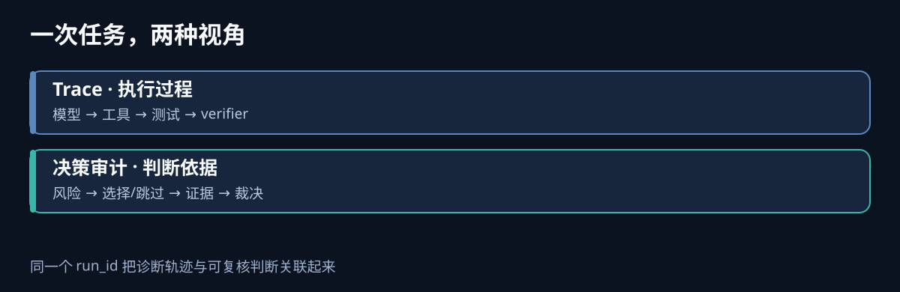
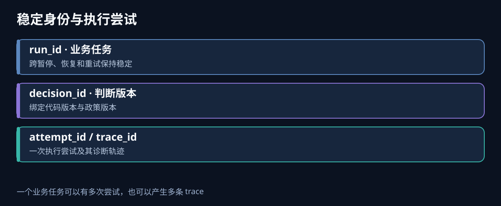
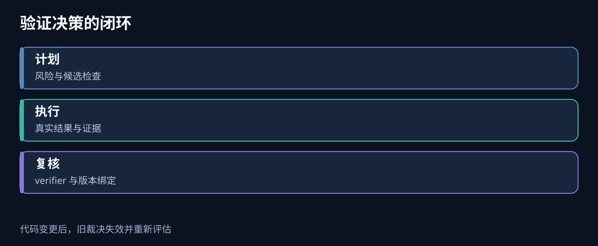

假设一个代码 Agent 改了数据库连接配置。它跑过单元测试，然后决定跳过真实数据库验证，给出“可以合并”的结论。几天后线上出现连接池故障。此时仅看到一条 `tool.pytest succeeded` 的 trace，并不能回答关键问题：**它当时看到了哪些改动，为什么认为真实数据库验证可以跳过？**

这正是决策审计（decision audit）要解决的问题。它与 Agent tracing 可以出现在同一条运行时间线上，但两者回答的问题不同：**tracing 还原执行过程；决策审计保存判断依据与责任边界。** 当 Agent 的判断会影响放行、权限或资源使用时，后者就不能只是几行自由文本日志。



## 一、先把四种记录分清

| 记录 | 核心问题 | 典型内容 | 常见用途 |
| --- | --- | --- | --- |
| Trace | 经过了哪些步骤，耗时和错误在哪里？ | Agent、模型、工具、命令的 span 与父子关系 | 排障、性能分析 |
| Log | 某一刻发生了什么？ | 命令退出码、异常、状态变化的文本或结构化事件 | 定位具体故障 |
| Decision record | 基于哪些输入作了什么判断？ | 风险、候选项、选择/跳过及理由、决策版本 | 复核判断 |
| Evidence | 判断是否得到事实支持？ | 命令结果、测试报告、截图、审查报告及其摘要 | 验收与复验 |

一份 trace 完全可以包含 `validation.plan`、`validation.execute` 之类的 span，也可以链接决策记录。但**把 span 存下来，不等于完成审计**：span 常为排障服务，可能被采样、截断或按较短期限清理；审计记录则要明确必填字段、留存策略、版本关联与完整性状态。反过来，只有决策表而没有 trace，也很难诊断工具超时、重试和上下文断裂。

这里的“审计”不是声称记录模型的全部内心推理。我们能记录和复核的是**可观察的输入、显式给出的理由、执行器实际取得的结果，以及最终授权动作**。自由文本解释可以帮助人理解，但不能替代结果和证据。

## 二、决策审计是 tracing 的一部分吗？

从**用户界面**看，可以是一部分：点开一次 Agent run，沿着时间线看到“分析改动 → 制订验证计划 → 执行 → verifier 复核 → 放行”。从**数据责任**看，最好是独立记录，再通过标识关联。它们可以共用一次任务的 `run_id`，而 `trace_id` 指向这一轮执行的诊断轨迹。

需要特别区分 `run_id` 与 `trace_id`。一次长期任务可能暂停、恢复或重试，仍属于同一个业务 run，却产生多个 trace；一次 trace 也可能只覆盖其中一段执行。因此审计主键应围绕业务对象与代码版本设计，不能把“当前 trace 恰好存在”当作放行条件。

```text
PRD / Issue / change
  └─ run_id：业务任务身份
       ├─ decision_id：一次验证计划或放行判断
       ├─ attempt_id：一次执行尝试
       └─ trace_id：该次尝试的诊断轨迹
```

一种实用做法是：**审计记录保留最小且稳定的事实，trace 保留丰富的执行细节**。审计记录可以引用 trace；trace 丢失或过期后，仍能知道当时基于哪个代码版本、采用了哪些检查、结果如何。若审计存储本身也可能故障，必须显式标记 `history_complete=false`，不能默默显示“通过”。



## 三、一条可复核的决策记录长什么样

以“Agent 自主选择验证项”为例，至少要分开记录**计划、执行与裁决**。这是本文最重要的边界：Agent 写下“我将运行测试”，不代表测试真的运行过。

```json
{
  "schema_version": 1,
  "decision_id": "dec-42",
  "run_id": "run-17",
  "attempt_id": "attempt-2",
  "source_revision": "git-tree-sha-or-worktree-fingerprint",
  "policy_version": "validation-policy-v3",
  "actor": "validation-planner",
  "risk_facts": ["changed: database pool configuration"],
  "checks": [
    {
      "check_id": "unit-tests",
      "disposition": "selected",
      "reason": "配置解析路径已变更"
    },
    {
      "check_id": "real-db-smoke",
      "disposition": "selected",
      "reason": "连接池行为依赖真实数据库"
    }
  ],
  "created_at": "2026-09-22T03:30:00Z"
}
```

这条记录只是**计划**。执行器随后追加每项检查的 `started`、`passed`、`failed`、`timed_out` 或 `unavailable` 结果，并附命令摘要、退出码、环境说明、产物引用和摘要值。verifier 再引用同一个 `decision_id`，说明它是否认可计划覆盖面和实际证据。最终放行记录引用 verifier 结论及代码版本，避免“检查的是 A，合并的是 B”。

| 字段 | 为什么需要 |
| --- | --- |
| `source_revision` | 防止旧证据给新代码放行；未提交改动也需要工作区指纹 |
| `policy_version` | 以后规则变化时，还能解释当时采用哪套标准 |
| `disposition` 与 `reason` | 把跳过项显式化，便于统计误判与复核 |
| `result` 与 `evidence_ref` | 区分 Agent 承诺和执行器观察到的事实 |
| `actor` | 区分 planner、执行器、verifier 和人工签核 |
| `history_complete` | 告诉读者记录缺失，避免把沉默误读为成功 |

原始 prompt、源码、密钥和完整终端输出不应默认写进长期审计表。可以将原始产物放入受控存储，审计表只保留路径、摘要、脱敏摘要和访问范围。**哈希能证明后来查看的是同一份产物，但不能证明产物当初真实或结论正确。**真实性仍需靠可信执行器、环境记录和必要时的复跑。

## 四、它怎样帮助替代固定门禁

固定门禁适合确定、便宜、误报低且失误代价高的规则，比如迁移链完整性或禁止提交密钥。Agent 适合根据改动上下文决定验证深度，例如是否需要浏览器真实入口、真实数据库或特定回归场景。决策审计让后者的自由度能够被复核。



可落地的执行顺序是：

1. **识别风险**：从 diff、任务要求、依赖边界和历史故障提取具体事实，而不是只给“高/中/低”标签。
2. **列出候选检查**：同时记录选择与跳过；跳过需说明前提，例如“仅改文案，没有可执行行为变化”。
3. **执行并留证**：由执行器记录实际命令、环境、退出状态和产物；失败、超时、无凭据分别处理。
4. **独立复核**：verifier 检查计划是否漏掉关键边界，以及证据是否对应当前版本。它的意见也应作为一条新记录，而不是覆盖原计划。
5. **形成最终裁决**：只有与当前代码版本匹配、记录完整且满足必要硬约束的结果，才能支持自动放行；其余情况升级给人。

这不是要求每次都运行最昂贵的验证。它要求**验证深度的取舍有可见依据**。例如前端仅调整按钮文案，可以跳过端到端流程，但要说明未改交互或请求结果；修改 Dialog、Portal 或跨页流程时，单独的组件截图就不足以证明真实入口可用。

### 一个常见失败：结果是绿的，判断仍然错

| 症状 | 原因 | 修复 |
| --- | --- | --- |
| 单元测试通过，线上连接池仍故障 | 计划漏了真实数据库边界 | verifier 审查“覆盖了哪些风险”，而不只看退出码 |
| 证据文件存在，实际测试没跑完 | Agent 把计划或旧文件当结果 | 执行器写入退出码、时间与产物摘要；绑定代码版本 |
| verifier 判绿，但新提交改变了代码 | 裁决没有绑定修订版本 | 代码版本变化时使旧裁决失效并重新评估 |

## 五、从最小实现开始，不必先建平台

已有 runner、日志文件和生命周期账本的项目，可以先增加一张追加式 `decision_events` 表或等价的 JSONL 存储：`decision_id`、`run_id`、`attempt_id`、`event_type`、`actor`、`source_revision`、`occurred_at`、`detail`。事件类型先控制在 `plan_created`、`check_started`、`check_finished`、`verdict_issued`、`decision_invalidated`。原始输出继续落文件，通过 `evidence_ref` 关联。

第一阶段让 Agent 决策与现有门禁**并行运行**，只记录分歧，不自动改变放行。挑选常误拦、执行成本高的门禁，统计它拦住过哪些真实问题、Agent 漏掉了哪些检查、verifier 能否识别。只有在这些反例上表现稳定，才逐项把固定门禁降为提示。否则只是把可见的脚本误报，换成不易发现的判断漏报。

这个方案也有边界。独立 verifier 可能与 planner 共享同一种盲点；本机 SQLite 可能丢失；外部服务验证可能受凭据和环境限制。审计不能神奇地消除这些风险，它的价值是把**依据、缺口与责任**留在可复核的位置，让后续改进有真实样本。

## 速查：遇到一个问题该看哪里

| 你要问的问题 | 先看 |
| --- | --- |
| 为什么这次 run 很慢？ | Trace 的 span 树与耗时 |
| 命令究竟报了什么错？ | 关联 `trace_id` 的日志及原始产物 |
| 为什么跳过真实入口验证？ | 决策记录中的候选项、理由和政策版本 |
| 跳过是否合理？ | 风险事实、任务要求、verifier 结论 |
| 测试通过是否能支持当前合并？ | 执行结果、证据引用、代码版本与最终裁决 |

我的判断是：**决策审计可以嵌进 Agent tracing 的浏览体验，但应有独立的数据契约和留存责任。** 当 Agent 只是辅助写代码，trace 通常足以排障；当 Agent 开始决定“哪些门禁可以不跑、这次是否放行”，决策记录就成为运行时的必要组成部分。

继续阅读：[Agent 决策审计落地：写入点、复核器与门禁降级判据]()——本文的落地实现篇；[Agent Tracing 基础：Trace、Span 与 OpenTelemetry 埋点]()；[Agent Runtime 详解]()。
