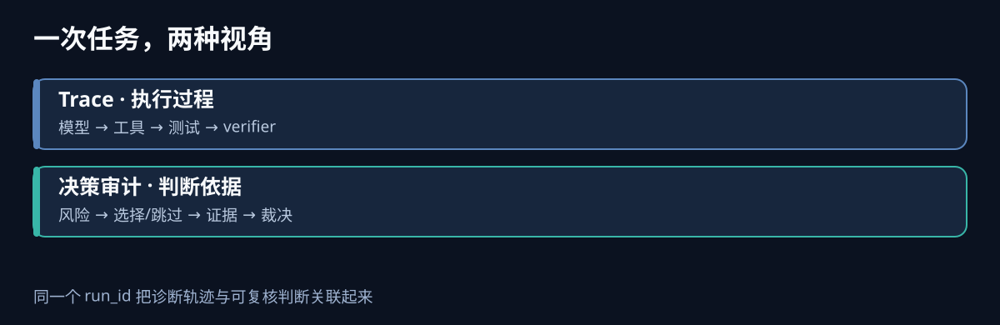
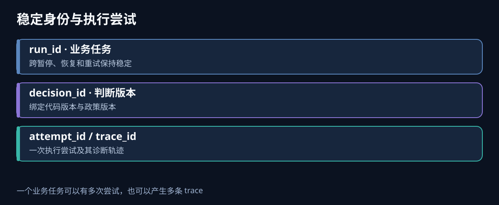
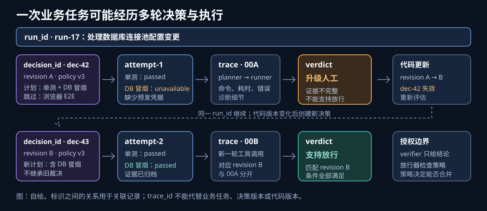
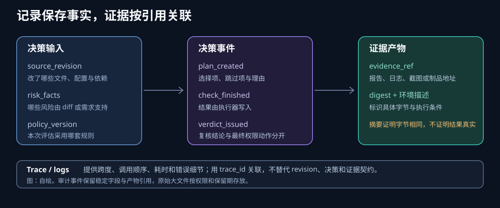
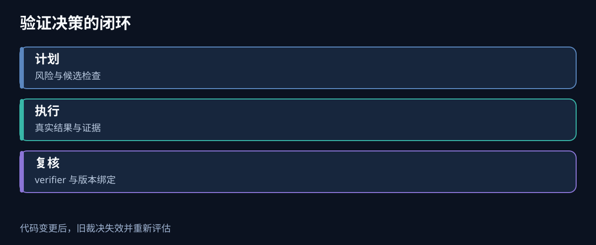

假设一个代码 Agent 改了数据库连接配置。它跑过单元测试，然后决定跳过真实数据库验证，给出“可以合并”的结论。几天后线上出现连接池故障。此时仅看到一条 `tool.pytest succeeded` 的 trace，并不能回答关键问题：**它当时看到了哪些改动，为什么认为真实数据库验证可以跳过？**

这正是决策审计（decision audit）要解决的问题。它与 Agent tracing 可以出现在同一条运行时间线上，但两者回答的问题不同：**tracing 还原执行过程；决策审计保存判断依据与责任边界。** 当 Agent 的判断会影响放行、权限或资源使用时，后者就不能只是几行自由文本日志。



*▲ 同一任务要同时回答“执行到哪一步”和“为什么选了这条验证路径”。图：自绘*

## 一、先把四种记录分清

| 记录 | 核心问题 | 典型内容 | 常见用途 |
| --- | --- | --- | --- |
| Trace | 经过了哪些步骤，耗时和错误在哪里？ | Agent、模型、工具、命令的 span 与父子关系 | 排障、性能分析 |
| Log | 某一刻发生了什么？ | 命令退出码、异常、状态变化的文本或结构化事件 | 定位具体故障 |
| Decision record | 基于哪些输入作了什么判断？ | 风险、候选项、选择/跳过及理由、决策版本 | 复核判断 |
| Evidence | 判断是否得到事实支持？ | 命令结果、测试报告、截图、审查报告及其摘要 | 验收与复验 |

一份 trace 完全可以包含 `validation.plan`、`validation.execute` 之类的 span，也可以链接决策记录。OpenTelemetry 把 span 定义为一次操作，可带属性、事件、状态和链接；它非常适合说明调用发生了什么。[Tracing API](https://opentelemetry.io/docs/specs/otel/trace/api/) 描述的是遥测数据模型，而不是某个业务团队必须保存哪些放行依据。

**把 span 存下来，不等于完成审计。** OpenTelemetry SDK 支持采样决策，部署方也会配置导出、保留与访问策略；某条 trace 是否完整，取决于这套遥测管线的实际配置。[采样规范](https://opentelemetry.io/docs/specs/otel/trace/sdk/#sampling)里就有不记录并丢弃 span 数据的决策。审计记录因此要另行明确必填字段、留存策略、代码版本关联和完整性状态。反过来，只有决策表而没有 trace，也很难诊断工具超时、重试和上下文断裂。

这里的边界是工程设计推论：Trace 可以成为审计事件的关联入口，但不能自然继承“不能漏记”“保存多久”“谁能修改”这类业务承诺。即使团队选择把决策事件写成 span event，也应另有一份清楚的数据契约和存储策略；是否共享底层存储，是实现选择，不是两者语义相同的证明。

这里的“审计”不是声称记录模型的全部内心推理。我们能记录和复核的是**可观察的输入、显式给出的理由、执行器实际取得的结果，以及最终授权动作**。自由文本解释可以帮助人理解，但不能替代结果和证据。

### 审计能说明什么，不能证明什么

审计记录能回答“系统当时拿到了哪组输入、按哪个策略作了什么选择、哪些动作确实执行、谁签发了什么裁决”。它无法仅凭一段理由证明 Agent 的判断合理，也无法仅凭文件摘要证明测试真的运行过。后两个结论分别要依赖独立复核和可信执行器。

这一区分会影响故障复盘。假设审计里写着“因为改动只涉及文案，所以跳过数据库冒烟”：这句话可能准确，也可能只是事后编得通。若记录同时引用 `changed_files`、风险规则版本、被跳过的检查 ID 和对应理由，复核者才有机会重新判断；若执行器还保存了命令、退出码和产物引用，才可以检查“运行过”是否属实。**理由是解释，不是证据；证据是材料，也不自动等于结论。**

还有一条权限边界：verifier 的“支持放行”是基于当时输入得出的裁决，不等于合并、发布或访问生产资源的授权。真正执行这些动作的放行器还要检查当前代码版本、硬性策略和权限。把裁决记录和权限动作分开，才能回答“判断是谁作的”和“最终是谁让它发生”这两个不同问题。

## 二、决策审计是 tracing 的一部分吗？

从**用户界面**看，可以是一部分：点开一次 Agent run，沿着时间线看到“分析改动 → 制订验证计划 → 执行 → verifier 复核 → 放行”。从**数据责任**看，最好是独立记录，再通过标识关联。它们可以共用一次任务的 `run_id`，而 `trace_id` 指向这一轮执行的诊断轨迹。

需要特别区分 `run_id` 与 `trace_id`。一次长期任务可能暂停、恢复或重试，仍属于同一个业务 run，却产生多个 trace；一次 trace 也可能只覆盖其中一段执行。因此审计主键应围绕业务对象与代码版本设计，不能把“当前 trace 恰好存在”当作放行条件。

```text
PRD / Issue / change
  └─ run_id：业务任务身份
       ├─ decision_id：一版验证计划与裁决
       │    ├─ attempt_id：一次执行尝试
       │    │    └─ trace_id：这次尝试的诊断轨迹
       │    └─ verdict：针对绑定版本的复核结论
       └─ decision_id：代码或策略变化后的新计划
```

这些标识不是一套必须照搬的标准字段，而是为不同查询目标划出的身份边界。设计时可以逐项问：

| 标识 | 生命周期 | 适合回答 | 不该承担的含义 |
| --- | --- | --- | --- |
| `run_id` | 一个 Issue、PR 或业务任务从创建到完成 | 这个目标经历过几轮处理？ | 不能用来代替某次具体执行的成功状态 |
| `decision_id` | 一版验证计划及其对应裁决；改计划或重新评估时新建 | 当时的候选检查和判断依据是什么？ | 不能被覆盖成“最新结论”而抹掉旧判断 |
| `attempt_id` | 一次执行尝试 | 这次重跑究竟发生了什么？ | 不能把重试结果覆盖到先前失败的尝试上 |
| `trace_id` | 一条遥测诊断轨迹 | 哪些 span、工具调用和日志属于同条轨迹？ | 不能证明整个业务任务只有这一次执行 |
| `source_revision` | 被评估的代码与配置快照 | 证据和裁决对应哪份输入？ | 不能只写分支名或可变标签 |

`decision_id` 的具体粒度要在系统里固定下来。这里把它定义为一版计划与裁决的身份：只重跑同一计划中的检查，可以保留 `decision_id`，但必须为新执行分配新的 `attempt_id`；代码、风险事实、候选检查或策略版本改变，意味着判断对象改变，应创建新的 `decision_id`。事件键也要包含对应的尝试身份，否则第二次运行同一检查会被错误地当成第一次事件而去重。

一种实用做法是：**审计记录保留最小且稳定的事实，trace 保留丰富的执行细节**。审计记录可以引用 trace；trace 丢失或过期后，仍能知道当时基于哪个代码版本、采用了哪些检查、结果如何。若审计存储本身也可能故障，必须显式标记 `history_complete=false`，不能默默显示“通过”。



*▲ `run_id` 稳定标识业务目标；具体计划、尝试与 trace 则各有自己的生命周期。图：自绘*



*▲ 第一次缺少数据库凭据时只能升级；代码变更后旧裁决失效，必须针对新版本重新计划和验证。图：自绘*

版本绑定不一定意味着每个项目都要对整个仓库做昂贵的哈希。关键是记录**实际被评估的内容快照**：已提交代码可以用 commit SHA；工作区有未提交改动时，还要存工作区差异或稳定指纹；会改变测试结果的依赖锁文件、配置和子模块状态，也要落入快照范围。若复核者无法知道 fingerprint 覆盖了什么，它就只是一个看似精确的字符串。

同理，`policy_version` 需要能回到具体规则内容。只写 `v3` 而不保存版本映射，几年后仍然不知道 v3 是什么；可以让它指向 Git 提交、不可变配置对象或带摘要的策略包。若裁决之后代码或策略发生变化，要追加“旧决策失效”的事件并重新评估，不能把旧结论悄悄改成新结论。

## 三、一条可复核的决策记录长什么样

以“Agent 自主选择验证项”为例，至少要分开记录**计划、执行与裁决**。这是本文最重要的边界：Agent 写下“我将运行测试”，不代表测试真的运行过。

```json
{
  "schema_version": 1,
  "decision_id": "dec-42",
  "run_id": "run-17",
  "source_revision": "git-tree-sha-or-worktree-fingerprint",
  "policy_version": "validation-policy-v3",
  "actor": "validation-planner",
  "risk_facts": [
    {
      "fact_id": "risk-1",
      "source": "diff:src/db/pool.py",
      "statement": "连接池空闲超时默认值发生变化",
      "impact": "行为依赖运行时连接池配置"
    }
  ],
  "checks": [
    {
      "check_id": "unit-tests",
      "disposition": "selected",
      "reason": "配置解析路径已变更"
    },
    {
      "check_id": "real-db-smoke",
      "disposition": "selected",
      "reason": "连接池行为依赖真实数据库"
    },
    {
      "check_id": "browser-e2e",
      "disposition": "skipped",
      "reason": "本次没有修改页面、路由或浏览器请求流程",
      "basis": ["diff:src/db/pool.py"]
    }
  ],
  "created_at": "2026-09-22T03:30:00Z"
}
```

这条记录只是**计划**。执行器随后追加每项检查的 `started`、`passed`、`failed`、`timed_out` 或 `unavailable` 结果，并附命令摘要、退出码、环境说明、产物引用和摘要值。verifier 再引用同一个 `decision_id`，说明它是否认可计划覆盖面和实际证据。最终放行记录引用 verifier 结论及代码版本，避免“检查的是 A，合并的是 B”。

最好把一项检查的状态拆成两个维度，而不是用一个 `status` 字段概括所有情况：

| 维度 | 建议值 | 含义 | 能否作为通过证据 |
| --- | --- | --- | --- |
| 计划选择 `disposition` | `selected` | 计划要执行 | 不能，计划还没执行 |
| 计划选择 `disposition` | `skipped` | 明确决定不执行 | 不能，只能说明理由已留下 |
| 执行结果 `result` | `passed` / `failed` | 执行器观察到检查完成及其结果 | 只有当前版本、当前策略下的 `passed` 才可能支持放行 |
| 执行结果 `result` | `timed_out` / `unavailable` | 超时或环境、凭据等条件不可用 | 不能把“没测成”转写成“没问题” |
| 执行结果 `result` | `not_started` / `cancelled` | 未启动或启动后取消 | 不能；分别保留未运行和被中断的原因 |

分开两个维度是为了避免常见的状态压扁：`skipped` 是规划选择，不是执行结果；`unavailable` 是尝试过但环境不满足，不代表测试失败，也更不代表通过。某项检查如果有重试，每次尝试都要有自己的 `attempt_id` 和结果；汇总页面可以给出“最终采用哪次”，但原始事件仍应保留每次执行。

| 字段 | 为什么需要 |
| --- | --- |
| `source_revision` | 防止旧证据给新代码放行；未提交改动也需要工作区指纹 |
| `policy_version` | 以后规则变化时，还能解释当时采用哪套标准 |
| `disposition` 与 `reason` | 把跳过项显式化，便于统计误判与复核 |
| `result` 与 `evidence_ref` | 区分 Agent 承诺和执行器观察到的事实 |
| `actor` | 区分 planner、执行器、verifier 和人工签核 |
| `history_complete` | 告诉读者记录缺失，避免把沉默误读为成功 |



*▲ 决策事件保存结构化结论，测试报告和原始日志留在受控产物存储中，并通过引用关联。图：自绘*

`risk_facts` 也不该是“风险很高”这样的结论标签。它最好能回指具体 diff、需求条目、策略条款或已经确认的环境事实；`reason` 再解释为什么这些事实使某项检查被选择或跳过。没有来源的风险标签会让审计者只能复核 Agent 的措辞，无法复核它的判断基础。

原始 prompt、源码、密钥和完整终端输出不应默认写进长期审计表。可以将原始产物放入受控存储，审计表只保留路径、摘要、脱敏摘要和访问范围。**哈希能证明后来查看的是同一份产物，但不能证明产物当初真实或结论正确。**真实性仍需靠可信执行器、环境记录和必要时的复跑。

## 四、它怎样帮助替代固定门禁

固定门禁适合确定、便宜、误报低且失误代价高的规则，比如迁移链完整性或禁止提交密钥。Agent 适合根据改动上下文决定验证深度，例如是否需要浏览器真实入口、真实数据库或特定回归场景。决策审计让后者的自由度能够被复核。

落地前应先把“不能被 Agent 跳过”和“可以按上下文选择”分开。前者是系统不变量，后者是验证资源的分配问题：

| 类型 | 例子 | 建议的裁决边界 |
| --- | --- | --- |
| 不可豁免的硬约束 | 密钥扫描、权限边界、数据库迁移完整性、制品签名校验 | Agent 可以解释失败，但不能靠自己的理由绕过；例外走有身份的人工审批 |
| 上下文相关的验证 | 浏览器端到端流程、真实数据库集成、跨服务回归、昂贵的大规模测试 | Agent 可以提议选择或跳过，计划和结果都要留证，verifier 检查风险覆盖 |
| 低风险的提示项 | 格式、文案或可自动修复的静态建议 | 可以不阻断交付，但要注意它们是否间接代表更高风险的信号 |

“替代固定门禁”只可能发生在第二类，并且应该按单项逐步评估。表面上是同一种测试，如果失败后果从“增加一点排障时间”变成“可能写坏生产数据”，它就不再适合交给模型单独决定是否执行。



*▲ 计划负责覆盖风险，执行器负责写事实，verifier 负责检查两者是否吻合。图：自绘*

可落地的执行顺序是：

1. **识别风险**：从 diff、任务要求、依赖边界和历史故障提取具体事实，而不是只给“高/中/低”标签。
2. **列出候选检查**：同时记录选择与跳过；跳过需说明前提，例如“仅改文案，没有可执行行为变化”。
3. **执行并留证**：由执行器记录实际命令、环境、退出状态和产物；失败、超时、无凭据分别处理。
4. **独立复核**：verifier 检查计划是否漏掉关键边界，以及证据是否对应当前版本。它的意见也应作为一条新记录，而不是覆盖原计划。
5. **形成最终裁决**：只有与当前代码版本匹配、记录完整且满足必要硬约束的结果，才能支持自动放行；其余情况升级给人。

这不是要求每次都运行最昂贵的验证。它要求**验证深度的取舍有可见依据**。例如前端仅调整按钮文案，可以跳过端到端流程，但要说明未改交互或请求结果；修改 Dialog、Portal 或跨页流程时，单独的组件截图就不足以证明真实入口可用。

用开头的数据库连接池改动走一遍，会更容易看出每一层的责任：

1. diff 显示 `src/db/pool.py` 的空闲超时默认值改变。planner 把它记为风险事实，并把“配置单测、真实数据库冒烟、浏览器 E2E”列为候选项。
2. planner 选择前两项，理由分别绑定配置解析路径和真实连接池行为；它跳过浏览器 E2E，理由是页面、路由和浏览器请求流程没有变化。跳过记录仍保留在计划中。
3. executor 跑完单测，写入 `passed` 与报告引用；真实数据库冒烟因缺少凭据写入 `unavailable`；浏览器 E2E 没有启动，因此没有执行结果。
4. verifier 检查计划覆盖面和执行证据，发现关键的连接池行为没有被验证，裁决是升级人工，而不是把 `unavailable` 当成绿灯。
5. 人工补齐环境后重新运行；如果代码 revision 已变化，则新建决策版本。新的通过证据只对它绑定的版本生效。

这段流程中，planner 有权提出“跑什么”，没有权力把“没跑成”解释成“已通过”；verifier 可以指出证据缺口，也不自动获得合并权限。任何一个组件都不应同时决定候选范围、伪造执行结果、并执行放行动作。

### 一个常见失败：结果是绿的，判断仍然错

| 症状 | 原因 | 修复 |
| --- | --- | --- |
| 单元测试通过，线上连接池仍故障 | 计划漏了真实数据库边界 | verifier 审查“覆盖了哪些风险”，而不只看退出码 |
| 证据文件存在，实际测试没跑完 | Agent 把计划或旧文件当结果 | 执行器写入退出码、时间与产物摘要；绑定代码版本 |
| verifier 判绿，但新提交改变了代码 | 裁决没有绑定修订版本 | 代码版本变化时使旧裁决失效并重新评估 |
| 检查因凭据不足而不可用 | 把环境缺失压成了通过/失败二选一 | 单独记录 `unavailable`，升级或走明确的人工替代流程 |
| 有摘要值但下载不到原始报告 | 把摘要当作证据本身 | 检查引用可访问性、保留期和读权限；失效引用按缺失处理 |
| 计划列了所有检查，但关键风险没入选 | verifier 只核对“计划是否执行完” | 增加覆盖率复核：风险事实到候选检查之间要有映射 |

一个特别重要的负面结论是：**记录得完整，不等于裁决正确。** 完整性校验只回答“应该留下的事件都在不在”；覆盖面复核才回答“该查的风险有没有查”；真实性检查还要回答“产物是否来自可信执行器”。这三类校验不能用一个“审计完整”状态取代。

## 五、从最小实现开始，不必先建平台

已有 runner、日志文件和生命周期账本的项目，可以先增加一张追加式 `decision_events` 表或等价的 JSONL 存储：`decision_id`、`run_id`、`attempt_id`、`event_type`、`actor`、`source_revision`、`occurred_at`、`detail`。事件类型先控制在 `plan_created`、`check_started`、`check_finished`、`verdict_issued`、`decision_invalidated`。原始输出继续落文件，通过 `evidence_ref` 关联。

第一阶段让 Agent 决策与现有门禁**并行运行**，只记录分歧，不自动改变放行。挑选常误拦、执行成本高的门禁，统计它拦住过哪些真实问题、Agent 漏掉了哪些检查、verifier 能否识别。只有在这些反例上表现稳定，才逐项把固定门禁降为提示。否则只是把可见的脚本误报，换成不易发现的判断漏报。

并行阶段最好在开跑前写明范围和观察指标，避免看到几次绿灯就临时宣布“已经可靠”。至少按**每一项门禁**分别保留以下分母：

| 指标 | 计算口径 | 它暴露什么问题 |
| --- | --- | --- |
| 漏报候选率 | 固定门禁拦截、审计却支持放行的数量 ÷ 固定门禁拦截总数 | Agent 是否会放过固定规则发现的问题 |
| 误报候选率 | 固定门禁放行、审计却升级的数量 ÷ 固定门禁放行总数 | Agent 是否比现有门禁更常阻断正常变更 |
| 可归因率 | 能落到具体风险、环境、策略差异的分歧 ÷ 全部分歧 | 记录本身是否足以解释结论差异 |
| 证据可用率 | 引用可读取且匹配 revision 的证据 ÷ 应提供证据的检查数 | 留下的 evidence_ref 是否真的能支撑复核 |

这几项不能混成一个“准确率”：漏报和误报的代价通常不对称，平均值会把最危险的漏报掩掉。样本量下限、允许的例外和人工复核范围都要在试点开始前写下；不存在适用于所有门禁的通用阈值。样本太少时，“还没观察到漏报”只能说明证据不足，不能直接改写成“不会漏报”。

表里的“候选”也要保留这个限定：固定门禁和审计结论不同，只说明出现分歧，不直接说明哪一边错。尤其是固定门禁放行、审计升级的样本，可能是误报，也可能是审计发现了原门禁没覆盖的风险；只有人工复核并记录归因后，才能给它定性。

一个收敛的试点可以分四步：

1. **限定授权范围**：挑一项高成本、上下文相关、暂时仍由旧门禁裁决的验证，不把生产权限、密钥或迁移安全一起纳入试点。
2. **影子记录**：Agent 给出计划、verifier 给出裁决，旧门禁继续作最终决定；记录两方对同一 revision 的结论。
3. **人工检查分歧**：逐条复核漏报候选，抽查一致放行；确认引用的输入、策略和证据都可以重建。
4. **单项试点与回退**：只有预先约定的判据满足后，才把这一项门禁改为提示；保留一键恢复旧门禁的路径，下一项重新走完整个试点。

如果项目里根本没有让 Agent 决定“是否验证、是否放行”的场景，先把 trace 和人工审批日志关联好通常就够了。新建独立服务、审计数据库或 verifier 平台并不会自动增加可信度；复杂度只有在有人据此改变授权动作时才有回报。

## 六、留存、完整性和记录失败

审计的失效策略要按它是否参与放行来定。在影子阶段，写入失败可以让任务继续，但必须将该次标记为 `history_complete=false`，计入审计缺失率并触发可见告警；进入授权阶段后，如果写入或完整性校验失败，放行器应按“没有可用审计证据”处理，退回固定门禁或人工审批。无论哪种阶段，都不能因为表里没有失败记录就推断任务成功。

“追加式”也不等于防篡改。SQLite 的 `UPDATE` / `DELETE` 触发器能挡住应用路径上的误操作，却挡不住拥有数据库文件权限的人直接替换文件。需要更强追责时，要把写入权限与发布权限分开，保留异地备份或不可变归档；事件摘要链、签名或外部时间戳可以提供额外线索，但密钥管理、可信时间和归档访问控制也必须纳入威胁模型。

保留期和访问范围同样属于数据模型的一部分。计划理由可能暴露内部架构，终端输出可能带密钥，trace 属性也可能带用户输入；“有利于复盘”不足以成为无限期保留原始内容的理由。可以把长寿命审计索引与短寿命诊断材料分开：审计里保存最少必要字段、策略版本、结果和产物引用；原始报告按项目权限和期限访问。引用过期或对象被删除后，应显示证据缺失，不能沿用过去的绿色裁决。

Trace 丢失时，审计记录仍可能完整；审计记录丢失时，Trace 即使还在也不能替它补出一个未记录的跳过理由或授权判断。两者的降级路径应该分别设计，并在界面上明确显示“遥测不完整”与“审计不完整”，不要合成一个模糊的绿色状态。

## 速查：遇到一个问题该看哪里

## 速查：遇到一个问题该看哪里

| 你要问的问题 | 先看 |
| --- | --- |
| 为什么这次 run 很慢？ | Trace 的 span 树与耗时 |
| 命令究竟报了什么错？ | 关联 `trace_id` 的日志及原始产物 |
| 为什么跳过真实入口验证？ | 决策记录中的候选项、理由和政策版本 |
| 跳过是否合理？ | 风险事实、任务要求、verifier 结论 |
| 测试通过是否能支持当前合并？ | 执行结果、证据引用、代码版本与最终裁决 |
| 这次的审计能不能信？ | 记录完整状态、写入者身份、版本绑定与证据可访问性 |

我的判断是：**决策审计可以嵌进 Agent tracing 的浏览体验，但应有独立的数据契约、版本绑定和留存责任。** 当 Agent 只是辅助写代码，trace 加上人工审批记录通常足以排障；当 Agent 开始决定“哪些门禁可以不跑、这次是否放行”，计划、执行事实、证据和最终授权就必须能分开复核。先记录分歧，再证明它能识别分歧，最后才讨论把某一项门禁交给它判断。

开始设计时可以先问四个问题：被允许调整的是哪一项验证？哪些硬约束绝不能跳过？“实际完成”由哪个执行器写入？代码或策略变化后，旧裁决何时失效？这四个答案比先挑数据库、日志平台或模型更能决定系统是否可信。

继续阅读：[Agent 决策审计落地：写入点、复核器与门禁降级判据]()——本文的落地实现篇；[Agent Tracing 基础：Trace、Span 与 OpenTelemetry 埋点]()；[Agent Runtime 详解]()。
