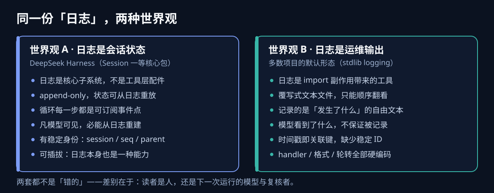
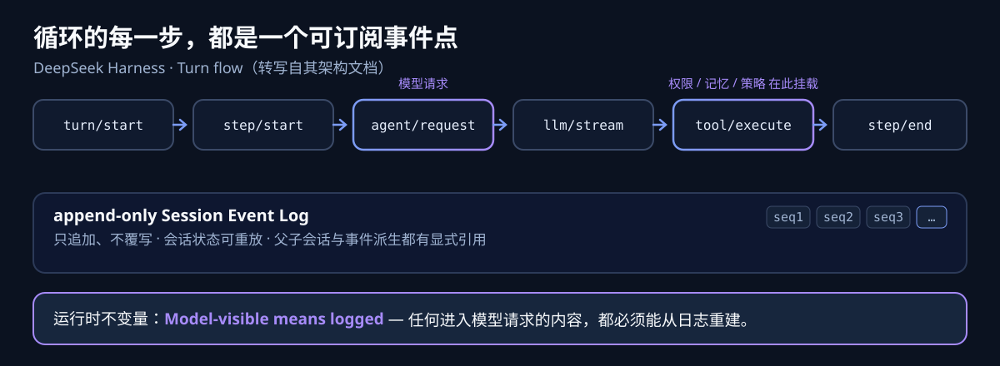
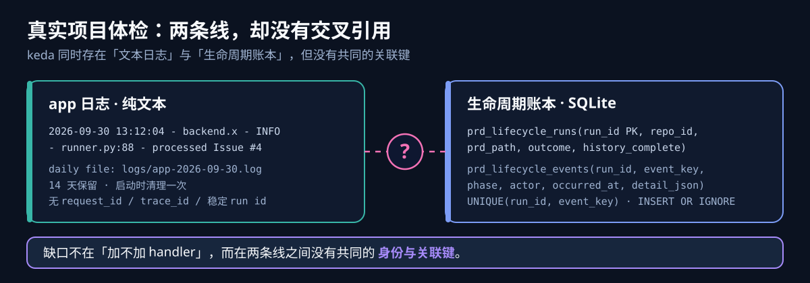
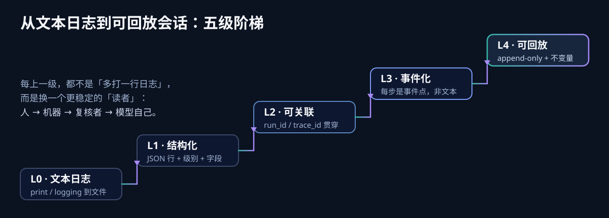

DeepSeek Harness（命令 `dsh`，2026 年 8 月以 Developer Preview 发布）的架构文档里有一句话，我第一次读到是抵触的：

> **Model-visible means logged.** Anything that reaches a model request must be reconstructable from the log, and a runtime invariant asserts it.
>
> （凡模型能看到的，都必须被记录。任何进入模型请求的东西都必须能从日志重建，而且有一条运行时不变量在强制检查这一点。）

日志不是出了事才翻的记录吗？把它抬成一条**强制检查的架构不变量**，是不是过度设计？

带着这个疑问，我把自己手上正在跑的 Agent 项目——keda——的日志实现从头翻了一遍，想看看拿这把尺子量，它到底站在哪。结果比预想的更有意思：keda 其实有**两套**被混着叫「日志」的东西，一套很落后，另一套又意外地接近 DSH；而它们恰好是**断开的**。

这篇文章就按这次体检的顺序写：先把 DSH 的日志观拆开，再解剖多数项目的默认形态，然后逐条量 keda，最后给出从「文本日志」迁移到「会话状态」的最小路径。它既是一次真实项目的对照体检，也是一份关于「日志到底该长什么样」的完整说明。

## 一、先搞清楚 DSH 说的「日志」是什么

要评价一个项目的日志，得先知道顶端长什么样。DSH 的产品定义很直接：**Agent = Model + Environment + Tools + State**——模型、环境、工具、状态四件套。它的架构口号是「Everything is a Plugin」，连 agent 循环本身都是可替换插件，运行时不拥有任何 agent 的特权内核。

关键在于：它官方架构文档列出的**最核心一层有 7 个包**，其中第一个就是 **Session（会话日志）**：

> Session（会话日志）、System Prompt（系统提示组装）、Tools（工具系统）、Agent（Agent 注册与接口）、Agent Loop（智能体循环）、Scope（作用域注册）、LLM（模型适配接口）。

会话日志和工具系统、智能体循环平级——它不是工具层的一个配件。这已经和「项目里加个 logging 模块」是两种物种了。

具体到实现，DSH 的 Session 有四个特征值得记住：

**1）既是 append-only，又可重放。** 会话历史不是一份普通的「消息列表」，而是一份**只追加的事件日志**。会话之间的父子关系编码在不可变 header 的 `parentSession` 字段里，模型可见的「当前表面」（surface）由位置式替换操作（`surfaceOp`）决定，事件之间的派生关系记录在 `sourceEventSeqs` 引用数组里。换句话说，**状态是事件日志的一个投影，而不是日志之外另存的一份真相**。任何时刻的会话状态都可以从日志重放出来。

**2）循环的每一步都是可订阅事件点。** DSH 内部不是简单的「LLM → 工具 → LLM」循环，而是一条事件流水线：

```text
turn/start → claim input → assemble（system prompt / context / tools）
  → agent/pre-step → step/start → LLM request（agent/request）→ llm/stream
  → assistant/message → tool/call
  → tools/pre-execute（permission / guard / policy / hook）
  → tools/execute → tools/post-execute → tool/result → step/end → 下一轮
```

其中 `turn/*`、`step/*`、`user/message`、`assistant/*`、`tool/*` 是**持久化会话事件**，`agent/pre-step`、`agent/request`、`llm/stream`、`tools/*` 是可供插件监听的**扩展点**。这样做的后果是：权限、记忆、策略、日志全部以「监听者」的身份挂在循环上，而不是写死在循环里——**可观测性成了循环的结构属性，而不是事后补的功能**。

**3）可插拔。** DSH 把几乎每项能力都拆成三层：Service Definition（能力定义）→ Service Provider（能力提供者）→ Consumer（能力消费者）。日志本身也是一种可替换的能力，而不是硬编码的 stdout。

**4）最强的约束：Model-visible means logged。** 任何进入模型请求的东西，必须能从日志重建，并且有**运行时不变量断言**兜底。

这四条摆在一起，才是「日志是一等公民」的完整含义。我把它们整理成一张可检验的清单，作为后面体检的尺子：



*▲ 世界观 A 把日志当会话状态；世界观 B 把日志当运维输出。图：自绘*



*▲ 循环每一步都是事件点，事件落进 append-only 日志，最后由运行时不变量兜底。图：自绘*

### 一个容易忽略的问题：为什么 DSH 要这么较真？

如果只是为了排障，plain text 日志也够用。DSH 把日志做成可重放的事件流，真正的动机在**harness 自进化**。

DSH 的插件机制里有一套「可回退效应」（revertible effects）：每次修改都向 runtime 返回一个逆操作，卸载组件时按相反顺序执行，从而把系统恢复到加插件之前的状态。这套机制只有在「运行影响可追踪、修改可局部撤销」时才有意义——而能做到这一点的前提，是**每一次「结构—干预—影响范围—轨迹变化—结果」都被完整记录**。

一旦日志可以重放，就能做**反事实实验**（加组件 A 跑一次，撤销 A 再换成 B），也才有机会把 reward 归因到具体的干预上。这篇文章不展开自进化，但记住这个动机很重要：**对 DSH 来说，日志不是为了「看懂过去」，而是为了「重放和干预过去」**。下一节的第 5 部分会再说这一点。

## 二、世界观 B：日志是「运维输出」

现在回到绝大多数项目的默认形态。打开一个典型的 Python 后端，日志大概长这样：一个 `logger` 单例、stdlib `logging`、文件 + stdout 各一个 handler、一行行纯文本、按天命名、定期清理。

这没什么不好——在「排障」这个目标下，它够用，甚至是最优解。但它背后有一组**隐含假设**，而 Agent harness 恰好逐条破坏了这些假设：

| 隐含假设 | 在 Agent harness 里为什么不成立 |
| --- | --- |
| 读者是人 | 模型自己、下一次运行、复核器都需要读 |
| 事后才看 | 运行中就要用它恢复上下文和状态 |
| 时间戳就是关联键 | 并发多 Issue / 多 attempt 下时间戳会撞车、会交错 |
| 单进程、短生命周期 | daemon 长驻，跨天、跨重试 |
| 「发生了什么」写在自由文本里 | 需要机器可解析的字段来做聚合和断言 |

世界观 B 没有错，它只是**服务错了对象**：它服务的是「事后翻日志的工程师」，而不是「需要重建状态的下一次运行」。

## 三、拿尺子量 keda

keda 是一个真实在跑的 Agent runner：它从 GitHub Issue 取任务，跑 agent、验证、review、合并，还有一条 PRD 生命周期链路。它的日志实现相当典型，正好当样本。

### 3.1 keda 的日志中枢：105 行的单例

整套应用日志的配置，集中在一个文件里：

```python
# src/backend/infrastructure/logging/logger.py
class Logger:
    """Singleton logger manager with daily log files."""
    _instance: Logger | None = None
    _logger: logging.Logger | None = None

    def _setup_logger(self) -> None:
        self._logger = logging.getLogger(config.app_name)
        self._logger.setLevel(getattr(logging, config.log_level))

        root = logging.getLogger()
        if root.handlers:          # 幂等：已有 handler 就跳过
            return
        root.setLevel(getattr(logging, config.log_level))

        formatter = logging.Formatter(
            fmt="%(asctime)s - %(name)s - %(levelname)s - "
                "%(filename)s:%(lineno)d - %(message)s",
            datefmt="%Y-%m-%d %H:%M:%S",
        )
        # stdout + 日文件，14 天保留
        ...

logger = Logger()   # 模块级实例 —— setup 是 import 的副作用
```

这段代码本身写得挺干净：幂等、UTF-8 防护、文件创建失败时降级不崩。但把它放到世界观 A 的尺子下，问题就一条条浮出来了。

### 3.2 逐条对照

| 维度 | 世界观 A（DSH） | keda 现状 | 判定 |
| --- | --- | --- | --- |
| 一等子系统 | Session 是 7 个核心包之一 | 105 行工具模块，setup 是 import 副作用，没有 `setup_logging` 调用点 | 差 |
| append-only / 可重放 | 会话事件日志可 replay | app 日志不是事件流；但 SQLite 生命周期账本是 append-only | 半对 |
| Model-visible means logged | 运行时不变量强制检查 | **不存在**：送进模型的 prompt/context 不强制留痕，无断言 | 缺 |
| 事件流水线 | 每步都可订阅 | 生命周期事件只有粗粒度 phase，无 turn/step/tool 级 | 差 |
| 关联 / 溯源 | header `parentSession` + `sourceEventSeqs` | **无 request_id / trace_id / 稳定关联键**，靠线程号硬切 | 差 |
| 能力接缝 | logging 是可换 Provider | handler / 格式 / 轮转全部硬编码 | 差 |
| 访问日志 | —— | uvicorn 不加 `--access-log`，HTTP 层无应用级日志 | 缺 |

逐条展开：

**（1）日志不是子系统，而是 import 的副作用。** `logger = Logger()` 写在模块底部——任何模块 import 它，全局配置就被触发。这在只有一个进程、一个入口时没问题；但当一个 daemon、一个 CLI、一个 API 三种入口共用同一份代码时，「谁先 import 谁配置」就变成了隐式顺序依赖。DSH 里 Session 是一个显式装配的核心包，keda 里它是一行副作用。

**（2）纯文本，无结构化字段。** 格式是 `%(asctime)s - %(name)s - %(levelname)s - %(filename)s:%(lineno)d - %(message)s`。人看着舒服，但机器要聚合「某个 Issue 的失败率」「某类工具调用耗时」时，只能靠正则去啃。全仓没有 structlog、loguru 或 JSON formatter——这是个可以直接改、收益明确的小切口。

**（3）没有关联键，用线程号冒充。** 这是最要命的一条。keda 要给「每个 Issue 一份独立日志」，做了一件很聪明的事：给 `backend` 这个 logger 命名空间临时挂一个 `StreamHandler`，再用一个过滤器按**线程号**把记录分流到对应 Issue 的文件：

```python
class _ThreadLogFilter(logging.Filter):
    def filter(self, record: logging.LogRecord) -> bool:
        return record.thread == self._thread_ident   # 靠线程号关联

handler = logging.StreamHandler(stream=writer)
handler.addFilter(_ThreadLogFilter(threading.get_ident()))
logging.getLogger(_BACKEND_LOGGER_NAME).addHandler(handler)
```

它确实能工作，而且比大多数项目的日志做得好——但它把「一个 Issue」和「一个线程」绑定死了。只要哪天引入线程池复用、异步任务、或一个 Issue 拆到多个 worker 线程，这条关联立刻失真。真正的解法是给每个 Issue / run 一个**显式 ID**，注入每条日志的 `extra`，而不是依赖运行时碰巧成立的线程映射。

**（4）轮转和保留只跑一次。** 日文件名 `app-{today}.log` 在 `_setup_logger` 里**打开时就定死**，清理也只在启动时执行一次：

```python
today = datetime.now().strftime("%Y-%m-%d")
log_path = log_dir / f"app-{today}.log"
file_handler = logging.FileHandler(filename=str(log_path), encoding="utf-8")
...
self._cleanup_old_logs(log_dir, keep_days=14)   # 仅启动时执行
```

对一个短生命周期进程（CLI 命令跑完就退）没问题。但 keda 有长驻的 daemon：**今天启动的进程，明天还在往 `app-09-30.log` 里写**。跨天不切文件、保留策略不重跑，`--follow` 和归档都会踩到。这里应该用 `TimedRotatingFileHandler(when="midnight")`，或者让 daemon 自己检查日切。

**（5）配置脆弱。** 日志级别直接用 `getattr(logging, config.log_level)`。如果 `LOG_LEVEL` 配成小写 `info` 或错拼成 `INOF`，这里直接 `AttributeError` 崩掉——不是「丢掉日志」，而是**整个进程起不来**。日志配置不该有这个杀伤力。

**（6）两套 logger 惯例并存。** 约 100 个模块用 `logging.getLogger(__name__)`，而 infrastructure / engines 层用共享单例 `logger`。两者最终都汇到 root handler，所以「能用」，但风格不统一，新人不知道该跟哪个。更麻烦的是，调试时你不确定某个 `logger.info` 到底会不会被那条线程过滤器捞进 Issue 文件。

### 3.3 但 keda 有两件事，反而很接近 DSH

批评完要公道。keda 在另一条线上，做的东西其实**比它的 app 日志先进一代**。

**每 Issue 的轨迹日志。** keda 会给每个 Issue 单独开一个文件，路径是 `logs/agent-runner/issues/<repo_id>/issue-<n>-<ts>.log`，而且在一个 attempt 结束时，会显式写入一个终态标记：

```python
# agent_runner_output_routing.py
writer.write(f"\n{ATTEMPT_END_MARKER}\n")
```

理由写在注释里：`--follow` 需要把「运行结束」和「这一刻没有新字节」区分开——后者在 agent 两次写入之间、重试间隔里都会出现。**这不就是 DSH 说的「任务轨迹」吗？** 一条从开始到结束、带明确终态边界的执行记录，只是 keda 没把它当成一等公民，也没和别的东西关联起来。

**SQLite 生命周期账本。** keda 有一张真正意义上的 append-only 事件表：

```sql
CREATE TABLE prd_lifecycle_events (
    run_id TEXT, event_key TEXT, event_type TEXT,
    phase TEXT, actor TEXT, occurred_at TEXT, detail_json TEXT,
    UNIQUE(run_id, event_key)
);
-- 写入用 INSERT OR IGNORE，幂等追加
```

加上 `prd_lifecycle_runs` 的 `history_complete`、`reopen` 终态语义，这已经具备 DSH 会话日志的骨架：**稳定 run id、事件幂等、终态可 reopen、历史完整性显式标记**。生命周期事件类型也不是随意的字符串，而是一个封闭集合（queued / started / claimed / attempt / retry / recovered / validation_* / review_* / merge_* / merged / archived / blocked / failed）。

**所以真正的缺口不是「没有账本」，而是两条线断开了：**



*▲ 一边是纯文本 app 日志，一边是 SQLite 账本，中间缺一个稳定关联键。图：自绘*

出问题时，你有一份带 `run_id` 的结构化账本，也有一堆带时间戳的纯文本——但**没有任何字段能把它们对上**。你只能拿时间戳去人肉对齐，而复现 DSH 那种「从日志重建会话」的能力，恰恰需要这层关联。

## 四、从「文本日志」到「会话状态」的最小迁移

不需要一步到位重写成 DSH。按性价比排序，五步就能把 keda 从世界观 B 拉向世界观 A：



*▲ 每上一级，换的不是「多打一行日志」，而是更稳定的读者。图：自绘*

**第一步：接上关联键（收益最大、成本最小）。**
给每个 Issue / run 一个稳定 ID，在所有日志里注入 `extra`：

```python
logging.basicConfig(
    format="%(asctime)s %(levelname)s run_id=%(run_id)s %(name)s: %(message)s",
)
logger.info("processed Issue #4", extra={"run_id": run_id})
```

这样纯文本日志里也能一眼定位到某个 run，账本和文件第一次有了交叉引用。先做这一步，后面所有事都变简单。

**第二步：把「模型可见即记录」变成断言。**
在组装模型请求的函数出口加一条校验，确保 prompt / messages 已经落进账本或轨迹文件。不需要完整的运行时不变量系统，一条 `assert` 或一次显式写入就够起步。这是 DSH 最值钱的一课：**把可观测性从「事后想起来补」变成「不记录就走不下去」**。

**第三步：修轮转，顺手让 level 解析 fail-soft。**

```python
handler = logging.handlers.TimedRotatingFileHandler(
    filename=..., when="midnight", backupCount=14, encoding="utf-8",
)
# level 解析不再 getattr 直接崩
level = getattr(logging, str(config.log_level).upper(), logging.INFO)
```

**第四步：统一 logger 获取方式，把事件从 phase 级下沉到 step / tool 级。**
前三条是把现有日志变好；这一步才是往「事件流水线」走。生命周期事件现在是粗粒度的阶段标记，可以逐步加上 `step/start`、`tool/call`、`tool/result` 这类细粒度事件——不必覆盖全部，先从最长、最容易出问题的 agent 执行段开始。

**第五步：结构化输出（双通道）。**
人读的文本和机器读的 JSON 行可以并存：stdout 走人类可读格式，文件或一个独立 sink 走 JSON lines。放最后，因为前面四条不做，结构化只是把「grep」换成「jq」。

顺带一个判断标准：**不是每个项目都需要走到 L4**。如果日志只是用来排障，L1（结构化）往往就够了。真正的分水岭是——**你的系统里有没有「依据日志/记录去改变授权、放行或状态」的动作**。只要有，它就必须是稳定、可关联、可重放的记录，而不是自由文本。

## 五、为什么值得这么较真：日志与 harness 自进化

回到开头那个「过度设计」的疑问。

如果 harness 永远不变、只服务人类排障，那么 plain text 日志确实够用。DSH 把日志做成可重放的会话事件流，是因为它把这套系统当作**可以自我修改、自我进化的对象**：

- **可回放，才能做反事实。** 有了 append-only 会话日志，你才能「撤销一次干预、恢复到原状态、再换另一种干预」，从而估计「在当前结构下，加 A 的边际效果是多少」。
- **可归因，才能做 reward assignment。** 只记录「最终成功/失败」的 harness，无法知道成功到底来自哪一次修改。事件化的会话日志把「结构—干预—影响范围—结果」整条链留下来，reward 才有稳定的落点。
- **可重放，才能做好会话交接。** 一个好的进度记录能把新会话的启动诊断时间减少 60%~80%，而这本质上就是 append-only 日志的工程化保证——新会话不需要从零猜上一个会话做了什么，回放日志即可重建上下文。

这三点和语言模型的能力演化关系不大，和**你愿不愿意把「日志」当成系统状态本身**关系很大。keda 已经有一只脚踩在这条路上（生命周期账本），只是另一只脚（app 日志）还停在运维时代，中间缺一座桥。

## 六、几点收获

- **「日志」是个被滥用的词。** 至少混着四种东西：text log、trace、事件日志、决策/审计记录。它们的读者、生命周期、完整性要求都不同。评价任何项目的日志，先问「它服务谁、要回答什么问题」，再谈格式和工具。
- **默认形态的隐含假设值得显式写出来。** 人来看、事后看、时间戳即关联键、短生命周期——把这几条列出来，Agent 系统里能对上几条，一目了然。
- **最大的收益往往来自最小的一步。** keda 不需要立刻重写成事件溯源，先接上一个贯穿日志与账本的 `run_id`，就已经修复了最关键的那道缝。
- **可观测性是第一性约束，不是加分项。** DSH 的「Model-visible means logged」最反直觉，也最值得抄：与其事后补日志，不如让「不记录就进行不下去」成为约束。
- **判断要不要升级日志，看它是否参与决策。** 当记录能改变授权、放行或状态时，它就不再是「日志」，而是需要独立数据契约的系统状态。

继续阅读：[Agent 决策审计：它与 Tracing 的关系]()；[Agent Run 流式协议：事件溯源、SSE 投影与断线恢复]()；[Agent Tracing 基础：Trace、Span 与 OpenTelemetry 埋点]()。
