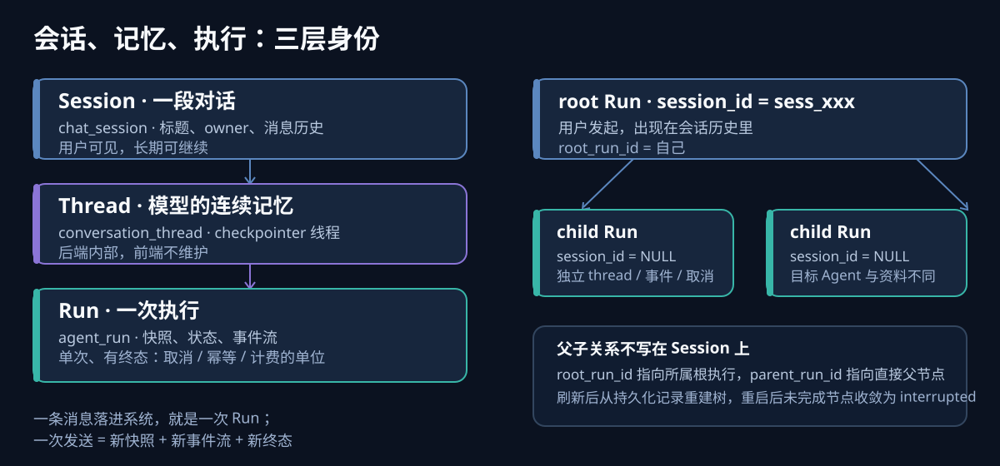

把 Run 表定义摊开看，有个细节很别扭：

```python
class AgentRunModel(Base):
    id:         Mapped[str]        # Run ID
    thread_id:  Mapped[str]        # 外键 -> conversation_thread，NOT NULL
    session_id: Mapped[str | None] # 外键 -> chat_session，允许为空
    agent_id:   Mapped[str]
    status:     Mapped[str]
    ...
```

一张表上挂了两个"会话类"外键，一个必填、一个可空。第一眼看上去像是设计没收敛——要么统一用 session，要么统一用 thread，为什么两个都要？

真正解释这件事的，是那个**允许为空**的字段。它存在的理由，不是一个空值占位，而是"一次执行可以不隶属于任何对话"。等子 Agent 出现时，这个空位会立刻被填满意义。

## 一、三个名字，三种事实

这三层不是同义词，也不是新旧替代关系，它们各自是一类问题的权威答案：

| 层 | 表 | 谁看得见 | 回答的问题 | 生命周期 |
| --- | --- | --- | --- | --- |
| Session | `chat_session` | 用户 | 这是哪一段对话 | 长期，可继续 |
| Thread | `conversation_thread` | 只有后端 | 模型的连续记忆装在哪 | 与对话同寿 |
| Run | `agent_run` | 用户（状态/取消）、管理员（审计） | 这是哪一次执行、用了什么、跑到哪 | 单次，有终态 |

```text
Session   用户可见的一段对话：标题、owner、历史消息
  └─ Thread   模型的连续记忆（checkpointer 线程），前端不维护
      └─ Run   一次执行：快照 / 状态机 / 事件流 / 取消 / 计费
```



几处容易混的地方，一次说清：

- **Session 是产品概念**。它管标题、归属、消息顺序；删掉一个 Session 意味着用户不再看到那段对话。
- **Thread 是实现细节**。Session 到 Thread 的映射在后端完成，客户端不需要传也不需要存 `thread_id`。它存在的唯一理由是：模型需要一个连续的上下文容器。
- **Run 是事实源**。它不属于"对话"这个层级，而属于"执行"这个层级：一次输入落进去，出来的是带序号的事件流和一个终态。

所以那条别扭的表定义翻译过来是：**每次执行必须属于一个记忆线程，但不一定属于一段用户对话。**

> 这里要跟另一套常见用法区分开：在审计与可观测性的语境里，`run_id` 有时指"跨暂停、重试仍稳定的业务任务身份"，再用 `attempt_id`、`trace_id` 区分每一次尝试（可参考本系列的《Agent 决策审计：它与 Tracing 的关系》）。本文说的 Run 是**执行层**的单位：单次、有终态、不可重开——想重跑，就是一次新的 Run。两套用法服务的问题不同，混用会在"重试算不算同一次"上直接打架。

## 二、一条消息，就是一个 Run

用户视角里，一次交互是"在对话里发了一句话"。到 API 这一层，它变成一次 Run 创建：

```http
POST /sessions/{session_id}/messages
→ 202 { "message_id": "...", "run_id": "run_xxx", "events_url": "/api/agent-runs/run_xxx/events",
        "agent_id": "...", "agent_name": "..." }
```

返回体里同时出现 `session_id`（在 URL 上）和 `run_id`（在响应里），这不是冗余，而是两个层级各自交回自己的凭据：前者继续指向那段对话，后者指向刚刚开始的这次执行——订阅事件、取消、查状态，用的全是它。

历史消息也保留了这层关系：assistant 消息上挂一个唯一的 `run_id` 回指生成它的那次执行。这样当用户在同一个对话里换了 Agent，回看历史时依然能说出"这条回答当时是哪个 Agent 给的"，而不是拿当前绑定去反推过去。

而 Session 上的 `agent_id` 只是**初始默认值**：同一段对话的后续每条消息都可以逐次切换 Agent，切换只影响下一次发送。这一点是后面所有讨论的前提——如果 Session 就等于 Run，这条规则根本无法表达。

## 三、为什么不能"一个 Session 一个 Run ID"

合并成一层听起来更简洁，但会立刻遇到四个对不上的地方：

**1. 快照必须逐次冻结。** 每个 Run 在创建事务里固化两份不可变快照：Agent 执行快照和资料上下文快照。它们记录的是"这一次用的版本"，而不是"这段对话现在用什么"。会话级 ID 没有位置安放"逐次"这个语义。

**2. 终态是执行的属性，不是对话的。** Run 的状态机有唯一终态且不可重开：`succeeded`、`failed`、`cancelled`、`interrupted`。一次执行失败，不应该把整段还能继续聊的对话标记为失败。

**3. 幂等键挂在 Run 上。** 创建 Run 必须带 `Idempotency-Key`，唯一约束是 `(owner_id, idempotency_key_hash)`。同一用户、同一个 key、同一份请求会重放原来那次 Run；同样的 key 配不同请求则稳定返回 `idempotency_conflict`。重放的单位是"那一次执行"，不是"那段对话"。

**4. 取消、租约、事件游标都是 per-Run 的。** `GET /api/agent-runs/{run_id}/events?after_seq=N` 的游标是 Run 内的序号；执行租约（lease）也写在 Run 上。刷新续流用 `Last-Event-ID` 接上原来那条流——如果一段对话只有一条流，换 Agent、重试、取消全都会糊在同一根管道里。

换个角度看得更清楚。挂在 Run 上的这些字段，每一条都在说"这是单次执行的属性"：

| 事实 | 字段 |
| --- | --- |
| 用哪个 Agent、什么版本 | `agent_id`、`agent_execution_snapshot` |
| 看的哪些资料 | `context_pack_snapshot` |
| 跑到哪一步 | `status`、`last_event_seq` |
| 谁在跑 | `executor_instance_id`、`lease_expires_at` |
| 能不能重放 | `idempotency_key_hash`、`request_checksum` |
| 结果与失败 | `final_message_id`、`error` |
| 时间线 | `created_at` / `started_at` / `finished_at` |

## 四、Run 的状态机：把"事实"和"活性"分开

既然执行是单位，状态就必须说准。非终态有三个，终态有四个：

```text
queued ─→ running ─→ succeeded
   │         │    └→ failed
   │         ├─────→ cancelled
   └─────────┴─────→ interrupted
        cancelling 是 running 到 cancelled 之间的过渡态
```

三条容易踩的语义：

- **租约不是历史事实。** `lease_expires_at` 只表示"执行者还活着"，它过期不代表这次执行失败了。失联的 Run 由 reconciliation 追加 `run.interrupted` 收口——而且**不会自动重跑模型**。想重跑，是人的决定，是一次新的 Run。
- **取消只追加一次终态。** 用户取消先写 `run.cancelling`，运行中的执行器收到信号后回收当前图或模型流，恰好追加一次 `run.cancelled`（带 `external_stop_confirmed: true`）。确认取消之后，不会再出现 `run.completed` 或 `run.failed`。
- **终态不可重开。** 一个 Run 进入终态，它的故事就结束了。任何"再来一次"都是新 Run、新快照、新的幂等键。

这套规则的价值不在单 Agent 场景——那里一条流从头读到尾就够了。它的价值在于：**当你需要并行、需要重试、需要给一部分工作单独踩刹车时，你必须有一个不可重开的最小单位。**

## 五、委派那天，这个空字段被填满了

现在回到开头那个可空的 `session_id`。

子 Agent 委派落地后，父 Run 在执行过程中会请求平台创建 child Run。child 是**另一次真实执行**：目标 Agent 不同、快照不同、独立线程、独立事件流、独立状态与独立取消入口。它满足"执行"的全部定义，但不隶属于用户的那段对话——用户没有在对话里发过那句话。

所以 child 的 `session_id` 就是 `NULL`：

```text
root Run     session_id = sess_xxx   用户可见，出现在会话历史
├─ child A   session_id = NULL       内部执行，只有树里能看到
└─ child B   session_id = NULL
```

父子关系不表达在 Session 上，而是靠 Run 表自己的两个自引用字段：`root_run_id` 指向所属的根执行，`parent_run_id` 指向直接父节点。运行树因此可以从持久化记录里重建：刷新页面后树还在，服务重启后未完成节点统一收敛为 `interrupted`。

对前端而言，这个分层直接决定了工作量：原来"发一次消息 = 拿到一个 run_id = 连一条 `events_url`"的假设，要变成"先读树，再按每个节点的 `events_url` 各自订阅"。一条流变多条流，正是因为一次对话里现在真的有了多次执行。

反过来验证一下：如果当初把 Run 合并进 Session，委派就得在 Session 上开洞——一段对话要同时容纳多个 Agent、多份快照、多个终态、多个取消目标。这个洞会一直开到把 Session 拆回去为止。

## 几点收获

- **ID 的层级应该跟生命周期对齐，而不是跟界面层级对齐。** 用户看到的是对话，系统需要的是执行；把两者合成一个 ID，短期少一个字段，长期处处要打补丁。
- **允许为空的外键往往在讲一个未来的故事。** `session_id` 可空不是随手留的，它提前承认了"执行可以不属于任何对话"这类存在。
- **状态机要区分事实与活性。** 心跳、租约、连接状态说明的是"谁还在跑"；状态、事件流说明的是"发生了什么"。把两者混在一起，就会出现"进程没了所以这次执行失败了"这种错误结论。
- **幂等、取消、游标、计费都需要一个不可重开的最小单位。** 它们四个的需求指向同一个答案：Run。先把这层定清楚，后面加并行、加委派、加预算，都是在这个单位上做加法。

回到最开始那张表：两个外键不是没收敛的设计，而是两层身份各自在场的证据。一个必填，因为执行总需要记忆；一个可空，因为执行不一定需要观众。
