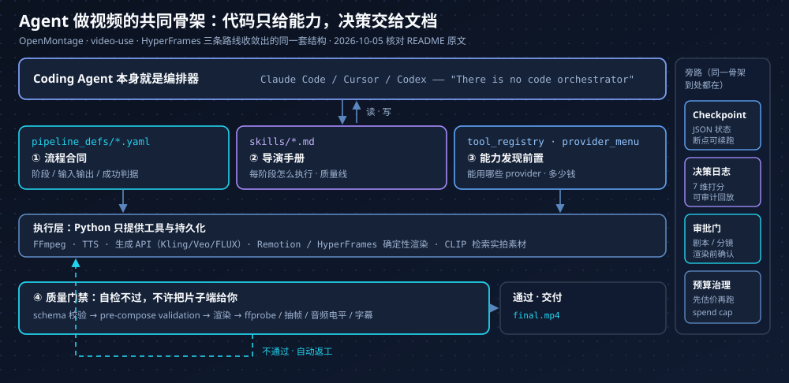

`calesthio/OpenMontage` 的 README 第 416 行写着这么一句：

> OpenMontage uses an **agent-first architecture**. There is no code orchestrator. Your AI coding assistant IS the orchestrator.

翻译过来是：这套系统里**没有编排代码**，跑在你终端里的 Claude Code / Cursor / Codex 本身就是编排器。仓库 63,417 star、AGPL-3.0、最后一次 push 是 2026-10-03（一手，GitHub API 现查）。

这件事值得单独盘一次。起因是很朴素的一个问题：现在到底有没有「Agent 自己把一条视频做完」的可用项目，大家是怎么做的。答案散在几十个仓库里，而且**分成五条互不相通的路线**——它们的差别不在模型选得好不好，而在「谁来做决定」这一层。

## 先划清那道工程鸿沟

「能生成一段视频」和「能做完一条视频」之间隔着一长串步骤。拿一条 60 秒的科普片举例，真实清单是：

选题 → 查资料 → 收敛观点 → 写脚本 → 设计分镜 → 生成或检索素材 → 配音 → 选 BGM → 剪辑 → 字幕 → 转场与动画 → 混音 → 渲染 → 质检 → 导出。

**文生视频模型只解决「生成素材」这一格。** 剩下十四格要么没人管，要么散在五个工具里。所以「Agentic Video Production」这个方向的实质不是换个更强的模型，而是有人去补那十四格——补法不同，就分出了下面的路线。

信源分级沿用我[《Agent 自进化开源盘点》]()里定的规矩：**一手**是我直查了 GitHub API 或 README 原文；**转述**只在二手渠道看到、没连上原始出处；**未核**的不作为论据。star / push / 许可证统一是 **2026-10-05** 从 GitHub API 拉的，README 引文是从 `raw.githubusercontent.com` 拉的。**这批数字半年就过期，看的时候记得对日期。**

## 路线一：Agent 就是控制平面

代表是 OpenMontage。把它的目录结构抄下来，注释是仓库自己写的：

```text
OpenMontage/
├── tools/              # 100+ registered production tools (the agent's hands)
├── pipeline_defs/      # YAML pipeline manifests (the agent's playbook)
├── skills/             # Markdown skill files (the agent's knowledge)
│   ├── pipelines/      # Per-pipeline stage director skills
│   ├── creative/  core/  meta/        # meta 里是 reviewer 和 checkpoint 协议
├── schemas/            # 20+ JSON Schemas (contract validation)
├── styles/             # Visual style playbooks (YAML)
├── remotion-composer/  # React/Remotion video composition engine
└── lib/                # Core infrastructure (config, checkpoints, pipeline loader)
```

Python 只负责**工具和持久化**；所有创意决策、编排逻辑、评审标准和质量线都放在可读可改的 YAML + Markdown 里。README 里还给了 Agent 一条硬性顺序：

> Pick the right pipeline first, then read the manifest, then read the stage skill, then use tools.

三个设计我觉得是可以直接抄的：

**1）能力发现前置。** 不是让 Agent 凭记忆猜「我能不能用 Kling、有没有 FFmpeg、这个该用 Piper 还是 ElevenLabs」，而是让它先跑一次 registry：

```bash
python -c "from tools.tool_registry import registry; import json; registry.discover(); \
  print(json.dumps(registry.support_envelope(), indent=2))"     # 我这台机器到底支持什么
python -c "... print(json.dumps(registry.provider_menu(), indent=2))"  # 供应商菜单
```

`support_envelope` 和 `provider_menu` 这两个函数名本身就说明态度：**先把可用能力摊开，再谈方案**。

**2）三层知识结构。** 仓库专门画了这张图：Layer 1（`tools/` + `pipeline_defs/`）回答「有什么」，Layer 2（`skills/`）回答「按本项目规矩怎么用」，Layer 3（`.agents/skills/`）回答「底层技术什么原理」。每个工具声明自己依赖哪些 Layer 3 知识包。换供应商不改代码，加一条流水线只要写 YAML 和 Markdown。

**3）质量门禁不是形容词。** README 列了具体拦截点：`delivery promise` 校验专门拦「渲染出来像 PPT」的片子，pre-compose validation 在烧 GPU 之前就否掉坏方案，渲染后强制自检（ffprobe、抽帧、音频电平、字幕检查）**通过了才允许把成片端给你**。每个供应商选择按 7 个维度打分并留下可审计的决策日志。预算也是硬的：执行前先估价、有花费上限、超阈值动作单独审批。

另一手是 `Backlot` 看板：`python -m backlot open` 打开一个自己填内容的本地制片板，阶段逐个点亮、脚本按剧本页排版、每个 provider 决策和每块钱都贴墙上；跑完能 **▶ REPLAY RUN** 按时间戳回放整次制作。分镜表是一个真的审批门——素材生成会在逐场景的 contact sheet 上暂停，让你在**渲染之前**而不是之后点头。

11 条流水线里我意外看到一条不需要付费生成 API 的：**Documentary Montage** 从 Pexels / Archive.org / NASA / Wikimedia / Unsplash 建一个 CLIP 可检索的语料库，再剪成实拍纪录片。想做「零素材成本」的片子，这格比堆生成模型实在。

同路线的还有：

| 仓库 | star | 许可证 | push | 特点 |
| --- | --- | --- | --- | --- |
| `HKUDS/ViMax` | 12,547 | MIT | 2026-09-30 | 港大，导演/编剧/制片/生成四合一；长剧本 RAG 拆分、参考图保一致性、VLM 校验首帧 |
| `HITsz-TMG/VideoClaw` | 1,839 | MIT | 2026-08-26 | 哈工大张民团队 + 阿里，"Chat an Idea. Get a Film." |
| `HKUDS/VideoAgent` | 1,919 | MIT | 2026-07-22 | EMNLP 2026，理解 + 剪辑 + 重制一体，按意图路由到 Agent |
| `video-db/Director` | 1,545 | MIT | 2026-01-23 | 挂在 VideoDB 后端上做 search/edit/compile/generate 推理 |
| `waooAI/waoowaoo` · `HBAI-Ltd/Toonflow-app` · `chatfire-AI/huobao-drama` | 14.4k · 16.5k · 15.7k | — | — | 国内短剧簇：先建角色/场景/道具资产库，再分镜生成，末尾导出剪映草稿 |

顺带一个反常识观察：**短剧簇几乎都在同一个地方收口——导出剪映草稿**。不是做不到全自动，是大家都发现最后一刀还是要人挪，于是把「不锁死工作流」当成设计目标。video-shotcraft 也一样做了剪映工程导出（README 注明在 JianYing Pro 11.2 for macOS 验证过）。

## 路线二：视频即代码——确定性是入场券

HeyGen 开源的 `heygen-com/hyperframes`（56,930 star、Apache-2.0、push 到 2026-10-05，一手）口号是 "Write HTML. Render video. Built for agents."。它的做法是**把视频定义成 HTML**：

```html
<div id="stage" data-composition-id="launch" data-start="0" data-width="1920" data-height="1080">
  <h1 id="title" class="clip" data-start="1" data-duration="4" data-track-index="1">Launch day</h1>
</div>
```

`data-start` / `data-duration` / `data-track-index` 声明时间与轨道，动画接 GSAP、CSS、Lottie、Three.js、Anime.js、WAAPI 或自定义帧适配器。渲染器在无头 Chrome 里**逐帧 seek**再用 FFmpeg 编码，README 的原话是 "the same input produces the same video"。

这句话才是重点。Agent 生成的东西本来就有随机性，如果渲染这一步也随机，就没有任何可复现性可言。**确定性渲染是把视频放进 CI 和回归测试的前提**，也是它能被 Agent 反复调用而不炸的原因。同类的 [Remotion](https://github.com/remotion-dev/remotion)（61,911 star）更早，但基于 React/TSX；HyperFrames 的卖点正是「不需要 React，没有私有时间线格式」——对大模型来说，写合法 HTML 比写合法 TSX 稳。它甚至提供了 `/remotion-to-hyperframes` 这个单向迁移 skill。

对 Agent 友好的部分在 skill 层：仓库发布 **21 个按需加载的 skill**，`/hyperframes` 是路由兼能力地图，负责把「帮我做个十秒产品介绍」这类请求分派到 `/faceless-explainer`（无产品无 URL，画面全靠 LLM 造）、`/product-launch-video` 这类创作工作流；`/hyperframes-core` 写的是 composition contract 和 determinism 规则，`/hyperframes-cli` 是 `init / lint / check / snapshot / preview / render / publish / doctor` 这条开发闭环，外加 HeyGen 云渲染和 AWS Lambda 分布式渲染。注意 `lint` 和 `check` 在 `render` 前面——**先静态过一遍再花渲染时间**。

`Vincentwei1021/video-shotcraft`（10,308 star、Apache-2.0，一手）是这条路线上最好看的**经验资产化**样本。README 的头一行就是数字：

> An agent skill for crafting cinematic product videos: **157 shot recipe cards · 214 styles · 214 motion previews** · a production-ready template

它把「电影感」拆成一张张可复用的镜头配方卡（2026-08 从 104 张扩到 152 张，是从 209 个候选动效里筛出来的），配上线上 Gallery 可以逐个预览。Agent 干活的路径是 real page captures → 2.5D camera moves → beat-synced cuts → SFX → Remotion render，交付后打开一个 CapCut 式工作台让人接手。**卡片不是 prompt，是能版本管理的资产**——这一点比效果 demo 更值得学。

## 路线三：剪辑 Agent——目前最成熟的一格

`browser-use/video-use`（28,057 star、MIT、push 2026-10-02，一手）一句话：把原素材丢进文件夹，跟 Claude Code 聊几句，拿回 `final.mp4`。它不是剪辑软件，没有预设也没有菜单。

README 里我最喜欢这句：

> The LLM never watches the video. It **reads** it.

它读的是两层东西。第一层是音频转写：每个素材调一次 ElevenLabs Scribe，拿到词级时间戳、说话人分离，还有 `(laughter)`、`(applause)`、`(sigh)` 这类音频事件；所有 take 打包成一个约 12KB 的 `takes_packed.md`，作为 LLM 的主阅读视图。有了词边界，砍口头禅和停顿才是确定动作而不是猜。它自己的合成视图叫 timeline_view——胶片条 + 说话人轨 + 波形 + 词标签 + 静音切口候选。

能力清单也是具体到数值的：删填充词和 take 之间的空段、逐段自动调色、**每个切口加 30ms 音频淡入淡出以防爆音**、按你的风格烧字幕（默认两词一组的 ALL CAPS）、字幕对齐靠并行子 Agent 一个动画开一个（后端可以派给 HyperFrames / Remotion / Manim / PIL），**每个切口边界渲染后自检通过才给你看**，会话状态存在 `project.md` 里所以下周接着干。

安装方式是这条路线的真正信号：那段 setup prompt 是让 Agent **自己装自己**——读 `install.md`、克隆仓库、接好 ffmpeg、把 skill 注册到当前 Agent、要 ElevenLabs key 时才来问你一句。MoneyPrinterTurbo 干的是同一件事，它在仓库里放了一份 `docs/skill/SKILL.md`，你直接把 raw URL 发给 Agent 就行。

同路线还有一层「让 Agent 开真软件」的集成，值得单独看：

| 仓库 | star | 说明 |
| --- | --- | --- |
| `luoluoluo22/jianying-editor-skill` | 3,740 | Agent 操作剪映（写草稿工程） |
| `FireRedTeam/FireRed-OpenStoryline` | 3,458 | 把「手动剪辑」换成「表达意图」 |
| `diffusionstudio/editor` | 3,217 | "视频剪辑界的 VS Code"，配 WebCodecs 合成引擎 |
| `veedstudio/open-edit` | 1,511 | Veed 出的开源 Agent 剪辑管线 |
| `GVCLab/CutClaw` | 978 | 小时级长素材 + 音乐卡点的多 Agent 混剪（**注意：无 LICENSE 文件**） |
| Premiere / Resolve MCP | — | `ayushozha/AdobePremiereProMCP`(1000+ 工具)、`samuelgursky/davinci-resolve-mcp`、`lordhoell/davinci-resolve-mcp`、纯 Bash 的 `wizenheimer/vibestudio` |

一个生态位判断：**HyperFrames 已经成了这条路线的动画后端**。video-use 明确把动画叠加派给 HyperFrames；OpenMontage 在提案阶段就要在 Remotion 和 HyperFrames 之间二选一，选完锁进 `render_runtime` 字段。也就是说上层调度都在把「渲染合成」外包给路线二——**这层是目前最有复用价值的公共底座**（Pixo 那篇 50+ 流水线评测把 HyperFrames 单列为「基础设施层」，与此互证，转述）。

## 路线四：关键词→成片，但别叫它文生视频

`harry0703/MoneyPrinterTurbo` 是这条线上量最大的仓库：**128,527 star、MIT、push 2026-10-04**（一手）。它的热度也带来一个普遍的误会，得掰开说。

它的真实管线是：LLM 写文案 → 按关键词去 Pexels / Pixabay / Coverr 匹配**库存素材** → TTS 配音（Edge TTS 免费无需 key，另有 ElevenLabs / MiniMax / Fish Audio 等一长串）→ 字幕与 BGM → **FFmpeg 合成**。全程不生成一个新镜头。项目自己的 README 里，社区甚至专门开 issue 澄清「这不是 AI 文生视频」。

所以它的适用面很清楚：口播解说、资讯、faceless 账号——画面要求不高的批量内容。Token 便宜、能铺量；指望它出原创镜头就选错了。

工程上它提供了四种入口：**AI Agent / WebUI / API / CLI**，这个顺序不是随便排的。CLI 那条 `uv run python cli.py --batch-file ./tasks.json --stop-at video` 吃 UTF-8 的 JSON 数组或 JSONL，一单最多 100 条，所有条目在第一个任务起跑前完成参数与本地文件预检，单条失败不断流，跑完吐一份 `total / succeeded / failed / tasks` 汇总。这是给无人值守设计的——你不会跑到第九条才发现第三条的音频路径是错的。

同类：`ATH-MaaS/Pixelle-Video`（28,643 star，阿里系「AI 全自动短视频引擎」）、`OpenCut-app/OpenCut`（92,401 star，开源剪映替代，本身不是 Agent 但常被当底座）、`krillinai/OpenCreator`（12,594 star，前身 KrillinAI）。

## 路线五：闭源 Agent 产品

不想自己搭就走这条。2026 年 5 月那几周节奏很密（**日期来自二手评测，转述**）：05-13 Runway Agent（对话式端到端制片）、05-19 Adobe 宣布 for-creativity connector 接入 Gemini、05-21 Aleph 2.0 + Edit Studio、**05-27 Runway MCP**——最后这条是关键：视频能力进了 Agent、编码工具和对话工作区。App Store 描述现在是 "just describe the video you want and let Runway Agent build the whole thing"（一手）。

另外几家：Adobe **Firefly AI Assistant**（官方 helpx 标为 beta，把构思/生成/编辑收进一个环境，一手）；Google **Flow + Veo 3.1**（原生同步音频）；HeyGen 除了 HyperFrames 还有一层 `heygen-com/skills`（466 star）走它的 Video Agent 管线。国产即梦、可灵的 agent 化程度低一档，主要还是模型 + 画布。

## 论文那一支：很多工程手法早有出处

开源项目里那些「返工」「评审」「一致性检查」不是拍脑袋加的，学术线 2024 年就趟过了：

- **MovieAgent**（NUS，arxiv 2503.07314）分层 CoT，模拟导演 / 编剧 / 故事板 / 场地经理；`showlab/MovieAgent` 仓库只有 366 star 且**没有 LICENSE 字段**，push 停在 2025-03-26——论文火但代码不是给你用的。
- **FilmAgent**（SIGGRAPH Asia 2024）、**Anim-Director**、**AniMaker**（SIGGRAPH Asia 2025，MCTS 驱动候选片段生成）——哈工大那条线，VideoClaw 是它们的工程化收口。
- **EditDuet**（SIGGRAPH 2025，Adobe Research）Editor + Critic 双 Agent；**CutClaw** 的 Playwriter/Editor/Reviewer 三段就是同一思路的开源版。
- **VideoGen-Eval** 是 agent-as-judge 的前置工作——上面每个项目的「自检」都在做这件事。

想系统索引的话，`PhiloLabs/awesome-video-agents`（14 star，但分类最干净）按 All-in-One / 多 Agent 管线 / 剪辑 / 生成 / 理解 / NLE-MCP 六类整理，论文和代码都标了；`zhuyansen/awesome-claude-video-skills` 收了 **180 个 Agent 视频 skill 并逐个做了安全评级（SAFE / CAUTION / pending）**（转述）。后者给了一个很提神的数：**180 个仓库里 107 个不到 50 星，过 1000 星的只有 20 个左右**。所以按 star 排序选工具，大概率选错——星标低不等于不能用，很多只是没被榜单看见。

## 共同的骨架：四条，可以直接抄

把路线一到路线三并排看，收敛出来的架构其实一模一样：



1. **流程合同化**。阶段、输入输出、成功判据写成 Agent 每轮都要读的 YAML/Markdown，而不是硬编码在 Python 里。同一句话写在代码注释里没人看，写进 pipeline manifest 里就变成操作规程——这是「约束 Agent」和「祈祷 Agent」的分界线。
2. **能力发现前置**。给 Agent 一个 registry（`support_envelope` / `provider_menu`），让它先查「我到底能用什么、多少钱、fallback 是什么」再提方案。幻觉调用大部分不是模型的错，是没人把可用面摊开给它看。
3. **质量门禁 + 自检返工**。渲染完自己抽帧、测音频电平、查字幕、比对角色一致性，**不合格不许端上来**。配合 cost estimate / spend cap / per-action approval，成本也是门禁的一部分。
4. **确定性优先**。能用代码化渲染就别靠模型抽卡。这条同时买到了三样东西：可复现、可进 CI、可 Git diff。

## 怎么选

| 你手上有什么 | 走哪条 | 具体 |
| --- | --- | --- |
| 有文章 / 有产品，要演示或宣传短片 | 路线二 | HyperFrames（Apache-2.0，无协议包袱）起步；要发布会质感上 video-shotcraft |
| 有实拍 / 口播原素材 | 路线三 | video-use，MIT，跟 Claude Code 用法天然契合 |
| 要「一句话→成片」的完整调度，或想研究架构 | 路线一 | OpenMontage（**AGPL-3.0，服务化必须开源**）；轻量些看 ViMax（MIT） |
| 要铺量、跑矩阵 | 路线四 | MoneyPrinterTurbo，但接受它是库存素材拼接 |
| 不想碰部署和 key | 路线五 | Runway Agent / Firefly AI Assistant / Flow |
| 只想把自己的文章变成口播视频 | — | 看[《用 AI 把文章做成口播视频》]()，那篇是创作 SOP，这篇是系统架构 |

## 几点收获

**「Agent 化」的真正内容是把行规写成文档。** 700 个 skill 文件、157 张镜头卡、21 个渲染 skill，本质都同一件事：把一个剧组 / 一个动效工作室靠经验判断的部分，翻译成 Agent 每轮必须读的文本。领域知识一旦结构化到这种程度，通用编码助手就能顶上一个团队的活——这才是这个赛道 50 多个仓库在同一个月提交代码的原因。

**没有调度器，比换个调度器更值得注意。** 传统做法是拿 LangGraph 之类画状态机；OpenMontage 直接删掉中央编排器，把编排职责交给读得懂 manifest 的 LLM。代价是可预测性变差，所以它必须用 schemas、contract tests、checkpoint 和 delivery promise 把这些不确定性一圈圈钉回来。**这套「用文档编排」的取舍，比视频本身更通用**——任何长流程 Agent 应用都会撞上同一道题。

**确定性是 Agent 工作流的入场券，不是加分项。** HyperFrames 全部设计（逐帧 seek、无构建步骤、lint 在 render 前）都在买这一件事。视频模型给的是概率，渲染层如果也给概率，这个流水线永远进不了 CI，也永远说不清「昨天那版是怎么出来的」。

**最成熟的不是 AI 生成电影，而是把已有素材和已有内容变成片子。** 剪辑（素材→成片）和讲解（文案→动画）这两格跑在最前面，因为它们不需要跟模型能力较劲。反过来「一句话生成电影」那一格，仓库普遍年轻、且大多依赖还没稳定的生成模型 API。

**许可证要当架构问题看。** 这条线最火的两个仓库，一个 AGPL-3.0、一个 Remotion 那种 source-available（GitHub 识别为 NOASSERTION），要商用或做成服务，得先把 README 读完再动手。

**留一个出口给人类。** 剪映草稿导出、`project.md` 会话记忆、分镜审批门、可回放的 Backlot——反复出现在不同仓库里。大家的共识是最后一步要交回人手，区别只是交在哪个阶段。**一个不打算接手的自动化方案，在这条赛道上是不被信任的。**

## 参考

一手（GitHub API / README 原文，2026-10-05 核对）：

- [calesthio/OpenMontage](https://github.com/calesthio/OpenMontage)
- [heygen-com/hyperframes](https://github.com/heygen-com/hyperframes)
- [browser-use/video-use](https://github.com/browser-use/video-use)
- [Vincentwei1021/video-shotcraft](https://github.com/Vincentwei1021/video-shotcraft)
- [harry0703/MoneyPrinterTurbo](https://github.com/harry0703/MoneyPrinterTurbo)
- [HKUDS/ViMax](https://github.com/HKUDS/ViMax) · [HITsz-TMG/VideoClaw](https://github.com/HITsz-TMG/VideoClaw) · [HKUDS/VideoAgent](https://github.com/HKUDS/VideoAgent)
- [PhiloLabs/awesome-video-agents](https://github.com/PhiloLabs/awesome-video-agents) · [zhuyansen/awesome-claude-video-skills](https://github.com/zhuyansen/awesome-claude-video-skills)
- [remotion-dev/remotion](https://github.com/remotion-dev/remotion) · [FireRedTeam/FireRed-OpenStoryline](https://github.com/FireRedTeam/FireRed-OpenStoryline) · [GVCLab/CutClaw](https://github.com/GVCLab/CutClaw)

论文：

- [MovieAgent: Automated Movie Generation via Multi-Agent CoT Planning (arxiv 2503.07314)](https://huggingface.co/papers/2503.07314)
- [FilmAgent: A Multi-Agent Framework for End-to-End Film Automation](https://github.com/HITsz-TMG/FilmAgent)

转述（二手渠道，未直连原始发布页）：

- [GitHub 上的开源 AI 视频：50+ 条流水线全评测——Agent 就是导演](https://pixo.video/zh/blog/open-source-ai-video-pipelines)
- [AI 视频生成进入工作流阶段：Runway Agent、Aleph 2.0、Adobe Gemini 连接器盘点](https://m.blog.csdn.net/2401_88848122/article/details/161633985)
- [2.96 万 Star 的 OpenMontage，把 AI 视频生成做成了一套 Agent 剧组](https://wangruofeng007.com/blog/2026-06/openmontage-agentic-video-production/)
- [180 个 Claude 视频神器，我把真正值得用的开源 Skill 挖出来了](https://m.toutiao.com/article/7690396465835622912/)
- [Runway 官方 App Store 页面](https://itunes.apple.com/cn/app/id1665024375/) · [Adobe Firefly AI Assistant overview](https://helpx.adobe.com/in/firefly/web/firefly-ai-assistant/firefly-ai-assistant-overview.html)
