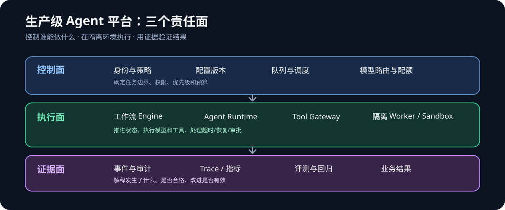
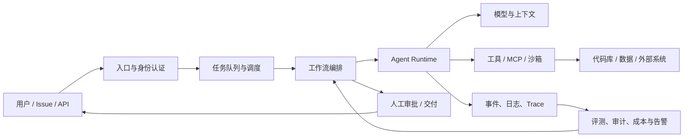
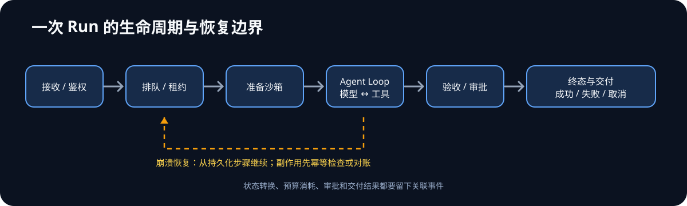
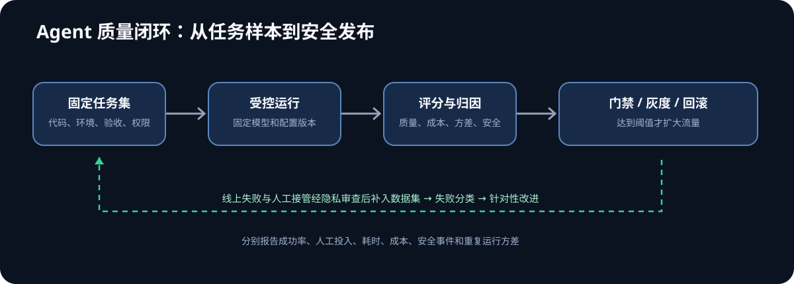

> 本文是一份 Agent 工程知识总纲，目标是把“能跑一个 Agent”推进到“能让 Agent 系统在真实任务中稳定运行，并能证明它有效”。它覆盖架构、运行、验证、治理和业务结果；具体框架的 API 与云产品参数应以对应版本的官方文档为准。

## 先看全貌：生产级 Agent 系统是什么

生产级 Agent 不是一个模型调用循环，而是一套围绕任务运行的系统。模型负责在有限上下文中提出下一步行动；平台负责验证、执行、记录和约束这些行动；用户或业务系统负责定义什么结果才算完成。

先把系统划分成三个边界：

1. **控制面**：身份、策略、配置版本、模型路由、配额、队列和工作流定义。它决定谁可以发起什么任务，以及任务如何调度。
2. **执行面**：Run Controller、Agent Runtime、工具网关、Worker 和沙箱。它在受限环境中推进任务，并把状态写回持久化存储。
3. **证据面**：事件、Trace、审计、评测结果、成本和业务指标。它回答任务发生了什么、是否合格、出了问题如何追查。





一个典型 Coding Agent 任务会经过：接收 Issue、检查权限、创建隔离工作区、读取代码和约束、调用模型规划、执行工具、运行测试、整理证据、等待必要审批、创建 PR，最后记录结果。任务可能持续数分钟甚至数小时，中间会遇到模型超时、工具异常、用户取消、机器重启和预算耗尽。因此，系统设计必须覆盖任务全生命周期，而不只是“模型返回了答案”。

### 能力层次：知道、会做、做过生产、能负责

| 层级 | 证据 | 例子 |
|---|---|---|
| 知道 | 能说清概念、适用范围和风险 | 解释幂等、工具权限和离线评测 |
| 会做 | 独立完成可复现实验或功能 | 实现可恢复的 Agent Run，跑固定任务集 |
| 做过生产 | 真实用户持续使用，处理过故障和回归 | 有任务量、成功率、接管率、事故复盘 |
| 能负责 | 能做架构取舍、设指标、推动协作并承担结果 | 设计多租户平台并对质量、成本和业务价值负责 |

“做过生产”不是部署到一台服务器就算。它意味着有真实使用、有运行数据、有故障处理、有变更回归，也知道系统在哪些情况下应该拒绝执行或交给人。

## 1. Agent Runtime：把模型循环变成可管理的任务执行

### 1.1 Runtime 的边界

Agent Runtime 是一次 Agent 运行的执行环境与控制层。它负责把输入、上下文、模型、工具和状态组织成受控循环，直到任务成功、失败、被取消或达到限制。

一次基础循环如下：

```text
接收输入与权限上下文
  → 构造模型请求
  → 解析模型输出（最终答复或工具调用）
  → 校验工具参数与权限
  → 执行工具并记录结果
  → 更新任务状态和上下文
  → 继续循环，直到终止条件成立
```

Runtime 应明确区分“模型建议做什么”和“平台允许执行什么”。模型输出不是授权凭证；任何读写工具都需要由 Runtime 按用户、租户、任务和资源范围再次鉴权。

### 1.2 一次 Run 的完整生命周期

Run 是有身份、有边界、有预算、有结果的一次任务尝试。一次用户目标可能因为重试或人工修复而有多个 Run；不要把“业务任务”和“某次执行尝试”混成一个对象。

```text
创建请求 → 鉴权/策略检查 → 排队 → 分配 Worker → 准备沙箱
   → 运行 Agent Loop ↔ 调用模型/工具
   → 验收与风险检查 → 成功/等待审批/失败/取消/超时
   → 保存交付物 → 清理资源 → 汇总指标与审计
```



建议区分以下对象：

| 对象 | 生命周期 | 应保存的核心字段 |
|---|---|---|
| Task | 用户希望完成的业务目标 | 来源、需求、仓库/资源、验收条件、发起者 |
| Run | 对 Task 的一次执行尝试 | 状态、配置版本、模型、预算、起止时间、终止原因 |
| Step | Run 中可观察、可重试或可审批的工作单元 | 类型、输入/输出引用、状态、尝试次数、耗时 |
| Event | 状态变化或重要事实的追加记录 | 序号、时间、主体、事件类型、关联对象、脱敏载荷 |
| Artifact | 运行产生的文件或交付物 | 内容摘要、存储位置、访问策略、来源 Step |

将大块日志和工作区快照放对象存储，以不可变引用关联 Run；关系数据库保存状态与索引。不要把完整代码 diff、长模型输出和二进制文件塞入运行状态行。

### 1.3 Runtime 的核心部件

| 部件 | 责任 | 关键设计问题 |
|---|---|---|
| Run Controller | 创建、推进、取消和终止一次运行 | 状态转换是否合法？谁能取消？ |
| Model Adapter | 统一模型请求、流式输出、工具调用和错误 | 超时、限流、模型差异如何处理？ |
| Context Builder | 选择并组织提示词、历史、检索资料和工具说明 | 如何限制 token、隔离不可信内容？ |
| Tool Gateway | 校验 schema、权限、配额并分发工具调用 | 写操作是否需要审批？如何防止重放？ |
| State Store | 保存 Run、步骤、事件和检查点 | 进程重启后能否恢复？状态如何迁移？ |
| Execution Sandbox | 隔离运行代码、浏览器或命令 | 文件、网络、密钥、CPU 和内存边界是什么？ |
| Observability | 记录结构化事件、指标、Trace 和审计 | 能否重建因果链？敏感数据如何脱敏？ |

### 1.4 状态机、事件与恢复

不要只把运行状态存成一个 `running=true/false`。至少为任务定义清晰的状态机，例如：

```text
queued → running → waiting_approval → running → succeeded
                  ↘ retrying ↗       ↘ failed / cancelled / timed_out
```

每次状态转换都应有可检查的前置条件，并写入事件记录。建议保存：Run ID、任务输入摘要、配置和提示词版本、模型版本、工具调用、步骤结果、预算消耗、错误分类、检查点和终止原因。事件用于审计和重建过程；检查点用于从安全边界继续运行。二者用途不同，不能只留一份最终对话文本。

恢复时要区分：

- **可安全重试**：只读请求、带幂等键的操作，或明确没有副作用的步骤。
- **需要对账**：请求可能已在下游成功，但本地没收到响应。先查下游状态，再决定是否重试。
- **不能自动重试**：不可逆外部副作用、资金或权限变更等高风险步骤，应暂停并要求人工处理。

幂等键应覆盖业务任务与操作身份，例如 `run_id + step_id + operation`。只按 HTTP 请求 ID 去重，无法阻止同一业务动作在重试时重复发生。

检查点需要放在语义安全的边界，例如“工具调用已完成且结果已持久化”，而不是任意一段对话文本之后。若在工具执行完成、结果还没写入状态库时进程崩溃，重启后系统无法知道副作用是否发生。这种不确定窗口需要由下游幂等键、查询对账或人工确认来解决。

| 故障位置 | 恢复动作 | 需要防范的问题 |
|---|---|---|
| 调用模型前 | 从当前步骤继续 | 请求重复、上下文版本变化 |
| 模型响应后、尚未执行工具 | 保存响应或重发请求 | 采样结果变化、重复费用 |
| 工具执行中 | 按工具语义查询/重试/转人工 | 下游已成功但本地超时 |
| 工具成功、结果未落库 | 使用幂等键查询结果 | 重复写入或重复发布 |
| 等待审批 | 持久暂停，审批事件到达后恢复 | 审批过期、参数被替换 |
| Worker 被终止 | 租约过期后由新 Worker 接管 | 两个 Worker 同时执行 |

Worker 领取任务时可使用带过期时间的租约。续租失败的旧 Worker 必须停止写入；数据库条件更新或 fencing token 可以阻止失去租约的进程覆盖新执行者的状态。租约本身不能撤销已经发出的外部副作用，因此副作用仍需幂等保护。

### 1.5 限制循环和资源

每个 Run 都要有明确预算：最大步骤数、墙钟时间、模型调用次数、输入输出 token、工具调用次数、并发数、CPU/内存、网络访问范围和金钱成本。达到限制时要有确定行为：安全终止、降级、请求用户补充信息，或转人工；不能无限循环或静默超支。

常见防护包括重复工具调用检测、相同状态循环检测、指数退避和抖动、熔断、请求取消传播、模型与工具级超时、队列背压。重试策略必须设置总预算，避免瞬时故障引发重试风暴。

### 1.6 会话上下文不等于长期记忆

短期上下文用于当前 Run 的推理，长期记忆用于跨 Run 保留经过授权、经过筛选的信息。把所有历史直接塞回上下文会增加费用、噪声和隐私风险。上下文构建应显式决定：系统规则、任务输入、可信业务数据、检索资料、历史摘要、工具定义各自的边界和优先级。

上下文预算需要为模型输出和工具结果留空间；检索结果应带来源与时间；工具返回内容和用户内容都视为不可信数据，不能让它们覆盖系统指令。压缩历史时保留决策、未完成事项、关键证据和引用，而不是只保留一段无法核对的自然语言总结。

### 1.7 工具执行与隔离

工具调用的安全边界至少包括：JSON/schema 校验、身份与资源授权、租户隔离、速率和成本限制、审计记录、超时与取消。工具风险可以分级：只读、可逆写入、不可逆或外部副作用。高风险工具应采用最小权限、人工审批和执行后核验。

执行不可信代码时，进程隔离不等于完整沙箱。要检查文件系统、网络出口、凭证注入、容器逃逸面、CPU/内存/运行时限额和清理策略。密钥尽量通过短期凭证或受控代理提供，避免写入提示词、日志、环境快照和 Agent 可读文件。

延伸阅读：[Agent Runtime 详解]()、[Agent 沙箱选型指南]()、[Agent Run 流式协议]()。

## 2. 工作流、调度与交付

### 2.1 工作流与 Agent Loop 的区别

Agent Loop 是一次运行内部“观察—推理—行动”的循环。工作流是更高层的业务过程，规定多个步骤、条件、并行分支、人工检查和失败补偿如何衔接。调度器负责何时、在哪个执行资源上启动工作；队列负责缓冲和分发工作。它们相关，但不是同一个组件。

适合用确定性工作流的部分：权限检查、测试、审批、发布、通知、数据迁移。适合交给 Agent 判断的部分：从 Issue 提取意图、探索代码、提出修改方案、解释失败。把所有步骤都交给模型，会让本应确定的控制流程变得不可预测。

### 2.2 工作流的基本要素

- **触发器**：Issue、Webhook、定时任务、API 请求或人工启动。
- **步骤与依赖**：顺序、并行、条件分支、循环和子流程。
- **状态**：每步输入、输出、版本、开始结束时间和执行结果。
- **等待点**：人工审批、外部事件、限流恢复或长时间等待。
- **失败策略**：重试、补偿、回滚、暂停、转人工或终止。
- **版本**：流程定义和执行中的 Run 使用哪个版本；升级如何兼容旧 Run。
- **可见性**：用户能看到进展、暂停原因、待审批动作和最终证据。

对长任务，应将工作流状态持久化，不能依赖一个常驻进程的内存。工作进程可随时被替换；任务恢复依靠数据库、事件日志、队列和明确的步骤边界。

### 2.3 如何选择同步执行、队列与持久化工作流

| 执行方式 | 适合场景 | 主要代价 | 必须考虑 |
|---|---|---|---|
| 同步请求 | 几秒内完成、没有长等待、失败可以直接返回 | 请求连接占用、超时传播复杂 | 网关超时、客户端断线、取消语义 |
| 队列 + Worker | 异步任务、需要削峰和并发控制 | 需要状态查询和结果通知 | 重复投递、死信、背压、公平调度 |
| 持久化工作流引擎 | 长任务、等待审批、多步骤副作用、跨小时恢复 | 状态模型和版本治理更复杂 | 历史兼容、活动超时、重放确定性 |

不要为“可能以后会很复杂”先引入重量级引擎。先根据任务时长、恢复要求、等待点和副作用数量选型；一旦需要长时间等待、可靠恢复和人工审批，内存里的简单队列通常就不够了。

### 2.4 工作流定义应版本化

每次执行开始时固定工作流版本、工具策略版本、提示词版本和模型路由版本。运行中的流程不要被新配置静默改变。升级策略通常有三种：让旧 Run 按旧版本继续；提供显式迁移函数；或安全暂停旧 Run 并由人工决定。修改审批条件、权限规则或数据格式时，要把迁移纳入发布评审。

工作流活动应有确定的输入输出契约。活动可以是普通服务函数，也可以是 Agent 子任务；Agent 子任务也要有超时、预算、输入范围、验收条件和明确的失败结果。

### 2.5 幂等、补偿和人工门禁

队列通常提供至少一次投递，因此消费者必须假设同一消息会重复到达。通过 Run/Step 唯一键、状态条件更新和下游幂等键实现去重。若一个流程包含多个外部副作用，数据库事务通常无法覆盖所有系统；应采用 Saga 思路，为已完成步骤定义补偿操作，或在失败时暂停并人工对账。

人工审批不是弹窗装饰，而是流程中的持久状态。审批记录应绑定具体动作、目标资源、参数摘要、发起者、审批者、时间和策略版本；动作内容发生变化时，旧审批不能自动复用。审批通过后仍要再次检查授权和资源状态。

### 2.6 Coding Agent 示例工作流

```text
接收 Issue
→ 校验来源、仓库权限、预算和任务类型
→ 创建 Worktree / 沙箱并固定基线提交
→ Agent 分析并制定计划
→ 按权限执行代码和工具操作
→ 运行单测、集成测试和静态检查
→ 归纳差异、测试输出和风险
→ 人工审查高风险变更
→ 创建 PR 并等待 CI
→ 汇总结果、清理资源、记录指标
```

每个阶段都应有输入契约、输出契约和超时。Agent 未完成任务时，系统要能给出明确失败原因，而不是制造一个看似成功的空 PR。验证步骤失败时，工作流应保留工作区和证据，方便继续修复或人工接管。

### 3.1 软件测试与 Agent 评测分别验证什么

| 类型 | 要回答的问题 | 例子 |
|---|---|---|
| 单元测试 | 单个函数和状态转换是否正确？ | 重试计数、权限判定、序列化 |
| 集成测试 | 模型、工具、存储和队列接口能否协作？ | Tool Gateway 与沙箱联调 |
| 端到端测试 | 从入口到交付的链路是否跑通？ | Issue 到 PR 的真实流程 |
| 可靠性测试 | 故障后是否可恢复、是否会重复副作用？ | 杀进程、断网、超时、重复消息 |
| Agent 评测 | Agent 对一组任务完成得如何？ | 修改正确性、验收测试、成本和时间 |
| 安全测试 | 是否越权、泄露、受注入影响或逃出隔离？ | 提示注入、恶意仓库内容、网络探测 |

传统测试主要验证程序行为；Agent 评测验证一组可变模型行为。二者需要共同构成发布门禁，不能用单元测试覆盖率替代任务成功率。

### 3.2 测试金字塔和发布门禁

越靠近底层的测试运行越快、越稳定，适合高频执行；端到端和真实模型测试更接近用户结果，但运行成本更高、方差也更大。推荐的门禁组合：

1. 每次提交：格式、静态检查、单元测试、权限和状态机测试。
2. 合并前：集成测试、工具契约测试、少量端到端 Smoke 用例。
3. 模型/提示词/工作流变更：固定 Agent 回归集和安全用例。
4. 发布候选：多次重复运行关键任务、容量检查、故障注入与人工抽查。
5. 上线后：小流量灰度、监控任务质量和成本，达到停止条件时回滚配置或关闭高风险工具。

端到端测试不要依赖无法控制的实时模型响应来断言每个 token。可以在不同层次使用固定响应模拟器验证协议，在隔离评测环境中调用真实模型验证整体表现，并为每层分别设定通过标准。

### 3.3 建立可信的任务 Benchmark

每个评测用例至少固定：任务描述、仓库和提交版本、环境、工具权限、模型与提示词版本、预算、验收标准、参考结果或自动评分器。用例应覆盖正常路径、边界输入、工具失败、模糊需求和安全风险。数据集要记录来源、许可、隐私处理和修改历史。

对于 Coding Agent，验收可组合使用：隐藏测试、公开测试、静态分析、差异范围检查、构建成功、人工代码审查和任务说明一致性。测试必须在干净环境中从固定基线执行，不能接受 Agent 修改测试来“证明”自己正确。对于开放式任务，先由领域专家写评分 rubric，再通过盲评样本校准自动评分器。

指标至少分四组：

1. **结果质量**：验收测试通过率、功能正确性、缺陷率、回归率。
2. **交付效率**：端到端时间、首次成功时间、人工接管率、返工次数。
3. **资源消耗**：模型调用次数、token、工具时间、单任务成本。
4. **安全与可靠性**：越权率、敏感信息泄露率、恢复成功率、重复副作用率。

成功定义必须先写清楚。例如，代码“有 diff”不等于任务成功；只有满足验收、未破坏现有功能、成本在预算内且没有越权才可计为成功。LLM-as-judge 可补充主观质量判断，但评分器也会偏差，应抽样人工校准，并保留可重复的客观检查。

### 3.4 方差、回归与线上反馈

模型采样会导致同一用例多次运行结果不同。关键用例应重复运行，报告均值、区间和失败分布；样本较小时不要把细微涨幅包装成确定提升。修改模型、系统提示、工具 schema、检索、Runtime 或工作流后，运行同一套回归集，并按预先设定的质量、安全、延迟和成本门槛决定是否发布。

线上评估需要关注分布漂移：真实用户任务可能超出离线集合。记录失败类型和人工接管原因，经隐私审查后抽样补充到评测集；防止只收录 Agent 容易完成的任务。可采用影子运行、有限灰度和 A/B，但要避免把高风险动作直接交给实验组。

### 3.5 失败分类与实验设计

失败应按可行动的原因分类，而不是只记“模型失败”：需求解析错误、上下文缺失、计划不完整、工具选择错误、参数无效、权限拒绝、环境不一致、测试没有发现缺陷、结果总结失真、预算耗尽、用户取消等。分类要能落到改进手段，并允许多个原因共同存在。

比较两个 Agent 版本时，固定任务集和执行环境，记录模型、提示词、工具、Runtime、采样参数和数据版本。一次只改变少数变量；否则即使成绩变化，也无法知道原因。报告总成功率之外的分任务类型表现、失败类别、成本和方差。避免只挑容易提升的任务或在看过测试答案后反复调到过拟合。

### 3.6 故障注入和发布验证

主动模拟模型 429/5xx、工具超时、队列重复投递、数据库不可用、进程被杀、沙箱耗尽、用户取消和预算超限。验证的不只是“报警响了”，还包括：Run 状态是否正确、重试是否受控、用户能否理解当前状态、恢复后是否重复副作用、审计证据是否完整。

发布后用 SLO 判断系统是否健康。可为入口可用性、任务排队时间、任务完成率、恢复时间和安全事件设置服务目标；当错误预算耗尽，应暂停高风险变更，优先修复可靠性问题。



## 4. 可观测性、审计与事故响应

### 4.1 三种记录各自回答什么

- **日志**：某个组件发生了什么，适合诊断具体错误。
- **指标**：整体趋势和服务健康度如何，适合告警与容量规划。
- **Trace**：一次任务跨模型、工具、队列和服务的因果链是什么。
- **审计事件**：谁或哪个 Agent 在什么授权下，对哪个资源做了什么动作，结果如何。

一次 Agent Run 的 Trace 应贯穿排队、Runtime、模型请求、工具调用、测试、审批和交付。每个 Span 记录耗时、状态、版本和必要的成本信息。提示词和完整输出可能含有敏感数据，不应无条件写入通用日志；采用访问控制、脱敏、保留期限和按需取样。

可把每个 Run 的关联标识统一起来：`task_id` 关联业务目标，`run_id` 关联一次尝试，`step_id` 关联工作流步骤，`trace_id` 关联分布式调用链。不要把用户邮箱、原始 Issue 文本等个人或敏感信息直接放入指标标签，避免高基数和隐私泄漏。

建议先建立以下运行指标：

| 指标 | 关注点 |
|---|---|
| 入队数、排队时长、队列深度 | 是否积压、调度是否公平 |
| 活跃 Run、完成/失败/取消数 | 执行容量和终止原因 |
| 模型请求成功率、限流率、延迟 | 供应商健康与路由表现 |
| 工具调用成功率、超时率 | 工具可靠性和参数质量 |
| 每 Run Token、成本、沙箱时长 | 成本上限与优化空间 |
| 人工审批等待、人工接管、返工 | 产品可用性与人力负担 |

SLO 要对应用户能感知的结果。例如“99% 的任务在 30 秒内开始执行”比“Worker CPU 低于 80%”更接近服务承诺。Agent 的任务成功率受任务类型影响，需要分层统计；只报全局均值会掩盖某类任务严重退化。对于低频高风险安全事件，可采用绝对告警和人工升级，而不是等待统计显著性。

### 4.2 事故闭环

事故处理要能完成发现、止损、恢复、根因分析和预防。复盘聚焦系统条件，不止写“模型犯错”：是权限过宽、验收标准缺失、重试导致副作用、上下文截断、部署变更回归，还是用户操作不清楚？每个行动项都要有负责人和可验证的完成标准。

事故响应手册至少说明：如何停止新 Run、如何取消正在运行的 Run、如何撤销/轮换凭证、如何封禁工具或模型路由、如何保留证据、如何恢复队列和数据、谁负责通知用户。定期演练这些操作；紧急按钮如果从未演练，不能视为可用控制。

延伸阅读：[Agent Tracing 基础]()、[Agent 决策审计]()。

## 5. 安全与治理：让 Agent 的权限可控、行为可追溯

### 5.1 威胁边界

把用户、模型、工具、检索内容、代码仓库、浏览器页面、MCP 服务和外部 API 都纳入威胁模型。攻击者可能通过直接提示、文档/网页中的间接提示注入、恶意依赖、伪造工具输出或被盗凭证影响 Agent。模型输出本身也可能错误或越权。

风险至少包括：提示注入、数据泄露、工具越权、命令执行、供应链攻击、跨租户访问、凭证暴露、拒绝服务和不可逆副作用。每种风险要写明资产、攻击路径、影响、预防、检测和应急处置。

### 5.2 控制原则

- **最小权限**：按用户、Run、仓库和操作发放短期、细粒度权限。
- **明确授权**：模型不能通过自然语言自行扩大权限。
- **输入分区**：系统指令与不可信内容分开，并把检索和工具结果标为数据。
- **外部副作用门禁**：删除、发布、付款、权限修改等动作默认需审批或受严格策略控制。
- **网络与文件隔离**：限制沙箱出站访问和挂载路径，防止读取宿主凭证。
- **审计和响应**：保存必要的动作证据，支持撤销凭证、停用工具和终止 Run。
- **自动化红队回归**：把已发现的攻击模式加入回归集，确保修复不会退化。

提示词防护只能作为一层，不能替代工具授权、沙箱、网络限制和人工控制。对高影响操作，应使用确定性策略在模型之外实施。

### 5.3 威胁建模工作表

对每项重要能力，可以按“资产—主体—入口—动作—影响—控制—证据”建立威胁记录：

| 场景 | 可能路径 | 必要控制 | 验证证据 |
|---|---|---|---|
| 仓库中的恶意指令诱导 Agent 外传密钥 | Agent 读取 README 后调用网络工具 | 密钥不暴露给模型；网络出口白名单；工具授权 | 注入回归用例、网络拒绝日志 |
| 两租户共享缓存返回彼此结果 | 缓存键没有租户/权限维度 | 租户隔离键、授权后读取、敏感结果不共享 | 跨租户负向测试 |
| 重试重复创建外部资源 | 下游成功但响应丢失 | 幂等键、状态查询和对账 | 断网故障注入与副作用计数 |
| 沙箱读取宿主凭证 | 目录挂载或环境变量泄露 | 最小挂载、短期凭证代理、无特权容器 | 沙箱逃逸测试和配置审查 |
| 审批后内容被替换 | 审批只绑定 Run 而不绑定参数 | 对规范化动作摘要签名/绑定，执行前复核 | 参数篡改测试与审计记录 |

不要把威胁模型当成一次性表格。新工具、新数据源、新租户共享能力和权限变更都可能引入新的攻击路径；安全测试应跟随架构变化持续更新。

## 6. 模型、RAG 与上下文工程

### 6.1 工程岗位需要的模型深度

Agent 平台工程师不必训练大参数基座模型，但应理解 Transformer 如何基于上下文计算下一个 Token、Tokenization 与上下文窗口对输入长度的影响、推理调用的延迟与成本、结构化输出和 Tool Use 的失败模式、采样参数、模型版本变化以及模型能力边界。无需成为训练算法专家，但应能和算法团队一起定义任务、数据、评价器和实验设计。

工程上要把模型看成带有能力、价格、延迟、上下文长度和服务等级属性的依赖，而不是一个永远稳定的纯函数。模型升级、供应商切换、系统提示调整和推理参数修改都属于影响行为的变更，需要版本记录与回归验证。

可逐步掌握：

1. **模型路由**：根据任务难度、延迟、隐私和预算选择模型；失败时有受控降级策略。
2. **RAG**：文档解析、切分、索引、召回、重排、引用和检索质量评估。
3. **上下文工程**：按任务装配信息，控制噪声、冲突、长度和可信度。
4. **推理部署**：理解吞吐、并发、批处理、KV cache、量化和服务弹性等核心取舍。
5. **微调实验**：能完成一次有基线、有独立测试集、有版本记录的 LoRA/SFT 实验。

是否微调，应由失败分析决定。知识频繁变化通常应先更新检索数据；工具调用失败可能需要改 schema、示例或 Runtime；只有在行为模式稳定、数据合规且收益可测时，才考虑训练。训练集和测试集必须隔离，避免把测试答案泄漏进训练。

### 6.2 RAG 的质量链

RAG 不是“接向量数据库”。需要分别评估解析与切分质量、召回率、排序、答案忠实度、引用准确性、时效性和访问控制。权限过滤要在检索阶段生效，不能先取出不该访问的内容，再指望模型不复述。对每个答案保留来源片段，方便验证与审计。

检索阶段可用 Recall@k 检查相关片段是否进入候选集，用 MRR 或 nDCG 检查相关结果是否排在前面；生成阶段则检查答案是否由证据支持、引用是否指向正确段落、证据不足时是否正确拒答。检索和生成要分开诊断：答案错了，不一定是模型不会总结，也可能是解析漏页、切分破坏语义、过滤器误删或重排器排序失误。

### 6.3 成本和延迟

完整任务成本包括模型 Token、工具/沙箱计算、检索、存储、网络和人工处理。使用小模型处理分类、提取等简单步骤，大模型处理复杂推理；结合缓存、上下文裁剪、并行化和预算上限。缓存键要考虑租户、权限、模型与提示词版本、数据时效，避免跨用户泄漏或返回过期结果。

跟踪端到端延迟及 p50/p95/p99，而不只看模型首 Token 时间。对于长任务，可将用户感知拆成排队时间、首次进展时间、人工等待时间和总完成时间。

### 6.4 什么时候微调，什么时候不微调

| 观察到的问题 | 优先检查 | 可能的处理方式 |
|---|---|---|
| 答案缺少最新事实 | 数据是否进入检索、过滤是否正确 | 更新知识源、重建索引、改进引用验证 |
| 工具参数经常不合法 | Schema、示例、解析与错误反馈 | 收紧 schema、结构化输出、工具契约测试 |
| 任务经常漏步骤 | 工作流是否显式、上下文是否完整 | 拆分阶段、增加检查点、调整规划提示 |
| 领域表达风格不稳定 | 规范样例是否足够、评价目标是否清楚 | 提示词和样例优化；必要时评估微调 |
| 高难推理不稳定 | 任务是否超出模型能力、评测是否可诊断 | 模型升级/路由、工具辅助、问题降级或人工复核 |

只有当目标行为稳定、样本质量和授权合格、训练/验证/测试分离、推理成本与收益可量化时，微调才是合理候选。一次实验应保留基座模型、数据版本、训练配置、随机种子、评估集、结果和回滚方式；否则无法判断提升来自哪里，也无法复现。

### 6.5 SFT、偏好优化与 Agent 轨迹

- **SFT（监督微调）**：用高质量输入—目标输出示例训练模型模仿期望行为。数据要定义清楚角色、工具调用格式、成功终止和拒绝边界。
- **偏好优化（如 DPO）**：用偏好对表达“同一上下文下哪个结果更好”。偏好标注必须有一致标准；不能把安全拒绝错误地标成低质量答案。
- **Tool Use 训练**：不只训练工具名，还需要覆盖何时调用、参数如何组织、工具失败后如何修正、何时停止和何时询问用户。
- **Agent 轨迹数据**：包含任务、上下文、动作、工具结果、验证反馈和最终结果。轨迹必须检查权限、隐私、成功标签和失败原因，不能把“曾经执行过”当成“值得模仿”。

训练集和验证集按任务或来源隔离，防止同一个仓库、用户或模板的近重复任务跨集合泄漏。实验结果应与不微调的强基线比较，并同时评估任务质量、拒答、安全、工具调用、延迟和部署成本。

## 7. 分布式执行与多租户平台

从单机原型走向平台，主要增加的是故障域、隔离和控制面复杂度，而不是简单地把服务多开几份。

### 7.1 参考架构和数据边界

典型组件包括 API/控制面、任务队列、调度器、无状态 Worker、状态数据库、对象存储、模型网关、沙箱池和可观测性管道。控制面管理配置、身份、配额和策略；数据面执行具体 Run。运行状态应持久化，Worker 尽可能可替换。

多租户需逐层隔离：身份与数据行、队列和配额、密钥、检索索引、文件/沙箱、Trace 查看权限及缓存。任何一个共享层都要验证租户边界。限流和公平调度可避免一个租户占满模型额度或 Worker。

### 7.2 可靠性和扩展

- 队列削峰并提供背压；消费者处理重复投递。
- Worker 水平扩展，但受模型并发、沙箱容量和租户配额约束。
- 数据库使用事务和版本化迁移；可再生成的索引与不可丢失的原始任务数据分开治理。
- 对模型供应商、队列和存储故障定义降级、重试、隔离和恢复策略。
- 设定容量指标和成本预算；压测排队、吞吐、尾延迟与恢复能力。
- 通过备份恢复演练验证数据可恢复，而不是只确认备份任务成功。

先收集真实负载和瓶颈，再引入分布式组件。对个人原型，过早引入复杂微服务会增加运维面，却未必增加用户价值。

### 7.3 容量规划与压测

Agent 工作负载通常是长短任务混合、下游调用扇出明显、资源占用差异很大。容量规划不能只按 API 请求/秒估算，还要测每个 Run 的平均/高分位模型调用次数、工具并发、沙箱占用时长、人工等待和结果存储量。

压测至少覆盖：稳定负载下的吞吐、突发负载下的排队与背压、慢模型造成的并发占用、某租户大量任务时的公平性、数据库/队列故障时的退化行为，以及恢复后队列是否能在目标时间内清空。高并发不一定等于高有效吞吐；如果模型供应商限流，继续增加 Worker 只会堆积更多等待任务。

### 7.4 数据治理与隐私生命周期

为 Run 输入、模型请求/响应、工具输出、代码快照、Trace 和评测样本分别定义数据分类、访问角色、加密方式、保留期限和删除路径。默认只记录诊断所需的摘要和引用；确需存原文时应明确用途、访问审批和保留时间。用户删除任务时，要识别对象存储、缓存、搜索索引、分析副本和备份中的数据如何按策略删除或到期。

评测数据尤其容易混入客户代码和个人信息。对外公开 Benchmark 前要审查许可、机密、凭证、版权和重识别风险，并提供数据来源与清理说明。

## 8. 真实试点与业务结果

### 8.1 先定义任务边界

挑选频繁、可验收、风险可控、节省时间可测的任务类型，例如测试补全或低风险 Bug 修复。明确不支持的任务、用户需要提供的材料、所需权限、人工检查点和失败退路。不要一开始就承诺“Agent 自动完成所有研发工作”。

### 8.2 建立基线和试点协议

试点前记录当前人工流程的完成时间、返工率、缺陷率和直接成本；约定试点持续时间、参与团队、任务范围、数据权限、成功门槛和停止条件。记录所有任务，包括失败、放弃和人工接管，避免只展示成功样例。

推荐对比：

| 指标 | 定义示例 | 使用注意 |
|---|---|---|
| 任务成功率 | 满足预设验收条件的任务数 / 纳入任务数 | 固定任务范围，报告分母 |
| 人工接管率 | 需要人继续实质工作或纠正的任务比例 | 审批与接管分开统计 |
| 交付时间 | 从接单到验收的端到端时长 | 区分排队和人工等待 |
| 返工与回归 | 失败重跑、后续修复和引入缺陷 | 观察足够长时间 |
| 单任务成本 | 模型、工具、基础设施及必要人工成本 | 统一计算口径 |
| 用户持续使用 | 重复使用的团队/用户和任务量 | 注册数不等于持续采用 |

业务价值要和对照基线比较；“处理了 2000 个任务”本身不是收益证明。还需说明任务难度、人工参与、失败占比和结果质量。

### 8.3 反馈进入产品闭环

每次人工接管都应分类：需求不清、上下文缺失、模型规划错、工具不可用、权限不够、测试不充分、工作流设计差或用户不信任。优先修复重复出现且影响大的类别，并把修复转换为测试、策略或文档。外部案例和评价须取得许可，区分已验证结果与目标值。

### 8.4 试点结果的计算口径

定义一个可复核的“净节省时间”估算：

```text
净节省时间 = 人工基线时间
           - Agent 运行期间仍需投入的人工时间
           - 返工时间
           - 审核与运维分摊时间
```

将任务成功率与净节省时间一起看。若成功率上升但人工审查时间翻倍，整体收益可能为负；若平均节省明显但高风险错误增加，也不能简单判定成功。报告至少分任务类型、难度、模型版本和人工参与程度，并展示失败案例。

样本选择要避免偏差：纳入连续时间段内符合条件的任务，解释排除条件；记录用户拒绝交给 Agent 的任务，避免只测“最容易的那一类”。对照组尽量保持任务类型和人员经验相近，必要时采用分阶段上线，以区分季节、团队和学习效应。

## 9. 从能力地图到实践计划

建议按依赖关系推进，而不是同时造所有平台功能：

| 阶段 | 重点 | 可审查交付物 |
|---|---|---|
| 1. 定位与基线 | 选定窄任务，定义结果和成本指标 | 任务范围、基线、最小演示和用例集 |
| 2. Runtime 与评测 | 固定运行状态、工具边界、验收与回归 | 可恢复 Run、评测报告、失败分类 |
| 3. 真实试点 | 让小范围用户持续执行真实任务 | 试点协议、使用数据、反馈和事故记录 |
| 4. 平台化 | 按实际瓶颈建设队列、多租户、弹性和 SLO | 压测、故障演练、容量和成本报告 |
| 5. 治理与扩展 | 威胁模型、权限策略、审计和变更管理 | 红队回归、威胁模型、发布门禁 |
| 6. 影响力与负责 | 多团队采用、案例、协作和技术决策 | 可复现案例、设计决策、复盘和分享 |

一年内合理的成长目标通常是：Runtime、测试和工作流达到有真实生产经历；评测、安全和模型工程达到能独立设计、实现并解释取舍；分布式平台完成有证据的有限规模部署；团队领导力通过试点协作逐步积累。成熟的平台负责人能力需要更长的真实责任周期。

### 9.1 逐步推进的 12 个月路线

| 阶段 | 工作重点 | 阶段证据 |
|---|---|---|
| 第 1–2 个月：定位和基线 | 选一个高频、可验收任务；砍掉分散功能；为现有 Runner 建任务记录和版本信息 | 可安装演示、任务定义、基线数据、首批真实用户 |
| 第 3–4 个月：评测和模型 | 建立固定 Benchmark、失败分类、成本/成功率报表；完成路由或上下文实验 | 可重复评测、模型对比报告、回归门禁 |
| 第 5–7 个月：有限平台化 | 根据真实瓶颈加入队列、可恢复状态、多租户原型、压测和故障注入 | 架构决策记录、压测数据、恢复演练 |
| 第 5–8 个月：安全并行 | 做威胁模型、最小权限、沙箱边界、密钥治理和红队回归 | 威胁模型、策略测试、审计证据 |
| 第 2–9 个月：真实试点 | 持续收集用户任务、人工接管原因和业务结果 | 试点报告、用户反馈、事故/复盘记录 |
| 第 8–12 个月：放大影响 | 文档、公开案例、外部贡献、面试和技术方案表达 | 可复现项目、技术文章、案例证明和系统设计材料 |

时间表只是安排先后关系，不是必须按月完成的承诺。若试点尚未证明任务价值，就应该继续缩小任务和修复可靠性，不应因为路线图写着“平台化”而提前堆分布式组件。

### 9.2 试点规模目标如何使用

可以把“多个团队或持续用户、上千个真实任务、百例级 Benchmark、重复运行、故障演练、用户案例”等作为求职证据的参考目标，但这些数字不适用于所有产品。金融审批和代码自动修改的风险不同，任务难度、人工介入和质量标准也不同。更重要的是定义口径、报告分母和结果可复核。达到数量但没有质量、成本和用户价值证据，不等于生产成熟。

### 9.3 技术负责人能力如何形成

高级工程师和技术负责人不仅实现组件，还要为取舍负责：什么先做、什么明确不做；哪些任务允许自动执行；质量、成本、延迟和风险如何权衡；何时买服务、何时自建；出现事故时如何止损；多个团队的需求如何形成稳定接口。可以用轻量的架构决策记录（ADR）保存背景、备选方案、决定、代价和复核条件，让决策可讨论、可修订。

带人能力可从小范围试点开始：写清任务和验收，拆分工作，帮助同伴定位问题，做代码与设计评审，复盘交付偏差。衡量重点是团队能否持续交付和改进，而不是自己完成了多少代码。

### 9.4 把生产经验转成可信的职业证据

简历和面试中的生产案例应能回答：用户是谁、问题是什么、系统如何工作、你负责什么、规模和指标如何定义、遇到过什么故障、如何处理、哪些方案被放弃、结果有什么局限。每个数字都要能解释分母、时间范围和数据来源。

一个可信的案例表述应采用结构：

```text
背景与任务范围
→ 本人负责的架构/实现/推广
→ 约束与关键取舍
→ 验证方式和真实使用规模
→ 质量、效率、成本、安全指标变化
→ 失败、局限与下一步
```

避免声称“成功率提升 30%”却说不清基线、样本、版本和是否包含人工接管。工程能力的有力证据不仅是代码，也包括复现实验、事故复盘、设计决策、用户反馈和可公开的架构材料。

## 10. 生产就绪检查表

### 任务与用户

- [ ] 任务范围、拒绝条件、验收标准和人工接管路径明确。
- [ ] 有真实基线、固定成功定义和隐私处理规则。
- [ ] 用户能看到进度、暂停原因、预算和最终证据。

### Runtime 与工作流

- [ ] Run 状态、步骤状态、版本和事件可持久化。
- [ ] 超时、取消、重试、重复投递和进程崩溃经过验证。
- [ ] 副作用有幂等保护；无法确认结果时能对账。
- [ ] 资源、模型调用、工具调用和成本均有硬限制。
- [ ] 人工审批绑定具体动作与参数，流程升级不会错用旧审批。

### 测试与评测

- [ ] 有单元、集成、端到端、安全和故障注入测试。
- [ ] 固定评测集覆盖常见任务、边界、失败和攻击场景。
- [ ] 关键任务重复运行，报告方差、成本和失败类别。
- [ ] 模型、提示词、工具、数据和 Runtime 变更能触发回归门禁。
- [ ] 评分器经过人工抽检，测试集没有训练或提示泄漏。

### 安全与运维

- [ ] 身份、租户、仓库、工具和网络权限符合最小权限。
- [ ] 不可信代码在受限沙箱中运行，密钥不会进入模型上下文或日志。
- [ ] 日志、指标、Trace 和审计事件可关联并有保留策略。
- [ ] 有告警、停止运行、撤销凭证、恢复数据和事故复盘流程。
- [ ] 有容量、成本、延迟和服务目标，并经过演练。

### 业务证据

- [ ] 记录全部纳入任务、人工介入、失败、取消和成本。
- [ ] 与相同口径的人工基线比较质量、时间和成本。
- [ ] 结果由试点用户确认；公开案例获得许可并注明范围。

## 11. 常见误区

1. **把能调用模型当成 Runtime。**缺少状态、预算、权限、取消和恢复，仍只是 Demo 循环。
2. **把 Agent 评测等同于单元测试。**代码可以测对，任务仍可能做错；要分别验证软件和 Agent 行为。
3. **把工作流做成全由模型决定。**权限、审批、测试和发布等控制步骤应由确定性策略执行。
4. **把重试当可靠性。**没有幂等和对账的重试会放大副作用。
5. **把 Trace 当审计。**Trace 解释技术调用链，审计还要说明主体、授权、对象和动作结果。
6. **先做多租户和微服务再找用户。**先证明任务价值和负载，再按瓶颈扩平台。
7. **只报成功任务和模型分数。**要报告分母、人工投入、方差、成本、安全和后续缺陷。
8. **把微调当作所有失败的解法。**先归因问题来自数据、提示、工具、流程还是模型，再选手段。

## 延伸阅读

- [Agent 工程实战：从 Demo 到生产]()
- [Agent Runtime 详解]()
- [AI Agent Loop 工程]()
- [LangGraph 实战教程]()
- [Agent 用户记忆与 Skill 沉淀]()

本文是领域知识入口，不替代针对特定技术栈的操作手册。后续可将 Runtime、评测、工作流、安全和平台运营分别扩展为专题，并在这里维护它们之间的关系、实践顺序与生产验收标准。
