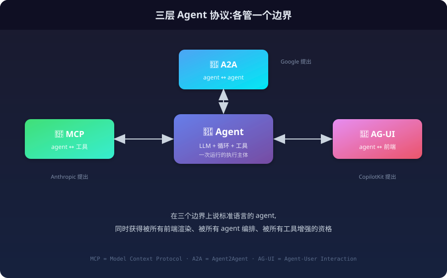
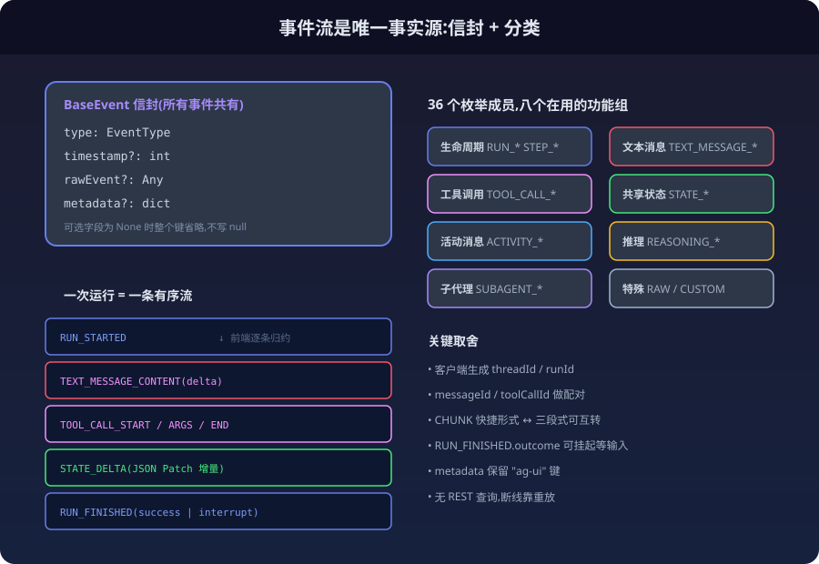
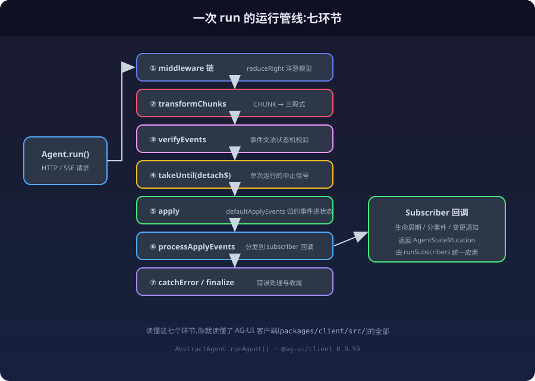
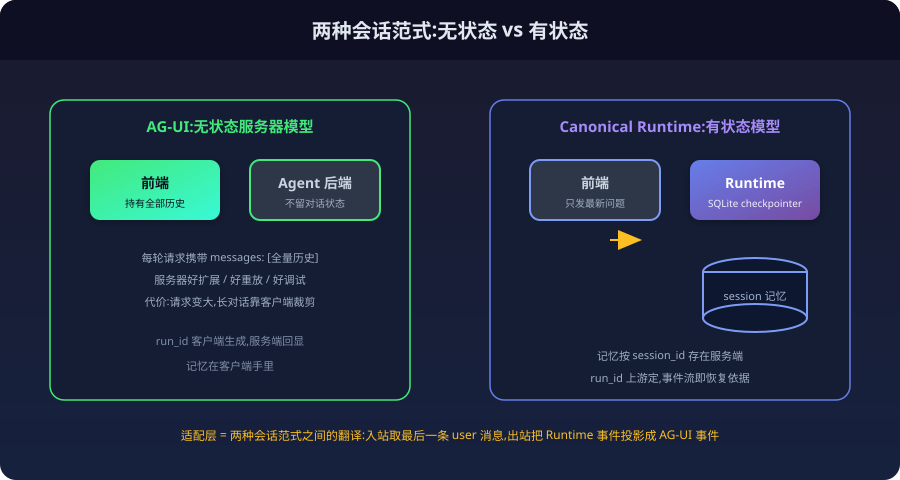

最近在给自己的 Agent Runtime 设计输入输出契约时，我在 README 里画了一张三方对照表：我定义的事件类型一列、Runtime 原生事件一列，第三列空着——那是留给 [AG-UI](https://github.com/ag-ui-protocol/ag-ui) 的。填完这张表之后我发现，AG-UI 值得不只是一列，它值得被完整讲一遍。为了写这篇文章，我把官方仓库、Python SDK 源码和 PyPI/npm 的发布记录都翻了一遍，下面带着版本号讲。

## 先看仓库现状（2026-09-10）

先把事实钉住，本文所有描述都对应这个版本：

| 项 | 值 |
|---|---|
| 仓库 | [`github.com/ag-ui-protocol/ag-ui`](https://github.com/ag-ui-protocol/ag-ui)，创建于 2025-05-07 |
| 文档 | [docs.ag-ui.com](https://docs.ag-ui.com/)（draft spec + SDK 参考） |
| 热度 | **15.8k stars / 1.4k forks**，MIT License |
| 本文对应 commit | `main@5f32a64ee999`（2026-09-09） |
| Python SDK | [`ag-ui-protocol`](https://pypi.org/project/ag-ui-protocol/) **0.1.22**（PyPI，2026-08-31 发布，首版 0.1.4 于 2025-04-30） |
| TypeScript SDK | [`@ag-ui/core`](https://www.npmjs.com/package/@ag-ui/core) 及 client/encoder/proto 系列 **0.0.59**（npm latest，另有 canary/alpha 通道） |
| 发布节奏 | 几乎**每日**切一次 release（2026-08-20 到 09-09 切了 5 个），协议仍处 draft 阶段 |

Python 包只依赖 `pydantic>=2.11.2`，一个依赖，克制得不像一个协议实现。

## 三层协议的最后一块

把 2024-2026 这两年 agent 协议的版图摊开，会发现一个很规整的分层：

- **MCP**（Anthropic）：agent ↔ 工具。让模型能标准地"伸手拿东西"。
- **A2A**（Google）：agent ↔ agent。让多个 agent 标准地互相委派任务。
- **AG-UI**（CopilotKit）：agent ↔ 前端。让 agent 的运行过程标准地"演给用户看"。

前两层这几年讨论得足够多了，第三层却长期处于"每家自己造"的状态：LangGraph 自己定义 stream mode，OpenAI Assistants 自己定义 run steps，各家 ChatUI 各自解析各家的事件格式。你写一个 agent 后端，想换个前端，事件层的适配就得重写一遍；你写一个聊天前端，想接不同的 agent，每种 agent 的 SSE 格式都得单独处理。

AG-UI 的野心就是把这层标准化掉。它不是委员会里设计出来的协议——它是从 CopilotKit 这个产品里长出来的：CopilotKit 做了几年"把 agent 嵌进 React 应用"这件事，攒够了事件类型的实战样本，回头把内部格式提炼成了开放协议，初始合作伙伴是 LangChain（LangGraph）和 CrewAI。这一点从仓库结构里看得见：`integrations/` 目录下有 21 个条目——18 个框架适配层、2 个 server starter 模板加一个 community 目录；`apps/` 里挂着 dojo（官方演示站）和一个 CLI 示例应用。



## 仓库解剖：一个协议 monorepo 长什么样

官方仓库是一个 pnpm + nx 的 monorepo，顶层结构本身就是协议生态的切片：

```
ag-ui/
├── sdks/
│   ├── python/          # ag-ui-protocol 0.1.22 (core + encoder)
│   ├── typescript/      # @ag-ui/core|client|encoder|proto 0.0.59 + cli
│   ├── dotnet/          # 官方 .NET SDK
│   └── community/       # dart / rust / ruby / c++ / kotlin / go / java ...
├── integrations/        # 20 个框架适配层(见后文生态一节)
├── middlewares/         # a2a / a2ui / mcp / mcp-apps / event-throttle
├── apps/                # dojo(官方演示) + client-cli-example
└── docs/                # 文档源
```

两个细节值得注意：**middlewares 是独立一层**——A2A 桥接、MCP 桥接、MCP Apps、A2UI、事件节流各占一个包，说明协议把"和别的协议对接"也当成了标准件而不是用户自理；**protocol 有 TypeScript 和 Python 两套官方实现**，且明确以 TypeScript 为参考实现（源码注释里直接写着 TS 的行为是其他 SDK 对齐的基准）。

## 事件流是唯一事实源

AG-UI 的核心设计只有一句话：**agent 的一次运行 = 一条有序事件流，前端状态完全由事件序列归约得到**。

没有独立的 REST 查询接口，没有"拉取当前状态"的端点。前端想知道 agent 在干什么？订阅事件流，逐条归约。想在断线后恢复？重新拿一遍事件（或快照），重放。这个思想和事件溯源（Event Sourcing）一脉相承，也和我自己的 Canonical Run 契约不谋而合——事件即事实，投影即状态。

协议在 0.1.22 的定义里共有 **36 个事件枚举成员**——31 个在用，加上 5 个已废弃的 `THINKING_*`（1.0.0 移除）。全部继承自一个四字段信封：

```json
{
  "type": "TEXT_MESSAGE_CONTENT",
  "timestamp": 1730000000,
  "rawEvent": null,
  "metadata": {}
}
```

按功能分组看一眼全集，就能感受到协议想覆盖的交互光谱：

**生命周期（5 种）**——`RUN_STARTED`、`RUN_FINISHED`、`RUN_ERROR` 管起止，`STEP_STARTED`/`STEP_FINISHED` 标记过程里的小步。注意 run 的两个标识 `threadId` 和 `runId` 都是客户端生成的，服务端在 `RUN_STARTED` 里回显——这和 OpenAI 式"服务端生成 ID 返回给你"正好相反。

**文本消息（4 种）**——经典三段式 `TEXT_MESSAGE_START` → `TEXT_MESSAGE_CONTENT`（带 `delta`）→ `TEXT_MESSAGE_END`，外加一个 `TEXT_MESSAGE_CHUNK` 快捷形式：省掉配对开销，客户端自己展开。消息靠 `messageId` 关联。

**工具调用（5 种）**——`TOOL_CALL_START`（带 `toolCallId` 和 `toolCallName`）→ `TOOL_CALL_ARGS`（参数 JSON 增量下发，支持流式渲染参数）→ `TOOL_CALL_END`，加上 `TOOL_CALL_RESULT` 和 `TOOL_CALL_CHUNK`。

**共享状态（3 种）**——这是 AG-UI 最有辨识度的部分。`STATE_SNAPSHOT` 全量下发一份 typed state，之后 `STATE_DELTA` 用 **RFC 6902 JSON Patch** 增量同步。这意味着前端不只是"看"agent 生成文本，而是和 agent 共享一份可编辑的应用状态——agent 改了表单、改了画布、改了文档大纲，前端实时跟着变。CopilotKit 的生成式 UI 就建立在这上面。

**活动消息（2 种）**——`ACTIVITY_SNAPSHOT`/`ACTIVITY_DELTA`，聊天消息之间的结构化进度材料，为 generative UI 准备的通道。

**推理（7 种）**——`REASONING_*` 一族把思维链流式透出（`REASONING_MESSAGE_CONTENT` 的 `delta`），甚至有 `REASONING_ENCRYPTED_VALUE` 用于加密透传私有推理。另有 5 个旧的 `THINKING_*` 事件已废弃、1.0.0 移除。

**子代理（3 种）**——`SUBAGENT_STARTED`/`FINISHED`/`ERROR`，用 `subagentRunId` + `parentSubagentRunId` 构成树。有个字段很说明问题：`SUBAGENT_STARTED` 带可选的 `parentToolCallId`，直接支持"agent-as-tool"模式——子代理是父代理调用的一个工具（deep agents 的 `task` 就是这个模式），事件树和工具调用树是同一棵。

**特殊（2 种）**——`RAW`（底层框架事件透传）和 `CUSTOM`（自定义事件通道）。



## 能力声明：协议里藏着一份"agent 名片"

读 Python SDK 源码时的一个意外发现：除了事件和输入类型，`ag_ui/core/` 下还有一个 `capabilities.py`（415 行），定义了一整套 **`AgentCapabilities` 能力声明体系**，十个分类：

| 分类 | 回答的问题 | 典型字段 |
|---|---|---|
| `identity` | 你是谁 | name / type(框架标识) / version / provider / documentation_url |
| `transport` | 怎么连你 | streaming / websocket / http_binary / push_notifications / **resumable** |
| `tools` | 你能调什么 | supported / 自带工具清单(完整 JSON Schema) / parallel_calls / **client_provided** |
| `output` | 你产出什么 | structured_output / supported_mime_types |
| `state` | 你的状态怎么管 | snapshots / deltas / **memory**(跨会话记忆) / persistent_state |
| `multi_agent` | 你和谁协作 | delegation / handoffs / sub_agents 清单 |
| `reasoning` | 你的思考可见吗 | supported / streaming / **encrypted**(零数据保留模式) |
| `multimodal` | 什么模态进、什么出 | input: image/audio/video/pdf/file; output: image/audio |
| `execution` | 你的执行边界 | code_execution / sandboxed / max_iterations / max_execution_time |
| `human_in_the_loop` | 人在哪介入 | approvals / interventions / feedback / **interrupts** / approve_with_edits |

关键语义写在 docstring 里：**"所有字段可选，缺省意味着未声明（unknown），不等于不支持"**——典型的开放协议渐进声明风格；外加 `custom` 逃生舱给集成特有能力。这份能力体系和我之前给自己协议设计 discovery 契约（`RuntimeDescriptor`）时想解决的问题一模一样：让调用方在运行前就知道对端有什么。AG-UI 的答案粒度更细——它同时服务于"agent 市场、发现 UI、调试"三类消费场景，甚至 `sub_agents` 清单的注释都写着"帮助客户端构建 agent 选择界面"。

## 输入：全量历史的无状态哲学

事件流往回走，输入往前送。AG-UI 的请求体 `RunAgentInput` 长这样：

```python
class RunAgentInput(BaseModel):
    thread_id: str            # 会话标识
    run_id: str               # 本次运行,客户端生成
    parent_run_id: str | None # agent-started-agent 场景的父 run
    state: Any                # 起始共享状态
    messages: list[Message]   # 全量对话历史,按序
    tools: list[Tool]         # 前端工具定义
    context: list[Context]    # 注入上下文
    forwarded_props: Any      # 透传段,中间层不得改动
    resume: list[ResumeEntry] | None  # 中断应答
```

最有态度的是 `messages`：**全量历史回传，按序，无旁路通道**。服务器不存对话记忆，每一轮前端把完整历史发过来。这是刻意的——无状态服务器好扩展、好重放、好调试，代价是每轮请求变大、长对话依赖客户端裁剪。

消息定义了七种角色：`developer`、`system`、`assistant`（可带 OpenAI 风格的 `tool_calls`）、`user`（支持多模态：text/image/audio/video/document，URL 或 base64 inline）、`tool`（工具结果）、`activity`（渲染材料，发送前必须剥离，不作为恢复历史）、`reasoning`。

人在回路是一个完整闭环：`RUN_FINISHED` 的 `outcome` 可以是 `{type: "interrupt", interrupts: [...]}`——agent 停下来等输入，且源码里有校验：**interrupt outcome 至少携带一个 interrupt**，空的直接构造失败。每个 interrupt 带 `id`、`reason`、可选的 `response_schema` 和 `expires_at`；客户端下一轮在 `resume` 数组里逐条应答（`resolved` 或 `cancelled`，可带 `payload`）——审批、确认、澄清问题，都是这个机制的产品化。能力声明里的 `approve_with_edits` 说明连"批准前修改参数"都在协议考虑内。

## 从 SDK 源码里读出的工程细节

我读了 Python SDK（`ag-ui-protocol` 0.1.22）的几个核心模块，这几处注释值得单独说：

**序列化的血泪史**。基类 `ConfiguredBaseModel` 自定义了 serializer：可选字段为 None 时，整个键从线上 JSON 省略，而不是写 `null`。注释里明说了缘由——Python SDK 曾是唯一把 null 写上线的 producer，为此协议吃了三个兼容补丁（`TOOL_CALL_START.parentMessageId`、`TOOL_CALL_CHUNK.parentMessageId`、`RUN_FINISHED.outcome`）。类型注释里那句"在基类上统一省略，才能保证每一条序列化路径都生效"是一位工程师被 null 坑过之后的防御性姿势。字段 camelCase 上线（`alias_generator=to_camel`），`extra="allow"` 放行未知字段——协议演进不锁死旧 producer。

**token 计数的跨语言红线**。`token_usage.py` 里有一个细节：所有计数上限被钳在 **2⁵³−1**——不是 int64 的上限，而是因为"TypeScript 的 protobuf 解码器停在 `Number.MAX_SAFE_INTEGER`，这才是各语言绑定之间的真实天花板"。而且注释明确写了这个结构会喂给匿名遥测，**不允许携带任何内容字段**（无 prompt、无补全、无 thread/run/user ID），只有 provider/model 标签和纯数字。跨语言兼容和隐私边界都焊死在类型定义里。

**metadata 的克制**。每个事件都带可选 `metadata`，开放键值空间，但保留 `"ag-ui"` 键给协议自己用——而且是纯约定，不做运行时强制。注释的原话：验证它的 shape 会"contradict that"（与开放性矛盾）。

**双编码传输**。`encoder.py` 不只是 SSE——协议定义了二进制编码，媒体类型 `application/vnd.ag-ui.event+proto`（protobuf over HTTP），TypeScript 侧有独立的 `@ag-ui/proto` 包维护 `.proto` 定义。文本 SSE 用于开发调试，二进制用于生产，同一套事件类型两种编码。

## 运行时管线：一次 run 的完整解剖

前面讲的是协议的"静态"部分（类型和字段）。协议真正的工程含量在客户端 SDK 的**运行时管线**里——一次 `runAgent()` 调用背后是一条精心编排的 RxJS 管道。以 TypeScript `@ag-ui/client` 0.0.59 的 `AbstractAgent.runAgent()`（`src/agent/agent.ts`）为例，事件从网络到你的回调要穿过这条流水线：

```text
run()（子类实现,发 HTTP/SSE 请求）
  ↓ pipe 依次串接:
① middleware 链          ← reduceRight 组装成洋葱模型
② transformChunks        ← CHUNK 快捷事件展开成三段式
③ verifyEvents           ← 事件文法状态机校验
④ takeUntil(detach$)     ← 单次运行的中止信号
⑤ apply                  ← 把事件归约进 messages/state
⑥ processApplyEvents     ← 分发到 subscriber 回调
⑦ catchError / finalize  ← 错误与收尾
```

每一层都可以单独讲。这正是"看哪些文件"的答案：读懂这七个环节，你就读懂了 AG-UI 客户端的全部。



### ① Middleware：洋葱模型的拦截器

中间件机制定义在 `src/middleware/middleware.ts`。核心接口只有一个方法：

```typescript
abstract class Middleware {
  abstract run(input: RunAgentInput, next: AbstractAgent): Observable<BaseEvent>;

  // 调下一个 agent,附带 chunk 展开
  protected runNext(input, next) {
    return next.run(input).pipe(transformChunks(false));
  }

  // 调下一个,且把每一步之后的 messages/state 一起带出来
  protected runNextWithState(input, next): Observable<EventWithState> { ... }
}
```

组装方式是 `agent.ts` 里的 `reduceRight`——数组里**后注册的中间件先执行**，`next` 指向链上更内层的 agent（最内层是真正 agent 的 `run()`）。这就是经典的洋葱模型，和 Koa/Express 中间件一个思想。

有意思的是 `runNextWithState` 的实现：它用一个 `ReplaySubject` 把事件喂给 `defaultApplyEvents`（事件归约器），让中间件在**每个事件后**都能拿到"应用了这个事件之后"的 messages 和 state——中间件因此能基于语义状态做决策，而不只是看原始事件。实现里那句 `await new Promise(resolve => setTimeout(resolve, 0))` 是给归约器留一个微任务窗口同步状态，朴素但有效。

官方仓库 `middlewares/` 目录下有 6 个可参考的成品：`event-throttle`（按帧率节流 + 合并 delta）、`mcp`（把 MCP 工具桥接进事件流）、`a2a`（A2A 协议互转）、`a2ui`、`mcp-apps`，外加一个 `middleware-starter` 脚手架。

### ② 三个值得抄的中间件设计

**EventThrottleMiddleware**（`middlewares/event-throttle-middleware/src/index.ts`）——把高频 delta 按时间窗（默认 16ms ≈ 60fps）和最小字符数节流并合并，防止前端被打爆。它的三个设计决策都写满了"为什么"：

其一，**只对白名单事件做缓冲**。`BUFFERABLE_EVENT_TYPES` 是显式白名单（各种 `*_CHUNK`、`*_CONTENT`、`STATE_*`、`ACTIVITY_*`），**不在表内的事件一律立即透传**。注释原话："这是白名单而非黑名单，这样协议将来新增的事件类型默认走立即透传——对生命周期/边界事件来说，这是更安全的失败模式。"新事件宁可多一次渲染，也不能被错误地延迟。

其二，**合并只在同一 subagent lane 内进行**。chunk 的合并键是 `JSON.stringify([kind, owner, entityId])`——用 JSON 编码而不是分隔符拼接，因为 owner/id 是任意字符串，"任何分隔符都可能出现在某个分量里，把两个不同的 (owner, id) 别名到同一个键上"。这个注释值得所有写缓存键的人读一遍。

其三，**metadata 反向合并**。合并两个 chunk 时，`role`/`name` 取**第一个**（它们只出现在首 chunk），但 `metadata` 取**最后一个**并按 key 逐项合并——因为 metadata 是设计成"最后到达"的，携带 usage 和 finish reason。"在这里丢掉它会吞掉一个纯 usage 的尾 chunk。"

**FilterToolCallsMiddleware**（`src/middleware/filter-tool-calls.ts`）——按工具名拦截工具调用事件。看起来平平无奇，但注释记了一个真实并发 bug：中间件实例是跨 run 复用的，如果被拦截的 toolCallId 集合放在**实例**上，"一个卡住的 run 的订阅还开着时，下一个 run 启动会抹掉那些还在过滤这个卡住的 run 的 id，于是它被禁的工具的 `TOOL_CALL_ARGS`/`END`/`RESULT` 就开始漏出来了"。解法是用 `defer` 给**每个订阅**一份独立集合，并在 `RUN_STARTED` 时重置。并发场景下"状态放实例还是放订阅"这个坑，这是教科书级的案例。

**四个 BackwardCompatibility 中间件**（`src/middleware/backward-compatibility-0-0-*.ts`）——这是我见过最优雅的协议演进手法。agent 构造时读对端声明的 `maxVersion`，按版本号**自动插到中间件链最前面**：

```typescript
if (compareVersions(this.maxVersion, "0.0.39") <= 0) {
  this.middlewares.unshift(new BackwardCompatibility_0_0_39());
}
if (compareVersions(this.maxVersion, "0.0.57") <= 0) {
  // 0.0.57 之前的 agent 不认识 subagent:剥掉 subagentRunId、丢弃 SUBAGENT_* 事件
  this.middlewares.unshift(new BackwardCompatibility_0_0_57());
}
```

`0.0.45` 中间件把废弃的 `THINKING_*` 事件翻译成新的 `REASONING_*`，`0.0.47` 把老的 `BinaryInputContent` 映射成新的分模态输入类型，`0.0.57` 给不认识 subagent 的老客户端剥掉归属字段。**每个协议破坏性变更都固化为一个可测试、可移除的适配中间件**，而不是散落在业务代码里的 if-else。协议处于日更的 draft 阶段还能保持向后兼容，靠的就是这套机制。

### ③ verifyEvents：1052 行的事件文法状态机

`src/verify/verify.ts` 是整个客户端最硬核的文件——它把"合法的 AG-UI 事件流"编码成了一个状态机，逐事件校验。维护四组"哪些实体还开着"的集合（文本消息、工具调用、推理、活动），外加每个实体类型的**归属映射**（哪个 subagent 开的）。

这个文件的注释本身就是一部协议演进史，每条规则背后都是真实 bug：

- **为什么 owners 按实体类别分桶**：一个 message 和一个 tool call 可以都叫 "x" 而不冲突。早期单个桶时，"tool call 的写入会覆盖 message 的 owner，导致后续一个加密值拿了错误的 owner 做校验而被接受"。
- **为什么 owners 关闭后不清除**：`REASONING_ENCRYPTED_VALUE(subtype="tool-call")` 合法地要在 `TOOL_CALL_END` **之后**到达，"清掉 owner 会让这个不匹配变得无法匹配从而接受一个错误的"。
- **为什么 step 要按 (owner, name) 嵌套 Map 而不是拼字符串**：曾经用分隔符拼接 owner 和 name，结果"没有 owner 的父级会和 subagent id 是空字符串的实体撞键"——而空字符串是合法的 opaque id。注释直言："有个设计伙伴从真实的 deepagents run 里报回了这个 bug：合法的嵌套 step 被拒，而非法的跨 owner 关闭却被接受。"
- **为什么 `STEP_STARTED` 判重按 owner 分**：父 agent 和子 agent 常常跑同一个图，两边**同时**有一个叫 "tools" 的 step 是合法的（父的包着委派，子的是自己的内部工作）——按名字单独判重会把合法嵌套当成错误拒绝。

这些不是设计文档里能写出来的东西，全是生产流量打磨出来的。想理解 AG-UI 的边界条件，`verify.ts` 比 spec 更有信息量。

### ④ transformChunks：快捷事件的双向门

`src/chunks/transform.ts`（564 行）负责 `*_CHUNK` 快捷事件和 `*_START/CONTENT/END` 三段式之间的转换。核心概念是 **lane（通道）**：每个 subagent 一条，"一条 lane 上最多有一路正在组装的流，因为 chunk 的简写只靠'和之前一样'来标识延续"。这里也有个精妙的元数据规则——chunk 的 metadata 会扩散到由它合成的每个事件上，**但绝不施加于关闭前一条消息的合成 `*_END`**，"这就是防止某个 chunk 的 metadata 泄漏到它正在关闭的那条消息上的原因"。

### ⑤ apply 与 subscribers：归约器和观察者

`src/apply/default.ts`（约 1500 行）是事件归约器——一个巨型 `switch(event.type)`，把每一种事件映射成 `messages`/`state` 的变更（`AgentStateMutation`）。这是"事件即事实、状态即投影"落地的地方。它对 `*_CHUNK` 事件直接抛错（`TEXT_MESSAGE_CHUNK must be transformed before being applied`）——这是管线的纪律：chunk 必须先过 `transformChunks` 这道门，归约器只认展开后的三段式。

`src/agent/subscriber.ts`（408 行）则是应用层的观察者接口，钩子分三类：生命周期（`onRunInitialized`/`onRunFailed`/`onRunFinalized`）、按事件类型（`onTextMessageContentEvent` 连 `textMessageBuffer` 都给你拼好了、`onToolCallArgsEvent` 带 `toolCallBuffer` 和 `toolCallName`）、变更通知（`onMessagesChanged`/`onStateChanged`）。

这里有个订阅者协议的关键设计：**订阅者不直接改状态，而是返回一个 `AgentStateMutation`**，由 `runSubscribersWithMutation` 统一应用。多个订阅者的 mutation 可以 `stopPropagation` 拦截后续订阅者——订阅者之间也是中间件式的。实现里还有一段性能注释：dev 环境会对输入做 `structuredClone` + `deepFreeze` 来抓"原地修改"的 bug，但这个守卫是"每个事件最大的一笔分配"，流式大参数时会把 V8 堆打爆，所以它在生产环境关闭、dev 环境下 payload 过大时也跳过——"常见的不改状态的事件cost 零次克隆"。

## 怎么读 AG-UI 的源码：一份导航

如果你要接 AG-UI 或者只是想学它的设计，按这个顺序读最省时间：

**第一梯队——协议本身（先读，两小时）**

| 文件 | 读什么 |
|---|---|
| `sdks/python/ag_ui/core/events.py` | 全部事件类型（555 行，每个类型的字段和约束都在） |
| `sdks/python/ag_ui/core/types.py` | `RunAgentInput`、七种消息、多模态、中断类型（416 行） |
| `sdks/python/ag_ui/core/capabilities.py` | 能力声明体系（415 行，看注释里的"为什么这样设计"） |
| `sdks/python/ag_ui/encoder/encoder.py` | SSE 与二进制编码（很短，看序列化约定） |

**第二梯队——客户端运行时（TypeScript `packages/client/src/`，深读）**

| 文件 | 读什么 |
|---|---|
| `agent/agent.ts` | 运行管线七环节 + middleware 链组装 + 生命周期（看 `runAgent`） |
| `middleware/middleware.ts` | 洋葱模型基类 + `runNextWithState` 的状态追踪 |
| `middleware/backward-compatibility-0-0-*.ts` | 协议演进如何固化成中间件（四份文件一起看） |
| `verify/verify.ts` | 事件文法状态机（注释里的 bug 案例最值钱） |
| `apply/default.ts` | 事件归约器（看状态怎么从事件投影出来） |
| `chunks/transform.ts` + `agent/subscriber.ts` | chunk 双向门 + 订阅者协议 |

**第三梯队——生态接线**

| 目录 | 读什么 |
|---|---|
| `integrations/langgraph/{python,typescript}/` | 一个真实框架适配层的全貌（含中断处理、SSE 断线恢复测试） |
| `middlewares/event-throttle-middleware/` | 生产级中间件的最完整示例（含性能和不变量注释） |
| `apps/dojo/` | 官方演示站，交互式体验所有事件类型 |

一个实用建议：读 TS 客户端时**先读注释再读代码**——这个仓库的注释密度和坦诚度罕见，"我们当初这么写、后来发现 X 有问题、现在的写法是 Y、原因是 Z"的叙事随处可见。很多边界条件 spec 里没有，但注释里有。

## 生态：谁在用它

AG-UI 的知名产品就是创造它的 [CopilotKit](https://www.copilotkit.ai/)（React 前端 agent 框架，`useCopilotAction` 的 human-in-the-loop 模式就是协议里前端工具机制的产品化），加上官方 demo 站 **Dojo**（`apps/dojo`，仓库内）。

但真正的覆盖面在 `integrations/` 目录里，18 个框架适配层的原文清单：LangGraph、LangChain、CrewAI、Microsoft Agent Framework、Google ADK、AWS Strands、Agno、Mastra、Pydantic AI、LlamaIndex、AG2、Vercel AI SDK、watsonx、Langroid、**Claude Agent SDK**、**Claude Managed Agents**、A2A、Agent Spec，另有两个 server starter 模板。社区 SDK 覆盖 Dart、Rust、Ruby、C++、Kotlin、Go、Java。客户端不止浏览器——终端、React Native、Slack、Teams 都能当 AG-UI client。

不过要校准一下预期：AG-UI 的"知名"集中在**框架生态**，不是终端产品。和 MCP 一样，它是管道协议，终端用户永远看不到它——人们用的是接了它的 CopilotKit 应用和 LangGraph agent。

## 和有状态 Runtime 的张力

最后说一个我实际设计契约时撞上的问题。AG-UI 的无状态模型很优雅，但我的 Runtime 是**有状态**的：对话记忆按 `session_id` 存在服务端（SQLite checkpointer），每次 Run 只需要送最新的问题。

两套范式接在一起时的正确姿势是：AG-UI 前端发全量 `messages`，adapter 只取**最后一条 user 消息**作为 Runtime 的输入，历史由服务端记忆提供；事件流方向则反过来，把 Runtime 的事件投影成 AG-UI 事件喂给前端。适配层的本质是两种会话范式之间的翻译。

还有几块 AG-UI 有、多数自研契约没有的东西，值得列为后续演进的清单：interrupt/resume 的人在回路（自研契约通常只有"取消"，没有"挂起等输入"）、共享状态的 StateSnapshot/StateDelta、子代理事件树、前端工具的反向执行回路，以及那份克制的能力声明体系。



三层协议凑齐之后的图景其实很清晰：MCP 让 agent 拿到工具，A2A 让 agent 找到同伴，AG-UI 让用户看见过程。你的 agent 用哪套实现无所谓——只要它在这三个边界上说标准语言，就同时获得了被所有前端渲染、被所有 agent 编排、被所有工具增强的资格。

---

*本文基于 `ag-ui-protocol/ag-ui` main@5f32a64ee999（2026-09-09）、Python SDK ag-ui-protocol 0.1.22、TypeScript SDK @ag-ui/client 0.0.59 写成，源码研读覆盖 `sdks/python/ag_ui/core/`（events / types / capabilities / token_usage / encoder）与 `sdks/typescript/packages/client/src/`（agent / middleware / verify / apply / chunks / interrupts）、`middlewares/event-throttle-middleware/`。协议处于 draft 阶段、日更演进，引用前请核对最新版本。*
