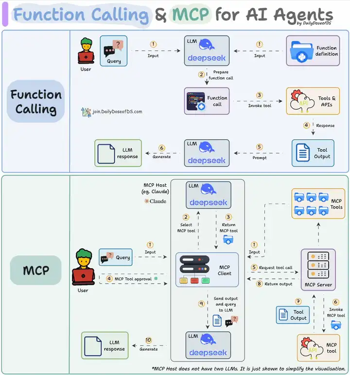

# LangChain 与 MCP 极简教程

给 Agent 接工具，最常见的做法是把所有工具函数都写在应用代码里，再逐个注册给模型。工具少的时候没问题；一旦工具多起来、或者想跨项目复用，这条路就会越来越累——同样的工具，每个应用都要重新写一遍。

MCP（Model Context Protocol，模型上下文协议）是 Anthropic 在 2024 年底推出的开放协议，解决的就是这个问题：把「工具的定义和执行」从应用代码里拆出来，放到独立的服务器上，客户端按需发现和调用。本文用一个最小的双文件例子——FastMCP 起一个数学工具服务，langchain-mcp-adapters 把它接进 Agent——把这条链路跑通。

## MCP 和 Function Call 是什么关系

先说结论：两者不是竞争关系，而是工作在两层的东西。

- **Function calling 是模型的能力**：模型根据工具的名称、描述和参数 schema，决定「该调哪个工具、传什么参数」，并以结构化 JSON 输出。
- **MCP 是工具的供给协议**：约定客户端如何发现服务器上有哪些工具（tool list）、如何调用（tool call）、如何取回结果。

也就是说，MCP 解决的不是「模型会不会调工具」，而是「工具从哪来、谁来维护、能不能复用」。写一次 MCP server，任何支持 MCP 的客户端（Claude Desktop、Cursor、你自己的 Agent）都能连。

## 最小实战：两个文件跑通

项目就两个文件：

- `math_server.py`：MCP 服务端，提供数学工具
- `client.py`：LangChain 客户端，把 MCP 工具接进 Agent

### 服务端：FastMCP 起服务

```python
# math_server.py
from mcp.server.fastmcp import FastMCP

mcp = FastMCP("Math")

@mcp.tool()
def add(a: int, b: int) -> int:
    """Add two numbers"""
    return a + b

@mcp.tool()
def multiply(a: int, b: int) -> int:
    """Multiply two numbers"""
    return a * b

if __name__ == "__main__":
    mcp.run(transport="stdio")
```

两个细节值得注意：

- 工具用 `@mcp.tool()` 装饰器定义，函数签名和 docstring 就是模型看到的工具说明——和 LangChain `@tool` 的玩法一致，类型注解必须写清楚。
- `transport="stdio"` 表示通过标准输入/输出通信，客户端会以子进程方式拉起这个脚本，本地工具用它最省事；要跨机器就走 HTTP（streamable HTTP / SSE）。

### 客户端：把 MCP 工具接进 Agent

```python
# client.py
import os
from mcp import ClientSession, StdioServerParameters
from mcp.client.stdio import stdio_client
from langchain_mcp_adapters.tools import load_mcp_tools
from langgraph.prebuilt import create_react_agent
from langchain_openai import ChatOpenAI
import asyncio

# 模型走阿里云百炼的 OpenAI 兼容模式
model = ChatOpenAI(
    api_key=os.getenv("DASHSCOPE_API_KEY"),
    base_url="https://dashscope.aliyuncs.com/compatible-mode/v1",
    model="qwen-plus",
)

# 配置与 MCP 服务器的连接
server_params = StdioServerParameters(
    command="python",
    args=["math_server.py"],
)

async def run_agent():
    async with stdio_client(server_params) as (read, write):
        async with ClientSession(read, write) as session:
            # 初始化连接
            await session.initialize()

            # 把 MCP 工具加载为 LangChain 工具
            tools = await load_mcp_tools(session)

            # 创建并运行 agent
            agent = create_react_agent(model, tools)
            agent_response = await agent.ainvoke({"messages": "what's (3 + 5) x 12?"})
            return agent_response

if __name__ == "__main__":
    result = asyncio.run(run_agent())
    print(result)
```

### 运行

```bash
pip install mcp langchain-mcp-adapters langgraph langchain-openai

export DASHSCOPE_API_KEY=your_api_key

python client.py
```

客户端会自己拉起 `math_server.py`，提出问题 "what's (3 + 5) x 12?"，并输出计算结果。

## 运行时发生了什么

1. 客户端按 `StdioServerParameters` 以子进程方式启动 `math_server.py`
2. `session.initialize()` 完成 MCP 握手
3. `load_mcp_tools(session)` 把服务器上的工具转换成 LangChain 工具列表
4. `create_react_agent(model, tools)` 用这些工具构建 ReAct Agent
5. Agent 收到问题，决定调用哪个工具；实际执行发生在 MCP server 侧，结果经客户端回传给模型

关键点在第 3 步：对 Agent 来说，MCP 工具和本地 `@tool` 定义的工具没有任何区别，适配器把协议细节全部藏掉了。

## Function Call vs MCP



| 维度 | Function Calling | MCP |
|---|---|---|
| 解决的问题 | 模型如何表达「调这个工具、参数是这些」 | 工具如何被外部程序发现、提供和复用 |
| 所在层 | 模型 API 的能力 | 客户端与服务端之间的协议 |
| 工具定义位置 | 应用代码里（`@tool` / JSON Schema） | 独立的 MCP server |
| 复用性 | 换个应用基本要重写 | 一个 server 服务所有支持 MCP 的客户端 |
| 传输方式 | 随模型 API 请求一起发送 | stdio / HTTP，工具在进程外执行 |

一句话总结：function calling 决定模型「怎么说」，MCP 决定工具「从哪来」；MCP 工具最终还是要靠 function calling 让模型真正用起来。

## 版本注记与延伸阅读

- 本文客户端用的是 `langgraph.prebuilt.create_react_agent`；LangChain 1.x 之后对应的统一入口是 `create_agent`，思路一致，细节以官方文档为准。
- 依赖包名注意：PyPI 安装名是连字符的 `langchain-mcp-adapters`，代码里 import 的是下划线的 `langchain_mcp_adapters`。

收藏的参考资料：

| 资源 |
|---|
| [MCP 终极指南（很值得读）](https://guangzhengli.com/blog/zh/model-context-protocol) |
| [langchain-mcp-adapters（GitHub）](https://github.com/langchain-ai/langchain-mcp-adapters) |
| [Using LangChain With Model Context Protocol (MCP)](https://cobusgreyling.medium.com/using-langchain-with-model-context-protocol-mcp-e89b87ee3c4c) |
| [知乎：一文看懂 MCP（大模型上下文协议）](https://zhuanlan.zhihu.com/p/27327515233) |
| [Function Call vs MCP](https://www.dailydoseofds.com/p/function-calling-mcp-for-llms/)（本文配图出处） |
| [知乎：在 Langchain 中使用 MCP 的极简教程](https://zhuanlan.zhihu.com/p/1899053057435739384) |

## 下一步

- 把数学工具换成你真正需要的东西：查数据库、调内部 API、文件处理，思路完全一样
- 工具链路稳定之后，如果要做长周期、多步骤的 Agent 工程（文件系统、子智能体、上下文管理），看本站的《DeepAgents完全指南》
