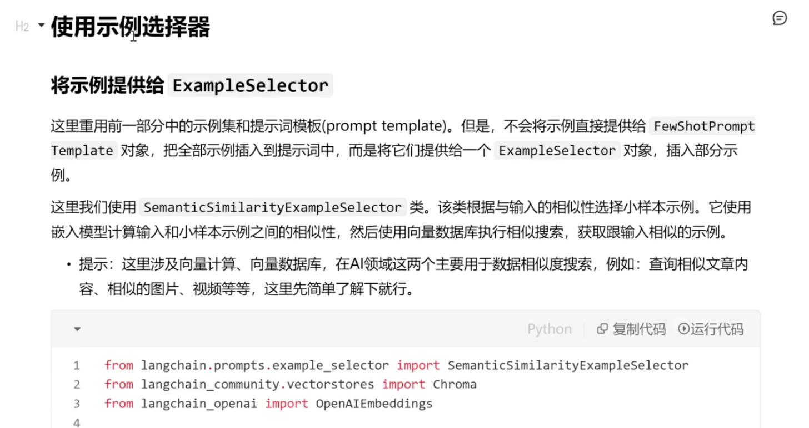
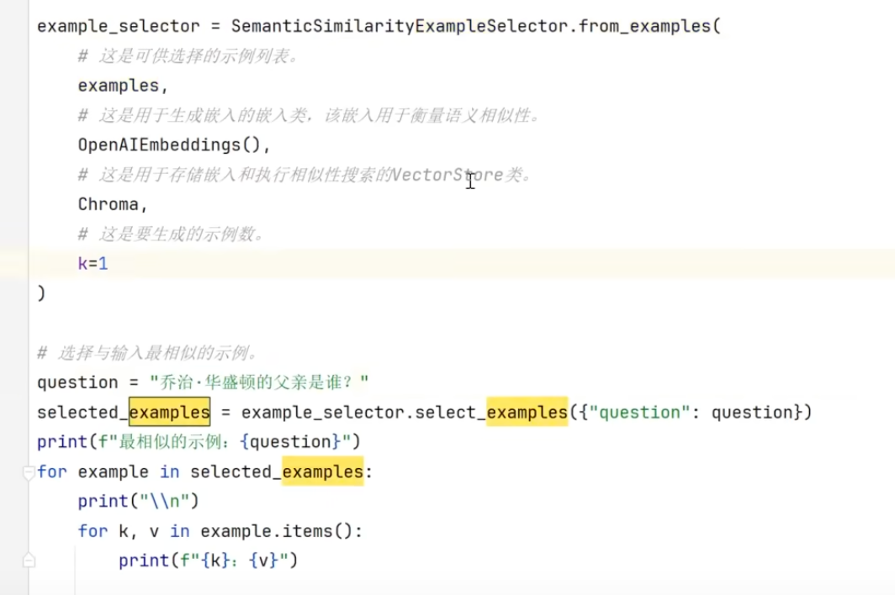

# langchain_core 组件详解：Prompt 模板与 Output Parsers

把一个 LangChain 应用拆到最小，真正绕不开的是一条链：`prompt | llm | parser`。prompt 决定喂给模型什么，llm 吐出一段自由文本，parser 再把文本变成程序能用的数据。langchain_core 把这条链的两头做成了两个模块——`prompts` 管输入侧，`output_parsers` 管输出侧。

这篇是这两个模块笔记的合并整理：输入侧讲 Prompt 模板家族怎么选、FewShot 怎么从固定示例进化到动态选例；输出侧讲五种常用解析器和解析失败后的 async 重试实战；解析报错的排查方法放在末尾。带运行输出和截图的部分来自我的实践记录，代码跑在 LangChain 0.3 时期的 langchain_core 上，个别老 API 的位置会标 ⚠️ 说明。

两个核心判断先放在这里：

- **输入侧默认 ChatPromptTemplate。** 它吃一组消息、吐一组消息，和现代聊天模型的接口天然对齐；字符串版 `PromptTemplate` 退居二线，主要做内部格式化片段。
- **要结构化输出，优先 `with_structured_output`。** LangChain 1.x 时代的主流做法是把 schema 绑在模型上，走 tool calling 或 JSON mode 通道，结构由模型原生保证。`PydanticOutputParser` 这一族文本解析器是备选：模型不支持原生结构化输出，或需要把格式说明精确嵌进提示词时才用。但 format_instructions、解析、重试这套思路依然值得吃透——排查结构化输出问题时，最终都要回到这条最原始的链上。

---

## 一、Prompt 模板（输入侧）

`langchain_core.prompts` 解决的问题只有一个：把动态变量填进固定结构，生成模型输入。模板类有一族，日常主力只有一个。

### ChatPromptTemplate：默认选择

`ChatPromptTemplate` 生成的不是一段字符串，而是一组结构化消息（`List[BaseMessage]`），正好对齐聊天模型的输入格式：

```python
from langchain_core.prompts import ChatPromptTemplate

template = [
    ("system", "You are a helpful AI assistant named {name}."),
    ("human", "Tell me a joke about {topic}."),
]
prompt_template = ChatPromptTemplate.from_messages(template)

prompt = prompt_template.invoke({"name": "Grok", "topic": "dogs"})
print(prompt.messages)
# [SystemMessage(content='You are a helpful AI assistant named Grok.'),
#  HumanMessage(content='Tell me a joke about dogs.')]
```

`from_messages` 接受 `("角色", "模板")` 元组，也接受消息模板对象和占位符，可以任意混搭。日常写角色字符串就够了；`SystemMessagePromptTemplate`、`HumanMessagePromptTemplate`、`AIMessagePromptTemplate` 这些细粒度的类，只在需要程序化拼装单条消息时才用得上。

真正解决独立问题的类是 `MessagesPlaceholder`——往模板中间插一段动态消息列表，最典型的用途是对话历史：

```python
from langchain_core.prompts import ChatPromptTemplate, MessagesPlaceholder
from langchain_core.messages import HumanMessage, AIMessage

chat_prompt = ChatPromptTemplate.from_messages([
    ("system", "You are a helpful assistant."),
    MessagesPlaceholder(variable_name="history"),
    ("human", "{input}")
])

history = [
    HumanMessage(content="What's the weather like?"),
    AIMessage(content="It's sunny!")
]

prompt = chat_prompt.invoke({"history": history, "input": "What's the forecast tomorrow?"})
print(prompt.messages)
# [SystemMessage(...), HumanMessage(content="What's the weather like?"),
#  AIMessage(...), HumanMessage(...)]
```

注意 `variable_name` 必须和 invoke 时传入的键一致，写模板时就对清楚。

### Prompt 模板家族速查表

完整班底如下，大部分场景只用到前几行：

| 类 | 功能 | 适用场景 |
|---|---|---|
| `ChatPromptTemplate` | 构建对话消息列表，支持多角色 | 聊天机器人、多轮对话（日常默认） |
| `MessagesPlaceholder` | 插入动态消息列表 | 对话历史、动态上下文 |
| `PromptTemplate` | 格式化字符串提示，支持动态变量 | 字符串模板、内部格式化片段 |
| `FewShotChatMessagePromptTemplate` | 把少样本示例格式化成对话消息 | 对话任务需要示例引导 |
| `SystemMessagePromptTemplate` | 系统消息模板 | 程序化拼装 system 消息 |
| `HumanMessagePromptTemplate` | 用户消息模板 | 程序化拼装 human 消息 |
| `AIMessagePromptTemplate` | AI 回复模板 | 少样本对话、预置示例回答 |
| `ChatMessagePromptTemplate` | 自定义角色消息模板（如 `"Jedi"`） | 非标准角色的创意对话 |
| `FewShotPromptTemplate` | 少样本示例，生成字符串 | ⚠️ 官方已标记 deprecated |
| `PipelinePromptTemplate` | 组合多个子模板 | ⚠️ 已废弃 |

两个 deprecated 的类多说两句。`FewShotPromptTemplate`（字符串版少样本）官方已标记 deprecated，现代做法是 ChatPromptTemplate + FewShotChatMessagePromptTemplate 组合，再配 ExampleSelector 做动态选例（见下节）；`PipelinePromptTemplate` 原本用来嵌套组合多段子模板，同样废弃了，多段模板的组合用普通变量嵌套或 LCEL 就能解决，不再需要专门的类。

安全上有一条红线：字符串模板默认用 f-string 语法，`PromptTemplate` 也支持 jinja2，但**不要用 jinja2 加载来源不可信的模板**——jinja2 模板可以执行代码，是一个真实的注入面。没有特殊语法需求，留在默认的 f-string。

### FewShot：从固定示例到动态选例

少样本提示的思路是用示例教模型任务模式。对话版写法是把示例格式化成 human/ai 消息对，作为一个整体嵌进主模板：

```python
from langchain_core.prompts import FewShotChatMessagePromptTemplate, ChatPromptTemplate

examples = [
    {"question": "What is 2+2?", "answer": "4"},
    {"question": "What is 3+3?", "answer": "6"},
]

example_prompt = ChatPromptTemplate.from_messages([
    ("human", "{question}"),
    ("ai", "{answer}")
])

few_shot_prompt = FewShotChatMessagePromptTemplate(
    examples=examples,
    example_prompt=example_prompt
)

final_prompt = ChatPromptTemplate.from_messages([
    ("system", "You are a math expert."),
    few_shot_prompt,
    ("human", "{input}")
])

prompt = final_prompt.invoke({"input": "What is 4+4?"})
```

固定示例有两个天然限制：示例一多就挤占上下文窗口，示例和当前输入不相关时还会稀释注意力。进阶做法是接一个 `ExampleSelector`，按语义相似度动态挑出与当前输入最相近的几条示例再拼进提示——等于把 RAG 的检索思路用在了示例库上，官方实现里 `SemanticSimilarityExampleSelector` 是最常用的一个。

我试过的玩法是把相近对话入库，请求时按相似度取回再传入 FewShot 模板，跑通后的效果：



具体代码：



这套做法的关键在示例库质量和 embedding 的匹配度，示例数量适中即可。再想提升效果，该调的是检索策略，不是往提示里硬塞更多示例。

## 二、Output Parsers（输出侧）


输出解析器负责把 LLM 的自由文本转换成结构化数据：从自然语言句子、JSON 字符串或列表里提取关键信息，转成 Python 对象、字典或列表这类程序友好的格式。没有它，每个应用都得自己写一遍"从文本里抠 JSON"的脏活，格式约定还会散落在提示词和解析代码两处，很难保持一致。

在链上的位置就是开头那条：

```text
PromptTemplate → LLM → OutputParser
```

提示模板定义输入和输出格式要求，LLM 生成原始文本，解析器完成最后一步转换。输入侧要求什么格式，输出侧就得配对应的 parser，两头的约定靠 `get_format_instructions()` 生成的格式说明对齐。

### 五种常用解析器

| 解析器 | 干什么 | 典型场景 |
|---|---|---|
| `StrOutputParser` | 原样返回字符串 | 简单问答、文本生成 |
| `JsonOutputParser` | 解析为 JSON 字典 | API 返回数据、键值对提取 |
| `PydanticOutputParser` | 解析为 Pydantic 模型 | 数据验证、复杂对象处理 |
| `CommaSeparatedListOutputParser` | 逗号分隔文本 → 列表 | 列表提取（选项、标签） |
| 自定义 `BaseOutputParser` | 自己实现 `parse` | 特殊格式（分号分隔、表格解析） |

下面五个示例共用同一个 llm 初始化（OpenAI 兼容接口，配置从 `.env` 读取），后文不再重复：

```python
import os
from dotenv import load_dotenv
from langchain_openai import ChatOpenAI

load_dotenv()
llm = ChatOpenAI(
    model=os.getenv("model"),
    api_key=os.getenv("api_key"),
    base_url=os.getenv("base_url"),
    streaming=True
)
```

#### StrOutputParser：什么都不做

最简单的解析器，直接返回字符串，不需要任何格式化指令：

```python
from langchain_core.prompts import PromptTemplate
from langchain_core.output_parsers import StrOutputParser

prompt = PromptTemplate(template="今天是星期几？（假设今天是 2025 年 3 月 16 日）")
parser = StrOutputParser()

chain = prompt | llm | parser
response = chain.invoke({})
print(response)
```

**输出**：

```text
今天是星期日。
```

#### JsonOutputParser：拿到字典

```python
from langchain_core.prompts import PromptTemplate
from langchain_core.output_parsers import JsonOutputParser

parser = JsonOutputParser()
prompt = PromptTemplate(
    template="以 JSON 格式返回两种水果及其颜色。\n{format_instructions}",
    partial_variables={"format_instructions": parser.get_format_instructions()}
)

chain = prompt | llm | parser
response = chain.invoke({})
print(response)
```

**输出**：

```text
{'apple': 'red', 'banana': 'yellow'}
```

`get_format_instructions()` 自动生成"请按 JSON 格式返回"的说明嵌进模板，提示和解析器的约定永远对得上。但硬约束不存在：LLM 输出的不是合法 JSON 时直接抛异常。

#### PydanticOutputParser：强类型 + 字段校验

```python
from langchain_core.prompts import PromptTemplate
from langchain_core.output_parsers import PydanticOutputParser
from pydantic import BaseModel, Field

class Book(BaseModel):
    title: str = Field(description="书名")
    author: str = Field(description="作者")
    year: int = Field(description="出版年份")

parser = PydanticOutputParser(pydantic_object=Book)
prompt = PromptTemplate(
    template="推荐一本书，并以指定格式返回。\n{format_instructions}\n推荐什么书？",
    input_variables=["question"],
    partial_variables={"format_instructions": parser.get_format_instructions()}
)

chain = prompt | llm | parser
response = chain.invoke({"question": "推荐什么书？"})
print(response)
```

**输出**：

```text
Book(title='《活着》', author='余华', year=1993)
```

Pydantic 保证字段类型（`year` 必须是整数），格式化指令里还会带上每个字段的 description。`get_format_instructions()` 生成的说明长这样：

```text
Please provide your response in the following JSON format:
{
  "title": "string",
  "author": "string",
  "year": "integer"
}
```

实例运行截图：


#### CommaSeparatedListOutputParser：拿到列表

```python
from langchain_core.prompts import PromptTemplate
from langchain_core.output_parsers import CommaSeparatedListOutputParser

parser = CommaSeparatedListOutputParser()
prompt = PromptTemplate(
    template="列出三种编程语言，用逗号分隔。\n{format_instructions}",
    partial_variables={"format_instructions": parser.get_format_instructions()}
)

chain = prompt | llm | parser
response = chain.invoke({})
print(response)  # type: list
```

**输出**：

```text
['Python', 'Java', 'C++']
```

实例：


#### 自定义解析器：继承 BaseOutputParser

内置解析器覆盖不到的格式，继承 `BaseOutputParser` 实现 `parse` 方法就行，比如解析分号分隔的列表：

```python
from langchain_core.prompts import PromptTemplate
from langchain_core.output_parsers import BaseOutputParser

class SemicolonListParser(BaseOutputParser):
    def parse(self, text: str) -> list:
        return [item.strip() for item in text.split(";")]

parser = SemicolonListParser()
prompt = PromptTemplate(template="列出三种城市，用分号分隔，例如：北京;上海;广州")

chain = prompt | llm | parser
response = chain.invoke({})
print(response)
```

**输出**：

```text
['北京', '上海', '广州']
```

### 解析失败重试：async 实战

文本解析器没有硬约束，LLM 输出不稳定或格式要求严格时，解析失败是常态而不是异常，重试应该直接设计进链路。下面是完整跑通的 async 版本：`PydanticOutputParser` 解析动词提取结果，外层 for 循环控制最多三次尝试，全部失败后再兜底一次。

```python
from langchain_openai import ChatOpenAI
from langchain_core.prompts import PromptTemplate
from langchain_core.output_parsers import PydanticOutputParser
from langchain_core.runnables import RunnableSequence
from pydantic import BaseModel, Field
import os
from dotenv import load_dotenv
import asyncio

# 加载环境变量
load_dotenv()
model = os.getenv("model")
api_key = os.getenv("api_key")
base_url = os.getenv("base_url")

# 初始化 LLM
llm = ChatOpenAI(
    model=model,
    api_key=api_key,
    base_url=base_url,
    streaming=True
)

# 定义输出结构使用 Pydantic
class ParseResult(BaseModel):
    result: str = Field(description="解析出的参数结果")

# 创建输出解析器
output_parser = PydanticOutputParser(pydantic_object=ParseResult)

# 创建提示模板
prompt_template = PromptTemplate.from_template(
    "请解析以下输入并返回结果：{input}\n\n返回格式：\n{format_instructions}",
    partial_variables={"format_instructions": output_parser.get_format_instructions()}
)

# 创建可运行序列
# chain = RunnableSequence(
#     prompt_template,
#     llm,
#     output_parser
# )
chain = prompt_template | llm | output_parser

# 输入数据
user_input = "提取这句话中的动词：'我喜欢跑步和游泳'"

async def run_parsing():
    max_attempts = 3

    for attempt in range(max_attempts):
        try:
            # 使用 invoke 方法运行链
            result = await chain.ainvoke({"input": user_input})

            print(f"第 {attempt + 1} 次尝试成功")
            print(f"解析结果: {result.model_dump()}")
            return result

        except Exception as e:
            print(f"第 {attempt + 1} 次尝试失败，错误: {e}")
            if attempt < max_attempts - 1:
                print("正在重试...")
            else:
                print("已达到最大尝试次数")
                try:
                    result = await chain.ainvoke(
                        {"input": user_input},
                        config={"max_retries": 1}
                    )
                    print(f"最终修复结果: {result.model_dump()}")  # 使用 model_dump() 替代 dict()
                    return result
                except Exception as final_error:
                    print(f"最终尝试失败，错误: {final_error}")
                    return None

# 在已有事件循环中运行
async def main():
    await run_parsing()

# 如果在已有的事件循环中（比如 Jupyter），直接运行
if asyncio.get_event_loop().is_running():
    await main()  # 在已有循环中运行
else:
    asyncio.run(main())
```

**输出示例**：

```text
解析结果： {'result': '喜欢,跑步,游泳'}
```

关于这段代码有一点必须澄清（原笔记在这里有误导）：重试全部来自手工调用——外层 for 循环跑满三次，都失败后再兜底调一次。最后那次 `ainvoke` 传的 `config={"max_retries": 1}` 并不是解析重试的开关——`prompt | llm | parser` 这条链上，解析失败抛出的异常只会向上传给调用方，库不会自动重跑；`max_retries` 至多影响底层 API 请求层面的重试（网络错误、限流），跟解析失败是两回事，真正需要 API 层重试应该设在 `ChatOpenAI` 的初始化参数里。想让模型重新生成合规输出，只能像上面这样自己捕获异常、重新调用整条链。

重跑整条链之所以有效，是因为 LLM 输出有随机性：同一个输入再来一次，经常就能给出合规格式。捕获异常后重跑，是成本最低的重试方案。

### 和 with_structured_output 怎么选

回到开头第二个判断。1.x 时代做结构化输出，第一选择是模型侧的 `with_structured_output`——还是上面那个 Book schema，但玩法完全变了：

```python
structured_llm = llm.with_structured_output(Book)
book = structured_llm.invoke("推荐一本书，返回书名、作者和出版年份")
# 直接拿到 Book 实例
```

| | `with_structured_output` | 文本解析器一族 |
|---|---|---|
| 结构由谁保证 | schema 绑在模型上，走 tool calling / JSON mode | 格式说明嵌进提示词，靠模型遵守约定 |
| 提示词 | 不需要 format_instructions | `get_format_instructions()` 嵌入 partial_variables |
| 解析 | 库内部完成 | 链上显式一环，失败自己处理 |

怎么选：模型支持 tool calling 或 JSON mode（主流模型都支持），直接 `with_structured_output`，代码更少、格式更有保障；模型不支持原生结构化输出，或需要把格式说明精确控制进提示词（特定提示策略、兼容老链路），用文本解析器。`StrOutputParser` 不受这场选型影响——拿纯文本时它仍是标准配件，也是后面排查解析问题的关键工具。

## 三、解析报错排查

### Agent 场景：OutputParserException 与 handle_parsing_errors

解析报错最密集的场景是 Agent。ReAct 式 Agent 靠解析模型文本来决定下一步动作（Thought / Action / Final Answer 的固定格式），模型一旦不合规矩就抛 `OutputParserException`——典型的坏输出比如同一段回复里同时包含 `Action` 和 `Final Answer`。

我跑 ReAct Agent 时撞到过这个错，解法是初始化代理时传 `handle_parsing_errors=True`：

```python
agent = initialize_agent(
    tools=tools,
    llm=llm,
    agent_type="zero-shot-react-description",
    verbose=True,
    handle_parsing_errors=True  # 自动处理解析错误
)

response = agent.run("告诉我关于 LangChain 的信息")
print(response)
```

机制：解析失败时代理不抛异常，而是把错误信息反馈给模型，要求它重新生成符合预期的输出格式——相当于框架替你做了上一节手写的那层重试循环。

⚠️ 此为 0.x 时代写法：`initialize_agent` / AgentExecutor 属于 legacy API，LangChain 1.x 已将其移出主线。更根本的变化是，现代 tool-calling Agent 让模型直接输出结构化的 tool call，不再靠解析自由文本决定动作，这一类解析报错从源头就少了一大截。这段经验的价值在机制本身：解析失败时把错误反馈给模型让它自我修正，这个思路在哪个版本都适用。

### 调试心法：先定位问题在模型还是解析器

解析失败时第一个动作不是改提示词，是看原始输出。把链尾换成 `StrOutputParser` 跑一遍，问题在哪一侧立刻清楚：原始输出本身不符合约定格式，问题在模型侧；原始输出看着合规但 parser 仍报错，问题在解析器侧——多半是格式约定和实际输出没对上。

```python
try:
    response = chain.invoke({})
    print(response)
except Exception as e:
    print(f"解析失败：{e}")
    # 用 StrOutputParser 检查原始输出
    raw_chain = prompt | llm | StrOutputParser()
    raw_output = raw_chain.invoke({})
    print(f"原始输出：{raw_output}")
```

定位到模型侧之后，两个常用手段：

- **把格式要求写得更硬。** 在提示里重复强调，比如"严格按照 JSON 格式返回，不要添加额外说明"；格式说明用 `get_format_instructions()` 生成后经 `partial_variables` 嵌入，不要自己手写一份——手写的和解析器的约定迟早对不上。
- **降低 temperature。** 对格式遵从度差的模型，降低采样温度能减少格式漂移。

## 总结

- 输入侧默认 `ChatPromptTemplate` + `MessagesPlaceholder`，细粒度消息类按需取用；FewShot 的进阶形态是 ExampleSelector 按相似度动态选例，示例库质量比数量重要。
- 输出侧要结构化数据，1.x 优先 `with_structured_output`；文本解析器是备选，五种里 `PydanticOutputParser`（要校验）和 `JsonOutputParser`（要字典）最常用，特殊格式继承 `BaseOutputParser` 自己写 `parse`。
- 解析失败按常态路径处理：普通链上自己包一层循环重跑；Agent 场景（0.x）用 `handle_parsing_errors=True` 让框架把错误喂回模型。
- 排查顺序固定：先换 `StrOutputParser` 看原始输出，定位模型侧还是解析器侧，再对应改提示（格式说明、temperature）或改解析约定。
- 字符串模板留在默认的 f-string，不要用 jinja2 加载来源不可信的模板。
