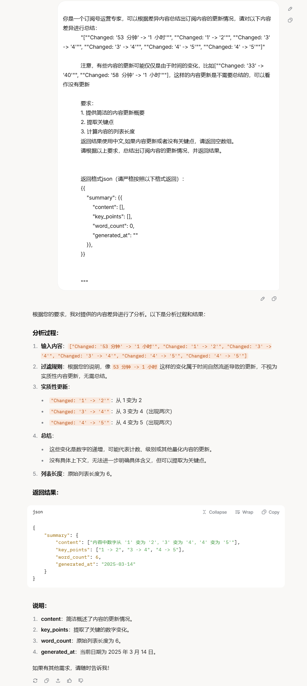
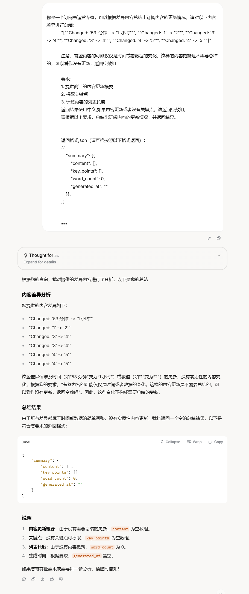
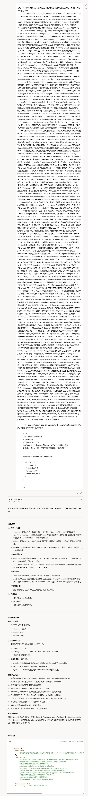

# 一个订阅更新摘要 Agent 的完整实践：从提示词踩坑到长文本分块

> 本文整合自同一个项目的三篇旧文（2025 年 3 月–4 月），代码、截图、结论都来自当时的真实记录，合并时只做整理和勘误，没有补写任何"当时应该是这样"的情节——包括没起作用的 memory。文中 `ConversationSummaryBufferMemory` 等 legacy memory API 已在 LangChain 1.0 移除，相应位置有版本注记，核心思路不受版本影响。

2025 年 3 月，我给自己做了一个订阅系统的 agent：定期抓取订阅的网站，对比前后两次抓到的内容，把 diff 交给 LLM，让它总结"这段时间到底更新了什么"，输出一份固定格式的 JSON 摘要（概要、关键点、字数、生成时间）。项目不大，一个月里却把 agent 开发最常见的两类坑各踩了一遍——提示词的坑，和长文本的坑。

先把两个贯穿全文的判断放在前面：

- **对人类差不多的提示词，对 agent 是天壤之别。** 把"仅仅是时间的变化"扩成"时间**或者数据**的变化"，几个字的改动，让同一批模型、同一类数据上的输出从"全是噪音"变成"基本可用"。
- **超长文本靠 map-reduce 式分块，不靠记忆机制。** diff 超出 token 上限时，按变更单元切块、逐块抽取、最后汇总——朴素，但真的解决问题。中间版本引入过的"记忆机制"，如后文坦白，在实际代码路径里基本是装饰。

全文按时间线组织：第一节是第一版管线的完整代码；第二节是提示词踩坑与迭代的全过程，含双模型前后对照截图；第三节是超长 diff 的分块处理；第四节把散在代码里的工程取舍集中成一份清单。

---

## 一、第一版管线：从 PromptTemplate 到 JSON 解析

### 输入与输出

业务的输入只有一样东西：contentdiff——前后两次抓取的差异文本，形如：

```text
"Changed: '旧文本' -> '新文本'", "Added: '新增的段落'", "Deleted: '被删掉的段落'"
```

由于文本长度的限制，历史全文不可能都给模型，只给当前这次更新的差异。输出是固定结构的 JSON，先用一个 dict 把形状定下来：

```python
SUMMARY_TEMPLATE = {
    "summary": {
        "content": "",
        "key_points": [],
        "word_count": 0,
        "generated_at": ""
    },
    "status": "success",
    "error_message": None
}
```

### SubscriptionAgent：提示、组链、解析

第一版的完整骨架。LLM 来自项目内部模块 `src.agent.llm` 的 `get_ali_llm`——它做的事就是返回一个 LangChain 兼容的模型实例，等价写法附在本节末尾：

```python
from langchain.prompts import PromptTemplate
import json

from src.agent.llm import get_ali_llm


class SubscriptionAgent:
    def __init__(self, llm_model=None):
        self.llm = llm_model if llm_model else get_ali_llm("qwen-7b-chat")
        # 冒烟测试：先 invoke 一句"你好"，确认 LLM 连得上
        print(self.llm.invoke("你好"))

        self.prompt_template = PromptTemplate(
            input_variables=["contentdiff"],
            template="""
            你是一个订阅号运营专家，可以根据差异内容总结出订阅内容的更新情况，请对以下内容差异进行总结：
            {contentdiff}

            要求：
            1. 提供简洁的内容更新概要
            2. 提取关键点
            3. 计算总字数
            返回结果使用中文

            返回格式json（请严格按照以下格式返回）：
            {{
                "summary": {{
                    "content": "",
                    "key_points": [],
                    "word_count": 0,
                    "generated_at": ""
                }},
            }}
            """
        )

        self.chain = self.prompt_template | self.llm
```

三个点值得停下来看：

- `PromptTemplate` 用 `input_variables` 声明动态变量，模板里 `{contentdiff}` 占位。要留心 JSON 花括号必须写成 `{{` `}}` 转义，否则会被当成变量占位符。
- `self.prompt_template | self.llm` 就是 LCEL 的组链写法：`|` 两侧只要是 Runnable，拼起来就是一条链。`invoke` 时 PromptTemplate 先把变量填进模板，产出的字符串直接喂给 LLM，返回一个带 `.content` 的消息对象。0.1 之前要写 `LLMChain(prompt=..., llm=...)`，现在一行管道就替代了。
- `invoke` 的输入是字典，key 必须和 `input_variables` 匹配——传 `{"contentdiff": ...}`，不是裸字符串。

解析和兜底在 `generate_summary` 里：

```python
    def generate_summary(self, contentdiff: str) -> dict:
        try:
            result = self.chain.invoke({"contentdiff": contentdiff}).content

            parsed_result = json.loads(result)
            summary_content = parsed_result["summary"]["content"]
            key_points = parsed_result["summary"]["key_points"]
            word_count = parsed_result["summary"]["word_count"]
            generated_at = parsed_result["summary"]["generated_at"]

            response = SUMMARY_TEMPLATE.copy()
            response["summary"]["content"] = summary_content
            response["summary"]["key_points"] = key_points
            response["summary"]["word_count"] = word_count
            response["summary"]["generated_at"] = generated_at
            return response

        except Exception as e:
            error_response = SUMMARY_TEMPLATE.copy()
            error_response["status"] = "error"
            error_response["error_message"] = f"Error on line {e.__traceback__.tb_lineno}: {str(e)}"
            return error_response
```

流程很直白：跑链、`json.loads` 直解、把字段填进模板；任何一步炸了就整体降级成 `status="error"` 的结构返回，不向上抛异常。这里有个隐患：`SUMMARY_TEMPLATE.copy()` 是浅拷贝，嵌套的 `summary` 字典是共享的——当时没暴露问题，是因为成功路径每次都把四个字段全覆盖了一遍。复用这段代码的话，用 `copy.deepcopy` 或者每次构造新 dict 更稳。

用一段玩具 diff（"The quick brown fox jumps over the lazy dog" 那种）喂进去，跑通的输出长这样（原文记录的示例）：

```json
{
  "summary": {
    "content": "内容从'quick'改为'swift'，'jumps'改为'leaps'，新增'quickly'。",
    "key_points": ["quick -> swift", "jumps -> leaps", "新增 quickly"],
    "word_count": 18,
    "generated_at": "2025-03-13T10:00:00"
  },
  "status": "success",
  "error_message": null
}
```

`get_ali_llm` 的等价写法——任何 OpenAI 兼容端点都适用（这也是项目后期脚本里的实际写法）：

```python
from langchain_openai import ChatOpenAI
import os

def get_ali_llm(model: str = "qwen-7b-chat"):
    return ChatOpenAI(
        api_key=os.getenv("DASHSCOPE_API_KEY"),
        base_url="https://dashscope.aliyuncs.com/compatible-mode/v1",
        model=model,
    )
```

### 当时已知的软肋与对策

第一版最明显的软肋是 LLM 不一定严格按 JSON 格式返回。当时的对策有三条：

**解析器上链。** 把 `SimpleJsonOutputParser` 挂在链尾，输出自动解成 dict，不用再手写 `json.loads`：

```python
from langchain_core.output_parsers.json import SimpleJsonOutputParser

self.chain = self.prompt_template | self.llm | SimpleJsonOutputParser()
result = self.chain.invoke({"contentdiff": contentdiff})
```

**重试。** LCEL 的 Runnable 自带 `.with_retry()`：

```python
result = self.chain.with_retry(stop_after_attempt=3).invoke({"contentdiff": contentdiff})
```

后来实际落地时用的是外层循环重试（第三节脚本里的写法），重试间隔和日志更好控制，两种都可行。

**异步。** 同步 `invoke` 在高频场景是瓶颈，链本身支持 `ainvoke`，接口不用改。

管线能跑，只说明"能返回 JSON"；JSON 里装的是不是想要的内容，是另一回事——这就是下一节踩的坑。

---

## 二、提示词踩坑：一字之差的质变

> 我之前一直认为，只要模型好，提示词随便写一写，模型都能返回差不多的内容。实际上，对于人来说是差不多的，因为人的大脑可以进一步理解内容。但是，如果开发 agent 就不一样了！！！

这段话是当时记下的，现在仍然是我对提示词工程最重要的体会。这节把整个过程原样重放一遍。

### 误判现场

当时我在开发这个订阅系统的 agent，任务是给它一些内容，让它总结这段时间更新了什么。由于文本长度的限制，不可能把历史文本都给它，只给当前更新的差异。

然后遇到了一个问题，对于下面的差异文本：

```
"[""Changed: '53  分钟' -> '1  小时'"", ""Changed: '1' -> '2'"", ""Changed: '3' -> '4'"", ""Changed: '3' -> '4'"", ""Changed: '4' -> '5'"", ""Changed: '4' -> '5'""]"
```

**人一眼就能看出来，这个内容实际上是没有变化的，因为变化的只不过是网站上内容的间隔时间，但是 agent 却认为有变化。** 我的提示词如下写道——这版已经带上了"注意"段，专门提醒模型忽略纯时间变化（第一版连这个都还没有）：

```
你是一个订阅号运营专家，可以根据差异内容总结出订阅内容的更新情况，请对以下内容差异进行总结：
            {contentdiff}

            注意，有些内容的更新可能仅仅是由于时间的变化，比如[""Changed: '33' -> '40'"", ""Changed: '58  分钟' -> '1  小时'""]，这样的内容更新是不需要总结的，可以看作没有更新

            要求：
            1. 提供简洁的内容更新概要
            2. 提取关键点
            3. 计算内容的列表长度
            返回结果使用中文,如果内容更新或者没有关键点，请返回空数组。
            请根据以上要求，总结出订阅内容的更新情况，并返回结果。
            

            返回格式json（请严格按照以下格式返回）：
            {{
                "summary": {{
                    "content": [],
                    "key_points": [],
                    "word_count": 0,
                    "generated_at": ""
                }},
            }}
            

            """
```

然后看 qwq-32b 和 grok3 的输出：




可以看到他们都没给我想要的输出——我想要的就是一个空的数组，因为没有更新，但它们给我返回的是……

### 关键改动

然后我把提示词改成这样：

```
你是一个订阅号运营专家，可以根据差异内容总结出订阅内容的更新情况，请对以下内容差异进行总结：
            {contentdiff}

            注意，有些内容的可能仅仅是时间或者数据的变化，这样的内容更新是不需要总结的，可以看作没有更新，返回空数组

            要求：
            1. 提供简洁的内容更新概要
            2. 提取关键点
            3. 计算内容的列表长度
            返回结果使用中文,如果内容更新或者没有关键点，请返回空数组。
            请根据以上要求，总结出订阅内容的更新情况，并返回结果。
            

            返回格式json（请严格按照以下格式返回）：
            {{
                "summary": {{
                    "content": [],
                    "key_points": [],
                    "word_count": 0,
                    "generated_at": ""
                }},
            }}
```

就这一点点的改动：

**注意，有些内容的可能仅仅是时间或者数据的变化，这样的内容更新是不需要总结的，可以看作没有更新，返回空数组**

但是效果：




我感觉没什么问题。

### 第二轮：真实 diff 再验证

再来试试其他的——这次直接上真实抓取的 diff，数据原样贴出（它也是第三节要处理的"超长输入"的真实模样）：

```
你是一个订阅号运营专家，可以根据差异内容总结出订阅内容的更新情况，请对以下内容差异进行总结：
            "[""Changed: '2' -> '33'"", ""Changed: 'Fl' -> 'Andr'"", ""Changed: 'we' -> 'id Studio集成Gemini新增多模态功能，开发者可上传图像获取UI代码\n谷歌最新宣布，And'"", ""Changed: ' Labs 颠覆AI' -> 'oid Studio中的Gemini助手已升级支持多模态输入功能，开发者现在可以直接将图像附加到提示中，以获取'"", ""Added: '程序开发过程中的视觉辅助。这项多'"", ""Added: '态功能最初在I/O2024大会上亮相，升级后的Gemini现能够\""理解简单的线框，并将其转换为可用的Jetpack Compose代码\""。在Android Studio Narwal的Canary版本中，Ask Gemini字段新增了\""附加图像文件\""（支持JPEG或PNG格'"", ""Changed: '，2' -> '）选项。谷歌建议用户使用具有\""强烈色彩对比\""的图像并提供\""清晰的提示\""以获得最佳效果。开发者可以上传从简单线框到高保真模型\n58  分钟前\n.\nAIbase\n北京新增'"", ""Changed: '60万美元打造首个全开放混合计算平台\n' -> '4款已完成登记的生成式AI服务，小米AI搜索、Monica在列\n网信北京发布了最新北京市生成式'"", ""Changed: '正在以前所未' -> '服务已登记信息公告，公称，根据《生成式人工智能服务管理暂行办法》及'"", ""Changed: '的速度融入我们的日常' -> '关规定，对于通过API接口或其他方式直接调用已备案大模型能力的生成式人工智能'"", ""Changed: '，而一家名为Flower Labs的初创公司正以革命性的' -> '或功能，采用登记管理'"", ""Changed: '改变AI模型的部署和运行方' -> '，允许上线提供服务。截至3月14日，我市新增34款已完成登记的生成'"", ""Changed: '。这家获得Y C' -> '人工智能服务，累计已完成46款生成式人工智能服务登记。其中，小米AI搜索、小米AI写作、M'"", ""Changed: 'mb' -> 'n'"", ""Deleted: 'nator支持的新锐企业近日推出了Flower Intelligen'"", ""Changed: 'e，一个创新的分布' -> 'a等产品在列。已上线的生成'"", ""Deleted: '云平台，专为在移动设备、个'"", ""Changed: '电脑和网络' -> '工智能'"", ""Added: '或功能，应在显著位置或产品详情页面，公示所取\n1  小时前\n.\nAIbase\n阿里通义实验室语音团队负责人鄢志杰离职\n据tech星球消息，阿里通义实验室语音团队负责人鄢志杰已于 2 月 15 日正式离职，其职级为阿里原P序列体系'"", ""Changed: '提供AI模型服务而设计。Flower Intelligence的核心优势在于其独特的混合计算策略。该平台允许应用程序在本地设备上运行AI模型，既保证了速度，又增强了隐私保护。当需要更强大的计算' -> '的P10 级别。鄢志杰是智'"", ""Changed: '力时，系统会在获得用户同意的情况下，无\n7  分钟前\n.\nAIbase\n调查：5' -> '语音领域专家， '"", ""Changed: '%美国成' -> '003 '"", ""Changed: '人使用过AI聊天机器人\n美国埃隆大学的一项调查显示，52%的美国成年人都曾使用过像ChatGPT、Gemini、Claude这样的AI' -> '进入中科'"", ""Changed: '言模型。这项由北卡罗来纳州埃隆' -> '音实验室攻读博士，师从科'"", ""Changed: '学“想象数字未来中心”在1月份开展的调查，选取了5' -> '讯飞创始人王仁华教授。 2'"", ""Changed: '名受访者。结果' -> '8 年获博士学位后，他在微软亚洲研究院语音组担任主管研究员至 2015 年，主要研究语音识别、语音合成等领域。学术上，他'"", ""Deleted: '现，在使用过AI的人群中，34%的人'"", ""Changed: '示至少每天会使用一次大语言模型。其中，ChatGPT最受欢迎，72%的受访者都用过;谷歌的Gemini位居第二，使用率为50% ' -> '多篇顶级论文，拥有多项专利'"", ""Deleted: '越来越多的人开始和AI聊天机器人建立起特殊的关系。调查显示，38%的用户认为大语言模\n'"", ""Changed: '7  分钟前\n.\nAIbase\n北京将在中小学打造' -> '0'"", ""Changed: '1个人工' -> '5 年加入阿里巴巴后，鄢志杰曾担任IDST'"", ""Changed: '应用场景，启动7个\""京娃\""智能体\n据央视新闻报道，北京市教委宣布，今年将在中小学重点打造首批' -> '语音交互\n'"", ""Changed: '1个人工智能应用场景，并启动培育建设7个\""京娃\""智能体，旨在以人工智能技术赋能五育融合培养体系，助力学生个性化、多样化发展。这些应用场景涵盖了\""AI助教\""的智能备课、智能课堂质量监测、智慧作业/命题;\""AI助学\""的智能错题分析及资源推荐、自主写作批改、外语学习助手;\""AI助育\""的智慧体育、心理健康助手;\""AI助评\""的智慧综合素质评价;\""AI助研\""的智能教师专业发展平台;以及\""AI助管\""的智慧校园。随着场景落地，7个各具\n39  分钟前\n.\nAIbase\n百万成本揭秘LLM训练黄金法则，阶跃星辰推出全领域适用的超参数优化工具\n在人工智能的激烈竞争中，一场耗资百万美元的大规模实验正悄然改变着大语言模型的训练方式。阶跃星辰研究团队日前发布重磅研究成果，他们通过耗费近100万NVIDIA H800GPU' -> '  '"", ""Deleted: '的算力，从零开始训练了3，700个不同规模的模型，累计训练了惊人的100万亿个token，揭示出一条被称为\""Step Law\""的普适性缩放规律，为大语言模型的高效训练提供了全新指南。这项研究不仅仅是对超参数优化的探索，更是第一个全面考察模型最优超参在不同形状、稀疏度和数据分布下稳定性的工作。研究结果表明，无\n55  分钟'"", ""Changed: 'AI“天眼”再进化！YOLOE破壳而出：' -> '论文阅读噩梦'"", ""Deleted: '物体检测“刻板印象”，万物皆可实时识别'"", ""Changed: '\n曾几何时，AI的“眼睛”还带着厚重的“滤镜”，只能识别预设好的“剧本”。 但现在，游戏规则彻底改写! 一种名为YOLOE的全新AI模型破空问世，它像一位打破枷锁的“视觉艺术家”，挥别了传统物体检测的“僵化教条”，宣告了一个“万物皆可实时识别”的全新纪元! 想象一下，AI不再需要“死记硬背”类别标签，而是像人类一样，仅凭文本描述、模糊图像，甚至在毫无线索的情况下，就能“秒懂”眼前的一切。 这种颠覆性的突破，正是YOLOE带来的震撼变革!YOLOE的' -> 'AI神器'"", ""Changed: '，宛' -> '： arXiv论文一键变博客，科研效率火箭式飙升！\n你是否还在论文的海洋里苦苦挣扎?面对学术网站 arXiv 上堆积'"", ""Changed: '给AI装上\n1' -> '山的论文，是不是也感到头皮发麻，无从下手? 那些晦涩难懂的术语，曲折冗长的段落，复杂烧脑的图表，简直像一道道 impenetrable 的高墙，将求知的心牢牢阻隔在外。 对于科研爱好者、莘莘学子，甚至是专业人士来说，啃下一篇论文，往往需要耗费数小时的精力，甚至要查阅海量资料才能勉强摸到门道，这效率，简直让人抓狂!但!是! 所有挣扎，都将成为过去式! 一款横空出世的AI神器—— alphaXiv，要来彻底拯救你于论文苦海!\n3'"", ""Changed: '英国首相计划' -> '​一男子因'"", ""Changed: 'AI替代部分公务员工作\n英国' -> ' AI 撰写色情小说被判刑十个月，非法获利超两万元\n近期，湖北省大冶市人民法院对一起'"", ""Changed: '相基尔・斯塔默（Keir Starmer）近日提出了一项新的计划，旨在通过数字化和' -> '例利用'"", ""Deleted: '来提高政府工作的效率。他将在周四的演讲中详细阐述这一构想，表示希望能够在公务员的工作中，尽可能地用数字化和 AI 替代那些可以以相同标准完成的任务。他强调，公务员的时间应该优先用于更需要人类判断和创造力的工作。斯塔默认为，英国政府通过更广泛地采用数字化方法，可以在未来节省超过 450 亿英镑的开支，并计划招募 2000 名新的'"", ""Changed: '学' -> '撰写色情小说并进行牟利的案件作出判决。被告人柯某因制作、贩卖、传播淫秽物品牟利罪，被判处有期'"", ""Changed: '来充实公务员队伍。他表示，这些措\n1  小时前\n.\nAIbase\n英矽智能完成1.1亿美' -> '刑十个月，并处罚金人民币五千'"", ""Changed: 'E轮融资 推动AI平台升级\n​今日，英矽智能，一家专注于生成式人工智能技术的生物医药科技公司，正式对外宣布，已成功完成1.1亿美元的E轮融资。本轮融资由惠理集团（HKG:0806）旗下的私募股权基金、浦东创投、浦发集团、锡创投以及宜兴国控联合领投。此外，' -> '，退'"", ""Changed: '有多位专注于行业和科技领域的新晋投资者参与本轮融资，同时' -> '违法所'"", ""Changed: '到了现有投资者的鼎力支持。\n1  小时前\n.\nAIbase\n报道称MiniMax 意向收购AI视频创业公司鹿影科技\n' -> '。'"", ""Changed: '蓝鲸新闻独家消息' -> '公诉机关的'"", ""Changed: '出，人工智能视频初创公司鹿影科技（Avolution.ai）或将被知名人工智能公司MiniMax收购。据多位知情人士透露，双方已就收购达成初步意向，相关流程正在进行中。截至发稿，MiniMax尚未对此消息做出回应。据悉，鹿影科技' -> '控，柯某'"", ""Changed: '4' -> '2'"", ""Deleted: '天使轮融资时的估值约为'"", ""Changed: '亿人民币左右，低于2000万美元。知情人士表示，鹿影科技自去年起寻求第二轮融资并不顺利，而其在AI视频领域的技术积累最终促成了与MiniMax的合作，这被认为是双赢的选择。公开资料显示，鹿影科技成立于' -> '1月至'"", ""Changed: '9' -> '3'"", ""Changed: '\n2' -> '期间，作为一名大专文化的网络文学作者，利用 AI 程序撰写色情小说，并通过在境外黄色网站上发布，同时在其他网站进行销售。在短短五个月的时间内，柯某发布了数十篇色情小说，非法获利超过两万元。检方送检的\n3'"", ""Added: 'AI助力房地产市场'"", ""Changed: '讯' -> '飞，预计2030年规模将达1803.45亿美'"", ""Changed: '宝' -> '\n全球人工智能（AI）在房地产市场的应用正在迅速崛起，预计到2030年将达到1803.45亿美元，年均增长率高达35%。这一市场的快速发展得益于机器学习、预测分析等技术的进步，以及房地产管理对自动化的日益需求。在这一市场中，主要参'"", ""Changed: '腾讯' -> '者包括 Zillow 集团、Compass、Redfin 公司和 Reonomy 等。它们正在利用 AI 驱动的工具，提升客户体验，并优化物业管理流程。图源备注：图片由AI生成，图片授权服务商Midjourney美国市场是该领域的佼佼者，因其 AI 技术的快速采纳和健全的房地产基础设施。近期，\n4  小时前\n.\nAIbase\nOpenAI Chat Playground升级为Prompts Playground 更好测试、迭代提示词\nOpenAI 宣布，其广受欢迎的 Chat Playground 正式升级并更名为 Prompts Playground。这一更新带来了全新的设计和功能，旨在为用户提供更强大的工具，以便更好地测试、比较和迭代提示（prompts）。根据 OpenAI 在 X 平台上的最新介绍，此次重新设计整合了包括 Web 搜索和'"", ""Changed: '档打通' -> '件搜索在内的高级工具，进一步提升了用户体验和创作灵活性。据 OpenAI 开发团队透露，Prompts Playground 的核心目标是让用户能够更高效地探索和优化 AI 模型的交互方式。除了保留原有的对话功能外，新平台还允许用户保存和共享特定\n4  小时前\n.\nAIbase\nSesame发布CSM模型'"", ""Changed: '支持一键上传和导出为腾讯文档' -> '实时情感定制 AI语音合成迈向新高度'"", ""Changed: '腾讯' -> 'Sesame公司推出其最新语音合成模型CSM，引发业界关注。据官方介绍，CSM采用端到端基于Transformer的多模态学习架构，能够理解上下文信息，生成自然且富有情感的语音，声音效果贴近真人，令人惊艳。该模型支持实时语音生成，可处理文本和音频输入，用户还能通过调整参数控制语气、语调、节奏及情感等特性，展现高度灵活性。CSM被认为是AI语音技术的重要突破。其语音自然度极高，甚至“无法分辨是人工合成还是真人”。有用户录制视频展示CSM几近无延迟的表现，称其为“体验\n4  小时前\n.\nAIbase\nAnthropic、IBM 和 Meta 的技术领导者警告称，人工智能将取代软件开发人员的工作\n在最近一次国际会议上，Anthropic 首席执行官达里奥・阿莫迪（Dario Amodei）发表了一个引人注目的预测，他认为人工智能将在未来三到六个月内承担90% 的代码编写工作。阿莫迪表示，如果这一趋势持续下去，到了12个月后，AI 可能将几乎完全取代人类程序员的工作。他指出，尽管程序员仍需为 AI 设定特定的条件和目标，但未来这一过程也可能被技术所取代。阿莫迪认为，尽管人工智能将逐渐取代人类的某些工作，但这也将促使我们重新审视人力资源的有效利用。他指出，当前的思维模式已\n5  小时前\n.\nAIbase\n巨人网络发布行业首个DeepSeek原生游戏玩法 太空杀推出内鬼挑战\n巨人网络'"", ""Changed: '智' -> '社交推理游戏《太空杀》正式接入DeepSeek大模型，并推出基于该技术的原生游戏玩法“内鬼挑战”，目前该玩法已开启灰度测试，后续将面向全量用户开放。这标志着业内首次将DeepSeek大模型'"", ""Changed: '助手腾讯元宝与腾讯文档实现' -> '力'"", ""Changed: '打通，这一升级为' -> '应'"", ""Changed: '户带来了更加便捷高效的办公' -> '于游戏玩法创新，以AI驱动游戏核心玩法，重塑游戏的竞技和交互'"", ""Changed: '，有望改变现有的办公协作模式。在以往的工作场景中，用户需要在文档编辑与智能助手之间频繁进行复制粘贴操作，流程繁琐且易出错。而此次腾讯元宝的升级，成功解决了这一痛点。上传指引:移动端点击右下角“+”后选择腾讯文档;Web端点击“上传文档-上传腾讯文档”;现在，用户不仅可以从元宝一键上传腾讯文档，支持表格、文档、PPT、PDF、思维导图等多种格式，无需\n2  小时前\n.\nAIbase\nLuma开源图像模型预训练技术IMM 采样效率提高10倍\n人工智能初创公司Luma近日在X平台宣布，其开源了一项名为Inductive Moment Matching（IMM）的图像模型预训练技术。这一突破性技术以其高效和稳定的特性引发了广泛关注，被认为是生成式AI领域的一次重要进步。据X用户linqi_zhou透露，IMM是一种全新的生成范式，能够以单模型和单一目标从零开始稳定训练，同时在采样效率和样本质量上超越传统方法。他在帖子中兴奋地表示:“IMM在ImageNet256×256上仅用8步就达到了1.99FID（Fréchet Inception Distance），在CIFAR-10上仅用2步就达到了1.98FID。”这一性能不仅刷' -> '。'""]"

            注意，有些内容的可能仅仅是时间或者数据的变化，这样的内容更新是不需要总结的，可以看作没有更新，返回空数组

            要求：
            1. 提供简洁的内容更新概要
            2. 提取关键点
            3. 计算内容的列表长度
            返回结果使用中文,如果内容更新或者没有关键点，请返回空数组。
            请根据以上要求，总结出订阅内容的更新情况，并返回结果。
            

            返回格式json（请严格按照以下格式返回）：
            {{
                "summary": {{
                    "content": [],
                    "key_points": [],
                    "word_count": 0,
                    "generated_at": ""
                }},
            }}
            

            """
```




这个感觉也没什么问题，qwq-32b 的效果更好。

### 复盘

对照两版提示词，实质是三处改动：

- 范围从"时间的变化"扩成"时间**或者数据**的变化"——`Changed: '1' -> '2'` 这种裸数字变化终于被覆盖；
- 删掉了举例——现在回看，那两个时间变化的例子反而把模型的理解锚死在字面上的时间字符串，裸数字就漏了出去；
- 把"返回空数组"这个动作直接缀在"可以看作没有更新"后面——判断和行为写在同一句里，不靠模型自己把两段话联系起来。

验证也是从这次开始分两步走：先用构造的最小样例确认"该空的时候空不空"，再用真实数据回归"该有的时候有没有"。只测前者，会漏掉把真实更新也判成"没有更新"的过头修正。

---

## 三、超长文本：按变更单元分块，map-reduce 汇总

进入四月，新的问题来了：真实抓取的 diff 越来越长，一次全塞给模型开始顶不住 token 上限。这一节的完整可执行脚本放在本文同目录：[解决上下文过长.py](./解决上下文过长.py)，下面讲思路，代码有删节（去掉了日志行），完整版直接看文件。

模型换成 Dashscope 上的 `qwen-plus`，走 OpenAI 兼容端点：

```bash
pip install langchain-core langchain-openai pydantic openai
export DASHSCOPE_API_KEY="你的密钥"
```

### 输出结构：从手写 dict 到 Pydantic

第一版的手写 `SUMMARY_TEMPLATE` 升级成了 Pydantic 模型，多了 `url_list`（每个关键点对应的 URL 二维数组）和 `raw_response`（LLM 原始响应存档）两个字段：

```python
from pydantic import BaseModel, Field
from typing import List, Optional

class SummaryResponse(BaseModel):
    content: List[str] = Field(default_factory=list, description="内容更新摘要")
    key_points: List[str] = Field(default_factory=list, description="关键点列表")
    url_list: List[List[str]] = Field(default_factory=list, description="每个关键点对应的URL列表")
    word_count: int = Field(default=0, description="内容的总字数")
    generated_at: str = Field(default="", description="生成时间戳")
    status: str = Field(default="success", description="处理状态")
    error_message: Optional[str] = Field(default=None, description="错误信息（如有）")
    raw_response: Optional[str] = Field(default=None, description="LLM原始响应")
```

解析器换成 `PydanticOutputParser`：结构、类型、默认值都在一处定义，`get_format_instructions()` 直接生成 JSON 格式说明，用 `partial_variables` 注进提示词——不用再手抄一遍"请严格按照以下格式返回"的模板：

```python
from langchain_core.prompts import PromptTemplate
from langchain_core.output_parsers import PydanticOutputParser
from langchain_openai import ChatOpenAI

self.llm = ChatOpenAI(
    api_key=os.getenv("DASHSCOPE_API_KEY"),
    base_url="https://dashscope.aliyuncs.com/compatible-mode/v1",
    model="qwen-plus",
)
self.parser = PydanticOutputParser(pydantic_object=SummaryResponse)
self.prompt_template = PromptTemplate(
    input_variables=["contentdiff"],
    partial_variables={"format_instructions": self.parser.get_format_instructions()},
    template="""
    You are a subscription content expert. Summarize the following content differences:

    {contentdiff}

    ### Notes:
    - Ignore updates that are only time or data changes (return empty arrays).
    - Ensure content and key_points lists have a one-to-one correspondence.
    - url_list is a 2D array, each sublist contains URLs for the corresponding key point.

    ### Requirements:
    1. Provide content update summaries (content) as an array.
    2. Extract key points (key_points) for each content item.
    3. Extract URLs for each key point (url_list); return empty arrays if none.
    4. Calculate word count for content (Chinese/English characters only, no punctuation/spaces).
    5. Return results in Chinese if updates exist; otherwise, return empty arrays.
    6. Follow this JSON format:

    {format_instructions}
    """
)
```

提示词本身换成了英文，但 Notes 第一条就是第二节踩坑换来的那句——`Ignore updates that are only time or data changes`。几轮迭代下来的结论，直接固化进了代码。

### 主流程：token 估算与分块决策

```python
def generate_summary(self, contentdiff: str) -> SummaryResponse:
    avg_token_per_char = 0.5
    estimated_tokens = len(contentdiff) * avg_token_per_char
    if estimated_tokens > self.max_token_limit:
        return self.generate_summary_with_memory(contentdiff)   # 超限走分块路径
    # 未超限：直接一条链处理
```

token 数不引 tokenizer，拿字符数乘 0.5 粗估。这个数不需要准——它只服务"要不要分块"这一个二元决策。宁可把 `max_token_limit` 设得比模型实际上限低一截，让估算误差只往"多分一块"的方向错，而不是该分没分、请求直接撞上下文上限。

### 分块策略：优先变更单元，字符数兜底

contentdiff 的结构天然适合按语义边界切：每条变更都是一个 `""Changed: ...""` / `""Added: ...""` / `""Deleted: ...""` 单元。固定字符切分会把一条变更从中间切断，半截单元对模型是纯噪音，还容易诱导出半句幻觉。所以正则优先按变更单元攒包，实在匹配不到单元（比如输入根本不是 diff 格式）才按字符数硬切兜底：

```python
def chunking_content(self, contentdiff: str) -> List[str]:
    avg_token_per_char = 0.5
    if len(contentdiff) * avg_token_per_char <= self.max_token_limit:
        return [contentdiff]

    chunks = []
    change_units = re.findall(r'""(?:Changed|Added|Deleted):.*?"",', contentdiff, re.DOTALL)

    if not change_units:
        # 兜底：没有变更单元，按字符数硬切
        chars_per_chunk = int(self.max_token_limit / avg_token_per_char)
        for i in range(0, len(contentdiff), chars_per_chunk):
            chunks.append(contentdiff[i:i + chars_per_chunk])
    else:
        # 优先：按变更单元攒包
        chars_per_chunk = int(self.max_token_limit / avg_token_per_char)
        current_chunk = ""
        for unit in change_units:
            if len(current_chunk) + len(unit) > chars_per_chunk:
                chunks.append(current_chunk)
                current_chunk = unit
            else:
                if current_chunk:
                    current_chunk += "\n"
                current_chunk += unit
        if current_chunk:
            chunks.append(current_chunk)
    return chunks
```

### map：逐块抽取

每个块用一个简单的 `chunk_prompt` 抽 content / key_points / urls，三个 collected 列表各自累积。单块失败只跳过该块，不炸全局：

```python
for i, chunk in enumerate(content_chunks):
    chunk_prompt = PromptTemplate(
        input_variables=["chunk_content"],
        template="""
        Analyze the following content difference chunk:

        {chunk_content}

        Provide in JSON format:
        1. content: List of content update summaries
        2. key_points: List of corresponding key points
        3. urls: List of URLs (2D array)

        Return only JSON, no extra text.
        """
    )
    chunk_chain = chunk_prompt | self.llm
    try:
        chunk_result = chunk_chain.invoke({"chunk_content": chunk})
        chunk_content = chunk_result.content if hasattr(chunk_result, 'content') else str(chunk_result)
        json_match = re.search(r'\{.*\}', chunk_content, re.DOTALL)
        if json_match:
            chunk_json = json.loads(json_match.group(0))
            if 'content' in chunk_json and isinstance(chunk_json['content'], list):
                collected_content.extend(chunk_json['content'])
            if 'key_points' in chunk_json and isinstance(chunk_json['key_points'], list):
                collected_key_points.extend(chunk_json['key_points'])
            if 'urls' in chunk_json and isinstance(chunk_json['urls'], list):
                collected_urls.extend(chunk_json['urls'])
            memory.save_context(
                {"input": f"Chunk {i+1}:\n{chunk[:200]}..."},
                {"output": f"Analysis:\n{chunk_content[:200]}..."},
            )
    except Exception as e:
        continue   # 单块失败只跳过，不炸全局
```

### reduce：汇总成最终结果

所有块处理完，把三个 collected 列表交给 final prompt，让模型合并、去重，生成最终的 `SummaryResponse`：

```python
final_prompt_template = PromptTemplate(
    input_variables=["collected_content", "collected_key_points", "collected_urls", "format_instructions"],
    template="""
    Generate a final summary from the collected information:

    Content updates: {collected_content}
    Key points: {collected_key_points}
    URLs: {collected_urls}

    Return JSON in this format:

    {format_instructions}

    Notes:
    1. Ensure content and key_points correspond one-to-one.
    2. url_list is a 2D array for each key point's URLs.
    3. Calculate word_count (characters, no punctuation/spaces).
    4. Merge or remove duplicate content.
    5. Return only JSON.
    """
)
final_chain = final_prompt_template | self.llm
raw_response = final_chain.invoke({
    "collected_content": collected_content,
    "collected_key_points": collected_key_points,
    "collected_urls": collected_urls,
    "format_instructions": self.parser.get_format_instructions(),
})
```

解析成功后还有一层本地兜底——能本地算的字段不依赖模型：

```python
response = self.parser.parse(self.extract_json(raw_content))

if not response.generated_at:
    response.generated_at = datetime.now().isoformat()      # 时间戳本地填，不信模型
if response.word_count == 0 and response.content:
    response.word_count = len("".join(response.content).replace(" ", "").replace(",", "").replace(".", ""))
if len(response.url_list) < len(response.key_points):
    for _ in range(len(response.key_points) - len(response.url_list)):
        response.url_list.append([])                        # 补齐一一对应
response.raw_response = raw_content                         # 永远存原文，排查不用重跑
```

### 容错与重试

模型偶尔会在 JSON 前后裹话（"以下是总结：…"之类），裸 `json.loads` 直接炸。`extract_json` 用一个贪婪的 `\{.*\}`（DOTALL）把最外层花括号之间的内容抠出来再交给解析器：

```python
def extract_json(self, raw_content: str) -> str:
    json_match = re.search(r'\{.*\}', raw_content, re.DOTALL)
    return json_match.group(0) if json_match else raw_content
```

重试是外层 while 循环，直接路径和最终汇总两条路径各挂一个，间隔 `retry_delay` 秒。所有重试耗尽也不抛异常——返回一个 `status="error"` 的 `SummaryResponse`，下游拿到的永远是合法结构，错误本身也是数据：

```python
retries = 0
while retries < self.max_retries:
    try:
        raw_response = chain.invoke({"contentdiff": contentdiff})
        response = self.parser.parse(self.extract_json(raw_response.content))
        ...
        return response
    except Exception as e:
        retries += 1
        if retries < self.max_retries:
            time.sleep(self.retry_delay)
# 重试耗尽：返回带错误信息的合法结构
return SummaryResponse(status="error", error_message=f"Failed to parse SummaryResponse: {e}", ...)
```

演示的时候把 `max_token_limit` 调到 300 就能强制走分块路径，不用真造一份 3 万 token 的输入。

### 如实交代：memory 并没有真正生效

原文的标题把这部分叫"记忆机制处理超长文本"，但合并这篇的时候要如实交代两件事：

1. `__init__` 里初始化的 `self.memory`，在当前实现里从未被 `generate_summary` 真正使用——真正干活的是 `generate_summary_with_memory` 里局部新建的另一个实例。
2. 局部 memory 也只做了 `save_context`——把每块输入/输出的前 200 个字符存进去，理论上为后续块提供上下文。但实际每个块的处理是相对独立的：把结果串起来的是代码里的三个 collected 列表，最终汇总读的也是它们，不是 memory。

所以这套流程的本质就是 map-reduce：map 是逐块抽取，reduce 是最终汇总。要复现的话，把 memory 相关代码整个删掉，主流程不受影响。

> ⚠️ 版本注记：`ConversationSummaryBufferMemory` 来自 `langchain.memory`，属于 legacy memory 体系，LangChain 1.0 已将其整体移除。现在的等价做法是 LangGraph 的 checkpointer（线程级持久化）或对消息列表做裁剪/摘要。这里保留原样，是为了如实记录当时的选择。

---

## 四、工程细节清单

把散在代码里的取舍集中列一遍：

| 细节 | 做法 | 取舍 |
|------|------|------|
| 重试 | 直接路径与汇总路径各挂一个外层 while 循环 + `time.sleep(retry_delay)` | 直观、间隔和日志可控；LCEL 的 `.with_retry(stop_after_attempt=3)` 一行可替换，脚本里实际落地的是循环写法 |
| JSON 容错 | `extract_json` 正则 `\{.*\}`（DOTALL）先抠 → `PydanticOutputParser.parse` 再校验 | 模型在 JSON 前后裹话时不至于炸；`raw_response` 永远存原文，排查不用重跑 |
| token 估算 | `len(contentdiff) * 0.5` | 不引 tokenizer、零依赖；只服务"分不分块"的二元决策，把 `max_token_limit` 设保守点吸收误差 |
| 失败语义 | 重试耗尽不抛异常，返回 `status="error"` 的 `SummaryResponse` | 下游拿到的永远是合法结构，错误也是数据 |

几个不起眼的小处理，一并记在这里：

- `generated_at` 不信模型，本地 `datetime.now().isoformat()` 填；
- `word_count` 为 0 且有 content 时本地重算（直接路径：拼接后去空格去逗号句号数长度）；
- `url_list` 比 `key_points` 短就补空列表，保住一一对应；
- 每块抽取失败 `continue` 跳过，一块的失败不拖垮整份摘要。

还有一处坑，合并本文时验证过：脚本里 memory 路径的字数兜底写的是 `re.sub(r'[\s\p{P}]', '', content_text, flags=re.UNICODE)`——`\p{P}` 是 PCRE / `regex` 第三方库的语法，标准库 `re` 不认，这行会直接抛 `re.error: bad escape \p`（外层 try 会接住，触发无意义的重试）。要按原意去标点，得换 `regex` 库或手写标点集。直接路径的同名逻辑用的是 `replace(" ", "").replace(",", "").replace(".", "")`，土，但不会炸。

---

## 总结

这个项目从第一版管线到能吃下超长 diff，前后一个月，值得留下的结论就这几条：

- **提示词是 agent 的行为规格，不是写给人的备忘。** 对人类差不多的提示词，对 agent 是天壤之别——"时间或者数据的变化"几个字的改动就是质变。改完之后，最小样例和真实数据各验证一轮，缺一不可。
- **长文本的正解是 map-reduce 分块。** 按语义边界（变更单元）切块优先、字符数兜底，逐块抽取再汇总，朴素但有效；引入的"记忆机制"实际没起作用，如实记录比包装成"记忆驱动"更有参考价值。
- **结构化输出的可靠性靠工程兜底，不靠模型自觉。** 容错解析、重试、永不抛异常的失败语义、raw_response 存档——这一层做好了，模型偶尔不听话只是重试一次的事。
- **模型选型：这个任务上 qwq-32b 比 grok3 表现更好。** 样本很小，是个人判断，但它是双模型、双轮验证之后得出的。

---

## 溯源

本文整合自同一个项目的三篇旧文，按时间顺序：

1. 《使用 LangChain 构建订阅内容更新总结智能代理》（2025-03-13）——并入本文第一节：第一版管线、SubscriptionAgent 逐段讲解、LLM 输出不一致的对策。
2. 《提示词使用教程|工程应用实践》（2025-03-14）——并入本文第二节：误判问题、提示词改动前后对照、双模型验证截图与个人结论。
3. 《08-内容分块 (chunking) 和记忆机制 (memory) 处理超出 LLM Token 限制的长文本》（2025-04-12）——并入本文第三节：分块策略、容错重试、可执行脚本[解决上下文过长.py](./解决上下文过长.py)。

合并时做的处理，都列在这里：

- 原文一的 `from langchain_core.retry import retry` 是不存在的 API（当时的记录里混进了幻觉写法），合并版替换为 `.with_retry()` 与外层重试循环两种真实写法；`get_ali_llm` 是项目内模块，补了 ChatOpenAI + base_url 的等价写法。
- 原文三标题里的"记忆机制"如第三节坦白并未真正生效，合并版按实际代码路径写成 map-reduce 分块，并补了 legacy memory 的版本注记。
- 原文里被 Markdown 链接污染的 URL（`base_url="[https://...](...)"` 形式）已还原为纯 URL。
- 原文二的通用技巧小节（少样本提示等）与烂尾的"PUA大模型"小节没有并入正文；后者保存的 Windsurf（Codeium）系统提示词泄漏截图仍保留在 [images/index/windsurf-system-prompt.png](images/index/windsurf-system-prompt.png)。
