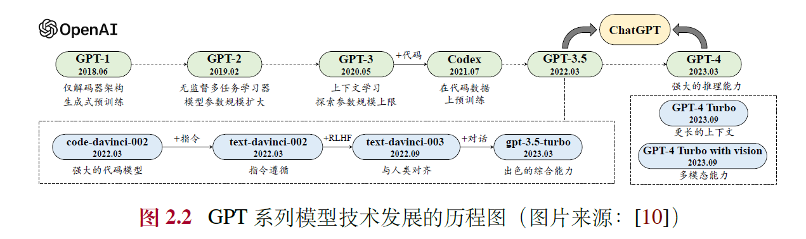
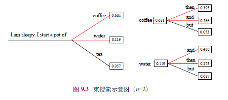
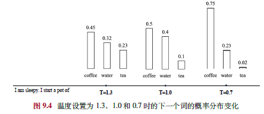

《大语言模型》（赵鑫等著）的读书笔记，按原书章节顺序覆盖第 1 至 11 章：语言模型的演进与扩展法则、预训练数据与模型架构、指令微调与人类对齐、解码与部署、提示学习，以及规划与智能体。

原书 PDF：[大语言模型PDF](images/LLMBook.pdf)

## 第 1 章 引言

### 1.1 语言模型的发展历程
语言模型旨在通过建模人类语言的规律来预测词序列的概率，其发展经历了四个主要阶段：
1. **统计语言模型（SLM）**：20世纪90年代兴起，基于统计方法和马尔可夫假设（如n-gram模型），广泛用于信息检索和早期NLP任务。但受限于数据稀疏和高阶上下文建模能力不足。
2. **神经语言模型（NLM）**：引入神经网络（如RNN）和分布式词表示（词嵌入，如word2vec），克服数据稀疏问题，增强语义表示能力，显著提升了NLP任务性能。
3. **预训练语言模型（PLM）**：基于大规模无标注数据预训练（如ELMo、BERT、GPT-1），引入Transformer架构和“预训练-微调”范式，提升上下文感知和任务迁移能力。
4. **大语言模型（LLM）**：通过规模扩展（如GPT-3、ChatGPT）带来性能跃升，具备涌现能力（如上下文学习），从语言建模转向通用任务求解，成为AI研究热点。

### 1.2 大语言模型的能力特点
大语言模型相比传统模型展现出显著优势：
- **丰富的世界知识**：通过超大规模数据预训练，掌握广泛知识。
- **通用任务解决能力**：基于下一个词预测的多任务学习，能解决多样化任务。
- **复杂任务推理能力**：在知识推理和数学问题中表现出色。
- **人类指令遵循能力**：通过自然语言提示实现任务执行。
- **人类对齐能力**：通过强化学习等技术与人类价值观对齐。
- **工具使用能力**：可通过微调或提示学习调用外部工具，扩展功能。

### 1.3 大语言模型关键技术概览
大语言模型的成功依赖以下技术：
- **规模扩展**：参数、数据和算力的增加遵循“扩展法则”，提升性能。
- **数据工程**：高质量数据采集、清洗和课程设计至关重要。
- **高效预训练**：分布式训练（如DeepSpeed）和优化技术支持大规模模型训练。
- **能力激发**：指令微调和提示策略（如思维链）激发模型潜能。
- **人类对齐**：RLHF等技术确保模型输出符合人类预期。
- **工具使用**：通过插件机制扩展模型能力。

### 1.4 大语言模型对科技发展的影响
大语言模型推动了多个领域的变革：
- **自然语言处理**：取代传统任务特定方法，研究转向提升综合能力。
- **信息检索**：与搜索引擎融合，形成对话式信息获取模式。
- **计算机视觉**：支持多模态模型发展（如GPT-4、Sora）。
- **AI4Science**：赋能数学、化学等领域的科研创新。
此外，大语言模型改变了科研范式和产业应用，推动通用人工智能（AGI）的探索。

### 总结
本章回顾了语言模型从统计方法到大语言模型的演化，强调了大语言模型在能力、技术和应用上的突破。它不仅是语言建模的延续，更是AI从专用智能向通用智能跃升的关键，展现了技术规模化与数据驱动的巨大潜力，同时也带来了新的研究与应用挑战。

## 第 2 章 基础介绍

---

### 2.1 大语言模型概述
- **定义**：大语言模型是指在海量无标注文本数据上预训练得到的超大规模语言模型，参数规模通常达百亿、千亿甚至万亿（如GPT-3、PaLM、LLaMA），或通过超大规模数据训练的较小模型（如LLaMA-2 7B）。
- **特点**：相比传统语言模型，大语言模型采用更复杂的训练方法，展现出强大的自然语言理解和复杂任务求解能力。
- **构建目标**：旨在成为通用任务求解器，而非仅针对特定任务优化。

---

### 2.2 大语言模型的构建过程
构建大语言模型通常分为两个阶段：

**2.2.1 大规模预训练**
- **目标**：利用大规模无标注文本数据为模型参数找到较好的初始值，压缩世界知识。
- **技术路径**：基于Transformer架构（尤其是仅解码器架构）和“预测下一个词”的任务（如GPT系列），已成为主流。
- **数据与算力**：
  - 需要高质量、多源化的文本数据（当前开源模型常用2-3T词元，趋势仍在扩大）。
  - 算力需求极高：百亿参数模型需百卡集群（如A100 80G）训练数月，千亿参数需千卡甚至万卡。
- **挑战**：数据清洗、学习率调整、异常检测等经验性技术需研发人员深度优化，避免算力浪费。

**2.2.2 指令微调与人类对齐**
- **指令微调（SFT）**：
  - 通过任务输入-输出配对数据（模仿学习），激发模型问答能力。
  - 数据规模较小（数万至百万条即可），算力需求低（如单机八卡A100数天完成）。
- **人类对齐（Alignment）**：
  - 使用强化学习（如RLHF）增强模型与人类价值观一致性，减少有害输出。
  - RLHF需训练奖励模型，基于人类偏好排序，资源消耗介于预训练与微调之间。
- **结果**：经过微调与对齐，模型具备较强的人机交互能力，能通过问答解决任务。

---

### 2.3 扩展法则（Scaling Law）
扩展法则研究模型性能与规模（模型参数𝑁、数据规模𝐷、算力𝐶）的关系，是大语言模型成功的关键。

**2.3.1 KM 扩展法则（OpenAI）**
- **公式**：性能损失𝐿与𝑁、𝐷、𝐶呈幂律关系（𝐿(𝑁) ∝ 𝑁⁻ᵅᴺ等）。
- **特点**：倾向将算力更多分配给模型规模（𝑎≈0.73 > 𝑏≈0.27），认为参数规模提升更重要。
- **意义**：提供定量指导，排除架构等次要因素影响。

**2.3.2 Chinchilla 扩展法则（DeepMind）**
- **公式**：𝐿(𝑁,𝐷) = 𝐸 + 𝐴/𝑁ᵅ + 𝐵/𝐷ᵝ，推导出最优分配𝑁opt∝𝐶ᵃ，𝐷opt∝𝐶ᵇ。
- **特点**：主张参数与数据规模等比例扩展（𝑎≈0.46，𝑏≈0.54），指出早期模型（如GPT-3）数据不足。
- **实例**：Chinchilla（70B参数，1.4T词元）验证了数据规模的重要性。

**2.3.3 讨论**
- **可预测扩展**：小模型可预估大模型性能，早期训练可监控异常，节省算力。
- **任务层面**：语言建模损失减少不总对应任务性能提升，某些任务甚至出现“逆向扩展”。
- **数据需求**：实际数据需求远超法则估计（如LLaMA-2 7B用2T词元），Transformer架构对数据扩展性强，未达饱和。

---

### 2.4. 涌现能力（Emergent Abilities）
- **定义**：模型规模达一定阈值时，特定任务性能突然跃升，常见于大模型而非小模型。
- **代表性能力**：
  - **上下文学习（ICL）**：无需训练，仅通过提示和示例完成任务（如GPT-3 175B）。
  - **指令遵循**：经微调后按自然语言指令执行任务（如InstructGPT）。
  - **逐步推理**：通过思维链（CoT）解决复杂推理问题（如PaLM 540B）。
- **争议**：
  - 可能因评估指标不连续或模型规模测试有限而夸大。
  - 用户感知仍以离散方式为主（如代码正确性），支持涌现能力的实用性。
- **与扩展法则关系**：法则预测平滑提升，涌现能力呈现跃升，二者趋势不完全一致。

---

### 2.5. GPT系列模型的技术演变

GPT系列由OpenAI开发，经历了四个阶段：

 **2.5.1 早期探索（GPT-1, GPT-2）**
- **GPT-1 (2018)**：基于解码器Transformer，奠定预训练基础，参数较小（~100M），需微调。
- **GPT-2 (2019)**：参数增至1.5B，探索无监督多任务学习，提出语言建模即任务求解。

 **2.5.2 规模扩展（GPT-3）**
- **GPT-3 (2020)**：参数175B，引入上下文学习，确立提示学习范式，验证规模提升性能。

 **2.5.3 能力增强（GPT-3.5, Codex, InstructGPT）**
- **Codex (2021)**：在代码数据上微调，提升编程与推理能力。
- **InstructGPT (2022)**：引入RLHF，增强指令遵循与安全性。
- **GPT-3.5**：整合代码训练与对齐技术，综合能力提升。

 **2.5.4 性能跃升（ChatGPT, GPT-4）**
- **ChatGPT (2022)**：优化对话能力，支持多轮交互与插件，引发广泛关注。
- **GPT-4 (2023)**：图文多模态，推理能力跃升，安全性增强（如红队攻击）。
- **GPT-4 Turbo等**：扩展上下文（128K）、多模态支持（视觉、语音），优化性能与生态。

---

### 2.6. 总结与展望
- **核心驱动**：大规模预训练、指令微调与对齐、规模扩展是LLM成功的基石。
- **挑战**：算力依赖、数据稀缺、幻觉与安全性需持续改进。
- **趋势**：多模态、更高效训练（如数据合成）、更强泛化能力是未来方向。

---

## 第 3 章 大语言模型资源

本章主要介绍了大语言模型研发中可公开使用的资源，包括模型检查点和API、预训练数据、微调数据以及常用代码库。以下是对内容的简要总结，方便您快速把握核心要点：

### 3.1 公开可用的模型检查点或API
- **背景**：预训练大模型需要大量算力和数据，开源模型检查点和商业API极大降低了研发门槛。
- **通用模型检查点**：
  - **LLaMA及LLaMA-2**：Meta AI 发布的开源模型，参数规模从7B到70B，广泛用于研究和微调，LLaMA-2支持商用并优化了性能。
  - **ChatGLM**：智谱AI和清华大学开发的中英双语模型，6B参数，支持对话和长文本处理。
  - **Falcon**：TII发布的模型，最高180B参数，是当时最大的开源模型。
  - **Baichuan及Baichuan-2**：百川智能的中英双语模型，7B和13B，支持商用。
  - **InternLM及InternLM-2**：上海人工智能实验室的多语言模型，7B至20B，提供完整工具链。
  - **Qwen**：阿里巴巴的多语言模型，0.5B至72B，支持代码、数学等多模态任务。
  - **Mistral及Mixtral**：Mistral AI的模型，7B至46.7B，采用MoE架构提升效率。
  - **DeepSeek LLM**：幻方公司的中英模型，7B至67B，擅长代码和数学。
  - **Gemma**：谷歌的轻量模型，2B和7B，专注英语任务。
  - **MiniCPM**：面壁智能与清华合作的2B模型，高效且支持多模态。
  - **YuLan-Chat**：中国人民大学的中英模型，最新12B版本经过完整训练流程。
- **LLaMA变体系列**：如Alpaca、Vicuna等，通过指令微调扩展功能，覆盖基础指令、中文指令、垂域指令和多模态指令。
- **公共API**：
  - **OpenAI**：提供GPT-3.5 Turbo、GPT-4等语言模型API，以及text-embedding系列用于文本表征。

### 3.2 常用的预训练数据集
- **网页**：如Common Crawl、C4、RefinedWeb（英文）和ChineseWebText、WanJuan（中文），提供大规模多语言数据。
- **书籍**：如BookCorpus、Project Gutenberg，高质量长文本，需注意版权。
- **维基百科**：多语言、高质量知识源，支持实时更新。
- **代码**：如The Stack、StarCoder，提升模型编程能力。
- **混合型**：如The Pile、ROOTS、Dolma，整合多源数据。

### 3.3 常用微调数据集
- **指令微调**：
  - **NLP任务**：P3、FLAN，基于多任务数据集。
  - **对话**：ShareGPT、OpenAssistant、Dolly，来源于真实用户交互。
  - **合成**：Self-Instruct、Alpaca，利用大模型生成数据。
- **人类对齐**：如HH-RLHF、SHP、PKU-SafeRLHF，关注有用性、诚实性和无害性。

### 3.4 代码库资源
- **Hugging Face**：提供Transformers、Datasets、Accelerate，简化模型开发和数据处理。
- **DeepSpeed**：微软的高性能库，支持分布式训练，包含MII和Chat框架。
- **Megatron-LM**：NVIDIA的优化库，支持多种并行策略。
- **本书配套**：包括LLMSurvey综述、YuLan-Chat模型和LLMBox代码库。

### 总结
本章全面梳理了大语言模型研发的资源生态，从模型到数据再到代码库，为读者提供了入门和实践的参考。资源的开源共享显著降低了研发成本，推动了技术进步。

## 第 4 章 预训练

预训练是研发大语言模型的第一个训练阶段，也是最为重要的一个阶段。有效的预训练能够为大语言模型的能力奠定坚实的基础：通过在大规模语料上进行预训练，大语言模型可以获得通用的语言理解与生成能力，掌握较为广泛的世界知识，具备解决众多下游任务的性能潜力。在这一过程中，预训练语料的规模和质量对于提升大语言模型的能力至关重要。

### 4.1 数据来源
- **重要性**：预训练是构建大语言模型的关键阶段，数据的规模和质量直接影响模型的语言理解与生成能力。
- **数据类型**：
  - **通用文本数据**：包括网页（主要来源数据集，如C4、RefinedWeb）、书籍（数据集，Books3、Bookcorpus2）、对话文本，提供广泛的世界知识。
  - **专用文本数据**：如多语文本（提升跨语言能力，如BLOOM、PaLM）、科学文本（增强科学推理，如arXiv）、代码（提高编程能力，如GitHub、StackExchange）。

- **图4.1**：展示了不同模型（如LLaMA、GPT-3、CodeGen等）的预训练数据来源比例，网页数据通常占主导地位。

### 4.2 数据预处理
- **目标**：通过质量过滤、敏感内容过滤和去重，确保数据的高质量和安全性。
- **质量过滤**：
  - **启发式规则**：基于语种（如过滤非目标语言）、统计指标（如困惑度、符号比例）、关键词（如HTML标签）。
  - **分类器方法**：训练分类器（如FastText、BERT）识别低质量数据，需平衡效率与准确性。
- **敏感内容过滤**：
  - **有毒内容**：使用分类器（如Jigsaw数据集训练）过滤攻击性文本。
  - **隐私内容**：通过规则（如正则表达式）去除PII（如邮箱、电话号码）。
- **数据去重**：
  - **粒度**：句子、文档、数据集级别。
  - **方法**：精确匹配（后缀数组）、近似匹配（MinHash）。
- **影响**：
  - **数据数量**：符合扩展法则（如Chinchilla的20:1比例），更多数据提升性能。
  - **数据质量**：高质量数据（如Phi-1的“教科书级”数据）显著提高效率，低质量数据导致“幻象”等问题。
  - **重复数据**：可能引发双下降现象，需精细去重。
  - **数据集污染**：需避免训练与测试数据重叠，确保评估公平性。

### 4.3 词元化（分词）
- **目标**：将文本转化为模型可处理的词元序列。
- **方法**：
  - **BPE**：基于频率合并词元（如GPT-2的Byte-level BPE），解决未登录词问题。
  - **WordPiece**：基于似然性增量合并（如BERT），使用前缀标记子词。
  - **Unigram**：从大词表迭代删除词元（如T5），基于一元语言模型。
- **选用**：定制化分词器（如SentencePiece）更高效，需考虑无损重构和高压缩率。

### 4.4 数据调度
- **数据混合**：
  - **典型分布**：如LLaMA以网页为主，CodeGen增加代码比例。
  - **策略**：增加多样性、优化配比（如DoReMi）、针对特定能力调整（如数学、代码）。
- **数据课程**：
  - **顺序安排**：从通用到专业化（如CodeLLaMA：通用→代码→Python）。
  - **应用**：提升代码、数学、长文本能力。
- **YuLan模型示例**：
  - **数据收集**：网页、书籍、代码等多源数据。
  - **清洗**：质量过滤、去重（MinHash）、隐私去除。
  - **调度**：通过小模型测试确定1:8中英文比例，最终使用1,680B词元。

## 第 5 章 模型架构

### 5.1 Transformer模型

- **核心结构**：Transformer由多层多头自注意力（Multi-head Self-attention）和前馈网络（FFN）组成，分为编码器和解码器两部分，可独立使用（如BERT用编码器，GPT用解码器）。
- **输入编码**：词元序列通过嵌入模块转为词向量，加入位置编码（Position Embedding, PE）以捕捉序列顺序信息。
- **多头自注意力**：通过查询（Query）、键（Key）、值（Value）计算注意力分数，支持长距离依赖建模，计算高效且并行性强。
- **前馈网络层**：引入非线性变换，提升模型表达能力。
- **编码器与解码器**：编码器用双向注意力生成上下文表示，解码器用掩码自注意力自回归生成序列，解码器还可通过交叉注意力关注编码器输出。

### 5.2 详细配置
- **归一化方法**：包括LayerNorm、RMSNorm（提高训练速度）和DeepNorm（稳定深层模型训练）。
- **归一化位置**：分为Post-Norm（原始设计，收敛快但不稳定）、Pre-Norm（稳定但性能稍逊）和Sandwich-Norm（结合两者，灵活性高但可能不稳定）。
- **激活函数**：从ReLU（简单但有神经元失效问题）发展到GELU、Swish及GLU变体（如SwiGLU、GeGLU），后者性能更优但计算复杂。
- **位置编码**：
  - **绝对位置编码**：如正余弦编码或可学习嵌入，局限于训练长度。
  - **相对位置编码**：如Transformer-XL、T5偏置，引入相对距离信息，支持一定外推。
  - **RoPE**：用旋转矩阵融合绝对与相对位置信息，广泛应用（如LLaMA）。
  - **ALiBi**：通过距离惩罚增强外推能力，无需额外参数。
- **注意力机制**：
  - **完整自注意力**：计算复杂度高（O(T²)）。
  - **稀疏注意力**：如滑动窗口注意力，降低复杂度至O(wT)。
  - **多查询/分组查询**：共享键值矩阵，提高效率。
  - **硬件优化**：如FlashAttention和PagedAttention，提升计算和内存效率。
- **混合专家模型（MoE）**：通过路由网络选择激活专家（如Mixtral 8×7B），在低计算成本下提升性能。
- **LLaMA配置**：推荐Pre-RMSNorm、SwiGLU、RoPE，代码实现展示了其解码器结构。

### 5.3 主流架构
- **编码器-解码器**：如T5，双向编码+自回归解码，适用于理解与生成任务。
- **因果解码器**：如GPT-3，单向掩码注意力，主流架构，擅长生成任务。
- **前缀解码器**：如GLM-130B，前缀双向编码+输出单向解码，参数共享，灵活性强。

### 5.4 长上下文模型
- **挑战**：传统模型受限于上下文窗口（如LLaMA-2的4096词元），需扩展以处理长文本。
- **扩展位置编码**：
  - **直接微调**：用长文本训练，但收敛慢。
  - **位置索引修改**：如位置内插（缩放索引）、位置截断（限制远距离角度）。
  - **基修改**：调整RoPE底数或截断关键子空间，提升外推能力。
- **调整上下文窗口**：
  - **并行上下文窗口**：分段编码，顺序关系弱。
  - **Λ形窗口**：关注起始和邻近词元，适合流式生成。
  - **词元选择**：基于相似度选关键词元或分块，优化效率。
- **长文本数据**：需少量多样化数据（1B词元即可），领域分布应与预训练匹配，优先整体型文本。

### 5.5 新型模型架构
- **问题**：Transformer自注意力复杂度高（O(T²)），不适合超长序列。
- **状态空间模型（SSM）**：结合RNN和CNN优点，支持并行训练和高效解码。
- **变种**：
  - **Mamba**：输入选择机制，性能强但无并行卷积。
  - **RWKV**：词元偏移+时间/频道混合，效率高但训练非并行。
  - **RetNet**：多尺度保留机制，支持并行与循环计算。
  - **Hyena**：长卷积替换注意力，训练高效但解码复杂度随序列增长。

---

### 关键点与趋势
1. **Transformer主导地位**：因果解码器（如GPT系列）因生成能力强成为主流，长上下文和效率优化是当前重点。
2. **配置优化**：归一化、激活函数和位置编码的改进显著提升稳定性和性能。
3. **长文本建模**：位置编码扩展和上下文窗口调整并行发展，数据质量至关重要。
4. **新型架构**：SSM及其变种（如Mamba）在效率和长序列建模上挑战Transformer。

---

## 第 6 章 模型预训练

本章详细阐述了大语言模型预训练的流程，包括预训练任务设计、优化参数设置、可扩展训练技术、效率分析及代码实践。以下是各节的核心内容：

### 6.1 预训练任务
预训练任务旨在通过自监督学习从海量无标注数据中提取语义和世界知识，常见任务分为三类：
1. **语言建模 (LM)**
   - **核心思想**：预测下一个词元，基于自回归方式优化似然函数$LLM(\mathbf{u}) = \sum_{t=1}^T \log P(u_t | \mathbf{u}_{<t}) $。
   - **应用**：广泛用于解码器模型（如GPT-3、PaLM），通过预测词元学习语言生成规律。
   - **变种**：
     - **前缀语言建模**：基于前缀预测后缀，仅计算后缀损失，适用于前缀解码器架构。
     - **中间填充任务**：调整序列顺序，训练模型填补中间缺失信息，常用于代码补全。
   - **特点**：任务简单但效果显著，可隐式学习多任务能力（如情感分析、算术推理）。

2. **去噪自编码 (DAE)**
   - **目标**：从损坏文本 $\mathbf{\tilde{u}}$ 恢复原始文本 $\mathbf{u}$，优化 $ L_{DAE}(\mathbf{u}) = \log P(\mathbf{\tilde{u}} | \mathbf{u} \setminus \mathbf{\tilde{u}}) $。
   - **应用**：常见于BERT、T5，通过随机替换或删除词元训练模型。
   - **特点**：实现复杂，需设计替换策略，较少单独用于大模型预训练。

3. **混合去噪器 (MoD)**
   - **思想**：统一语言建模和去噪自编码，定义 S（前缀）、R（短片段）、X（长片段）三种去噪器。
   - **应用**：用于UL2、PaLM 2，输入以特殊标记（如 [S], [R], [X]）区分任务类型。
   - **优势**：增强模型对不同损坏模式的适应性。

### 6.2 优化参数设置
为确保大模型训练稳定性和性能，需优化以下参数：
1. **批次大小**：通常为1M-4M词元，动态调整（如GPT-3从32K增至3.2M）以提升稳定性。
2. **学习率**：采用预热（0.1%-0.5%步数）+衰减策略（如余弦衰减），最大值一般为 $5 \times 10^{-5}$  至 $1 \times 10^{-4}$ 。
3. **优化器**：常用Adam/AdamW（超参数 $\beta_1=0.9, \beta_2=0.95, \epsilon=10^{-8}$ ）或Adafactor（节省显存）。
4. **稳定技术**：
   - 梯度裁剪（阈值1.0）防止损失突增；
   - 权重衰减（系数0.1）增强泛化；
   - 训练恢复设置存档点应对异常。

### 6.3 可扩展的训练技术
针对大模型的计算资源挑战，提出以下高效训练技术：
1. **3D 并行训练**：
   - **数据并行**：复制模型到多GPU，均分数据计算梯度后平均。
   - **流水线并行**：将模型层分配到不同GPU，配合梯度累积提升效率。
   - **张量并行**：分解参数矩阵（如注意力层 $ W_Q, W_K, W_V $），并行计算。
2. **零冗余优化器 (ZeRO)**：分片模型参数、梯度、优化器状态，减少显存冗余（ZeRO-3可降至 $ 1/N_D $）。
3. **激活重计算**：仅保存部分激活值，反向传播时重算，节省显存但增加计算开销。
4. **混合精度训练**：结合FP16/BF16（16位）和FP32（32位），提升效率并减少显存占用。

### 6.4 模型参数量计算与效率分析
1. **参数量计算**：以LLaMA为例，公式为 $ 2VH + H + L \cdot (4H^2 + 3HH' + 2H) $，如LLaMA-7B约为67亿参数。
2. **训练运算量**：近似为 $ 6CP $（未用激活重计算）或 $ 8CP $（使用时），C为词元总数，P为参数量。
3. **训练时间**：基于 $ \text{时间} = \frac{\text{运算量}}{\text{GPU数} \times \text{GPU浮点运算能力}} $，如LLaMA-65B约21天。
4. **显存估计**：
   - 模型参数与优化器：ZeRO-3下为 $ 16P/N_D $ 字节。
   - 激活值：受批次大小 $ B $、序列长度 $ T $、层数 $ L $ 等影响。
   - 总显存：如LLaMA-7B每GPU约66GB。

### 6.5 预训练代码实践
基于Transformers和DeepSpeed，提供LLaMA-7B预训练示例：
- **代码结构**：包括模型加载、分词器初始化、数据处理（PTDataset类）和训练循环。
- **关键参数**：支持BF16、ZeRO-3、激活重计算等优化。
- **运行方式**：使用torchrun实现多GPU训练，DeepSpeed配置文件设置并行策略。

---

### 总结要点
- **任务设计**：语言建模为主流，辅以去噪任务提升多样性。
- **优化策略**：动态批次、学习率调度和Adam优化器是关键。
- **训练技术**：3D并行和混合精度显著提升效率。
- **资源估算**：参数量、运算量和显存需求可量化分析。
- **实践支持**：提供可运行代码，适配中小规模模型训练。

---

## 第 7 章 指令微调

### 1. 指令微调概述
- **定义**：指令微调（Instruction Tuning）是用自然语言形式的指令数据对预训练大语言模型进行参数微调的过程，旨在增强模型的指令遵循能力和零样本学习能力。术语由谷歌研究员于2022年ICLR论文正式提出。
- **别称**：有监督微调（Supervised Fine-tuning）或多任务提示训练（Multitask Prompted Training）。
- **目标**：通过微调使模型能够理解并执行多样化的下游任务指令。

---

### 2. 指令数据的构建（7.1节）
指令数据通常包括任务描述（指令）、输入-输出对及可选示例。构建方法包括以下三种：

 **2.1 基于现有NLP任务数据集**
- **来源**：利用开源NLP数据集（如翻译、摘要、分类），添加任务描述（如“请翻译成英文”）将其转化为指令格式。
- **工具**：PromptSource平台支持任务描述的创建与验证。
- **扩展**：可通过翻转输入-输出对生成新任务（如基于答案生成问题）。
- **代表性数据集**：FLAN、P3、Super-Natural Instructions等，FLAN v2混合约20M条实例。

 **2.2 基于日常对话数据**
- **来源**：用户真实查询（如InstructGPT中的OpenAI API数据）或人工标注的对话任务（如开放式生成、问答）。
- **特点**：贴近真实场景，适合提升指令遵循能力。
- **开源数据集**：Dolly、OpenAssistant、ShareGPT（多轮对话数据）。

 **2.3 基于合成数据**
- **方法**：利用大语言模型生成指令数据，减少人工标注成本。
- **代表性技术**：
  - **Self-Instruct**：以少量人工实例为种子，迭代生成52K条数据（如Alpaca-52K）。
  - **Evol-Instruct**：通过深度（复杂化）和广度（多样性）演化提升指令质量。
  - **Self-Align**：基于人类对齐原则过滤高质量数据。
  - **指令回译**：从现有文本逆向生成指令。
- **优势**：高效、可扩展；**挑战**：需过滤低质或重复数据。

 **2.4 提升方法**
- **指令格式**：任务描述设计和示例数量影响性能，混合零样本与少样本提示效果更佳。
- **数量扩展**：适量高质量指令（52K条可媲美text-davinci-003）比大规模低质数据更重要。
- **重写与筛选**：如Evol-Instruct复杂化、YuLan-Chat-3主题多样化、Alpagasus筛选高质指令。

 **2.5 作用**
- **性能改进**：提升模型在多任务上的表现，小模型甚至超越未微调大模型。
- **任务求解**：增强零样本任务能力，缓解预训练问题（如重复生成）。
- **领域适配**：通过特定领域数据微调（如Med-PaLM医学模型）适配专业任务。

---

### 3. 训练策略（7.2节）
 **3.1 优化设置**
- **目标函数**：序列到序列损失，仅计算输出部分损失。
- **批次与学习率**：较小批次和学习率（如InstructGPT 8/5.03×10⁻⁶，Alpaca 128/2×10⁻⁵）。
- **多轮对话**：通过损失掩码一次性输入多轮内容，提高效率。

 **3.2 数据组织**
- **平衡分布**：混合NLP任务、对话和合成数据，设置最大采样容量避免单一数据集主导。
- **多阶段微调**：先用NLP数据，后用对话和合成数据，逐步增加复杂性。
- **结合预训练**：微调中加入少量预训练数据正则化，或预训练中引入指令任务。

---

### 4. 参数高效微调（7.3节）
针对大模型全参数微调成本高的问题，提出参数高效微调方法：

 **4.1 LoRA（低秩适配）**
- **原理**：冻结预训练权重，通过低秩分解矩阵（A、B）更新参数，减少训练量。
- **显存节省**：从16P降至2P+16P_LoRA（如LLaMA 7B从108GB降至14GB）。
- **变种**：
  - **AdaLoRA**：动态调整秩，优化性能。
  - **QLoRA**：4比特量化预训练参数，进一步降至0.5P显存。
- **应用**：广泛用于LLaMA、BLOOM等模型的多语言、多领域微调。

 **4.2 其他方法**
- **适配器微调**：在Transformer层插入瓶颈网络，仅训练适配器参数。
- **前缀微调**：在注意力层添加可训练前缀向量。
- **提示微调**：在输入层加入连续提示向量，依赖底层模型能力。

---

### 5. 代码实践与分析（7.4节）
 **5.1 指令微调代码**
- **实现**：基于Transformers库，使用SFTDataset处理指令数据，DataCollator计算序列损失。
- **资源需求**：LLaMA 7B-65B全量微调需2-16张A800 GPU，时间3-11小时。

 **5.2 实验分析**
- **数据集**：FLAN v2（NLP任务）、ShareGPT（对话）、Alpaca（合成）。
- **改进策略**：Evol-Instruct复杂化、YuLan-Chat-3多样化。
- **结果**：
  - FLAN v2擅NLP任务，ShareGPT擅对话，Alpaca介于两者。
  - 复杂性与多样性提升对话能力，接近ShareGPT。
  - 大模型（13B）比小模型（7B）更强。

 **5.3 LoRA实践**
- **代码**：扩展nn.Linear实现LoRA，使用PEFT库集成。
- **资源**：LLaMA 7B-65B需1-2张A800 GPU，时间2.3-26小时，显存大幅降低。

---

### 总结
指令微调通过多样化的数据构建和高效训练策略显著提升大语言模型的指令遵循能力。参数高效方法如LoRA在降低资源需求的同时保持性能，成为实际应用的关键技术。实验表明，指令质量优于数量，模型规模和数据类型匹配下游任务是性能提升的关键。

---

## 第 8 章 人类对齐

### 概述
大语言模型（LLM）通过海量文本数据学习，行为受数据质量和来源影响。经过预训练和指令微调后，模型具备通用能力和指令遵循能力，但可能生成有偏见、冒犯或错误的文本。为确保模型行为与人类价值观、社会伦理一致，人类对齐（Human Alignment）成为关键研究问题。本章探讨对齐背景、标准及技术方法。

---

### 8.1 人类对齐的背景与标准

- **背景**：尽管LLM在下游任务表现出色，但可能生成错误或有害内容，因预训练和微调未充分考虑人类价值观。人类对齐旨在通过引入新标准（如有用性、诚实性、无害性）确保模型与人类期望一致。例8.1展示了未经对齐的模型易受误导逻辑影响，而对齐后能识别错误并提供合理输出。
- **对齐标准**：
  - **有用性**：提供准确、有创造性的信息，理解上下文并主动澄清歧义。
  - **诚实性**：输出真实客观，避免误导并表达不确定性。
  - **无害性**：避免有害、冒犯性内容，拒绝恶意请求。
  - 其他细化标准包括行为对齐、意图对齐和道德对齐，主观性强，难以形式化建模。

---

### 8.2 基于人类反馈的强化学习（RLHF）

- **概述**：RLHF通过人类反馈指导LLM对齐，包含三步骤：监督微调、奖励模型训练和强化学习（如PPO）。目标是优化模型在有用性、诚实性、无害性上的表现。
- **人类反馈收集**：
  - 选择高素质标注员（如母语者、高学历），通过一致性筛选确保可靠性。
  - 反馈形式：评分（直接打分）和排序（Elo评分系统，两两比较）。
- **奖励模型训练**：
  - 用人类偏好数据训练模型预测评分，方法包括打分式（MSE损失）、对比式（正负例分数差）和排序式（全局排序）。
  - 优化策略：目标函数加正则项、选用大模型作为基座、针对多标准训练多个奖励模型。
- **强化学习训练**：
  - 将文本生成视为决策过程，LLM为策略模型，优化目标是最大化奖励。
  - PPO算法通过优势估计、重要性采样和梯度裁剪/KL散度惩罚提升稳定性。
- **代表性工作**：
  - **InstructGPT**：通过SFT、奖励模型和PPO对齐GPT-3，小模型（1.3B）性能超大模型（175B）。
  - **LLaMA-2**：结合拒绝采样和PPO，迭代优化安全性与有用性。
- **进阶RLHF**：
  - **过程监督**：对生成步骤逐一评估（如PRM800K数据集），提升细粒度对齐。
  - **AI反馈（RLAIF）**：用对齐模型（如Constitutional AI）或自我反馈替代人类反馈，降低成本。

---

### 8.3 非强化学习的对齐方法

- **局限性与替代**：RLHF复杂且不稳定，非强化学习方法通过监督微调（SFT）直接对齐，依赖高质量数据集和算法。
- **对齐数据收集**：
  - **基于奖励模型**：用已训练奖励模型评分或排序输出。
  - **基于LLM**：利用对齐模型（如ChatGPT）自我评价和修正生成数据。
- **DPO算法**：
  - 通过偏好数据直接优化策略模型，避免奖励建模，目标函数基于正负例概率差。
  - 优点：资源占用少、稳定性高，性能媲美RLHF。
- **其他监督对齐**：
  - **质量提示**：为输出加前缀（如“好的回复”）区分质量。
  - **质量对比**：用对比学习优化正负例概率，增强匹配性。

---

### 8.4 SFT与RLHF的比较

- **总体比较**：
  - **SFT**：模仿学习，通过词元级损失优化，简单高效。
  - **RLHF**：强化学习，通过文本级奖励优化，探索性强。
- **SFT优缺点**：
  - 优点：提升性能、泛化能力和专业性。
  - 缺点：易产生幻觉、受数据质量和一致性影响。
- **RLHF优缺点**：
  - 优点：增强能力、减少有害输出和幻觉，偏好标注一致性高。
  - 缺点：样本效率低、不稳定，依赖SFT初始化。
- **讨论**：SFT解锁能力，RLHF优化对齐，未来需结合二者优点并探索超级对齐。

---

### 总结
人类对齐是LLM发展中的核心挑战，RLHF通过人类反馈和强化学习实现对齐，DPO等非强化方法则提供高效替代。SFT和RLHF各有优劣，实际应用需根据任务需求权衡，未来研究方向包括更有效的对齐技术和超级智能监管。

---

## 第 9 章 解码与部署

---

### 9.1 解码策略
大语言模型通过自回归生成文本，解码策略决定输出质量与多样性。

#### 9.1.1 背景
- **自回归解码流程**：模型基于上下文逐词生成概率分布，选择下一词元，迭代至结束。
- **基本策略**：
  - **贪心搜索**：每步选概率最高词元，适合翻译/摘要，但开放任务易生成重复、不自然文本。
  - **概率采样**：按概率分布采样，增加多样性，但可能引入无关词元。

#### 9.1.2 贪心搜索改进
- **束搜索**：保留Top-k候选句子（束大小3-6），选整体概率最高者，避免局部最优。
- **长度惩罚**：归一化概率（惩罚因子0.6-0.7），鼓励长句生成。
- **重复惩罚**：如n-gram惩罚（3-5）、出现/频率惩罚（0.1-1），减少重复。

#### 9.1.3 随机采样改进
- **温度采样**：调整softmax温度（<1集中分布，>1均匀化），控制随机性。
- **Top-k采样**：从Top-k词元采样，减少低概率词影响。
- **Top-p采样**：从累积概率≥p的词元集采样，适应上下文变化。
- **对比解码**：利用大/小模型概率差值，提升重要词元影响力。

#### 9.1.4 实际设置
- **T5**：贪心/束搜索（束大小4，惩罚0.6）。
- **GPT-3**：束搜索（4，0.6）。
- **Alpaca**：Top-k（50）、Top-p（0.9）、温度0.7。
- **LLaMA**：任务相关（如贪心、温度0.1/0.8）。
- **OpenAI API**：支持多种策略及惩罚参数。

---

### 9.2 解码加速算法
自回归解码效率低，需优化全量解码（初始计算）和增量解码（逐词生成）阶段。

参考：[全量解码与增量解码原理区别以及应用](../全量解码与增量解码原理区别以及应用/)

#### 9.2.1 解码效率分析
- **阶段**：
  - **全量解码**：一次性计算输入状态，缓存键值。
  - **增量解码**：仅计算新词元状态，更新缓存。
- **效率指标**：GPU算力（FLOP/s）、带宽（byte/s）、计算强度（FLOP/byte）。
- **瓶颈**：
  - 全量解码：计算瓶颈（算力限制）。
  - 增量解码：带宽瓶颈（内存墙）。

#### 9.2.2 系统级优化
- **FlashAttention**：分块融合注意力计算，减少访存量，提速10倍。
- **PagedAttention**：分页管理键值缓存，优化拼接与注意力并行。
- **批次管理**：
  - **vLLM连续批处理**：动态拆分请求，增大批次。
  - **DeepSpeed-MII动态分割**：融合全量/增量解码，提升吞吐。

#### 9.2.3 解码策略优化
- **推测解码**：小模型预测、大模型验证，加速2倍。
- **级联解码**：按请求难度分配模型，分类器判断结果。
- **非自回归解码**：并行生成（如Medusa），需验证质量。
- **早退机制**：熵阈值或混合深度跳层计算，提效。

#### 9.2.4 代码实践
- **常见库**：llama.cpp（跨平台量化）、vLLM（高效解码）、DeepSpeed-MII（动态分割）、FlexFlow（推测优化）。
- **vLLM示例**：加载LLaMA-2-7b，支持贪心搜索、网络服务。

---

### 9.3 低资源部署策略
模型压缩减少显存占用，适应资源受限环境。

#### 9.3.1 量化基础
- **量化**：浮点数映射为整数（如INT8），缩放因子S、零点Z控制范围。
- **类型**：
  - **均匀/非均匀**：间隔是否固定。
  - **对称/非对称**：零点是否为0。
  - **粒度**：张量、通道、组，精度与开销权衡。
- **示例**：非对称/对称量化8-bit，误差分析。

#### 9.3.2 训练后量化
- **权重量化**：
  - **GPTQ**：逐层分组量化，3-4bit有效。
  - **AWQ**：激活感知缩放，关注关键权重。
- **权重+激活量化**：
  - **细粒度**：异常值用FP16，正常值INT8。
  - **SmoothQuant**：平衡量化难度，转移至权重。
- **其他**：
  - **QLoRA**：4-bit量化+16-bit适配器微调。
  - **量化感知训练**：蒸馏压缩权重/激活/缓存。

#### 9.3.3 经验分析
- **结论**：
  - INT8权重影响小，4-bit需优化策略。
  - 激活值难量化，需混合精度。
  - 轻量化微调（如QLoRA）补偿损失。
- **实验**：LLaMA 4/8-bit量化性能接近16-bit，显存降至3.94-7.34GB。

---

### 9.4 其他压缩方法
- **模型蒸馏**：
  - **传统**：反馈（logits）、特征（中间层）。
  - **大模型**：白盒（MINILLM）、黑盒（思维链蒸馏）。
- **模型剪枝**：
  - **传统**：结构化（删组件）、非结构化（掩码0）。
  - **大模型**：Sheared LLaMA动态剪枝至2.7B，恢复87.8%精度。

---

### 总结
本章探讨了大语言模型的解码与部署技术。解码策略平衡质量与多样性，加速算法优化效率，低资源策略通过量化、蒸馏、剪枝减少资源需求。未来需进一步提升效率与真实场景适配性。

## 第 10 章 提示学习

---

### 10.1 基础提示
提示学习通过自然语言接口与大语言模型交互，是解决下游任务的主要方法。提示质量直接影响模型表现，设计方法分为人工设计和自动优化。

#### 10.1.1 人工提示设计
- **关键要素**：
  - **任务描述**：清晰具体，如“回答问题”或“补全代码”，可用符号（如###）强调格式。
  - **输入数据**：自然语言或线性化结构化数据（如表格、图）。
  - **上下文信息**：提供参考文档或示例，提升复杂任务能力。
  - **提示策略**：如“逐步思考”前缀或专家角色，提升推理或领域表现。
- **设计原则**：
  - **清晰表达目标**：明确任务、格式和限制（如“50字摘要”）。
  - **分解子任务**：将复杂任务拆分为有序子步骤。
  - **少样本示例**：提供输入-输出对，增强语义映射。
  - **模型友好格式**：用特殊符号分隔，优先英语指令。

#### 10.1.2 自动提示优化
- **离散提示优化**（自然语言词元）：
  - **梯度方法**：用梯度搜索最佳词元，或优化“软词元”嵌入。
  - **强化学习**：将提示生成视为策略网络，基于奖励优化。
  - **编辑方法**：迭代修改提示，适配API调用场景。
  - **大模型方法**：用大模型生成提示，蒙特卡洛搜索筛选。
- **连续提示优化**（嵌入向量）：
  - **监督学习**：微调前缀/输入层提示向量，节省参数。
  - **迁移学习**：共享源任务提示，或加权组合适配目标实例。
- **局限性**：大模型参数量大，传统优化方法适用性有限。

---

### 10.2 上下文学习 (In-context Learning, ICL)
上下文学习通过任务描述和示例提示大模型，无需微调即可处理新任务。

#### 10.2.1 形式化定义
- **形式**：提示 = 任务描述 + 示例（可选） + 测试输入，模型生成输出。
- **与指令微调区别**：ICL仅靠提示调用，微调提升零样本能力。

#### 10.2.2 示例设计
- **示例选择**：
  - **相关度排序**：用k-NN检索相似示例。
  - **集合多样性**：MMR/DPP算法平衡相关性和多样性。
  - **大模型评分**：评估示例增益，或训练分类器筛选。
- **示例格式**：
  - **人工标注**：输入-输出对，或加任务描述/思维链。
  - **自动生成**：用大模型基于种子示例扩展模板。
- **示例顺序**：
  - **候选顺序**：语义相似度排序，靠近测试样本优先。
  - **质量评估**：用任务表现或预测熵值筛选。

#### 10.2.3 底层机制
- **预训练阶段**：
  - **任务设计**：元训练（如MetaICL）增强示例学习能力。
  - **数据选择**：多样性及长程依赖提升ICL，长尾词汇关键。
- **推理阶段**：
  - **任务识别**：利用预训练知识识别任务。
  - **任务学习**：隐式梯度下降或复杂算法学习新任务。
  - **规模效应**：小模型偏任务识别，大模型强于任务学习。

---

### 10.3 思维链提示 (Chain-of-Thought, CoT)
思维链通过中间推理步骤增强复杂推理任务表现。

#### 10.3.1 基本形式
- **结构**：⟨输入，思维链，输出⟩，提供逻辑推理过程。
- **简单方法**：如“Let’s think step by step”诱导推理。

#### 10.3.2 优化策略
- **示例设计**：
  - **复杂化**：增加推理步骤或问题长度。
  - **多样化**：聚类选择多样示例，减弱错误影响。
- **生成方法**：
  - **采样法**：Self-consistency生成多路径，投票集成。
  - **验证法**：DIVERSE用验证器检查推理路径/步骤。
- **拓展结构**：
  - **思维树 (ToT)**：树形搜索，支持前瞻和回溯。
  - **思维图 (GoT)**：图结构，节点汇聚复杂推理。

#### 10.3.3 进一步讨论
- **能力来源**：
  - **训练数据**：局部变量重叠支持推理。
  - **函数学习**：分解为信息聚焦和单步组合。
- **模型影响**：
  - **符号与模式**：表达任务意图为主。
  - **推理生成**：含推理路径的序列更准确。

---

### 总结
提示学习是高效利用大模型的关键。基础提示依赖人工设计或自动优化，上下文学习通过示例实现无微调任务适应，思维链提示增强复杂推理。未来需优化示例设计、推理结构及模型稳定性。

## 第 11 章 规划与智能体
---

### 11.1 基于大语言模型的规划
规划是大语言模型解决复杂问题和自主智能体的核心能力，通过分解任务并制定动作序列来简化问题求解。

#### 11.1.1 整体框架
- **核心组件**：
  1. **任务规划器（Task Planner）**：由大语言模型担任，生成解决方案（动作序列），可引入存储机制管理长期任务。
  2. **规划执行器（Plan Executor）**：执行动作，可由大语言模型或物理实体（如机器人）实现。
  3. **环境（Environment）**：动作执行的场景（如Web、虚拟世界）。
- **工作流程**：任务规划器生成方案，执行器在环境中执行，环境提供反馈，规划器根据反馈优化方案，迭代进行。

#### 11.1.2 方案生成
- **形式**：自然语言（直观但不严谨）或代码（规范、可执行）。
- **方法**：
  1. **一次性方案生成**：生成完整动作序列，简单但容错性低，适合逻辑性强的任务（代码表达）或非形式化任务（自然语言）。
  2. **迭代式方案生成**：逐步生成下一步动作，结合环境反馈调整。
     - **ReAct方法**：模拟“思考-决策”，生成决策理由和动作，迭代推进。
     - **回溯策略**：如思维树，通过回退优化方案，避免次优结果。

#### 11.1.3 反馈获取
- **外部反馈**：
  - **物理工具**：如代码解释器，提供执行结果。
  - **人类**：在具身智能中提供实时环境信息。
  - **虚拟环境**：如游戏，提供动作反馈。
- **内部反馈**：
  - 大语言模型自我判断动作正确性。
  - **Reflexion方法**：将简单反馈转为详细反思，优化方案。

---

### 11.2 基于大语言模型的智能体
智能体是具备感知、决策、执行能力的自主系统，大语言模型提升其在开放动态环境中的表现。

#### 11.2.1 智能体概述
- **发展历程**：
  - **规则智能体**：依赖预定义规则，适应性低。
  - **模型智能体**：如强化学习，通过试错学习策略。
  - **大语言模型智能体**：利用语言理解和规划能力，处理复杂任务。

#### 11.2.2 大语言模型智能体的构建
- **核心组件**：
  1. **记忆组件**：
     - **短期记忆**：上下文窗口，临时存储近期信息。
     - **长期记忆**：持久存储知识、经验，外部存储实现。
  2. **规划组件**：分解任务，生成并优化动作方案。
  3. **执行组件**：执行规划，与环境交互，可借助外部工具。
- **工作流程**：感知环境→检索记忆→规划策略→执行动作→获取反馈→更新记忆，动态调整行为。
- **示例**：RecAgent推荐系统智能体，用户Bob通过记忆、规划、执行完成观影及社交行为。

#### 11.2.3 多智能体系统的构建
- **构建方法**：定义目标→创建多智能体（不同角色）→设计交互机制→考虑可扩展性等。
- **通讯协同机制**：
  - **通讯机制**：协议（交换规则）、拓扑（连接关系）、内容（传输信息）。
  - **协同机制**：协作（共享资源）、竞争（博弈优化）、协商（冲突解决）。

#### 11.2.4 典型应用
1. **WebGPT**：单智能体，增强信息检索，提供准确回答。
2. **MetaGPT**：多智能体，模拟软件开发团队，高效协作但代码成功率待提升。
3. **西部世界沙盒模拟**：生成式智能体，社会仿真，支持复杂交互。

#### 11.2.5 待解决的关键技术问题
- **资源消耗**：模型调用成本高，多智能体系统难以扩展。
- **工具使用**：适配性不足，可扩展性需加强。
- **多智能体交互**：通信协调复杂，需高效机制。
- **模型适配**：指令理解、长期记忆、行为一致性待优化。
- **真实世界应用**：硬件限制、信息超载、安全性要求高。

---

### 总结
本章介绍了基于大语言模型的规划框架（方案生成与反馈获取）及智能体系统（单智能体与多智能体）的构建与应用。规划通过任务分解和反馈优化解决复杂问题，智能体则整合记忆、规划、执行能力适应动态环境。未来需解决资源效率、工具适配、交互机制及真实世界应用的挑战，以推动智能体技术发展。
