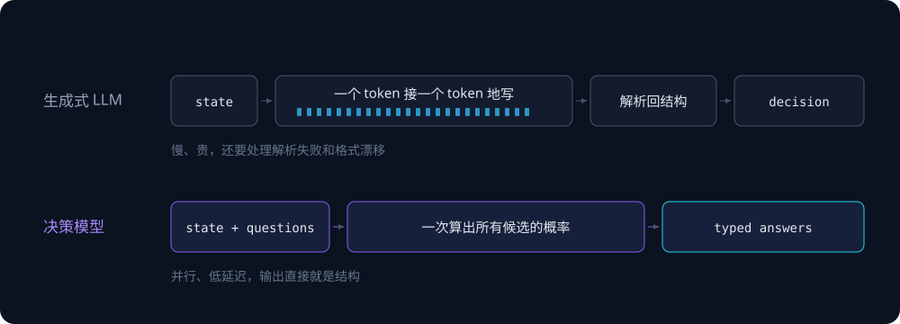

9 月 15 日，硅谷的 AI 开发者社区被一个名字刷屏了：**Jev**。当天它在 Hacker News 拿到 1800 多分、近 500 条评论，第二天 Vercel 宣布 AI Gateway 接入。

我看到时的第一反应，大概和多数人一样——又是哪家大厂偷偷憋了个全能模型，准备去跟 GPT、Claude 叫板。点开文档才发现，方向完全是反的：**它根本不会说话。**

发布它的公司叫 TypeSafe AI，2024 年成立，带着 4000 万美元种子轮（DCVC 领投）走出隐身期。创始人是 Diogo Almeida——InstructGPT 论文的联合作者，OpenAI 在 GPT-4 的贡献名单里把他列在「Foundational RLHF and InstructGPT work」一行；Erik Gafni 和 Sasha Sheng 是另两位联创。

他在接受 TechCrunch 采访时说过一句话，基本能概括这个产品的动机：

> We have lightning in a bottle, and yet it is not useful.

我们手里握着瓶中的闪电，可它却没什么用。理由很直白：**过去几年行业优化的是人类语言，但真正消费智能的是软件。**

## 两个名字，和一整套立场

Jev 身上有两个名字，都来自官方 FAQ，而且都不是随手起的。

第一个是 **System One Model**。它借的是丹尼尔·卡尼曼在《思考，快与慢》里的划分：系统 1 是快速、直觉的判断，系统 2 是缓慢、费力的推理。带思维链的推理模型更像系统 2，Jev 想做系统 1——**快而聚焦的判断**。

第二个是 Jev 本身。它取自经济学家威廉·斯坦利·杰文斯和**杰文斯悖论**：某种资源的利用效率大幅提升时，它的总消耗量往往不是缩减，而是成倍增长。TypeSafe 押的注就是这个——当单次智能决策的成本便宜到可以忽略，被塞进软件里的次数会指数级上升。原本写死 `if-else` 的地方，会开始考虑接一个模型来做动态判断。

顺着这个立场，还有两个更能说明态度的动作：发布前一周，TypeSafe 先发了两篇铺垫文章，一篇叫《The Bitterest Lesson》（主张"做对的任务 > 数据 > 算力 > 算法"），另一篇叫《Lies, Damned Lies, and Benchmarks》——**宣布不发布标准基准成绩**，理由是榜单会被刷，新评测发布即退役。

这既是姿态，也有一个很实际的后果：**没有任何公开榜单分数可以外推到你的业务上。** 想判断它行不行，只能自己拿数据测。

## 它砍掉的，是「生成文字」这件事

理解 Jev 的关键，是意识到它和 LLM 的分工不在同一个位置上。

LLM 是为"给人读"设计的：你问它一个问题，它把答案一个字一个字写出来。当你真正需要的是"一个程序能直接消费的判断"时，中间就出现了一层错配——你在强迫一个文本生成系统输出结构化结果，然后再写代码把那段文本解析回来。解析失败、格式漂移、多余的客套话，都是这层错配的副产品。

Jev 把这一步跳过了。它接收一份 `state`（程序当前的状态），回答你提前定义好的问题，直接返回**带类型的值**——`choice`、`score`、`noul`，以及每个选项的概率。



两条路径的差别不在于模型多聪明，而在于**要不要先把答案"写"出来**。

官方给了一张很直接的对比表（口径为官方自述）：LLM 用 RLHF / RLVR 优化人类偏好和可验证奖励，Jev 用 RLCD 优化"校准过的概率决策"；LLM 输出字符串需要解析和校验，Jev 输出类型化结果，选项是预先定义的；LLM 顺序解码一次一个 token，Jev 并行一次算完全部答案。至于成本那一栏，官方写的是输入 `$0.042 / 百万 token`、输出免费——**比 Claude Fable 5.1 的输入价低 238 倍**。

## 接口只有三种问法

Jev 目前只接受文本输入：字符串、JSON 对象，或者字符串数组。图片、音频、视频都还不支持。

它能回答的问题被限制在三种原语（官方叫 primitives）里：

| 原语 | 问什么 | 返回什么 |
|---|---|---|
| `choice` | 从一组选项里选一个（**单题最多 255 个**） | 选中的选项 + 各选项概率 + confidence |
| `score` | 在一组有顺序的等级上打分（2–10 级） | 分数 + 等级图例 + 各等级概率 + confidence |
| `noul` | 这句话成立吗？ | 一个 0–1 的概率，没有单独的 confidence 字段 |

几个容易读错的细节。

`score` 返回的那个数不是"选中了第几档"，而是**各等级位置的概率加权平均**。一个 3 级量表（0、1、2）如果概率是 0.0、0.7、0.3，得到的就是 `0×0.0 + 1×0.7 + 2×0.3 = 1.3`——它可以落在两档之间。

`noul` 没有 confidence 字段，因为**概率本身就是置信度**：0.92 是"很可能成立"，0.5 是"完全没头绪"。这里还藏着一个语义陷阱——`noul` 的 0.5 是"各半"，**不是"程度中等"**。想衡量程度要用 `score`，并且你得先把等级定义清楚。

还有一个只在文档角落里写着的实现细节：**问题 ID 不会发给模型**。你写在 `questions` 里的 key 只是给代码用的，模型只看 `instructions`。所以 `instructions` 必须自包含——写 `"type": "noul", "instructions": "Does this convey urgency?"` 是够的，但指望模型从 key 名 `is_urgent` 里猜出你的意思就不够了。

一次请求长这样，`state` 加一组问题：

```json
{
  "model": "jev-latest",
  "state": "Help! My payouts have been failing for 3 days.",
  "questions": {
    "is_urgent": {
      "type": "noul",
      "instructions": "Does this convey urgency?"
    },
    "department": {
      "type": "choice",
      "instructions": "Which team should handle this?",
      "criteria": {
        "billing": "Payments, invoicing, refunds",
        "technical": "Bugs, outages, integrations",
        "sales": "Pricing, upgrades, new accounts"
      }
    },
    "frustration": {
      "type": "score",
      "instructions": "How frustrated is the customer?",
      "criteria": ["Calm", "Frustrated", "Very angry"]
    }
  }
}
```

三个问题一起回来：

```json
{
  "model": "jev-latest",
  "answers": {
    "is_urgent": { "type": "noul", "noul": 0.92 },
    "department": {
      "type": "choice",
      "choice": "technical",
      "probabilities": { "billing": 0.08, "technical": 0.85, "sales": 0.07 },
      "confidence": 0.82
    },
    "frustration": {
      "type": "score",
      "score": 1.6,
      "legend": { "0": "Calm", "1": "Frustrated", "2": "Very angry" },
      "probabilities": { "0": 0.05, "1": 0.3, "2": 0.65 },
      "confidence": 0.78
    }
  }
}
```

调用方式有三条路，请求和响应的形状是一致的，只有 `noul` / `boolean` 的叫法不同：

- **TypeSafe 自己的 API**：`POST https://api.typesafe.ai/v1/systemone`，Bearer token 鉴权，模型别名 `jev-latest`，当前解析到 `jev-1.13.0`
- **Vercel AI SDK 7**：`experimental_evaluate`，模型 id `typesafe-ai/jev`——注意 OpenAI 兼容端点不支持
- **OpenRouter**：SDK 里的 `alpha.decisions.create`，模型 id `typesafe/jev-1.13`

```ts
import { experimental_evaluate as evaluate } from 'ai';

const result = await evaluate({
  model: 'typesafe-ai/jev',
  state: contextText,
  questions: {
    action: {
      type: 'choice',
      instructions: 'How should this request be handled?',
      criteria: {
        allow: 'Safe to proceed',
        block: 'Should be blocked',
        escalate: 'Needs human review',
      },
    },
  },
});
```

但真正值得注意的不是这三种原语本身，而是官方文档里的这句话：

> 每个问题都是针对同一份 state、并行且相互独立地被评估的。**增加问题通常不会增加延迟。** 一个问题的答案不会成为另一个问题的隐藏上下文。

这句话的分量比"快"更重。它意味着你可以放心地把一个模糊的大判断拆成十个窄问题——拆开不会互相污染，也不会让延迟线性增长。官方文档甚至给这个做法起了名字：**speculative fan-out**（推测性扇出）。

限定条件也要一起读：请求规模和输入长度得可控，而且**输入 token 消耗确实会增加**。你省下的是延迟，不是账单。

## 为什么它快，而且便宜得不太像话

普通大模型哪怕最后只需要一个 JSON，也得先把它逐 token "写"出来，再由程序解析回结构。Jev 不走这条路：它**直接计算各个候选答案的概率**，多个问题还能同时算。

官方放出的并排演示里，同一个任务的对照是：Jev 用 0.114 秒、花 0.000081 美元；对照的 LLM 用 8.566 秒、花 0.013880 美元。换算下来，**大约快 75 倍、便宜 171 倍**。

成本和延迟的公开数据：

- 输入 **$0.042 / 百万 token**，输出按官方定价免费，上下文窗口 32K
- 端到端延迟 **70–500 毫秒**，OpenRouter 页面显示的 P50 约 0.23 秒
- 采纳速度：上线 Vercel AI Gateway 后，**24 小时内被接近 13% 的付费团队使用**，是该平台采用最快的新模型

不过"193.6 倍更快、444.6 倍更便宜"这类头条数字，需要看清它的测量方式。这四个工作流由 TypeSafe 内部团队制作，**参考答案是 GPT-6 Astra 和 Claude Fable 5.1 高推理模式输出的平均**，而且被测 LLM 用的是官方提供的结构化输出 wrapper。

也就是说：**同一套工作流、官方出题、官方选裁判。** 官网自己也承认这些数字处在"预期实际收益的较高端"。这套自我披露值得肯定，但它显然不是独立基准——后文会看到独立实测给出的量级。

## 拆开看：它到底是怎么做到的

Jev 目前没有开源，也没有公开的完整技术报告。但社区在发布后几个小时内就跑通了复现，路径已经很清楚了。

**第一条路径是候选词的 logits 掩码投影。** 模型做完单次前向传播后，直接取序列最后一个位置的 logits，把候选标签对应的 token id 挑出来，做一次局部 softmax 归一化。这也是过往做约束输出和意图路由时的常用方法。

```python
# 你不需要重写注意力机制，在开源小模型上就能跑
logits = model(input_ids).logits[:, -1, :]
candidate_logits = logits[:, candidate_token_ids]
probs = torch.softmax(candidate_logits, dim=-1)
```

**第二条路径是基于 NLI（自然语言推理）的交叉编码器。** 把输入上下文当作前提（premise），候选动作当作假设（hypothesis），分类头直接输出蕴含、中立、矛盾的三分类得分，取蕴含概率做决策。

如果单次前向每次只能评估一个选项，面对高并发多选项依然不够快。Jev 靠的是 **Decoder-only 架构的 KV Cache 前缀缓存共享**：长文本上下文在 Prefill 阶段只算一次并驻留显存，后续几十个候选共享同一份前缀缓存指针，只并行算各自那少量 token 的注意力。**评估几十个维度的总耗时，因此几乎等同于单次评估。**

那普通小模型为什么不能直接套这套逻辑？因为 **Softmax 输出的分数只是指数归一化的相对值，不等于真实概率**。未经专门校准的模型普遍严重过度自信——即使预测完全错误，Softmax 也可能给出 0.99。

这正是 **RLCD**（Reinforcement Learning for Calibrated Decisions）要解决的问题。它优化的不是"回答像不像人"，而是**预期校准误差（ECE）**：通过样本校验与惩罚，让模型输出 0.8 的置信度时，在统计上真实对应约 80% 的准确率。

这一点必须要说清楚：**校准是群体口径。** 官方文档自己写着——校准是跨一组预测衡量的，不保证任何一条具体答案正确。一组被标为约 90% 置信度的预测，长期平均正确率可以接近九成；这不代表你手上这一条有九成把握。

有人会问：那这和 2018 年的 BERT 分类器有什么区别？区别在底座的常识储备和上下文容量。BERT 的窗口通常只有 512 token、词表小，读不了长代码、系统日志和长业务文档；Jev 站在现代因果 Transformer 底座上，具备现代语义理解能力，只是摘掉了自回归生成那一段。r/LocalLLaMA 上有个说法很传神：

> 它就是 BERT 式架构，只是配上了现代 LLM 的数据、算力和训练配方。

另一个配套的观点是：**最接近的老东西是 NLI 零样本分类，区别在于 NLI 每个标签跑一次前向、分数不可比，而 Jev 一次并行给出完整分布。**

## 接进系统：四步，和最容易踩空的那一步

Jev 最容易被用错的地方，是把它当成"另一个通用模型"。真正合适的接法是这样的：

**第一步，只给它当前判断需要的 state。** 工单分类就放客户消息、订单状态和已有标签，不要把几万字的对话历史整个塞进去。创始人专门在 X 上把这件事叫做 state engineering——判断的质量首先取决于你喂了什么，而不是模型多聪明。

**第二步，把一个模糊的大问题拆成多个小问题。** 不要问"接下来该怎么办"，而是分别问：转给哪个部门？客户是否在要求退款？紧急程度属于哪一级？这三项可以并行返回，代码只取相关的那几个。这也是官方推荐用法 speculative fan-out 的核心。

**第三步，在代码里设置置信度阈值。** 比如高于 0.9 才自动执行，中间区间异步记录并触发抽检，低于 0.6 转人工或交给更强的模型。这里有个必须钉死的认知：`choice` 和 `score` 返回的 `confidence`，是**从概率分布算出来的集中程度指标，不等于"这次判断正确的概率"**。阈值该设多高，只能拿自己的业务数据测——不能照抄任何示例数字。

**第四步，把执行和验证留在代码里。** Jev 可以判断"该退款"，但真正调用退款接口之前，金额、权限、幂等性仍然要由代码检查。模型输出的只是一个概率，不是一个可以无条件执行的动作。

TypeSafe 为 coding agent 准备了一个官方 skill（`typesafe-ai/skills`，整个仓库只有一个 149 行的 `SKILL.md`，而且 8 月 25 日就建好了，比模型发布还早三周）。它做的三件事很能说明官方希望你怎样用它：

1. **不写 API 手册**，只给一张"什么任务读哪一页文档"的表
2. **教 agent 拆需求**——从应用"要展示什么、选择什么、改变什么"倒推需要哪些判断，而规则、计算、查表、执行全部留在代码里
3. **纠正 LLM 时代的习惯**——独立问题一次同问（包括投机性的）；confidence 只表示分布集中程度，不表示流程正确；问题和阈值常量放在同一个文件里

官方 FAQ 里还有一条很实在的提醒：**如果你只是要选最优，直接取概率最高的那个就行，别到处设 confidence 阈值。**

把这几条合起来，其实就是一条清晰的分工线：

- **确定性判断**（文件存在吗？HTTP 200 吗？exit code 是 0 吗？）→ 写在代码里
- **语义闭集判断**（这是哪类任务？该调哪个工具？风险几档？完成了吗？）→ 交给 Jev
- **开放式推理与生成**（怎么拆任务？代码怎么改？报告怎么写？）→ 交给大模型
- **最终授权**（删文件、发邮件、花钱）→ 交给人


## 四种设计模式

社区把 Jev 在真实工程里的用法收敛成了四种模式，比任何特性列表都好用。

**推测性扇出。** 面对一份几千字的工单，系统往往要同时提取多个维度的标签。用传统大模型挨个提问，耗时和费用线性增加；用前缀缓存共享，长文本只做一次 Prefill，十几个离散问题并发挂载在同一份缓存上，总耗时接近单次评估。前提是**子问题在语义上相对独立**——如果问题 B 依赖问题 A 的结果，就不能放进同一批。

**置信度门控。** 让答案决定动作，让置信度决定自动化等级：高于 0.9 直接执行；0.6–0.9 暂缓执行、异步记录并抽检；低于 0.6 转人工。高并发内容审核是典型场景——绝大多数确信合规或确信违规的内容瞬间处理，只有模糊地带进人工池。**前提是模型在你的业务分布上校准可靠**，阈值还要根据误杀和漏放的容忍度定期调整。

**复合评分。** 很多团队想让模型直接输出一个百分制综合评分，这种做法通常不稳定，细微的 prompt 扰动就能让分数剧烈漂移。更稳的做法是**只让模型对单一维度打 0–10 的离散分，加权公式和安全硬规则全部交给后端确定性代码**。策略变了只改本地权重，不用重新调提示词。

**分层分类。** 标签数量到几百上千个时，一次性塞进枚举列表会导致注意力稀释（而且还有 255 个选项的上限）。分层做法是先在顶层大类里选出 top-2 分支，再沿胜出的大类细化到二级子类，逐级剪枝。建议每层保留 2–3 个候选，避免早期误剪枝导致后续全部走偏。

## 社区已经拿它做了什么

发布 72 小时里长出来的东西，本身就是一种信号。挑几个有原始数据的看：

**玩游戏。** 最出圈的是 Doom：模型每秒大约做 10 次判断，持续读取游戏状态并选择射击、躲避、找补给，官方估算成本约 7 美元一小时。社区还做了 `typesafe-mario`——把 NES 内存解析成 JSON，一个 `choice` 选手柄动作、一个 `noul` 判断"现在跳有没有用"、一个 `score` 估计眼前的危险程度，每 8 帧决策一次。

但这里有个容易忽略的前提：**喂给模型的是结构化的游戏状态（敌人坐标、距离、角度），不是画面。** 官方也承认，专用的传统游戏机器人可以玩得更好。这个 demo 真正证明的是**吞吐和低延迟**，不是规划能力——真正执行动作、读地图、检查结果的仍然是外部代码。

**浏览器 Agent。** Browser Use 的 `jev-ultrafast` 把浏览器动作空间做成"操作 + 目标"两组 `choice`，一次网络往返出两个决策，默认循环里不再截图，只有要输入文本时才调一个小语言模型。它给的独立测量是：**浏览器协议调用从 1092 次降到 101 次**，同一个 Google Flights 搜索任务的中位耗时从 9.45 秒降到 7.07 秒（约 −25%）。注意这个数字比官方口径的"快 25 倍"小了一个数量级——这就是真实工程里的样子。

**框架集成。** LangChain 的 `TypeSafeClassifier` 可以直接 `.invoke(state, questions)`；值得看的是它另外提供的两个 middleware——`ModelRouterMiddleware`（用 Jev 判断这次请求交给便宜模型还是强模型）和 `AutoModeMiddleware`（执行前判断工具调用有没有风险）。Vercel 的 agent 框架 eve 也把模型路由做成了默认能力。

**安全网关。** `pi-warden` 拦截 Agent 运行时的文件覆写和终端命令，替代传统关键词黑名单；`pi-jev-auto-mode` 用 Jev 做 bash / write / edit 调用的语义审批，无法判定时默认阻断。这类"执行前的守卫"是 Jev 最稳的用法之一。

**上下文压缩。** `fast-jev-compaction` 把 Jev 引入 coding agent 的 compaction 流程，把"这条工具调用还有用吗"变成一组并行 `noul` 问题，保留的内容仍是原文。这个项目得到了 Jev 开发者的认可。

**生态规模。** GitHub 上的 `yibie/awesome-jev` 和 `yzfly/awesome-jev-zh` 收了四十多个项目；V2EX 上有人把 433 个使用 Jev 的开源项目整理成了可检索目录。复现项目从 151M 的 ModernBERT、69M 的自研紧凑网络，一直到 Qwen3.5-35B MoE，各有取舍——比如 `heman10x/rlcd-modernbert-151m` 支持 25 个候选槽位、延迟小于 35ms，专门适配边缘推理。

顺便说一句：**仓库数量不是成熟度指标。** 那两个 awesome 列表自己就声明，收录不代表验证过代码质量、安全性、能不能跑通、报告结果能不能复现——一个漂亮的 README 完全可能出现在任何真实评测之前。

## 那个做交易机器人的，亏了 31,680 美元

上面几个案例都在讲 Jev 能做什么。但最该看的一个，是它做不到什么。

一位开发者用一晚加一个上午搭了个自动交易机器人，让 Jev 持续读取链上、链下数据并选择买入或卖出。界面很流畅，概率输出也很"像回事"，然后作者报告的结果是：**亏损 31,680 美元。**

它把边界展示得比任何成功案例都清楚：**低延迟只能让决策更快地执行，补不上策略、风控和因果判断。** 付款、交易、删库这类不可逆动作，不能把模型概率直接接到执行接口上——至少要有仓位上限、止损、回测、模拟盘和人工批准。

这里有一个出自官方 HN 评论区的细节值得一起记住：创始人自己承认，**模型完全可能自信地犯错，而且未来所有更聪明的模型仍然会有这种可能。**

## 官方数字、独立实测，和它们之间的差距

这部分是全文最该慢慢读的地方。

**先说官方口径。** 除了前面提到的价格和延迟，官方给出的工作流准确率是 **67.8%**，对照 GPT-5.6 Terra 的 67.9%——也就是说**水平接近而非超越**，只是成本是它的 1/76。类型错误率 0%。

**再说独立实测。** 综合几组可查证的数据：

| 测试者 | 方法与样本 | 结果 |
|---|---|---|
| Every.to（Mike Taylor） | 37 篇文档 × 21 个问题同问，单组 777 次判断 | 单组 < 0.7 秒、约 1/4 美分；逐段评估中位 0.35 秒，对照模型 8.83 秒；故意植入的 7 处缺陷**检出 6 处，漏 1 处** |
| Browser Use `jev-ultrafast` | 同任务交替运行 6 次，比较新旧 harness | 中位耗时 9.45s → 7.07s（约 1.34 倍）；协议调用 1092 → 101 次 |
| Archer Hume | 对官方接口发起上万次压测 | 长文本从 360 token 增到近 30,000 token，中位延迟 57.5ms → 218ms；并发问题从 1 增到 100，延迟稳定在 70–100ms，到 1,500 个时升到 610ms |
| VerySmallWoods | 自己搭 Playground 走 Vercel AI Gateway | 上游 210–340ms，端到端 350ms–1s；海外直连官方 API 则要 1.6–3.7 秒 |
| SamuelSacco 独立审计 | HTTP 契约、并行批处理、延迟、准确率 | 契约和并行属实；倍数"属实但夸大"（官方 20–400 倍，独立测得 5–25 倍）；"不会幻觉"不成立；**校准无法验证** |

把这些摆在一起，结论其实很干净：

- **便宜和快是真的**，但倍数取决于你拿什么当对照。官方 193.6× / 444.6× 的通用速度优势，目前**没有独立的复现**；可查证的量级是"成本极低 + 部分场景耗时下降约 25%"。
- **延迟的可预测性可能比绝对值更重要**。LLM 的端到端延迟是一个跨越两个数量级的区间（3–329 秒），而 Jev 是 70–500 毫秒。对工程系统来说，这比"快多少倍"更值钱。
- **准确率和中档模型持平，落后于推理模型**。官方自己的 67.8% 就是这个意思。
- **校准目前没有公开验证**。官方说做了 RLCD，但没有公开校准曲线；社区有人用裸 Qwen2.5-7B 的 logits 做对照，和 TypeSafe 工作流参考答案的一致性只有 **73.8%**，而 Jev 是 86.6%——更重要的是，**那个未校准的 Qwen 在预测错误时，Softmax 置信度仍然经常高于 0.90**。

### 社区测出来的三种偏差

除了"准不准"，还有三种更隐蔽的行为偏差，值得在接入前心里有数。

**无关选项会干扰结果。** 在既有的四个有效选项后追加一个完全无关的"天气"选项，原有业务选项之间的优势 log-odds 会明显下滑。这说明候选项之间**并非完全独立打分**——底层全量注意力会让候选池内部产生竞争，无关选项也在参与注意力分配。对统计分布要求严格的场景，候选集要做严格清洗。

**选项的物理顺序会影响判断。** 因为自回归模型的单向注意力，排在后面的 token 能看到前面所有上下文。把判断依据从选项列表末尾移到开头或中间，正确率会明显下滑。实践建议是：**依据能放进共享的 state 就放 state；只能放选项时，放列表末尾。**

**单步前向做不了多层因果推理。** 一个专门测钓鱼邮件识别的基准发现，面对包含多层转折和伪造身份的诱骗邮件，带思维链的 Claude Haiku 判定准确率明显优于 Jev，Jev 漏判更多。原因很朴素：**计算路径被压缩成了一次矩阵乘法**，而大模型依赖自回归逐步构建中间逻辑。一旦语义欺骗嵌套超过两层，单步打分就力不从心。

这一点在德州扑克实测里被展示得最清楚。作者用 GTO 求解器（8 分钟、7.6 GB、0.59% 可被剥削度）算出标准答案，再把牌桌状态交给 Jev：一个明明该过牌的顺子牌面，**Jev 16 次运行 16 次全部选择全下**；直到把"对手手牌 = 同花 A 高""我方当前落后""我方 0 张补牌"这类**已经得出结论的字段**写进 state，它才改判为过牌。

作者的总结值得直接引下来：**它不"算牌"，它只"读你写好的结论"。**

## 「Jev 不会幻觉」这句话只能信一半

官网上最醒目的一句宣传是 **Zero Hallucinations**，配图给出的工具调用类型错误率是 0%。

准确的含义是：**模型的输出分布永远定义在你给的 `criteria` 上**，所以它不可能编造字段、编造选项、编造 JSON。这是结构与类型层面的保证。

它不包含的，是判断本身正确。Jev 完全可以在你给的选项里高置信度地选错。Hacker News 上这条反驳最典型：

> Sure, it can't emit an invalid type, but it can still emit a completely wrong valid value…

它可以不输出非法类型，但它完全可以输出一个**完全错误的合法值**。

创始人在 HN 评论区正面回应过这个争论。当有人指出"用约束解码就能让 LLM 做同样的事"时，他的回答是：constrained decoding 会让模型变笨——因为**如果一个模型会给非法 token 分配概率，它本身就是糊涂的**。这个回应在技术上有它的道理（结构化输出确实会损失一部分 LLM 能力），同时也意味着：Jev 的价值不在"不会错"，而在**结构天生就在，不需要拿模型能力去换**。

所以更准确的说法是：**它保证了接口，不保证真相。**

顺带一提，TypeSafe 不发布标准基准这件事，到这里也显出两面性：它避免了被榜单绑架，代价是你**没有任何外部参照物**可以外推。想判断它行不行，只能自己测。

## 别人是怎么写 Jev 的

这几天中文和英文圈都出了不少解读。它们角度差得很远，合起来看反而比任何单篇都完整。

**中文圈里最硬核的是知乎那篇《万字长文解读 Jev 模型：毫秒级判定原理与工程应用边界》。** 它的核心价值是把底层路径讲透了：两条社区复现路线（logits 掩码投影 / NLI 交叉编码器）、KV Cache 前缀共享为什么能让"几十个候选 ≈ 一次评估"、以及 Archer Hume 的压测数据。它还给出了四种设计模式和一套成本测算——按日均 10 万次请求、80% 能在前置判别层分流的假设，推理费用能降近 80%。需要留意的是，它引用的两条复现路径**是社区逆向的思路，不是官方公布的架构**。

**51CTO 的《Jev详细解读：一个不说人话、只做决策的模型》**视角是"它比 LLM 放弃了什么"，两个细节最有价值：一是点破了官方评测的参考答案来自 GPT-6 Astra 和 Claude Fable 5.1 的输出汇总，所以那组数字反映的是**与参考模型的一致性，而不是独立准确率**；二是 Doom 演示喂的是结构化游戏状态，不等于它会看画面。它最后的判断也克制：**概念上并不全新，GLiNER 这类零样本分类器、各家 API 的结构化输出和约束解码都在逼近同一个方向；新的是"专用架构 + 专用训练方法 + 专用托管"这个组合。**

**封楚寒的《Jev 模型初探》是这几篇里最"学术"的。** 作者很诚实地声明是 AI 辅助整理、自己没实测，然后把三条研究线索接了上来：Guo 等 2017 年那篇 *On Calibration of Modern Neural Networks*（ECE 怎么算、温度缩放到底改了什么）、Damani 等的 *Beyond Binary Rewards*（RLCR 的奖励函数 `R = c − (q−c)²`，以及它为什么在期望意义下鼓励报告真实概率）、以及 SelectiveNet 的 coverage / selective risk。它还提了一个很实用的缩写陷阱：**2023 年已经有一篇 RLCD 叫 "Reinforcement Learning from Contrastive Distillation"，和 TypeSafe 的 "Reinforcement Learning for Calibrated Decisions" 不是一回事。** 并且明确说：截至 9 月 18 日，找不到 Jev 或 RLCD 的公开论文——**现有资料不足以重建它的算法。**

**VerySmallWoods 的《Jev 实测》是少见的真自己跑数据的中文实测。** 作者搭了个 Playground（`tryjev.xyz`）跑了五个场景——一句话一个概率、五问并发的工单分诊、矛盾和乱码、模型路由、内容审核与 LLM 输出把关——并且把数字分成"官方宣称 / 独立实测 / 自己测出来"三层摆开。最有信息量的一段是它对独立审计结论的四分类：**属实 / 属实但夸大 / 不成立 / 没法验证**。它自己那句话总结得最好：**便宜和快是真的，倍数看你拿什么比；类型安全是真的，但那是格式安全，不是答案正确；概率有没有校准，得拿自己的标注数据去验。**

**AIHubPlus 那篇《实测解析》虽然作者也声明"非一手实测"，但二次核对做得相当规范。** 它把官方自报表和第三方实测表并排放，敢标 `[待补证]`，也敢写"需要更正的旧说法"——比如明确指出第三方实测**并没有复现**"快 25 倍"这类数字。它还挖出了几个别处看不到的细节：Jev 名字来自杰文斯悖论（官方 FAQ）、TypeSafe 不发布标准基准、以及 HN 上关于"能不能说不会幻觉"的原帖争论和创始人回应。

**英文圈里被转得最多、也最不客气的是 Sean Goedecke 的《Jev means structured output is interesting again》。** 核心三点：① 快的结构化输出现在就能做——他用 Qwen2.5-1.5B 自己做约束解码（只生成一个受限 token + 预填充）就拿到了 2–3 倍加速，据此推测 **Jev 未必有技术护城河**；② 它没有思维链、没有测试时计算，**智能上限可能被锁死在"非推理 LLM"的水平**，别指望它 scaling 出新智能；③ "零幻觉"是一种语义上的回避。

**Every.to 的 Mini-Vibe Check** 是媒体侧做得最实的一次：37 篇文档 × 21 个问题、单组 777 次判断，故意植入的 7 处缺陷检出 6 处，作者的结论是"快与便宜站得住，准确率够用但不完美"。

**backnotprop 的德州扑克实测**（前面提过）是目前公开资料里扎得最深的一篇独立测评，它的价值在于**同时给出了反例和方法论**：在 150 个决策点里，求解器自己就有 95 个点选择过牌，所以一条不用模型的"能过牌就过牌"一句话规则在全部点位上拿到 72%——这个数字大部分来自样本偏斜；但在真正有争议的 55 个点上，那条规则只有 24%，而 Jev 是 38%。

如果只想读两篇，我建议：**想要工程落地细节看知乎那篇万字长文，想要独立证据看 VerySmallWoods 和 AIHubPlus 这两篇。** 想要一台现成的 Playground，`tryjev.xyz` 可以直接用（key 存在浏览器本地）。

## 顺带一提：有人用一个小模型复刻了它的形式

Jev 刚发布，社区里就有人用 0.8B 级别的小模型在本地复刻了一个"视觉版 Jev"（`jev-visual`，用 Qwen3.5-0.8B + MLX 在 Mac 上跑）。做法是：图片和公共上下文只计算一次，然后批量读取各个候选答案对应的分数，最后交给代码组装结果。这样就绕开了"Jev 目前只能吃文本"的限制，能看着图片做选择、判断和打分。

作者自己也叠了甲：这只是在 inference 层对 Jev 的**形式**做的一次小复现，不是 Jev 的原理，效率也远不如成熟的推理框架。

但这恰恰说明了一件事：Jev 的形态并不是什么黑魔法。**"不做逐字生成，直接读候选的概率"**——这个动作本身，任何会用 logits 的人都能在自己的场景里近似出来。真正难的是**把概率校准好**，以及在系统层面把判断和执行干净地切开。

这也正好呼应了 Goedecke 那个不太好听但可能成立的判断：如果形式可以复刻，那壁垒就不在形式，而在训练配方和托管工程。

## 几点收获

**第一，难的从来不是模型多聪明，而是问题能不能被拆成边界清楚的小决定。** 让 Jev 去回答"接下来该怎么办"会得到垃圾；把它拆成"转给哪个部门""是否要退款""紧急程度几级"，它就很好用。拆分这一步是人做的，模型帮不上忙——**官方自己也承认，难点从写提示词变成了设计决策的模式。**

**第二，"生成文字"和"做判断"本来就是两个不同的工程问题。** 把它们混在一次调用里，代价是解析、格式漂移和多余的 token；分开之后，两边都能做得更好。Jev 占的就是这个位置。

**第三，置信度只有配上阈值和兜底才有意义，而且它从来不是"正确率"。** 校准是群体口径，不是单条保证。一个 0.82 的 confidence 单独看毫无价值，它必须在代码里对应到"自动执行 / 升级 / 转人工"的某一条分支上才算被用上了。顺便记住官方 FAQ 那句：**只是要选最优的话，直接取概率最高的，别到处设阈值。**

**第四，低延迟会放大错误。** 当一次错误的判断能在几十毫秒内被自动执行无数次时，速度就成了一种风险。不可逆操作前面，必须有人或者确定性代码守着。那个亏了 31,680 美元的交易机器人，就是这句话最贵的注解。

**第五，看到厂商口径的数字要看清测量方式。** 193.6 倍、0.23 秒、67.8%——这些数字都真实，但它们各自有各自的样本、参考答案和对照条件。和自己的历史流量跑一遍，永远比抄一个基准可靠。

**第六，一个真正值得关注的信号，是它火的速度和方式。** 发布 72 小时里长出了 400 多个项目、两个 awesome 列表、一个可检索目录，LangChain 和 Vercel 都在第一周就跟上了集成。不管 Jev 本身最终成不成，**"把判断从生成里剥出来"这个方向已经被生态验证了一次**——而这可能是比"Jev 会不会取代 LLM"更值得关心的问题。
