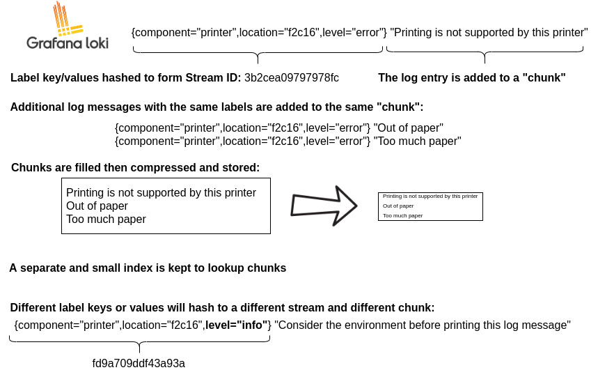
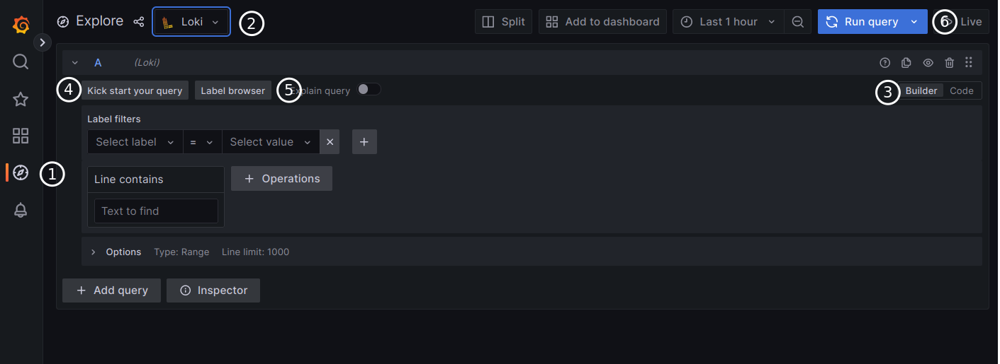

2026 年 9 月 9 日上午，我在给自己部署的 AI 应用排查"生成失败"问题时，顺手打开了 Grafana 上的日志面板，结果先被日志面板气到了：所有服务器的日志混在一起，每条日志外面包着一层 Docker 元数据的 JSON，最新的在最上面，长行还不自动换行。想找一段报错，体验还不如直接 SSH 上去 `grep` 一个 `log.txt`。

问题最后出在查询语句上。面板用的查询是 `{node=~".+"}`——选中所有节点的所有日志，其余什么都没做。而把它救回来的，是一条三段式的 LogQL：

```logql
{compose_project="freshai", compose_service="freshai-backend"}
  | json
  | line_format "{{.message}}"
```

执行这条查询后，日志恢复了本来的样子：`INFO: 127.0.0.1:35822 - "GET /health HTTP/1.1" 200 OK`，一行就是一条，干净可读。

这条查询的写法背后其实是一套完整的心智模型：**先选流，再过滤，最后才解析**。这个顺序不只是语法结构，也直接决定了查询的性能。这篇文章就把 LogQL 讲透：它为什么长这样、每一段在做什么、怎么写快、卡住时怎么自己定位，以及什么时候你根本不该用它。

## 一、前提：Loki 为什么不索引日志正文

要理解 LogQL 的语法设计，得先理解 Loki 这个存储引擎做的一个关键取舍。

传统日志方案（比如 Elasticsearch）会在写入时对日志正文建全文索引：写入成本高、存储膨胀，但查询时随便搜。Loki 反过来——官方文档的表述是，它"不为日志内容建索引，只为每条日志流的元数据（标签）建索引"，日志正文被"压缩后以 chunk 的形式存进对象存储（比如 S3）"。



*▲ Loki 的存储模型：标签组合哈希成一个流 ID，同流的日志行聚成 chunk 压缩存储，索引只记录"去哪个 chunk 找"。图：Grafana Loki 官方文档（Apache-2.0）*

上面这张官方图把模型讲得很清楚：`{component="printer", location="f2c16", level="error"}` 这组标签哈希出一个流 ID，后续相同标签的日志都追加进同一个 chunk，攒满后压缩落盘；另有一个很小的索引负责"根据标签找到 chunk"。换个标签值，就是另一条流、另一个 chunk。

这个设计的直接后果是：**写入便宜，查询时付成本**。查询时 Loki 要根据标签圈定一批流，再把 chunk 解压出来逐行扫描。所以 LogQL 的第一原则就是让"圈定"这一步尽量窄——这也解释了为什么语法把流选择器放在最前面，而且它是唯一必填的部分。

## 二、一条查询的解剖：选择器与流水线

LogQL 的一条日志查询由两部分组成：**流选择器**（必填）和**日志流水线**（可选）。


*▲ 一条 LogQL 查询的完整结构：`{流选择器}` 后接可选流水线——行过滤、标签过滤、解析器与格式化表达式。图：Grafana Loki 官方文档（Apache-2.0）*

### 流选择器：唯一的索引入口

流选择器就是花括号里的标签匹配器，写法与 Prometheus 完全一致：

```logql
{container="query-frontend", namespace="loki-dev"}
```

四个匹配操作符：

| 操作符 | 含义 |
|---|---|
| `=` | 等于 |
| `!=` | 不等于 |
| `=~` | 正则匹配 |
| `!~` | 正则不匹配 |

两个容易忽略的规则：第一，Loki 明确声明选择器沿用 [Prometheus 标签选择器的规则](https://prometheus.io/docs/prometheus/latest/querying/basics/#instant-vector-selectors)——至少要有一个**不能匹配空字符串**的匹配器，否则查询会命中所有流；第二，`=~` 和 `!~` 的正则是**完全锚定**的，`level=~"info"` 只匹配恰好等于 `info` 的值，想匹配前缀要写 `level=~"info.*"`。

标签体系是采集端定的。我部署的采集链路是 Vector 读取 Docker 容器日志，把 `compose_project`、`compose_service`、`level` 挂成 Loki 标签，所以我的选择器可以直接写 `{compose_project="freshai", compose_service="freshai-backend"}`。**选择器能写多窄，取决于采集端把标签设计多合理**——这是用 Loki 时唯一需要在写入侧认真规划的事。

### 行过滤：分布式 grep

流水线里最常用的是行过滤表达式。官方对它的定位很直白："对选中日志流做一次分布式 `grep`"。四个操作符：

| 操作符 | 含义 |
|---|---|
| `\|=` | 行包含该字符串 |
| `!=` | 行不包含该字符串 |
| `\|~` | 行匹配该正则 |
| `!~` | 行不匹配该正则 |

```logql
{job="mysql"} |= "error" != "timeout"
```

注意这些匹配是**大小写敏感**的，且是纯子串匹配——不解析、不提取，就是逐行看内容，所以非常快。正则走 RE2 风格，`(?i)` 前缀可以做大小写不敏感匹配。

这里埋着 LogQL 最著名的坑，官方文档专门加了警告：**行过滤的 `|~` 和 `!~` 正则不做完全锚定，`.` 会匹配包括换行在内的所有字符**。这和标签匹配器的正则行为不一致，写复杂正则时要特别留意。

## 三、流水线深潜：过滤、解析、格式化

流水线可以串联多个表达式，官方文档对执行顺序的描述是：**每个表达式按从左到右的顺序逐行执行；一旦某个表达式把一行日志过滤掉，流水线立即停止处理这行，跳去处理下一行**。

这个机制直接推出了最重要的性能规则：行过滤要放在解析器前面。官方文档给了一组对比例子，两条查询结果完全相同，但前者始终快于后者：

```logql
# 快：先过滤，命中的行才解析
{job="mysql"} |= "error" | json | line_format "{{.err}}"

# 慢：每行都解析完才过滤
{job="mysql"} | json | line_format "{{.message}}" |= "error"
```

原因很直观：前者只对包含 `error` 的行付出解析成本，后者对每一行都解析。**"先选流，再过滤，最后才解析"不只是阅读顺序，就是执行顺序。**

### 解析器：把日志行变成可引用的字段

解析器负责把非结构化的日志行拆成字段，拆出来的字段可以在后续的标签过滤、格式化和指标聚合里引用：

| 解析器 | 适用格式 | 备注 |
|---|---|---|
| `json` | JSON 行 | 官方建议优先使用 |
| `logfmt` | `key=value` 行 | 官方建议优先使用 |
| `pattern` | 固定结构的行 | 官方明说比 regexp 好写且更快 |
| `regexp` | 任意行 | 用正则捕获组提取 |
| `unpack` | JSON 打包的二进制等 | 特殊场景 |

`pattern` 解析器值得单独一说。它用一个"模板"描述行结构，尖括号是捕获，`<_>` 是跳过不捕获。官方文档用一条 NGINX 日志做演示：

```logql
| pattern "<ip> - - <_> \"<method> <uri> <_>\" <status> <size> <_> \"<agent>\" <_>"
```

就能把 `ip`、`method`、`uri`、`status` 全部提出来。

三个和解析器相关的重要行为：

- **解析失败不丢行**。一行日志格式不对时，Loki 不会把它过滤掉，而是给它打上 `__error__` 标签继续走。所以想只看解析成功的行，显式加一个 `| __error__=""`。
- **字段名会被清洗**。JSON 里的 `a.b` 会被改写成 `a_b`，以符合 Prometheus 命名规范。
- **字段名冲突加后缀**。解析出的字段和已有标签重名时，会得到 `_extracted` 后缀的新标签，比如 `level` 已存在时解析结果叫 `level_extracted`。

### 解析之后：标签过滤与格式化

字段提取出来之后，可以做结构化的标签过滤，支持字符串、时长、字节数的比较运算：

```logql
| duration >= 20ms or size == 20KB
```

最后是两个格式化表达式，都基于 Go 的 [text/template](https://pkg.go.dev/text/template) 语法：

- `line_format`：重写整行的显示内容，`{{.message}}` 引用字段；
- `label_format`：重命名或改写字段，右边也可以是模板，如 `dst="{{.status}} {{.query}}"`。

我在 Grafana 面板里用的 `| line_format "{{.message}}"`，作用就是把日志显示从"整包 JSON"还原成正文本身。

## 四、回到我的面板：一次真实修复

把语法讲完，回头看开头那个难读的面板。我的监控栈是 Vector 采集 Docker 容器日志、写入 Loki（写作时我服务器上跑的是 3.7.7），Grafana（13.2.1）负责查询展示。Vector 落到 Loki 的每一行日志，正文其实是一个 JSON：应用日志嵌在其中的 `message` 字段里，外面还包着 Docker 的容器名、标签等元数据。

旧面板的查询 `{node=~".+"}` 有三个问题：选择器宽到等于没有选择器；没解析 JSON，读者看到的是整包元数据；再配上"倒序 + 不换行"的显示设置，彻底没法读。

修复后的查询逐段拆开看：

```logql
{compose_project="freshai", compose_service="freshai-backend"}  # ① 用标签把范围收到一个容器
  | json                                                        # ② 解析 JSON 包装
  | line_format "{{.message}}"                                  # ③ 只显示正文
```

①把搜索范围从"全部服务器全部容器"缩到单个服务；②③把行内容还原成应用自己打的日志。这段查询我在 Loki 的 HTTP API 上实测过，返回的就是干净的 `INFO: ... "GET /health HTTP/1.1" 200 OK`。

在 Grafana 的 Explore 里写这些查询时，可以用 Builder 模式通过下拉框拼，也可以切到 Code 模式手写 LogQL：



*▲ Grafana Explore 的 Loki 查询界面：Builder 模式用"Label filters + Line contains"拼查询，右上角可切换到 Code 模式手写 LogQL。图：Grafana Loki 官方文档（Apache-2.0）*

我日常最常用的几个查询模式：

```logql
# 只看错误和异常（大小写不敏感）
{compose_service="freshai-backend"}
  |~ "(?i)error|exception|timeout"
  | json | line_format "{{.message}}"

# 隐藏健康检查噪音
{compose_service="freshai-backend"}
  | json | line_format "{{.message}}" != "GET /health"

# 用 request_id 串联一次请求的全部日志
{compose_project="freshai"} |= "req_abc123"

# 错误行数曲线：5 分钟窗口按 level 聚合
sum by (level) (
  count_over_time({compose_service="freshai-backend"} | json [5m])
)
```

最后一条是 LogQL 的另一面：**指标查询**。日志查询返回日志行，指标查询把同一段流水线包在 `count_over_time`、`rate` 等函数里，返回的是时间序列——语法和 PromQL 几乎一样，还有 `unwrap` 可以从日志行里提取数值做聚合。这意味着告警规则可以直接建在日志内容上，比如"5 分钟内 ERROR 超过 N 条就告警"，不需要额外的指标埋点。

## 五、把查询写快的四条原则

Loki 把成本从写入挪到了查询，查询习惯就决定了这套系统的体验。结合官方建议和我自己踩过的坑，总结成四条：

1. **选择器先窄，宽了等于全表扫描。** Loki 只索引标签，选择器是唯一走索引的环节。至少一个不能匹配空串的匹配器是语法底线，而实践中目标是把范围收到个位数的流。
2. **行过滤永远放在解析器前面。** 前面官方的那组对比查询就是证据：先 `|=` 再 `| json`，解析成本只花在命中的行上。
3. **解析器能简则简。** 官方原话是 `json` 和 `logfmt` 能用就用，`pattern` 比 `regexp` 好写且更快；正则只留给真正不规则的行。解析还失败的行记得用 `__error__` 处理，别让它们混进结果。
4. **指标查询控制时间范围和分组维度。** 指标查询要扫描范围内所有行，`[5m]` 和 `[30d]` 的成本完全不同；`by ()` 的分组维度越多，聚合开销越大。

对应的三个坑：

- **标签基数爆炸**。把 `user_id`、`request_id` 这类高基数值放进标签，流数量会指数级膨胀，索引和查询一起遭殃。它们属于日志正文，用行过滤或解析去查。
- **解析出的字段不进索引**。`| json` 提取的字段只在查询执行时生效，永远不要指望"解析过的字段下次查得更快"——索引里只有采集时写入的标签。
- **行过滤正则的 `.` 匹配换行**。这是官方文档专门警告的行为差异，跨行日志里写 `.*` 很容易匹配到意料之外的内容。

## 六、下次卡住时：三层定位，把事实带给 AI

开头那个面板问题，从"这日志没法看"到修复，用得最多的动作不是写查询，而是判断问题出在哪一层。Grafana 的日志链路是固定的三段——采集进 Loki、Loki 存起来、Grafana 查出来展示——所以"不知道怎么办"的时候，先对照症状定位层级，每层的下一步动作完全不同：

| 层 | 症状 | 先做什么 |
|---|---|---|
| 采集层（Vector → Loki） | Explore 里选不到标签，最宽的查询也没有数据 | 去看采集端（Vector）容器日志有没有报错，确认标签在采集端配置了 |
| 查询层（LogQL 写错） | 有数据但查不出，或查询直接报错 | 二分查询：只留 `{选择器}` 看有没有数据，再逐段加回 `\| json`、`\| line_format`，哪段加上就坏，问题就在哪段 |
| 显示层（面板设置） | 查询结果是对的，就是难读 | 检查面板 options：排序、换行；正文被 JSON 包住就补 `\| json \| line_format` |

多数卡住的情况落在查询层，而二分法几分钟就能圈出问题段。

定位到层级之后，无论是继续翻文档还是找人问，都要把"感受"换成"事实"。"日志好难看"这种描述，对方只能靠猜；能直接开工的提问包含五样东西，全部可以在 Explore 里一分钟内收集到：

1. **目标**：想看到什么（"只看某个服务的正文，隐藏健康检查"）；
2. **现状查询**：当前在用的查询语句原文；
3. **一条原始日志**：随便展开一条完整复制——它决定该用哪种解析器；
4. **标签列表**：Label browser 里有哪些标签——它决定选择器能写多窄；
5. **版本**：Grafana 与 Loki 版本——LogQL 语法存在版本差异。

拼成一段完整的提问：

```text
我在 Grafana Explore 查 Loki 日志。目标是【X】。
当前查询是【贴语句】，返回的是【贴一条原始返回】。
可用标签有【A、B、C】，Loki 版本【x.y】。
我试过【Z】没有效果。查询应该怎么改？
```

这比"LogQL 怎么写"能得到的答案质量高一个量级：对方能根据真实的日志格式选解析器、根据真实标签写选择器，而不是丢一个通用示例让你自己套。

## 七、什么时候不该用 LogQL

诚实地说，这套体系不是万能的。

如果你需要复杂的全文检索——模糊匹配、相关性排序、对日志正文里的任意嵌套字段做即席多维查询——Elasticsearch/OpenSearch 依然是更合适的工具。Loki 用"只索引标签"换来了便宜的写入和存储，代价就是查询能力向标签和行扫描收敛。

反过来，如果你是中小团队、个人项目，日志量在每天几个 GB 量级，已经有 Docker + Grafana 在跑，Loki + Vector + LogQL 的组合几乎是最省心的选择：存储便宜、组件少、查询语言和 PromQL 同源。我这套"多台服务器各自跑 Vector 采集、集中写入一个 Loki"的部署里，采集端 Vector 的常驻内存只有约 18MB，几乎感觉不到它的存在。

还有一个隐藏福利值得提：因为语法同源，会 PromQL 的工程师上手 LogQL 几乎零成本，Kubernetes 里用 Prometheus 的团队加一套 Loki 的边际学习成本接近于零。

## 总结

LogQL 的全部设计都源于 Loki 的一个成本决定：不为日志正文建索引，只索引标签。理解了这一点，剩下的是一套清晰的规则：

- 查询三段式：流选择器（走索引）→ 行过滤（分布式 grep）→ 解析与格式化（逐行付费）；
- 四个行过滤操作符 `|=`、`!=`、`|~`、`!~` 是流水线里最便宜的表达式，永远放在解析器前面；
- 解析器按 `json`/`logfmt` → `pattern` → `regexp` 的优先级选，解析失败的行带 `__error__` 标签，不会消失；
- 指标查询让告警可以直接建在日志内容上；
- 标签在采集端规划，高基数值不要进标签。

行动清单：采集端先把 `project`/`service`/`level` 三个标签挂好；面板查询统一加 `| json | line_format "{{.message}}"`；建一个 `count_over_time + sum by (level)` 的错误曲线；写复杂查询前先用 `logcli` 在命令行验证；再往后的每一次提问，先花一分钟收集"目标、当前查询、原始日志、标签、版本"这五样事实。

如果要留一句话：**LogQL 的快，不靠引擎魔法，而是逼你在写查询的第一秒就想清楚范围——这个约束恰恰是它比全文检索更快、也更便宜的原因。**

## 参考

- [LogQL: Log queries — Grafana Loki 官方文档](https://grafana.com/docs/loki/latest/query/log_queries/)
- [LogQL: Metric queries — Grafana Loki 官方文档](https://grafana.com/docs/loki/latest/query/metric_queries/)
- [Loki Get started: 查询与存储模型](https://grafana.com/docs/loki/latest/get-started/overview/)
- [Prometheus 标签选择器规则](https://prometheus.io/docs/prometheus/latest/querying/basics/#instant-vector-selectors)
- [logcli 命令行工具](https://grafana.com/docs/loki/latest/query/logcli/getting-started/)
