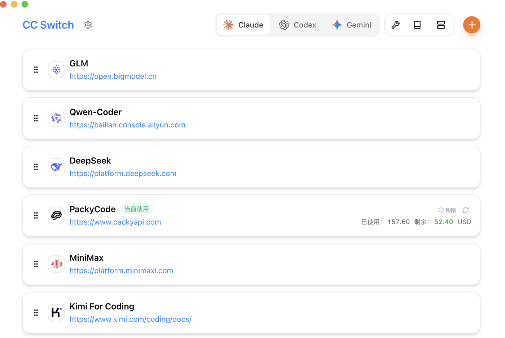
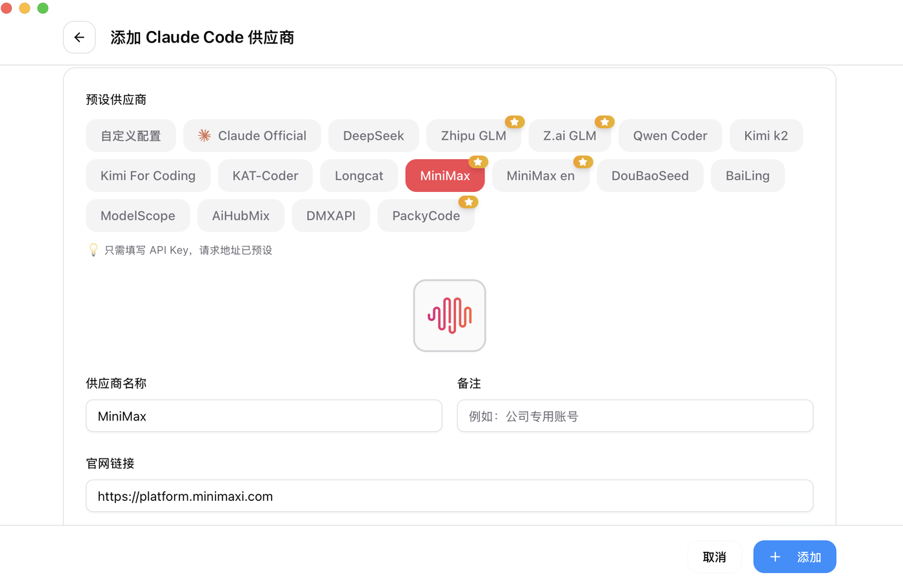
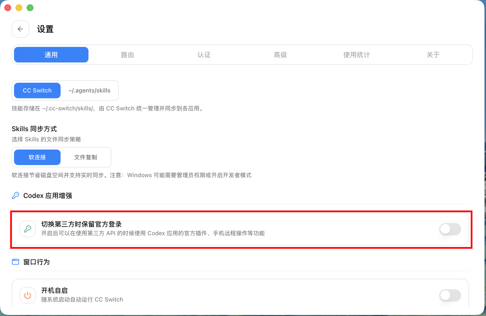
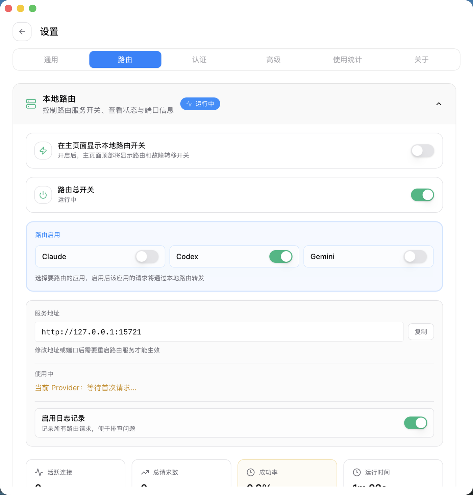

整理开发机时发现一件小事：`brew list --cask --versions cc-switch` 报的版本是 3.14.1，但打开 CC Switch 的界面，关于页写的是 3.20.0。不是装错了——这个 cask 带 `auto_updates` 标记，应用自己会联网更新，Homebrew 的账本追不上它。

一个配置管理工具，几个月里自己跑出去六个小版本。这个更新频率本身就是信号：它要追的那群 AI 编程 CLI，配置面正在快速膨胀。

这篇文章把 CC Switch 讲清楚——它解决什么问题、切换时内部到底改了什么、六大功能模块各自能做到什么程度、装和升级要注意什么，以及最容易被忽略的两块风险。先说结论：**它本质上不是一个「供应商切换器」，而是给八个 AI 编程工具做的一层本地配置管理层，切换只是这层管理层里最容易被看见的那个动作。**

## 一、它要解决的问题：配置面已经失控

现代 AI 编程很少只用一个 CLI。常见组合是 Claude Code 写主力逻辑、Codex 处理特定任务、Gemini CLI 做交叉验证，再加上 OpenCode、OpenClaw 这类各有侧重的工具。

麻烦在于，每个工具一套配置，格式还都不一样：

- **Claude Code** 走 `~/.claude/` 下的 settings 与环境变量（`ANTHROPIC_BASE_URL`、`ANTHROPIC_AUTH_TOKEN`）；
- **Codex** 走 `~/.codex/config.toml` 加 `auth.json`；
- 其他工具各有自己的 JSON、TOML 或 `.env`。

切换一个 API 供应商，意味着要按各家的格式分别手改一遍：改 base URL、换 token、别把别的不相关字段写坏。用几个工具就要重复几遍，漏改一个，那个工具就会继续拿着旧地址和旧 key 请求——而且往往不是立刻报错，是在你以为一切正常的时候返回一堆看不懂的失败。

MCP 服务器和 Skills 更麻烦。同一份 MCP 配置要在多个应用里各维护一份；提示词文件更是分裂成 `CLAUDE.md`、`AGENTS.md`、`GEMINI.md` 三个名字，内容基本一样，改一处就要记得同步另外两处。

CC Switch 就是冲着这一层来的。需要先划清边界：**它管的是「配置怎么存、怎么切、怎么同步」，不负责判断某个供应商好不好。** 本文同样不评价任何具体供应商的质量，只讨论管理这件事本身。

## 二、CC Switch 是什么

一句话：一个开源的跨平台桌面应用，把上述所有工具的供应商配置、MCP、Skills、用量和会话收拢到一个界面里管理。

| 项目 | 情况 |
| --- | --- |
| 仓库 | GitHub `farion1231/cc-switch`，MIT 协议，官网 ccswitch.io |
| 技术栈 | Tauri 2 + Rust 后端，React 18 + TypeScript 前端 |
| 体量 | 创建于 2025 年 8 月，截至 2026-09-15 约 13.2 万 star、9,100 fork |
| 平台 | Windows 10+ / macOS 12+ / Ubuntu 22.04+、Debian 11+、Fedora 34+ |
| 支持工具 | Claude Code、Claude Desktop、Codex、Gemini CLI、Grok Build、OpenCode、OpenClaw、Hermes |



*▲ 主界面顶部按应用分标签页（Claude / Codex / Gemini…），每个供应商一张卡片；当前激活的那张会显示用量与余额。图：CC Switch 官方仓库*

八个工具的配置，被抽象成同一套「供应商」模型：一张卡片 = 一组配置 = 一个可以一键启用的状态。这就是它全部设计的地基，后面所有功能都建立在这一点上。

## 三、切换的时候，内部到底改了什么

理解 CC Switch 的关键，是搞清楚它的数据存在哪、切换时动了什么。

**数据分两层存**。可同步的数据——供应商、MCP、提示词、技能——进 SQLite（`~/.cc-switch/cc-switch.db`），它被当作单一事实源（SSOT）；只跟这台设备有关的偏好设置进 `~/.cc-switch/settings.json`。分开的好处很直接：把数据库同步到多台机器，不会把 A 机器的窗口位置和 B 机器的主题设置搅在一起。

**切换是双向同步，不是单向覆盖。** 启用某个供应商时，它把配置写进对应 CLI 的 live 配置文件；反过来，当你编辑当前正在生效的那个供应商时，它会先从 live 文件把数据回填回来。这条设计解决的是一个很实际的场景：你在 CLI 里手动调过某个参数，如果不回填，下次切换就会把你的手改抹掉。

**写入用「临时文件 + 重命名」的原子操作**，避免写到一半崩溃留下半截 JSON 把工具搞挂。同时有自动备份机制，`~/.cc-switch/backups/` 轮换保留最近 10 份，Skills 相关另有一份保留 20 份。

**设计原则是「最小侵入」**：任何时刻至少保留一个激活中的供应商，所以你没法把配置删空；反过来，就算直接卸载 CC Switch，已经写进各工具的配置仍然有效，不会让工具用不了。

有一个细节值得单独说：**生效方式不统一**。大多数工具需要重启终端或 CLI 才能读到新配置，只有 Claude Code 支持热切换，改完即生效。所以「我切了怎么没反应」这类困惑，多数时候答案就是重启终端。



*▲ 添加供应商时，预设列表覆盖了主流模型厂商与社区中转服务，选中后通常只需填 API Key，请求地址已预设好。图：CC Switch 官方仓库*

还有个容易踩的坑值得提前知道：切换供应商后，你在某个工具里装的插件配置可能「不见了」。原因是插件配置往往写在同一个配置文件里，切换时没被带过去。官方的解法是「通用配置片段」——在编辑供应商的面板里点「从当前供应商提取」，把 Key 和请求地址之外的通用数据抽出来存成片段；之后新建供应商时勾选「应用通用配置」（默认勾选），这些数据就会被一并写入。你首次导入的那份默认供应商也会完整保留所有配置项。

## 四、功能地图：六个模块各自做到什么程度

### 4.1 供应商管理

核心是预设体系：内置 50+ 预设，覆盖 AWS Bedrock、NVIDIA NIM 以及大量社区中转服务，多数预设只需填 API Key。此外支持拖拽排序、导入导出、系统托盘一键切换。

有一个值得注意的抽象叫「**通用供应商**」：一份配置同时同步到 Claude Code、Codex 和 Gemini CLI。如果你的诉求是「所有工具都指向同一个入口」，这比逐工具配置省事得多。

回切官方登录也是支持的：添加一个「官方登录」预设，切过去后跑一遍 Log out / Log in 流程，之后就能在官方与第三方之间来回切。Codex 还支持在多个官方账号（比如 Plus 和 Team）之间切换。



*▲ 设置里的「Codex 应用增强」：开启后，使用第三方 API 期间仍可保留官方登录态，从而继续使用官方插件与手机远程操作等功能。图：CC Switch 官方仓库*

### 4.2 本地代理与故障转移

这是整个应用里分量最重、也最需要理解成本的一块。

它会在本地起一个代理服务（默认 `http://127.0.0.1:15721`），支持**格式转换**——把一种 API 协议转成另一种，让某个工具走它本来不支持的供应商；支持**自动故障转移**和**熔断器**，某个上游挂了自动切到备用；还有**供应商健康监控**和**整流器**。

**应用级接管**是另一个维度：可以独立为 Claude、Codex、Gemini 或 Grok Build 配置代理，粒度细到单个供应商。也就是说，你可以只让 Codex 走本地代理，Claude Code 保持直连。



*▲ 设置 → 路由：路由总开关、逐应用接管开关（图中只开了 Codex）、服务地址与实时统计。图：CC Switch 官方仓库*

代价要说清楚：启用了本地代理，请求路径就多了一跳，排查问题时需要先判断是上游的问题还是本地代理的问题。好在开关是显式的，出问题可以直接关掉路由总开关回到直连。

### 4.3 MCP、Prompts 与 Skills 统一管理

- **MCP**：一个面板管理 Claude、Codex、Gemini、Grok Build、OpenCode、Hermes 六个应用的 MCP 服务器，支持双向同步和 Deep Link 导入。
- **Prompts**：带 Markdown 编辑器，能跨应用同步到 `CLAUDE.md` / `AGENTS.md` / `GEMINI.md`，并且有回填保护——不会把你手写的文件覆盖掉。
- **Skills**：从 GitHub 仓库或 ZIP 一键安装，支持自定义仓库管理，同步方式可选软连接（省磁盘、实时同步）或文件复制（Windows 上更省事）。

### 4.4 用量与成本追踪

跨供应商追支出、请求数和 Token 用量，配趋势图表、逐条请求日志和自定义模型定价。对同时挂着多个供应商的人来说，这是把「这个月钱花哪了」变成可回答问题的功能。会话记录的扫描做了增量优化，大文件的解析速度在 3.20.1 里从秒级降到了毫秒级。

### 4.5 会话管理与工作区

可以浏览、搜索、恢复各工具的历史会话。OpenClaw 用户另有工作区编辑器，能直接编辑 `AGENTS.md`、`SOUL.md` 这类 Agent 文件并预览 Markdown。

### 4.6 系统集成

- **云同步**：把配置目录挂到 Dropbox、OneDrive、iCloud、坚果云、NAS，或直接用 WebDAV 服务器同步，实现多机一致。
- **Deep Link**：`ccswitch://` 协议，用一条 URL 导入供应商、MCP、提示词或技能——适合团队分发统一配置。
- **日常项**：深浅色主题、开机自启、自动更新、国际化（简中/繁中/英/日），以及一组解决首次安装登录确认、签名限制、插件同步等问题的「小工具」。

## 五、安装与升级

各平台路径都很常规，macOS 推荐 Homebrew：

```bash
brew install --cask cc-switch
brew upgrade --cask cc-switch   # 升级
```

Windows 用 Releases 页的 `.msi` 或便携版 zip；Arch 用 `paru -S cc-switch-bin`；其他 Linux 发行版用 `.deb` / `.rpm` / `.AppImage`。macOS 包已经过 Apple 签名和公证，装完直接打开，不需要额外绕过 Gatekeeper。

回到开头那个版本号对不上的现象，它有个实际影响：**别把 Homebrew 的版本号当成真实版本**。因为 cask 带 `auto_updates`，应用会自己更新，`brew list` 显示的可能是几个月前的老数字。想知道当前版本，看应用界面更准。

升级路径上有一个需要留意的节点。3.20.x 这一轮里，**3.20.1 带了数据库 schema 从 v17 到 v18 的迁移**（升级前会自动备份，但如果要降级，必须用备份恢复）；同一版还调整了 Codex 的第三方切换机制，改成只写配置文件、不再动 `auth.json`，Codex 的 OAuth 账号需要重新登录一次。后面两个版本没有 schema 变更。

| 版本 | 日期 | 关键变化 |
| --- | --- | --- |
| 3.20.1 | 08-28 | 适配 Codex CLI 0.149，切换改为「仅写配置」；同工作区多 ChatGPT 账号不再互相覆盖；DB schema v17→v18 |
| 3.20.2 | 09-07 | Grok 走 xAI 原生 Responses API；恢复并行工具调用；修复提示词前缀缓存被破坏等问题 |
| 3.20.3 | 09-11 | 新增「禁用 Artifact 工具」开关；修复空 reasoning 占位符刷屏、Codex 长任务中途停止；无 schema 变更 |

## 六、边界与风险

任何工具的能力边界都值得写清楚，这个尤其。

**它适合的**：同时用两个以上 AI 编程 CLI、需要频繁在多个供应商之间切换、在多地多台机器上用同一套配置、或者想给团队分发统一配置的人。收益随工具数量和切换频率线性上升。

**它不适合的**：只用一家供应商、只用一个工具、配置写死就不动的人。这种情况下它的全部价值只剩一个可视化的配置编辑器，装它的必要不大。

**风险一，也是最需要清醒对待的：预设列表不等于推荐列表。** 内置的 50+ 预设里，有相当一部分是第三方 API 中转服务——这一点从 README 里占了大篇幅的赞助商区块就能直观感受到。CC Switch 的立场是中立的：它提供的是「方便地接入」这个能力，不对任何预设的模型质量、稳定性、计费透明度或合规性做背书。**工具替你降低了切换成本，但没有替你承担选择成本。** 用第三方中转意味着你的请求和密钥要经过第三方，这部分判断得自己做。

**风险二，本地代理接管改变了请求路径。** 排障时多一层变量，建议在真正依赖它之前先小范围试一次，确认故障转移的触发条件和日志能看懂。

**风险三，配置文件的归属权冲突。** CC Switch 会写各工具的 live 配置文件。如果你另有脚本、dotfiles 管理工具或手工流程也在改同一份文件，两边会互相覆盖。原子写入和自动备份能防损坏，防不了逻辑冲突。

顺带一个冷知识，Linux + NVIDIA 用户可能会撞上：AppImage 默认强制走 XWayland，在较新的 Wayland + NVIDIA 环境下会出现界面点不动或缩放后黑屏。官方的逃生开关是 `CC_SWITCH_GDK_BACKEND=wayland ./CC-Switch-*.AppImage`。

## 七、我的判断

CC Switch 真正的价值，不在于「一键切换」这个动作节省的那几十秒，而在于它把散落在八个工具、三种格式里的配置，收敛成了一个有备份、有回滚、有单一事实源的本地管理层。

这个转变的意义在于：你开始可以**回答**「我现在到底在用哪套配置」这个问题了。在此之前，这个问题要靠翻四五个目录、比对若干份配置文件才能回答；现在它是一张卡片上的一行字。

值得提醒的是这个结论成立的前提：它成立，是因为你把多个工具和多个供应商当成常态来用。如果你的工作流只有一个工具加一个供应商，CC Switch 解决的是一个你并不存在的问题。工具的价值永远取决于它减掉的那部分复杂度，是不是真的存在于你的工作里。

## 总结

- CC Switch 是给八个 AI 编程 CLI 做配置管理的开源桌面应用（Tauri 2 + Rust，MIT，13 万 star），**配置管理层**才是它的定位，供应商切换只是入口。
- 内部机制是 SQLite 单一事实源 + 设备级 JSON 双层存储、切换双向同步、原子写入、自动备份；设计上保证最小侵入，卸载不留坑。
- 六个功能模块里，本地代理与故障转移最重、也最需要理解成本；MCP / Prompts / Skills 的统一管理是日常使用中最省事的部分。
- 安装优先走 Homebrew 或官方包；升级注意 3.20.1 的数据库迁移和 Codex OAuth 需要重新登录一次；别信 `brew list` 的版本号，应用会自更新。
- 预设列表里有大量第三方中转服务，工具降低了切换成本，但没有降低**判断该切到哪儿**的成本——这部分始终要自己做。

它把「切换」这件事的成本压到了最低，剩下的成本，是你判断该切到哪儿的成本。