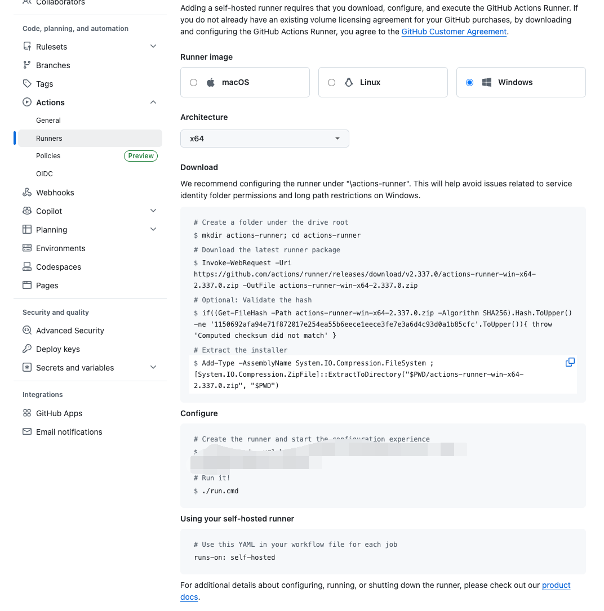
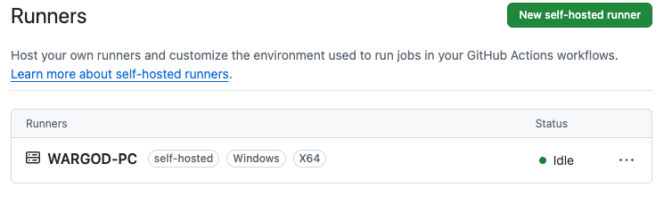

# 实现从 Windows 开发机通过 CI/CD 部署到另一台 Windows 机器的方法

要实现从一台 Windows 开发机通过 CI/CD 直接部署到另一台 Windows 机器，最主流且最稳定的做法是：在目标 Windows 机器上安装一个“自托管运行器 (Self-hosted Runner 或 Agent)”。

这样一来，CI/CD 平台就可以直接向你的目标机器发送指令，让它自动拉取最新代码（或构建好的程序包）、替换旧文件并重启软件。

以下是实现这一目标的标准流程，以目前最常用的 **GitHub Actions** 为例（GitLab CI/CD 或 Azure DevOps 的原理几乎完全相同）：

开发机上，你编写代码，然后执行 `git push` 命令将代码推送到云端仓库（如 GitHub）。

云端代码仓库（如 GitHub）检测到代码更新后，会触发 CI/CD 流程。此时，目标机器上运行的后台程序（Runner）接收到来自云端的指令，会自动在本地执行编译、覆盖文件和重启软件的脚本。

在你的目标机器上配置 Runner 是最关键的一步。你需要让目标机器和云端仓库建立连接。具体步骤如下：

在 GitHub 上，进入你的代码仓库，点击 **Settings**，然后选择 **Actions**，再进入 **Runners** 页面。点击 **New self-hosted runner**，选择 **Windows** 操作系统及对应的架构（通常是 x64）。

随后，在你的目标 Windows 机器上打开 PowerShell，按照 GitHub 页面上提供的步骤逐行复制并运行命令。这些命令会下载 Runner 程序、进行身份验证并将其注册到你的仓库中。

在配置的最后一步，建议将 Runner 安装为 **Windows 服务 (Windows Service)**，这样目标机器每次开机都会自动启动 Runner，随时准备接收部署任务。

在目标机器上更新软件时，通常会遇到“文件被占用”的问题。因此，你需要写一个简单的 PowerShell 脚本来处理部署逻辑。例如，你的软件运行在 `C:\MyApp`：

1. 停止正在运行的软件进程（或 Windows 服务）。
2. 将新编译好的文件复制到 `C:\MyApp` 并覆盖。
3. 重新启动软件。

在你的开发机上，在项目根目录下创建一个文件夹 `.github/workflows/`，并在其中新建一个文件（例如 `deploy.yml`），填入以下内容：

```yaml
name: Windows Auto Deploy

# 当推送到 main 分支时触发
on:
  push:
    branches: [ "main" ]

jobs:
  build-and-deploy:
    # 这里的 self-hosted 是关键，它告诉 GitHub 在你的目标机器上运行这些步骤
    runs-on: self-hosted 
  
    steps:
      - name: 1. 获取最新代码
        uses: actions/checkout@v4

      - name: 2. 编译项目 (根据你的语言修改)
        run: |
          echo "开始编译..."
          # 例如 C# 项目: dotnet build -c Release
          # 例如 Node 项目: npm install && npm run build
        
      - name: 3. 停止当前运行的程序
        run: |
          # 假设你的程序叫 MyApp.exe
          Stop-Process -Name "MyApp" -ErrorAction SilentlyContinue
          # 如果是 Windows 服务，使用: Stop-Service -Name "MyService"

      - name: 4. 部署/覆盖文件
        run: |
          echo "复制文件到运行目录..."
          # 将编译好的产物复制到目标文件夹 (根据实际路径修改)
          Copy-Item -Path ".\bin\Release\net8.0\*" -Destination "C:\Deployments\MyApp" -Recurse -Force

      - name: 5. 重启程序
        run: |
          echo "启动程序..."
          # 启动进程或重启服务
          Start-Process -FilePath "C:\Deployments\MyApp\MyApp.exe"
          # 如果是 Windows 服务，使用: Start-Service -Name "MyService"
```

在配置 Runner 时，需要注意权限问题。Runner 默认以配置它的用户身份运行。如果你需要操作 C 盘敏感目录或管理 Windows 服务，确保 Runner 对应的用户（或服务账号）具有**管理员权限**。

此外，如果你的目标机器性能较弱，或者不想安装编译工具链，可以将 CI/CD 拆分为两个 Job：第一个 Job 使用 GitHub 官方的云端 Windows 服务器进行编译并上传产物 (Artifacts)；第二个 Job 运行在 `self-hosted` 的目标机器上，只负责下载产物并覆盖文件。

## Self-hosted Runner 搭建教程

当 GitHub Actions 的免费额度用完，或者需要在特定硬件/内网环境上执行构建时，可以将自己的机器注册为 **Self-hosted Runner**。它不消耗 GitHub Actions 分钟数，job 会直接运行在你的机器上。

### 注册 Runner

进入仓库 **Settings → Actions → Runners → New self-hosted runner**（组织级别则在组织 Settings 中），选择对应的操作系统和架构，页面会生成一段包含一次性 registration token 的命令，照着执行即可。

### Linux 安装示例

```bash
mkdir actions-runner && cd actions-runner

# 版本号以 GitHub 页面给出的为准
curl -o actions-runner-linux-x64-2.325.0.tar.gz -L \
  https://github.com/actions/runner/releases/download/v2.325.0/actions-runner-linux-x64-2.325.0.tar.gz

tar xzf actions-runner-linux-x64-*.tar.gz

./config.sh --url https://github.com/<用户名>/<仓库> --token <页面生成的token>

# 前台测试运行
./run.sh

# 生产环境建议注册为系统服务
sudo ./svc.sh install
sudo ./svc.sh start
```

### Windows 安装示例

在 PowerShell 中执行（建议在 `C:\actions-runner` 这类位于驱动器根目录下的短路径中安装；注册为服务时需要在管理员权限下执行）：



```powershell
# 在驱动器根目录下创建安装目录
mkdir actions-runner; cd actions-runner

# 下载最新 Runner 包；版本号以 GitHub 页面给出的为准
Invoke-WebRequest -Uri https://github.com/actions/runner/releases/download/v2.337.0/actions-runner-win-x64-2.337.0.zip -OutFile actions-runner-win-x64-2.337.0.zip

# 可选：校验 SHA256 哈希，避免下载包损坏
if((Get-FileHash -Path actions-runner-win-x64-2.337.0.zip -Algorithm SHA256).Hash.ToUpper() -ne '1150692afa94e71f872017e254ea55b6eece1eece3fe7e3a6d4c93d0a1b85cfc'.ToUpper()){ throw 'Computed checksum did not match' }

# 解压到当前目录
Add-Type -AssemblyName System.IO.Compression.FileSystem;
[System.IO.Compression.ZipFile]::ExtractToDirectory("$PWD/actions-runner-win-x64-2.337.0.zip", "$PWD")

./config.cmd --url https://github.com/<用户名>/<仓库> --token <页面生成的token>

# 前台测试运行
./run.cmd

# 注册为 Windows 服务并启动
./svc.cmd install
./svc.cmd start
```

按页面给出的命令完成下载、校验、解压和 `config.cmd` 配置后，Runner 就会注册到仓库的 **Runners** 列表中。只要状态显示为 **Idle**，说明它已经在线并等待接收任务：



配置过程中会给 Runner 起名并选择 label（默认 `self-hosted`、`linux` 或 `windows` 等）。注册为服务后，即使关闭终端或注销用户，Runner 也会在后台常驻。

### 在 Workflow 中使用

```yaml
jobs:
  build:
    runs-on: self-hosted   # 或 [self-hosted, linux] / [self-hosted, windows] 指定更细的 label
    steps:
      - uses: actions/checkout@v4
      - name: Build
        run: echo "running on my own machine"
```

### 注意事项

- **安全**：公开仓库不要随意接入 self-hosted runner，任何 fork 的 PR 都可能执行代码。建议仅用于私有仓库，或在仓库设置中严格限制 workflow 权限。
- **环境隔离**：job 直接运行在宿主机上，会留下缓存和文件。建议用 Docker 容器或一次性虚拟机运行 Runner，或在每次 job 前后做清理。
- **服务账户权限**：Windows 下 Runner 默认以 `NETWORK SERVICE` 运行，如果 job 需要 Docker、文件系统或网络共享权限，需在安装服务时指定有权限的账户，或在 `services.msc` 中修改服务登录账户。
- **环境依赖**：确保 Runner 所在机器已安装构建所需的工具链（Node、Python、Docker 等），且服务账户的 PATH 中可访问。
- **在线要求**：Runner 需要保持在线才能接收任务，建议通过 `systemd`（Linux）或 Windows 服务常驻运行。
