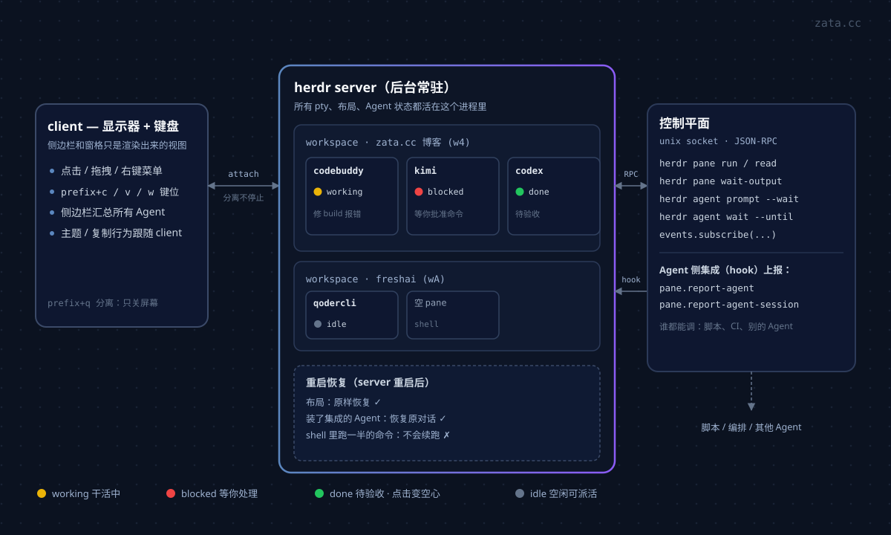
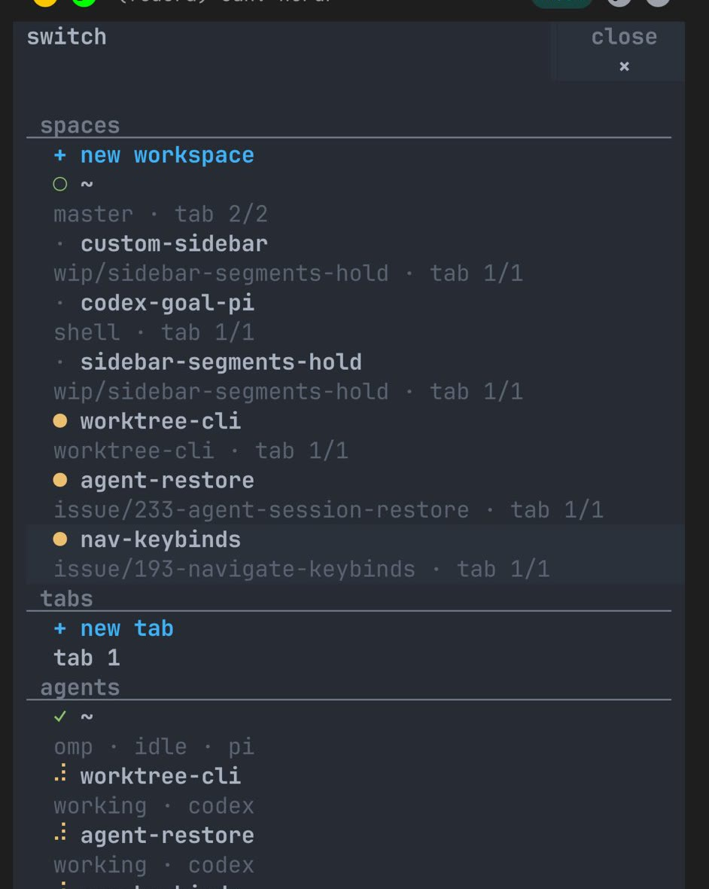
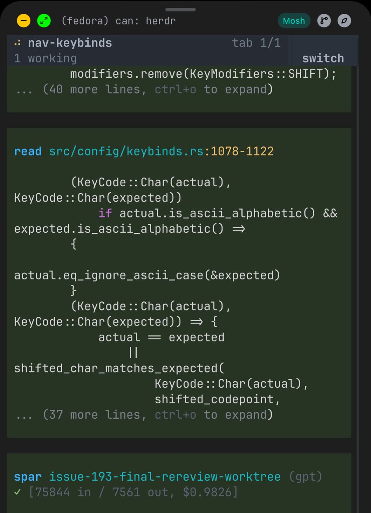
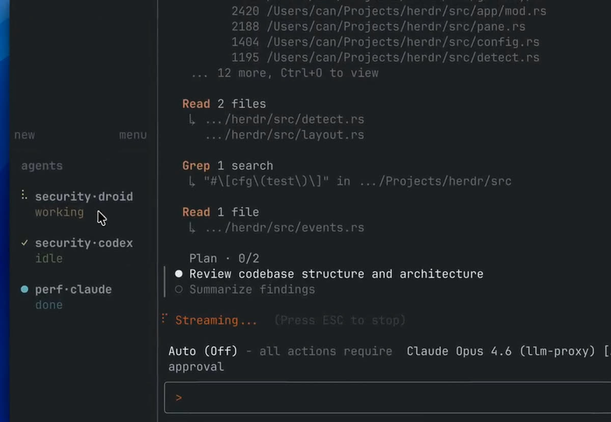
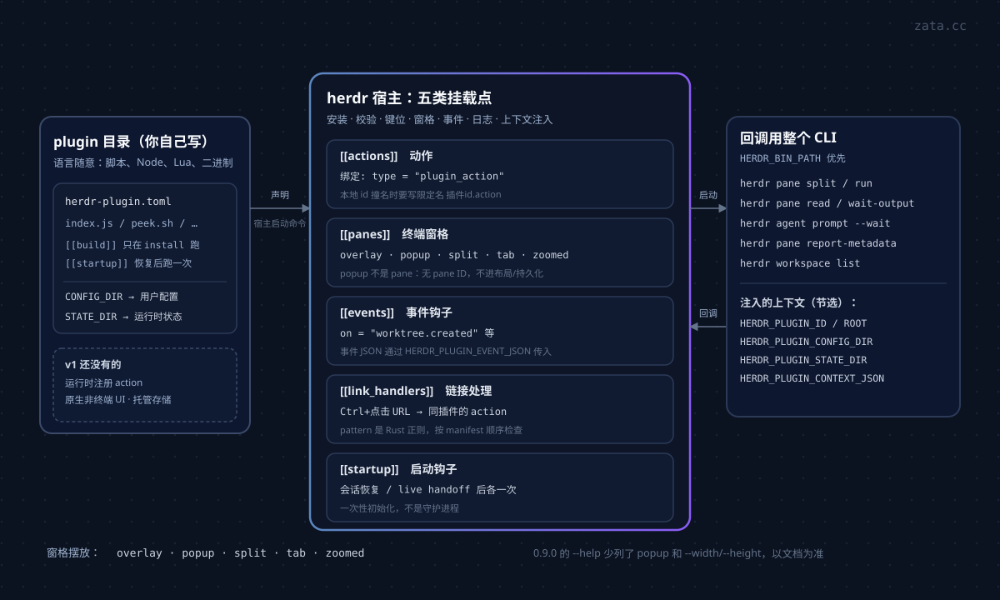

如果你同时开着三个 Claude Code、两个 Codex，再挂一台远程机器的构建任务，你大概经历过这几件事：某个 Agent 早就停下来等你批准命令，你却在另一个标签页里刷了两分钟；SSH 断了一下，跑了一半的活没了；想知道"现在到底哪个窗口在干活"，只能一个个切过去看。

Herdr 就是冲这些事来的。它的官方定位是"The runtime your coding agents live on"——**不是替代 Agent，而是给 Agent 提供它们运行于其中的那层终端基础设施**。用一句话概括：**Herdr 是把 tmux 按 Agent 的工作方式重新设计了一遍。**

这篇文章基于我本机装的 **herdr 0.9.0**（stable 通道，protocol 22），把它的用法、概念模型和配置讲清楚，命令和输出都是实际跑出来的。（9 月 15 日补充：右键转发、复制模式、会话恢复的全景、插件从装到写、手机用法、中文输入法开关。同日二次补充：9.6.7 装了一个真插件的完整实录。）

---

## 一、它到底是什么，和 tmux 差在哪

Herdr 是 tmux 一脉的 **后台 server + 前端 client** 架构：client 只是一个"显示器 + 键盘"，真正的 pty、进程、布局都在 server 里。但它在几个地方做了明确的 Agent 化改造：

| 维度 | tmux | Herdr |
|---|---|---|
| 基本目的 | 保住终端会话 | 托管 AI Agent 的工作区 |
| 组织单位 | session → window → pane | **workspace → tab → pane** |
| 状态感知 | 无，pane 里有什么全靠肉眼看 | 每个 pane 有语义状态：`working` / `blocked` / `done` / `idle` |
| 总览 | 逐个 window 切 | 侧边栏跨所有 workspace 汇总 Agent 列表 |
| 控制接口 | `tmux` 命令 | CLI + 本地 socket JSON API，**给 Agent 用的** |
| 多机 | 要自己拼 ssh | `--remote` / 已保存机器，本地与远程同一视图 |
| 鼠标 | 基本可用 | 一等公民，点击/拖拽/右键菜单全能 |

原话是"不包装、不替换 Agent，只接管它们的终端"。所以 Claude Code、Codex、Cursor、OpenCode、Grok 这些还是原来那些，只是被放进了 Herdr 管理的工作区里——Herdr 能识别它们、给它们状态打标、允许它们互相说话。

技术上是 **Rust 单二进制，没有 Electron**，终端后端用 libghostty（Ghostty 的终端库），Windows 走 ConPTY。装完就是一个约等于 tmux 的东西，但多了 Agent 那一层。

想先看动起来是什么样，官方 README 里有一段二十来秒的演示（[视频直链](https://github.com/user-attachments/assets/043ec09f-4bdd-41d5-aee0-8fda6b83e267)）：多个 Agent 在分屏里并行跑，侧边栏实时显示谁 blocked、谁 idle、谁 done，鼠标点着切窗格。下文用到的几张截图就是从这段演示和官方文档里取的。

---

## 二、安装与第一次启动

```bash
# 首选
brew install herdr
# 或官方脚本
curl -fsSL https://herdr.dev/install.sh | sh
# 或 mise
mise use -g herdr
```

Windows 现在也已 GA：一行 PowerShell 装上（`powershell -ExecutionPolicy Bypass -c "irm https://herdr.dev/install.ps1 | iex"`），企业安全软件拦无文件脚本时改用 `install.cmd` 版本，Windows ARM64 跑 x86_64 构建（模拟）。官方维护了一份[已知限制清单](https://herdr.dev/zh-cn/docs/windows-beta/)，不长，装前值得看一眼。补全脚本支持 bash / zsh / fish / elvish / powershell：`herdr completion zsh`。

升级要注意安装来源：直接安装的用 `herdr update`；Homebrew、mise、Nix 装的用各自的包管理器（`herdr update` 对它们不生效）。直接安装还能切更新通道——`herdr channel set preview` 跟进 master 的预发布版（可能回归），`herdr channel set stable` 切回，包管理器安装不支持预览通道。

装完在任意项目目录里敲：

```bash
cd ~/code/ZataTree
herdr
```

它**启动或连接默认后台会话**，不需要你去管 socket 在哪。第一次会走一个 onboarding（也可以 `onboarding = false` 跳过）。如果一个 workspace 都没有，它会自动开一个。

我本机的实际状态：

```console
$ herdr --version
herdr 0.9.0

$ herdr status
client:
  version: 0.9.0
  channel: stable
  protocol: 22
  endpoint_protocol_generation: 1

server:
  status: running
  version: 0.9.0
  endpoint_compatible: yes
  private_protocol: 22
  private_protocol_compatible: yes
  socket: /Users/zata/.config/herdr/herdr.sock

update:
  restart_needed: no
  server_binary_stale: no
```

注意这一行：**server 是 running，而 client 是我每次敲 `herdr` 才起的**。这是理解 Herdr 的第一把钥匙——server 活着，你的活就活着。

---

## 三、概念模型：workspace / tab / pane / agent

比 tmux 多了一层"工作区"，而且这层是**按项目**切而不是按窗口切：

- **workspace** — 项目级容器，对应一个仓库/一个项目。侧边栏按 workspace 分组。
- **tab** — workspace 内的标签页。
- **pane** — tab 内可分割的终端格子，每个格子通常跑一个 Agent。
- **agent** — Herdr 从 pane 里**检测出来的**编程 Agent 进程，是关注对象而不是容器。



`prefix+w` 或侧边栏的 `switch` 面板把这三层同时摊开，是这个模型最直观的一屏——左侧边栏分 spaces / tabs / agents 三段，Agent 名字下面是它的状态：



我本机现在的样子（`--json` 输出是我删掉无关字段后的样子）：

```console
$ herdr workspace list
{"result":{"workspaces":[
  {"workspace_id":"w4","label":"freshai","number":1,"pane_count":2,"tab_count":1},
  {"workspace_id":"w6","label":"zata_code_template","number":2,"pane_count":1,"tab_count":1}
],"type":"workspace_list"}}

$ herdr pane list
{"result":{"panes":[
  {"pane_id":"w4:p1","workspace_id":"w4","cwd":"/Users/zata/code/freshai",
   "terminal_title":"⠸ Complete external skill change review task in worktree","agent_status":"unknown"},
  {"pane_id":"w4:p3","workspace_id":"w4","cwd":"/Users/zata/code/ZataTree",
   "terminal_title":"⠧ 询问 herdr 相关信息","agent_status":"unknown"},
  {"pane_id":"w6:p1","workspace_id":"w6","cwd":"/Users/zata/code/zata_code_template",
   "terminal_title":"✳ Greeting and session start","agent_status":"unknown"}
],"type":"pane_list"}}
```

**pane ID 的格式是 `w4:p1`**——workspace 短 ID 加 pane 短 ID，稳定且可引用。所有跨 pane 的命令都用它寻址。Agent 列表现在是空的，因为我当前这几个 pane 里跑的不是被识别的 Agent（原因见第八节）。

> 一个实践建议：**每个活跃项目给一个独立 workspace**。侧边栏的 Agent 汇总只有在 workspace 边界清晰时才读得懂，否则所有项目的 Agent 混成一堆，"哪个项目在等我"又变成一个需要推理的问题。

---

## 四、核心能力一：分离而不停止

这是第一个真正让你离不开它的功能。

```console
# 分离（客户端退出，server 和 Agent 继续跑）
prefix + q

# 回来
herdr
```

也可以直接关掉终端窗口——效果一样。想真正结束会话和里面的 pane：

```bash
herdr server stop
```

Herdr 在这一点上比 tmux 多走了一步：**重启恢复**。server 重启后，它会恢复保存的布局，并且对**装了官方集成、上报过原生 session 引用的 Agent**，尝试恢复到原来的对话（`[session] resume_agents_on_restore = true`，默认开）。

但这里有个必须说清楚的边界：**恢复的是 Agent 的原生会话，不是原始进程**。你的 shell 里跑到一半的 `npm run build` 不会自己接着跑，别指望这个。Herdr 官方在文档里也写得很直白。

**把"恢复"拆成四个问题，答案才清楚。** 进程还在吗、布局回来吗、屏幕内容回来吗、对话能续上吗——官方文档就是这么拆的，我把它那张表放在这里：

| 情形 | 进程继续跑 | 布局 | 最近屏幕内容 | Agent 对话 |
|---|---|---|---|---|
| 分离再附着 | 是 | 是 | 是（活的终端） | 是（进程从没停） |
| server 重启 | 否 | 是 | 仅在开了屏幕历史回放时 | 仅在装了原生会话恢复时 |
| `herdr update`（不带 `--handoff`） | 兼容的 server 继续跑 | 重启后回来 | 仅在开了屏幕历史回放时 | 仅在装了原生会话恢复时 |
| `herdr update --handoff` | 尽力保留 | 是 | 是（交接成功时来自活终端） | 是（同上） |

两个默认不启用、但值得知道的能力：

- **屏幕历史回放**：`[experimental] pane_history = true`，让 server 全量重启后也能把每个 pane 最近的屏幕内容铺回去。默认关的原因很正当——pane 输出里可能有 token、密钥和敏感提示词，开了就要**像对待终端历史一样对待它**（内容落在会话目录的 `session-history.json`）。
- **live handoff（热交接）**：升级时把活着的 pane **连同进程一起**从旧 server 交到新 server，跳过"停掉再重建"。命令是 `herdr update --handoff`，`herdr --remote workbox --handoff` 也能用它换掉远端的 server。实验性、需要显式开，而且包管理器安装用不了（升级走 brew/mise/nix）。边界也要说清楚：**交接那一刻，在途的 CLI 请求、`agent wait`、事件订阅都会断**，客户端要自己重连重试。

顺带一提命名会话，多环境隔离时很有用：

```bash
herdr --session work          # 用或建一个命名会话
herdr session list            # 列出
herdr session attach work     # 附着
herdr session stop work       # 停掉
```

socket 落在 `~/.config/herdr/sessions/<name>/herdr.sock`，默认会话则是 `~/.config/herdr/herdr.sock`。

---

## 五、核心能力二：状态可见——`working` / `blocked` / `done` / `idle`

Herdr 最有价值的一点是**把 Agent 的状态变成了有语义的东西**，而不是让你去读屏幕。

每个 pane 有一个状态，四种取值：

| 状态 | 含义 | 你该做什么 |
|---|---|---|
| `working` | Agent 正在干活 | 别打扰 |
| `blocked` | **卡住了，等你输入/批准** | 切过去处理 |
| `done` | 这一轮任务完成 | 验收 |
| `idle` | 空着，等新指令 | 可以派活 |
| `unknown` | 没有检测到/上报状态 | 需要装集成，见第八节 |

侧边栏把**所有 workspace** 的 Agent 汇总成一个列表，默认按 workspace 分组（`ui.agent_panel_sort = "spaces"`），也可以切成 `priority`——按"谁在等我"排队的注意力队列。我认为 `priority` 在 Agent 多了之后更实用：它本质是一个待办队列。

状态还会**沿层级向上汇总**：一个 blocked 的 Agent 会让它所在的 pane、tab、workspace 都显示成 blocked；working 会让 workspace 显示活跃；done 会一直挂着，**直到你真的看过它**。所以侧边栏能当"哪个项目在等我"的单一入口——不是靠人记住，而是靠这条汇总规则替你维护。

状态指示符默认是彩色圆点，可以换成形状区分：

```toml
[ui]
status_indicators = "symbols"   # 用不同字形区分 blocked/working/done/idle/unknown
```

下面这张是同一个 Agent 在 `working` 状态下的实拍——标题栏的 `tab 1/1`、顶部的工作区名 `nav-keybinds`、底部的 `Working...` 都是 Herdr 自己画的：



再加上通知：

```toml
[ui.toast]
delivery = "herdr"        # herdr(应用内) | terminal(外层终端，SSH 场景好用) | system(系统通知) | off
delay_seconds = 1

[ui.toast.herdr]
position = "bottom-right"

[ui.sound]
enabled = true
# done_path = "sounds/done.mp3"       # 任务完成音
# request_path = "sounds/request.mp3" # 需要你介入的音
```

**阻塞和完成用不同的声音**，这是我配完之后最满意的一条改动——不用看屏幕，光靠耳朵就知道是"干完了"还是"卡住了要我批准"。macOS 上 `delivery = "system"` 会先试 `terminal-notifier`，没有则退回 `osascript`（注意会显示成 Script Editor，且无法激活终端）；要 `brew install terminal-notifier` 才有完整体验。

Herdr 会**抑制当前活跃 tab 的弹窗**——你正盯着那个 pane 看，它不会弹一个框告诉你它 blocked 了。这个细节做对了。

---

## 六、用法：鼠标是默认，键盘是可选

Herdr 的入门门槛比 tmux 低，核心原因是**它把鼠标做成了默认路径**，前缀键只是另一条路。

**鼠标：**

- 点击 pane / tab / workspace / agent 行 → 聚焦
- 拖动分割边框 → 调整大小
- 右键 → 上下文菜单（包含分割窗格、新建标签页）
- 拖选文本即复制，双击一个词即复制该词——**不需要 Ctrl+C**
- Ctrl+点击打开链接（OSC 8 超链接和可见的 `http(s)://` URL）。macOS 下鼠标捕获开着时要 Ctrl+点，`Cmd+点`需要终端原生绕过路径；也可以用 `ui.mouse_capture = false` 整体让出鼠标

**右键的归属是可以调的。** 默认右键是 Herdr 的窗格菜单，但 pane 里跑着 Claude Code、Neovim 这类开了鼠标上报的程序时，右键本来是它们的功能——Herdr 曾经统统一口吃掉，后来专门修过（issue #25）。现在**这个归属是按 pane 单独选的**：

- 右键窗格 → 菜单里的 **"Send right-clicks to pane"** 一键切过去；切过去之后再开菜单，这一项会变成 "Use Herdr right-click menu"，点它切回。
- CLI 等价物：`herdr pane input --current --right-click pane|herdr`（要在目标 pane 里执行；从别处操作就换成 `--pane w1:p2`）。`herdr pane split` 也接受 `--right-click pane`，分割时一次定好。
- socket 层是 `pane.input.set`，参数 `right_click: "pane"`。

注意它和 `ui.mouse_capture = false` 不是一回事：那个是把**整个鼠标**都让给 pane 里的应用，这个只让右键，其余交互仍归 Herdr。

不想逐个 pane 切的话，还有全局的**修饰键混合模式**：

```toml
[ui]
right_click_passthrough_modifier = "ctrl"   # ctrl+右键转发给应用，普通右键仍开 Herdr 菜单
```

接受 ctrl / alt / cmd / meta / hyper，可以组合（不能带 shift）。

最后是必须提前知道的坑：**右键转发出去之后，Herdr 菜单要靠右键窗格的边框唤回**。不知道这一条的人，会在 pane 里反复右键、以为菜单坏了。

**键盘：** 前缀键默认 `ctrl+b`，和 tmux 一致，所以从 tmux 迁过来基本零成本。按下 `ctrl+b` 进入前缀模式，再按动作键。

| 动作 | 默认绑定 |
|---|---|
| 向右分割窗格 | `prefix+v` |
| 向下分割窗格 | `prefix+minus` |
| 新建标签页 | `prefix+c` |
| 下一个 / 上一个标签页 | `prefix+n` / `prefix+p` |
| 切到第 N 个标签页 | `prefix+1..9` |
| 重命名标签页 | `prefix+shift+t` |
| 工作区选择器 | `prefix+w` |
| 新建工作区 | `prefix+shift+n` |
| 重命名工作区 | `prefix+shift+w` |
| 方向聚焦（vim 式） | `prefix+h/j/k/l` |
| 窗格循环切换 | `prefix+tab` / `prefix+shift+tab` |
| 关闭窗格 | `prefix+x` |
| 缩放窗格 | `prefix+z` |
| 重命名窗格 | `prefix+shift+p` |
| 侧边栏开关 | `prefix+b` |
| **分离客户端** | `prefix+q` |
| 进入复制模式（键盘复制） | `prefix+[` |
| **查看当前全部有效绑定** | `prefix+?` |

**复制模式。** 鼠标拖选即复制之外，`prefix+[` 提供一条完整的键盘路径——没有鼠标的 SSH 场景里，这是唯一的复制方式：

- **移动**：`h/j/k/l`；tmux 风格的单词 `w/b/e`、大字词 `W/B/E`（按空白分词）；`{`/`}` 段落；`PageUp`/`PageDown` 翻页、`ctrl+u`/`ctrl+d` 半页。
- **搜索**：`/` 向前、`?` 向后，`n`/`N` 顺逆序重复。**查询里没有大写字母就不区分大小写**，想精确匹配就带上一个大写。
- **选择与复制**：`v` 或空格开始选择（`shift+v` 是整行选择），`y` 或回车复制，`q`/`Esc` 放弃退出。`Esc` 会先清掉当前的选择或搜索，再按一次才退出。
- **复制模式不暂停进程**：输出照常产生、视图跟在底部；你滚进历史时画面钉住不动。

两个容易错过的点：**默认前缀就是 `ctrl+b`，所以在复制模式里 `ctrl+b` 仍然是"前缀"、不是翻页**，想用它翻页得先换前缀；另外 `prefix+e` 能把回滚内容直接在 `$EDITOR` 里打开，**软折行会还原成逻辑行**——审一段长日志，比在终端里滚舒服得多。

**给终端起个看得懂的名字。** 默认窗格标题显示的是运行中程序动态设置的 terminal title——比如 Claude Code 会把它改成当前正在做的事，还带转圈动画，一直变，根本认不出哪个窗格是哪个。三级对象都能改名：`prefix+shift+p`（窗格）、`prefix+shift+t`（标签页）、`prefix+shift+w`（工作区），按下后弹输入框，起个名，侧边栏和窗格边框从此显示固定名字。CLI 也能改，适合脚本或远程操作：

```bash
herdr pane rename w4:p3 "zata blog"   # 给指定 pane 起固定名字
herdr pane rename w4:p3 --clear       # 清掉，退回动态标题
```

再配一条：窗格**没有手动命名**时，在分割边框上显示检测到的 Agent 标签：

```toml
[ui]
show_agent_labels_on_pane_borders = true
```

两个容易忽略但很实用的点：

- **`prefix+?` 是帮助面板，显示当前生效的绑定。** 改过配置之后不用去翻文档。
- **字面 `ctrl+b` 用 `prefix+ctrl+b` 发送。** 也就是"再按一次"。终端里有个程序真的需要收到 `ctrl+b` 时用这个。

配置里的绑定语法是显式的：`prefix+n` 表示要先按前缀，`ctrl+alt+n` 才是终端模式下的直接快捷键。可以直接绑普通按键（比如 `n`），但**有风险**——它会拦截你所有输入，所以除非你确实想要一个无前缀的模式，否则都用 `prefix+`。

```toml
[keys]
prefix = "ctrl+b"
new_tab = "prefix+c"
split_horizontal = "prefix+minus"
# 一个动作可以有多个绑定
next_tab = ["prefix+n", "ctrl+alt+]"]
# 不用进 resize 模式，直接调大小
resize_pane_right = "ctrl+shift+alt+right"
```

改配置改乱了的救援命令：

```bash
herdr config reset-keys      # 备份 config.toml，移除自定义 [keys]，回到内置 v2 默认
herdr server reload-config   # 热加载（大部分 UI 设置不用重启 pane）
```

---

## 七、自定义命令与弹出面板

Herdr 允许把任意命令绑到按键上，这是把日常工具接进工作流的入口：

```toml
[[keys.command]]
key = "prefix+alt+g"
type = "popup"          # popup | pane | shell | plugin_action
command = "lazygit"
description = "run lazygit"    # 会显示在 prefix+? 帮助面板里
width = "80%"
height = "80%"
```

四种类型的语义差别值得记一下：

| `type` | 行为 |
|---|---|
| `popup` | 会话级模态弹窗，不改变 tab 布局，会拿到所有输入（含 Escape）直到命令退出 |
| `pane` | 开一个临时 pane，命令退出就关掉 |
| `shell` | 后台游离执行 |
| `plugin_action` | 调用已安装插件的某个 action |

`popup` 最实用。比如随手开一个临时 shell：

```toml
[[keys.command]]
key = "prefix+t"
type = "popup"
command = "exec \"${SHELL:-sh}\""
description = "open scratch terminal"
width = "80%"
height = "80%"
```

**注意 popup 命令拿不到 `HERDR_PANE_ID`**（它是会话级的，不属于任何 pane），要引用底下那个平铺 pane 得用 `HERDR_ACTIVE_PANE_ID`。这个坑不踩一次很难注意到。

自定义命令能拿到的环境变量里，比较有用的几个：`HERDR_SOCKET_PATH`、`HERDR_BIN_PATH`、`HERDR_ACTIVE_WORKSPACE_ID`、`HERDR_ACTIVE_TAB_ID`、`HERDR_ACTIVE_PANE_ID`、`HERDR_ACTIVE_PANE_CWD`。

标签栏右侧还能挂状态：主机名、时间、一段自定义脚本的输出。

```toml
[ui]
tab_bar_position = "bottom"
tab_bar_right = [
  { type = "zoom" },
  { type = "hostname" },
  { type = "datetime", format = "%H:%M" },
  { type = "command", command = "~/.config/herdr/status.sh", interval_seconds = 5, timeout_seconds = 2 },
]
tab_bar_right_separator = " · "
```

`hostname` / `datetime` / `command` 都在 **server 端**求值，所以 `herdr --remote` 时显示的是远端机器的值——这点很正确，看远程构建状态时不会误判。



---

## 八、关键一步：让状态真正准确——集成

**如果你什么都不做，`agent list` 会是空的，状态全是 `unknown`。** 我上面贴的实测输出就是这样。这不是 bug，是设计：Herdr 需要 Agent 侧有一个 hook 主动上报状态。

装法是一条命令：

```bash
herdr integration install claude
herdr integration install codex
herdr integration status
```

支持的一堆：`pi`、`omp`、`claude`、`codex`、`copilot`、`devin`、`droid`、`kimi`、`opencode`、`kilo`、`hermes`、`mastracode`、`qodercli`、`qwen`、`cursor`。

我本机 `herdr integration status` 的实际输出：

```console
pi: current (v8) (/Users/zata/.pi/agent/extensions/herdr-agent-state.ts)
claude: current (v9) (/Users/zata/.claude/hooks/herdr-agent-state.sh)
codex: current (v8) (/Users/zata/.codex/herdr-agent-state.sh)
copilot: current (v3) (/Users/zata/.copilot/hooks/herdr-agent-state.sh)
kimi: current (v7) (/Users/zata/.kimi-code/hooks/herdr-agent-state.sh)
opencode: current (v11) (/Users/zata/.config/opencode/plugins/herdr-agent-state.js)
hermes: current (v5) (/Users/zata/.hermes/plugins/herdr-agent-state/__init__.py)
omp: not installed (/Users/zata/.omp/agent/extensions/herdr-omp-agent-state.ts)
devin: not installed (/Users/zata/.config/devin/herdr-agent-state.sh)
droid: not installed (/Users/zata/.factory/hooks/herdr-agent-state.sh)
qwen: not installed (/Users/zata/.qwen/hooks/herdr-agent-session.sh)
cursor: not installed (/Users/zata/.cursor/herdr-agent-state.sh)
grok: not installed (/Users/zata/.grok/hooks/herdr-agent-state.sh)
...
```

有意思的是：它检测到我已经装了 Claude、Codex、Copilot、Kimi、OpenCode、Hermes 的集成，**但一个都没装 pi**。这正是我前面 `agent list` 为空的原因——我当前跑在 pane 里的那些进程，不是这几个装了集成的 Agent。装完集成后必须**在 Herdr 里重启那个 Agent**，hook 才会生效。

集成除了报状态，还负责上报**原生会话引用**，这就是第 4 节"重启后恢复对话"依赖的东西。没装集成的 Agent，重启后只能恢复成一个普通 shell。

Herdr 还有一份**给你自己的 Agent 看的技能文件**，装上之后 Agent 就知道怎么用 herdr 控制周边窗格：

```bash
npx skills add herdrdev/herdr --skill herdr -g
```

或直接 `herdr --skill` 打印与当前二进制版本匹配的内置副本。技能文件里第一条是护栏：**如果 `HERDR_ENV=1` 没设置，Agent 必须停下来**，并说明自己没跑在 Herdr 管理的 pane 里——防止 Herdr 外部的 Agent 去控制一个不属于它的会话。

---

## 九、重头戏：把 Herdr 当 Agent 的控制平面

这才是 Herdr 和 tmux 的分水岭。所有操作都通过**本地 socket 上的 JSON API**，CLI 只是它的一个包装。

### 9.1 三层接口，按需选

| 层 | 用途 |
|---|---|
| Agent 技能 | 教 coding agent 在 pane 内使用 Herdr |
| **CLI 包装** | 脚本、简单编排、人工调试 ← 大多数情况从这层开始 |
| 原始 socket API | 自定义工具、协议客户端、事件订阅 |

三层共用同一个控制平面。先看 CLI 的规模——这是 `herdr pane --help` 的命令表：

```console
$ herdr pane --help
Commands:
  list                  List panes
  current               Show the current pane
  get                   Show a pane
  layout                Show pane layout information
  process-info          Show pane process information
  neighbor              Find a pane neighbor
  edges                 Show pane edge information
  focus                 Focus a neighboring pane
  resize                Resize a pane split
  zoom                  Toggle or set pane zoom
  read                  Read pane terminal output
  rename                Rename a pane
  input                 Set pane input routing
  split                 Split a pane
  swap                  Swap panes
  move                  Move a pane
  close                 Close a pane
  send-text             Send literal text to a pane
  send-keys             Send key presses to a pane
  wait-output           Wait for matching pane output
  run                   Run a command in a pane
  report-agent          Report pane agent lifecycle state
  report-agent-session  Report pane agent session identity
  release-agent         Release pane agent lifecycle authority
  report-metadata       Report display-only pane metadata
```

关键点：**pane 是你的手，agent 是你的眼。** 用 `pane run` 开东西，用 `pane read` / `agent wait` 拿结果。

### 9.2 基础编排：起活、读输出、等结果

```bash
# 建一个工作区，指定目录和标签
herdr workspace create --cwd ~/code/project --label api

# 切一个 pane 出来跑测试
herdr pane split w1:p1 --direction right
herdr pane run w1:p2 "npm test"

# 读输出（四种来源见下）
herdr pane read w1:p2 --source recent --lines 50

# 等某个字符串出现
herdr pane wait-output w1:p2 --match "Test Suites:" --timeout 120000
```

`pane read --source` 的四种取值语义不一样，选错了会读出一堆噪声：

| source | 含义 | 适用场景 |
|---|---|---|
| `visible` | 当前渲染的屏幕 | **UI 反馈循环**——想看用户看到什么 |
| `recent` | 带终端软折行的最近回滚 | 一般读取 |
| `recent-unwrapped` | 不带软折行的最近回滚 | **日志**——不想被折行切断 |
| `detection` | Agent 屏幕检测用的底部缓冲区快照 | 排查检测逻辑 |

我读日志一律用 `recent-unwrapped`。用 `recent` 读一段长 JSON 或宽表格，折行会把结构切碎。

### 9.3 Agent 之间互相指挥

这是最有意思的部分。`herdr agent` 提供了一组面向"别的 Agent"的动词：

```console
$ herdr agent --help
  list       List agents
  get        Show an agent
  read       Read agent terminal output
  send-keys  Send key presses to an agent
  prompt     Submit a prompt to an agent
  rename     Rename an agent
  focus      Focus an agent
  wait       Wait until an agent reaches one of the requested states
  attach     Attach directly to an agent terminal
  start      Start a supported interactive agent in an existing pane
  explain    Explain agent detection state
```

`--kind` 支持的 Agent 相当全：`pi`、`claude`、`codex`、`gemini`、`cursor`、`devin`、`agy`、`cline`、`omp`、`mastracode`、`opencode`、`copilot`、`kimi`、`kiro`、`droid`、`amp`、`grok`、`hermes`、`kilo`、`qodercli`、`qwen`、`maki`、`muse`。

于是你可以这样写一个"评审"流程——**一个 Agent 等另一个 Agent 干完再接手**：

```bash
# 在右窗格起一个 Codex，让它做代码审查
herdr pane split w1:p1 --direction right
herdr agent start reviewer --kind codex --pane w1:p2

# 给它派活，并直接阻塞到它需要你/干完为止
herdr agent prompt reviewer "审查 src/auth 的变更，只报问题不报风格" --wait --until blocked --timeout 600000

# 读它的结论
herdr agent read reviewer --source recent-unwrapped --lines 120
```

`agent start` 有个前置条件：目标 pane 必须停在**交互式 shell 提示符**上——它把 Agent 进程放进现成的 shell 里启动，并确认检测成功才算数。

看清楚 `--wait --until blocked` 的含义：**阻塞直到那个 Agent 真的需要人类介入**，而不是"命令跑完了"。这个语义差别很重要，下面 9.4 会展开。

`agent prompt` 的帮助里有一段很值得逐字读的行为约定：

> 如果目标 agent 已经处于 blocked 状态，提交会在**发送任何输入之前**被拒绝，返回 `agent_blocked`。当一个被接受的提交从非 working 状态起步时，`--wait` 要求在 5000ms 内观察到一个 `working` 或 `blocked` 状态，否则返回 `agent_prompt_stalled`。

也就是说它**主动防止你往一个正在等人类输入的 Agent 里灌东西**。这个栏杆方向是对的——`blocked` 的 Agent 需要的往往是你去回答一个问题，而不是再来一条指令。

另外几个顺手的动词：`herdr agent attach reviewer` 把**当前终端直接接到某个 Agent 的屏幕**上（不看全景，就看这一个），退出用 `ctrl+b q`，想给它发字面 `ctrl+b` 就连按两次；已经有别的直连客户端占着输入时用 `--takeover` 抢过来。非 Agent 的普通终端有对应的 `herdr terminal attach <terminal_id>`。`herdr agent rename w1:p1 reviewer` 改的是 Agent 的名字，改完它就是一个能用在命令里的稳定引用，比 pane ID 好记。

### 9.4 为什么 `agent wait` 不是"等命令跑完"

这是我觉得 Herdr 在概念上最清醒的地方。看 help 原文：

> Agent waits observe **semantic state**, not completion of arbitrary commands.

`agent wait` 观察的是**语义状态**，不是任意命令的完成。所以在 socket 层它是这么实现的：

- **server 持有、事件驱动**——不是客户端轮询
- **钉在解析出的 pane 占用者上**——如果那个 Agent 被换成了另一个，"等待"不会由新来的假冒满足

配合 `events.subscribe` 可以做真正的编排：

```json
{"id":"sub_1","method":"events.subscribe","params":{"subscriptions":[
  {"type":"pane.agent_status_changed","pane_id":"w1:p1","agent_status":"blocked"}
]}}
```

还有一个容易被忽略的竞态。如果你分两步写：

```bash
herdr agent prompt reviewer "..."     # 先发
herdr agent wait reviewer --until done # 再等
```

两步之间 Agent 可能已经干完并进入 `done`，你的 `wait` 就漏掉了。Herdr 的解法是**把 prompt 和 wait 合成一个请求**——socket 层的 `agent.prompt` 接受内嵌的 `wait` 对象：

```json
{"method":"agent.prompt","params":{
  "pane_id":"w1:p1",
  "text":"...",
  "wait":{"until":["done"],"timeout_ms":600000}
}}
```

一次请求原子地完成"提交 + 开始等待"，没有中间态。CLI 侧对应的就是 `--wait --until`。

### 9.5 状态上报：`report-agent` 与 `report-metadata` 的区别

任何工具（hook、插件、自定义脚本）都可以报状态，但**有两个通道，语义完全不同**：

| 命令 | 影响 | 用途 |
|---|---|---|
| `pane report-agent` | **语义状态**——影响 wait、通知、汇总 | 告诉 Herdr "我在干活/我卡住了" |
| `pane report-metadata` | **仅展示**——只进侧边栏 | 显示模型名、当前子任务这类信息 |

```bash
# 语义：这个 pane 在干活
herdr pane report-agent w1:p1 --source my-hook --agent docs-bot --state working --message "building docs"

# 展示：只给侧边栏看的自定义字段
herdr pane report-metadata w1:p1 --source my-hook \
  --token model=opus --token summary="reviewing authentication"
```

**别把该用 metadata 的东西丢进 report-agent。** 语义状态会驱动 `agent wait` 的返回和通知的触发，污染它等于让整个编排逻辑读错信号。这条边界划得很清楚，值得尊重。

自定义字段在侧边栏里用 `$name` 引用，还能配合条件着色：

```toml
[ui.sidebar.agents]
rows = [
  ["state_icon", "agent", "$model"],
  ["$summary"],
  ["workspace", "tab"],
]
# 或者按数值变色
# [{ token = "$load", fg = "#fff", rules = [{ gt = 80, fg = "#f55", bold = true }, { gt = 50, fg = "#fc0" }] }]
```

侧边栏行布局本身是可编程的——`rows` 里放 token，最多 16 行、每行 16 个 token，支持 `equals` / `contains` / `starts_with` / `gt` / `lt` 做条件着色（只有第一条命中的规则生效，**没有正则、没有模糊匹配、没有脚本**）。还能给特定 Agent 单独换一套：

```toml
[ui.sidebar.agents.rows_by_agent]
claude = [
  ["state_icon", "agent", "state_text"],
  ["terminal_title_stripped"],   # 直接把 Claude 自己的标题拿来用
  ["workspace", "tab"],
]
```

注意 key 必须是**规范 agent ID**（`claude`、`codex`、`pi`），`claude-code` 这种检测别名不接受。而且它是**替换** `rows` 而不是追加。

### 9.6 插件：宿主给挂载点，你自己接行为

插件是 Herdr 留给"核心之外"的口子。官方的说法是：Herdr 保持精简的办法，是核心只管终端工作区、窗格、Agent 和一套稳定的 CLI/socket API，其余流程做成**可分享的插件**——一个目录、一份 `herdr-plugin.toml` manifest、若干宿主能启动的命令，语言随你（Bash、Node、Lua、Rust 二进制都行）。

三个定位要点：

- **宿主管挂载，插件管实现。** 安装、manifest 校验、键位、终端窗格、事件、调用上下文、socket 访问由 Herdr 提供；实现语言、依赖、文件、持久状态由插件自己负责。
- **没有插件 SDK，也没有受限命令集。** 整个 Herdr CLI 就是插件 API——插件里的代码想调什么就调什么。
- **回调写 `HERDR_BIN_PATH`，不要硬编码 socket。** 它指向正在运行的 Herdr 二进制，顺带抹平 Unix socket 和 Windows 命名管道的差异。



v1 明确不做的事也值得先知道：不能在运行时注册 action、没有原生非终端 UI，也没有 Herdr 托管的存储 API——需要状态就自己存。

这一段是"官方文档 + 本机 0.9.0 实测"的组合：命令面、参数解析都是我跑出来的；凡是没亲手跑过的我会标出来。

（9 月 15 日二次补充：原本写着"我本机一个插件都没装"。现在装了，所以有了 [9.6.7 试装实录](#967-试装实录herdr-file-viewer)，前面几处"没跑过"的说法已经按实测结果改掉。）

#### 9.6.1 先看宿主给了什么

一条 `--help` 就能把整个插件面看完（输出截断了结尾的 AI 提示段）：

```console
$ herdr plugin --help
Install and run workflow plugins

Usage: herdr plugin [COMMAND]

Commands:
  install     Install a plugin from GitHub
  uninstall   Uninstall a plugin
  link        Link a local plugin
  unlink      Unlink a local plugin
  enable      Enable a plugin
  disable     Disable a plugin
  list        List installed plugins
  config-dir  Print a plugin config directory
  action      List or invoke plugin actions
  log         Inspect plugin command logs [aliases: logs]
  pane        Manage plugin-owned panes
```

十一个子命令分三组：**装**（`install` / `link` / `uninstall` / `unlink` / `enable` / `disable` / `list` / `config-dir`）、**跑动作**（`action`）、**开窗格和查日志**（`pane` / `log`）。

#### 9.6.2 装：两条路径

从 GitHub 装，只接受简写，内部用 `git` 拉取：

```bash
herdr plugin install <owner>/<repo>[/subdir...] [--ref REF] [--yes]
```

交互式终端里它会先给一份**信任预览**——源码位置、以及将要执行的命令——你确认之后才跑 manifest 里的 `[[build]]`。`--yes` 跳过确认（脚本里用），`--ref` 把版本钉在某个 ref 上。

自己写的时候走 link：

```bash
herdr plugin link <path>          # 插件目录，或直接的 manifest 路径
herdr plugin unlink <plugin_id>
```

`link` **不跑** build 命令，构建是你自己的事；`unlink` 只注销、不动文件；`uninstall` 会连 Herdr 管理的 GitHub checkout 一起删。反过来，**已经 link 的插件不能被 install 覆盖**，得先 unlink。

四个容易踩的点：

- **插件和启用状态是"当前用户全局"的**，不属于某个会话。任何会话里装或启用，其他会话立刻可见。0.7.3 时代在命名会话里装的插件需要重新装一次。
- **v1 没有 `plugin update`**，刷新 = 重新 install（会替换托管的 checkout）。
- `install` 和 `link` 都会顺手把插件的 config / state 目录建好；只想拿路径就用 `herdr plugin config-dir <id>`。
- 没有 server 在跑也能装、能 link——它们只是往全局插件表里注册，不等 server。

装之前本机正好是空态，当基线很干净（装完之后长什么样见 9.6.7）：

```console
$ herdr plugin list
No plugins installed.

$ herdr plugin list --json
{"id":"cli:plugin","result":{"plugins":[],"type":"plugin_list"}}
```

#### 9.6.3 用：绑键、开窗格

装完插件不会自己冒出来。它对外提供的是 action 和窗格入口，接上手最常用的是绑键：

```toml
[[keys.command]]
key = "prefix+alt+f"
type = "plugin_action"
command = "herdr-file-viewer.open-file-viewer"   # 插件id.action
description = "open file viewer"
```

`command` 写 action id：**本地 id（`open-file-viewer`）和限定名（`插件id.action`）都可以**，本地 id 命中多个插件时报 `ambiguous_plugin_action` 让你补限定名——所以一开始就写限定名最省事，`herdr plugin action invoke` 同理。

窗格是插件的"界面"。`herdr plugin pane open` 让 manifest 里声明的 `[[panes]]` 命令变成一个 Herdr 管理的终端窗格，摆放方式可以在命令行覆盖 manifest 的默认值：

```bash
herdr plugin pane open --plugin ID --entrypoint ID \
  --placement split --direction right [--cwd PATH] [--env KEY=VALUE]
```

| `placement` | 行为 |
|---|---|
| `overlay`（manifest 默认） | 临时缩放的覆盖层，盖在当前 pane 上；关闭时恢复原来的焦点和缩放 |
| `popup` | 会话级模态弹窗，不改布局，拿到全部输入（含 Esc），命令退出或收到 `popup.close` 就关 |
| `split` | 常规分割窗格 |
| `tab` | 新标签页 |
| `zoomed` | 放大窗格 |

popup 是最"不像 pane"的一种，边界记清楚：**它没有 pane ID、不发 pane 生命周期事件、不参与布局/持久化/agent API**，进程里也拿不到 `HERDR_PANE_ID`（想引用底下那个平铺 pane，读上下文 JSON）。`--width` / `--height` 只对它有意义：默认半屏，支持 `80%` 这类百分比，低于弹窗最小值会被夹紧；Settings、Copy mode 这类模态开着时开 popup 会返回 `ui_busy`。

**踩坑：`--help` 不是完整真相。** 0.9.0 的 `herdr plugin pane open --help` 里，`--placement` 的候选值只列了 `overlay|split|tab|zoomed`，`--width` / `--height` 根本没出现。但解析器是接受 `popup` 的：

```console
$ herdr plugin pane open --plugin nope.nope --entrypoint nope --placement popup
{"error":{"code":"plugin_not_found","message":"plugin not found"},"id":"cli:plugin"}

$ herdr plugin pane open --plugin nope.nope --entrypoint nope --placement bogus
invalid pane placement: bogus
```

第一条已经走到"找不到插件"这一步，说明 `popup` 通过了参数校验；第二条才是不合法值。顺带一提，`zoomed` 还有个 `fullscreen` 别名。**摆放这件事以文档和源码为准，别以 help 为准。**

跑过的动作和日志都查得到：

```bash
herdr plugin action list [--plugin ID]
herdr plugin action invoke <action_id> [--plugin ID]
herdr plugin log list [--plugin ID] [--limit N]
```

#### 9.6.4 插件进程能拿到什么

调用时 Herdr 注入的环境变量：

| 变量 | 用途 |
|---|---|
| `HERDR_PLUGIN_ID` / `HERDR_PLUGIN_ROOT` | 插件身份、安装（或 link）目录 |
| `HERDR_PLUGIN_CONFIG_DIR` | 用户可编辑的配置，`.env` 放这里 |
| `HERDR_PLUGIN_STATE_DIR` | 插件自己的运行时状态 |
| `HERDR_PLUGIN_CONTEXT_JSON` | 完整调用上下文：workspace / tab / 焦点 pane / worktree / agent / 选中文本 / 被点击的 URL |
| `HERDR_BIN_PATH` / `HERDR_SOCKET_PATH` | 回调入口，优先用前者 |
| `HERDR_PLUGIN_ACTION_ID` | 被哪个 action 调起来的 |
| `HERDR_PLUGIN_EVENT` / `HERDR_PLUGIN_EVENT_JSON` | 事件钩子的事件名与完整事件体 |
| `HERDR_PLUGIN_ENTRYPOINT_ID` | 窗格命令对应哪个 entrypoint |
| `HERDR_PLUGIN_CLICKED_URL` / `HERDR_PLUGIN_LINK_HANDLER_ID` | 链接处理器专用 |

一条规矩：`HERDR_PLUGIN_ROOT` 是源码 checkout，**不要往里写凭据和状态**；用户配置进 `CONFIG_DIR`，运行时状态进 `STATE_DIR`。这两个目录 Herdr 负责建（`CONFIG_DIR` 还会从旧位置迁移一次），但里面的内容它不校验、不同步、也不删。另外 `--env KEY=VALUE` 可以给启动的进程加变量，不过和 Herdr 自己的变量冲突时以 Herdr 为准。

#### 9.6.5 写：最小骨架

目录就两样东西：

```text
my-plugin/
  herdr-plugin.toml
  peek.sh
```

manifest：

```toml
id = "me.file-peek"
name = "File Peek"
version = "0.1.0"
min_herdr_version = "0.7.0"
description = "在弹窗里看一眼文件"
platforms = ["linux", "macos"]

[[actions]]
id = "peek"
title = "Peek file"
contexts = ["pane", "workspace"]
command = ["bash", "peek.sh"]

[[panes]]
id = "viewer"
title = "Peek"
placement = "popup"
width = "80%"
height = "80%"
command = ["bash", "peek.sh"]

# 除了 action 和 pane，manifest 还能声明这四类（写法示意）：
[[build]]
command = ["bash", "build.sh"]

[[startup]]
command = ["node", "dist/restore.js"]

[[events]]
on = "worktree.created"
command = ["node", "dist/on-worktree.js"]

[[link_handlers]]
id = "peek-path"
title = "Peek this file"
pattern = "^file://"
action = "peek"          # 必须是同一个插件声明的 action
```

规则清单：

- **`command` 是 argv 数组，不走 shell。** 没有 glob、管道、`&&`；需要 shell 语义就在命令里显式起一个 shell。
- **id 规则不对称：** 插件 id 可以用点（`me.file-peek`），action / pane / link handler 的 id 不能用点。所以限定名 `插件id.action` 天然不会歧义。
- **`min_herdr_version` 是必填，而且真的会被强制**：插件要求的版本比当前二进制新，install 和 link 都会拒绝。
- **`platforms` 可以分层：** 顶层不写也能 link（给个警告），item 级的 `platforms` 覆盖顶层。Windows 上，build / action / event 命令会解析 `npm.cmd`、`bun.cmd` 这类 PATHEXT shim，而 pane 命令走 Herdr 常规的 Windows 启动路径，必须是合法的 Windows argv 命令。
- **`[[build]]` 只在 install 时跑**（link 不跑）。如果构建过程中 manifest 被改动，安装会中止——避免"预览看到的"和"实际装上的"不是同一个东西。
- **`[[startup]]` 是一次性初始化，不是守护进程。** 每个启用的插件在会话恢复后跑一次，live handoff 之后也会再跑一次；client 附着、配置热加载、插件新装或新启用都不触发。适合"把插件自己的状态恢复回去"，不适合挂常驻服务。
- **`[[events]]` 的钩子由 Herdr 端触发**，事件体通过 `HERDR_PLUGIN_EVENT_JSON` 传进来。事件名要写当前版本支持的（未知事件名会在 link 时给出警告）。
- **`[[link_handlers]]` 匹配的是 Ctrl+点击的 URL**（macOS 也是 Ctrl，因为终端鼠标上报分不出 Command），`pattern` 是 Rust 正则，按 manifest 顺序检查，`action` 必须是同一插件的 action。被点的那条 URL 在 `HERDR_PLUGIN_CLICKED_URL` 和上下文 JSON 里。
- **回调写 `HERDR_BIN_PATH`**：

```js
const { spawnSync } = require("node:child_process");
const herdr = process.env.HERDR_BIN_PATH ?? "herdr";
spawnSync(herdr, ["workspace", "list"], { stdio: "inherit" });
```

官方有一份可以直接抄的例子仓库：`ogulcancelik/herdr-plugin-examples`（`agent-telegram-notify`、`github-link-preview`、`dev-layout-bootstrap`）。注意它是"示例"，不是官方维护的插件。

#### 9.6.6 现成的：几类值得装的

市场里已经有能直接用的东西。下面这几条我都核过 manifest 或仓库说明：

| 插件 | 干什么 | 备注 |
|---|---|---|
| [smarzban/herdr-file-viewer](https://github.com/smarzban/herdr-file-viewer) | 只读文件查看器：目录树 + 内容面板，支持 diff、markdown 渲染、语法高亮，开在 split 里 | **只在显式动作下打开**，装完要自己绑键；markdown / diff 的美化靠外部 `glow` / `delta` / `bat`，没装会退回纯文本 |
| [persiyanov/herdr-reviewr](https://github.com/persiyanov/herdr-reviewr) | 评审侧栏：看 Agent 改出来的 diff，加行内评论回传给 Agent | macOS/Linux，要求 ≥ 0.7.5；带 `worktree.created` 钩子，可以配成自动打开 |
| [alexarthurs/herdr-sidebar](https://github.com/alexarthurs/herdr-sidebar) | VS Code 式侧栏：文件树 + git source control，语法高亮预览和 diff | manifest 在仓库的 `plugins/herdr-sidebar/` 子目录 |
| [iurysza/termscope](https://github.com/iurysza/termscope) | 把终端里已经出现的文件路径 / 链接在 split 里打开 | 从屏幕内容取路径，不用手输 |

装法就是前面那条命令，三条都跑通了（完整过程见下一节）：

```bash
herdr plugin install smarzban/herdr-file-viewer
herdr plugin action list --plugin herdr-file-viewer
herdr plugin pane open --plugin herdr-file-viewer --entrypoint file-viewer --placement split
```

`--plugin` / `--entrypoint` 的取值来自这个插件的 manifest（`id = "herdr-file-viewer"`、`[[panes]] id = "file-viewer"`），它的两个 Unix action 是 `open-file-viewer` 和 `open-file-viewer-tab`（另有 `-windows` 后缀的两个，Windows 上要绑那两个）。

想找更多，官方有一个[插件市场](https://herdr.dev/plugins/)：自动索引 GitHub 上打了 `herdr-plugin` topic、默认分支里有合法 manifest 的公开仓库，按热度、活跃度、最新排序——今天查这个 topic 下已经有 1161 个仓库。要留意它是**未审核的索引**：上榜只说明那个仓库给自己打了标签，不代表 Herdr 验过。装之前先读[信任与安全](https://herdr.dev/zh-cn/docs/plugins/)那一节，扫一眼 manifest 和它要跑的命令——`plugin install` 的那份预览就是为这个准备的。

#### 9.6.7 试装实录：herdr-file-viewer

表里第一个我真装了一遍。选它的理由不在星数，在形状匹配：那几条里唯一 scope 就写着"只读文件查看"的、唯一过了 1.0 的（v1.16.0），而且 `min_herdr_version = "0.7.0"` 是几个候选里最低的，兼容性最宽。

**第一步：install，以及那份预览到底给不给你看。**

```console
$ herdr plugin install smarzban/herdr-file-viewer --yes
Plugin install preview:
  id: herdr-file-viewer
  version: 1.16.0
  source: smarzban/herdr-file-viewer
  commit: 78441da81e63d5fc416ab63fa99d006161595523
  actions: 4      startup commands: 0      events: 0
  panes: 1        link handlers: 0         build commands: 2
    build: /bin/sh scripts/fetch-or-build.sh
    build (skipped on macos): powershell -NoProfile ... fetch-or-build.ps1
    action open-file-viewer: bash scripts/open-file-viewer.sh
    action open-file-viewer-tab: bash scripts/open-file-viewer-tab.sh
    action open-file-viewer-windows: powershell -NoProfile ... open-file-viewer.ps1
    action open-file-viewer-tab-windows: powershell -NoProfile ... open-file-viewer-tab.ps1
    pane file-viewer: ./target/release/herdr-file-viewer
Installed herdr-file-viewer from smarzban/herdr-file-viewer.
Config: /Users/zata/.config/herdr/plugins/config/herdr-file-viewer
```

预览是真东西，不是装饰：**它把 install 将要执行的每一条 `[[build]]`、每一个 action 的实际 argv 全列出来**，连那两条上千字符的 Windows PowerShell 单行也原样摊开，还标出哪些被当前平台跳过（`build (skipped on macos)`）。要审计第三方插件，这一屏就是审计面。

一个约束值得单独说：源码里有一条 `remote plugin install requires --yes when stdin is not interactive`（我没实跑，一开始就带了 `--yes`）。结论是**脚本、CI、Agent 里装插件必然带 `--yes`，也就是必然跳过人工确认**。所以更稳的顺序是先不带 `--yes` 跑一次、人工读完预览、再决定要不要带。

**第二步：`[[build]]` 干了什么，东西落在哪。**

`fetch-or-build.sh` 走快路径——按 manifest 版本加平台下载预编译二进制、校验 SHA-256，失配才回退 `cargo build`。本机没回退，直接产出 `target/release/herdr-file-viewer`，`file` 出来是 Mach-O arm64、3.7MB。

这一步建议真的看一眼：`[[panes]]` 里声明的是**相对路径** `./target/release/herdr-file-viewer`，构建静默失败时 install 不会报错，要到你按键那一刻才发现窗格起不来。

| 位置 | 内容 |
|---|---|
| `~/.config/herdr/plugins/github/herdr-file-viewer-c993314e2614/` | 托管 checkout（含构建产物），`uninstall` 会连它一起删 |
| `~/.config/herdr/plugins/config/herdr-file-viewer/` | 用户可编辑配置，`herdr plugin config-dir <id>` 打印的就是这个 |
| `~/.local/state/herdr/plugins/herdr-file-viewer/` | 插件自己的运行时状态 |

对应 9.6.4 那条规矩：构建产物落在 `PLUGIN_ROOT` 里，被重新 install 覆盖是正常行为，插件不该往这儿写状态。

**第三步：绑键——别照抄 README 的键，先查默认表。**

README 推荐 `prefix+f`。我先对着 0.9.0 的默认 prefix 表核了一遍，被占用的是 shift、n、c、p、minus、v、q、l、h、z、w、j、g、alt、x、t、r、k、b，`f` 确实空闲。

```toml
[[keys.command]]
key = "prefix+f"
type = "plugin_action"
command = "herdr-file-viewer.open-file-viewer"
description = "open file viewer in split"

[[keys.command]]
key = "prefix+shift+f"
type = "plugin_action"
command = "herdr-file-viewer.open-file-viewer-tab"
description = "open file viewer in tab"
```

然后热加载，它会把诊断回给你：

```console
$ herdr server reload-config
{"id":"cli:server:reload-config","result":{"diagnostics":[],"status":"applied","type":"config_reload"}}
```

`diagnostics: []` 就是干净。我只验证了"正常绑定不报错"这一侧，没去构造绑错的样本，所以不把这句话当完整错误清单用。

**第四步：确认它真的画出来了。**

`action invoke` 返回成功只代表命令被派发，不代表窗格活着。两个真凭据：

```console
$ herdr plugin log list --plugin herdr-file-viewer
... "exit_code":0, "status":"succeeded" ... "type":"plugin_pane_opened"
    "pane_id":"wB:p7", "label":"Files", "focused":true
```

再加一次屏幕读取（`--source detection` 读后台缓冲，不受你滚动的影响）：

```console
$ herdr pane read wB:p7 --source detection --format text
┌zata_code_template─────┐┌.claude────────────────────────────────────────────────┐
│  ▸ .claude           ▐││Directory: select a file to view                       │
│  ▸ .cursor           ▐││                                                       │
│● ▸ docs               ││                                                       │
│  ▸ src                ││                                                       │
│▄▄▄▄▄▄▄▄▄▄▄▄▄          ││                                                       │
└fix/alembi…consistency─┘└─────────────────────────────────────────────────? help┘
```

两栏、git 状态标记（`●`）、底栏分支名都在，才算装成。

**装完留下的五条经验**

1. **CLI 调 action 打在"焦点窗格"上，不是你的窗格。** 我在 `wC` 的 pane 里执行 `plugin action invoke`，split 却开在了另一个工作区 `wB`。返回值里的 `context.focused_pane_id` / `workspace_id` 会告诉你目标是谁。人在界面上按键没这个问题，脚本里容易踩。
2. **plugin pane 的 `cwd` 是插件根目录，不是工作区。** `pane open` 返回里 `cwd` 和 `foreground_cwd` 都是 `<plugin_root>`。所以插件里用相对路径当参数会指到自己家；要拿工作区路径得读 `HERDR_PLUGIN_CONTEXT_JSON`。
3. **验证完要收尾，而且 `close` 是位置参数。** `herdr plugin pane close <pane_id>`，写成 `--pane-id` 会打 usage 纠正你。再用 `pgrep -f <binary>` 确认子进程真退了——窗格关掉不等于进程消失，别默认它干净。
4. **"支持 markdown 渲染"这类话要看外部依赖。** 它的美化接的是外部 `glow` / `delta` / `bat`，我本机三个都没有，于是走纯文本 fallback。功能没坏，但和插件表里那句期待的不完全是一回事。装之前 `command -v glow` 扫一眼。
5. **回滚是干净的。** `herdr plugin uninstall smarzban/herdr-file-viewer` 删托管 checkout，键位是自己加进 `config.toml` 的两段、手删，没有残留状态要清。

顺带印证了 9.6.2 那句"v1 没有 `plugin update`"：`herdr plugin --help` 的十一个子命令里确实没有 `update`，刷新就是重新 `install`——而重新 install 会替换托管 checkout，连 `target/release/` 里的构建产物一起没，所以插件自己的状态一定要放在 state 目录而不是根目录。

这一节如果只记一句话：**插件不是"装了就有的功能"，而是"宿主给你挂载点、你自己把行为接上去"。** 它也解释了为什么 Herdr 本体能一直保持这么瘦。

---

## 十、多机：本地和远程在同一个窗口

```bash
# 临时接一台机器
herdr --remote workbox

# 或者存下来，之后在侧边栏里按机器切
herdr machine add workbox --label "Build machine"
herdr machine list
herdr --remote-keybindings server   # 远程用服务器的按键绑定，而不是本地的
```

**"远程"有三种走法，先选对。** 差别不只是习惯：

| 走法 | 谁在跑 server | 适合 |
|---|---|---|
| 本机 `herdr` | 本机 | 日常 |
| `ssh you@server` 再跑 `herdr` | 远端，纯 tmux 式 | 手机 SSH 客户端；你本来就活在 SSH 里 |
| `herdr --remote workbox` | 远端，UI 由本地 client 画 | 想要"远程会话手感像本地" |

第三种和第二种有一个实际差异值得知道：**先 ssh 再跑 herdr，Herdr 整个在远端运行，读不到你本地桌面的剪贴板**；而 `--remote` 时 client 在你本机，本地截图可以直接粘到远端 pane 里（`remote_image_paste` 默认绑 `ctrl+v`，只在 `--remote` 下生效）。要给远端的 Agent 贴图，只有这条路走得通。

**手机上盯 Agent。** Herdr 没有手机 App，也没打算做 web dashboard——装个 SSH 客户端连上跑着任务的机器，敲 `herdr`，同一套持久会话就在窄屏里打开了。TUI 会自适应：侧边栏收成移动版切换器，Agent 行带上 tab 上下文，切工作区、看 pane、查状态都不用离开 SSH。iPhone 上官方点名 [moshi](https://getmoshi.app/) 用着顺。


设计上有两个细节做得对：

1. **本地和远程的 Agent 汇总在同一个列表里**，每台机器的连接独立重连——断了一台不会拖垮其他。
2. **展示类设置跟随 client，运行类设置跟随 server。** 主题、侧边栏布局、复制行为来自**你本地 client 的配置**（你 SSH 过去，看到的还是自己的主题）；pane 默认值、worktree、集成、自定义命令属于**跑着 pane 的那台 server**。这个切分很清晰，避免了"我改了主题怎么远程机器没变"这类困惑。

`herdr --remote` 默认会生成一份**私有 SSH config**（先 include 你的 `~/.ssh/config`，再补上 `ServerAliveInterval` / `ServerAliveCountMax` 作为兜底，**你自己设的 keepalive 优先**），并用私有 control socket 复用第一次认证的连接。不想让它插手就 `manage_ssh_config = false`。

另一个不在 tmux 里的东西是 **worktree**：

```bash
herdr worktree list
herdr worktree create --branch feature/x --base main
herdr worktree open --branch feature/x
herdr worktree remove --workspace w7
```

它把 git worktree 拉成工作区的一组子行。**关闭父工作区会关掉这一组，但不会删掉 checkout 目录和分支**；`worktree remove` 会先请求安全删除，git 拒绝（有改动或未跟踪文件）时再二次确认，然后才 force。**分支永远不会被删掉。** 这个安全设计我认为是正确的默认。

---

## 十一、配置速查

配置文件：`~/.config/herdr/config.toml`（Windows 是 `%APPDATA%\herdr\config.toml`）。相关命令：

```bash
herdr --help                # 会显示解析到的配置路径
herdr --default-config      # 打印完整默认配置（带注释，是最好的文档）
herdr --default-config > ~/.config/herdr/config.toml   # 全量落盘再改
herdr server reload-config  # 热加载
herdr config reset-keys     # 按键绑定重置
```

Herdr **没有配置文件也能跑**；值非法会退回安全默认并在启动时告警（不静默）。

几个我认为值得一改的项：

```toml
[terminal]
shell_mode = "auto"     # macOS 上 auto = 登录 shell，/usr/libexec/path_helper 和 Homebrew 的 PATH 才会生效
new_cwd = "follow"      # follow(继承来源 pane) | home | current | 固定路径如 "~/Projects"

[ui]
status_indicators = "symbols"   # 用形状而非仅颜色区分四种状态
agent_panel_sort = "priority"   # 变成"谁在等我"的注意力队列
prompt_new_tab_name = false     # 新建 tab 不弹窗问名字，省一次交互

[ui.toast]
delivery = "terminal"   # SSH 场景下让外层终端发通知

[server]
headless_cols = 160     # 没有 client 连接时的虚拟终端宽度（默认 120x40）
headless_rows = 50
```

`headless_rows/cols` 这个**不是小事**：没有 client 连着时，server 用一个 120×40 的虚拟终端来算布局。**Agent 的 TUI 渲染是按 pane 尺寸做的**——尺寸变了它会重排。所以你在无 client 状态下跑的 Agent，看到的界面尺寸和你回头附上去时不完全一致。这不是 bug，但值得知道。

**主题与外观。** 内置 11 套主题，也可以在主题上逐个覆盖颜色 token：

```toml
[theme]
name = "catppuccin"        # catppuccin / terminal / tokyo-night / dracula / nord /
                           # gruvbox / one-dark / solarized / kanagawa / rose-pine / vesper
auto_switch = true         # 跟随外层终端的明暗自动切换
dark_name = "catppuccin"
light_name = "catppuccin-latte"

[theme.custom]             # 在选中的主题上覆盖单个颜色 token
sidebar_bg = "#181825"
selection_bg = "#313244"
accent = "#f5c2e7"
```

`theme.custom` 的值可以是 hex、颜色名或 `rgb(r,g,b)`，也能给某个面设 `panel_bg = "reset"` 交还给外层终端；开了 `auto_switch` 之后还能用 `[theme.custom.light]` / `[theme.custom.dark]` 给明暗两态各自叠一层。

**中文输入法的三个开关。** 都在 `[experimental]` 里、默认关，但每个都值得中文用户试一次：

```toml
[experimental]
# 按 prefix 时临时把系统输入源切成 ASCII，退出后恢复——中文输入法开着也能触发 prefix 命令
switch_ascii_input_source_in_prefix = true

# Claude Code / pi / codex 这类 TUI 自己画光标，macOS 输入法会把候选框跟丢；
# 把 pane 光标暴露给外层终端，输入法就能继续跟随
reveal_hidden_cursor_for_cjk_ime = true
# 只对检测到的这些 Agent 生效；留空则对所有聚焦 pane 生效
cjk_ime_agents = ["claude", "codex"]
```

代价和边界也说清楚：第一个是 best-effort、只覆盖 macOS 和 Windows，而且 **Windows 上目前只处理韩文 IME**（中文输入法不受益），macOS 上是临时切 ASCII 键盘布局、可用；第二个会让**那些"隐藏光标又不用别的东西代替"的应用**多出一个可见光标（比如 vim 的普通模式），介意的话就把 `cjk_ime_agents` 列成常用 Agent，让它只在这些 pane 里生效。

**几个散点：**

- `[terminal] kitty_graphics`（默认开）：外层终端支持 Kitty 图形协议时，pane 里的图片会真正渲染出来。
- **索引绑定**：`switch_tab = "prefix+1..9"`（默认）、`switch_workspace = "prefix+shift+1..9"`、`focus_agent = "prefix+alt+1..9"`——一行配置换来"按序号直达"；旧的 `[keys.indexed]` 仍在解析，但新配置用这三个。
- `[advanced] scrollback_limit_bytes`：每个 pane 的回滚上限，默认 10MB（对齐 Ghostty）。

环境变量一览：

| 变量 | 用途 |
|---|---|
| `HERDR_CONFIG_PATH` | 覆盖配置文件路径 |
| `HERDR_SESSION` | 为 CLI 命令选择命名会话 |
| `HERDR_SOCKET_PATH` | 覆盖 socket 路径 |
| `HERDR_ENV` | 在 Herdr 管理的 pane 进程内设为 `1`（技能文件的护栏靠它判断） |
| `HERDR_PANE_ID` / `HERDR_TAB_ID` / `HERDR_WORKSPACE_ID` | 当前 pane 的标识 |
| `HERDR_LOG` | 日志过滤，如 `HERDR_LOG=herdr=debug` |
| `HERDR_DISABLE_SOUND` | 关掉声音 |

排障时日志在这三个文件：`~/.config/herdr/herdr.log`、`herdr-client.log`、`herdr-server.log`。提问时记得连**轮转后的兄弟文件**一起带上。

---

## 十二、避坑清单

| # | 坑 | 现象 | 正确做法 |
|---|---|---|---|
| 1 | 不装集成就指望状态准确 | `agent list` 为空，全 `unknown` | `herdr integration install <name>`，然后**在 Herdr 内重启该 Agent** |
| 2 | 以为重启能恢复进程 | shell 里跑到一半的命令没了 | 只有**装了集成并上报过 session 引用**的 Agent 能恢复对话，进程不恢复 |
| 3 | `popup` 命令里读 `HERDR_PANE_ID` | 拿到空值，脚本行为异常 | popup 是会话级，用 `HERDR_ACTIVE_PANE_ID` |
| 4 | 分两步 prompt + wait | Agent 干太快，`wait` 漏掉已完成状态 | 用 `--wait --until`，或 socket 层的 `agent.prompt` + 内嵌 `wait`（原子） |
| 5 | 拿 `report-agent` 报展示信息 | 通知和 wait 被错误状态触发，编排读错信号 | 展示信息走 `report-metadata`，语义状态才走 `report-agent` |
| 6 | 读日志用 `recent` | 长行被软折行切断，结构破碎 | 读日志用 `recent-unwrapped`；看用户所见用 `visible` |
| 7 | 绑定普通按键没留意 | 输入的字符被 Herdr 拦截 | 一律用 `prefix+`，除非明确要一个无前缀模式 |
| 8 | 改完配置不热加载 | 改了半天没生效 | `herdr server reload-config`；按键乱掉用 `herdr config reset-keys` |
| 9 | 忘了无 client 时的尺寸 | Agent TUI 在附着前后布局不一致 | 用 `[server] headless_cols/rows` 定成你常用的尺寸 |
| 10 | `rows_by_agent` 用检测别名 | 配置不生效 | key 必须是规范 ID（`claude`），不能用 `claude-code` |
| 11 | 以为关工作区会删 worktree | 担心丢代码 | 关父工作区只关 group，**不删目录、不删分支**；`worktree remove` 有二次确认 |
| 12 | 从 Herdr 里再启一个 Herdr | 起不来 | `[experimental] allow_nested = false` 是默认，确实需要才开 |
| 13 | `herdr update` 以为会立即生效 | 更新了但行为没变 | 看 `herdr status` 里的 `restart_needed` / `server_binary_stale` |
| 14 | 右键开不出 Herdr 菜单 | 该 pane 开了右键转发 | 右键**窗格边框**唤回菜单；或右键菜单里切回 "Use Herdr right-click menu" |
| 15 | 对 brew / mise / Nix 安装跑 `herdr update` | 不生效或被拒 | 用各自的包管理器升级；只有直接安装能用 `herdr update` 和预览通道 |
| 16 | 以为 server 重启后屏幕内容还在 | 恢复出的是空白新 shell | 屏幕回放要开 `[experimental] pane_history = true`，且其中内容按终端历史对待（可能有敏感输出） |
| 17 | 中文输入法开着时 prefix 按键失灵 | prefix 命令不触发 | `switch_ascii_input_source_in_prefix = true`（macOS 可用；Windows 目前只处理韩文 IME） |
| 18 | 装完插件等它自己出现 | 什么都没发生 | 插件只声明 action 和窗格入口，要自己绑 `[[keys.command]] type = "plugin_action"` |
| 19 | 以为插件只属于某个会话 | 别的窗口里也看到了 | 插件与启用状态是当前用户全局的；v1 也没有 `plugin update`，刷新靠重装 |
| 20 | 拿 `plugin pane open --help` 当选型依据 | 以为开不了 popup | 0.9.0 的 help 少列了 `popup` 和 `--width` / `--height`，以文档和源码为准 |

---

## 十三、它适合谁

我觉得下面这几类人会立刻感觉到收益：

- **多 Agent 并行的人**：侧边栏统一状态 + `blocked` 优先队列，直接替掉了"挨个窗口看一眼"这个动作
- **经常 SSH 到别的机器跑长任务的人**：`--remote` + 已保存机器，本地和远程混在一个视图里；临时想看一眼进度，手机装个 SSH 客户端就能盯同一批 Agent
- **在搭多 Agent 编排的人**：这是 Herdr 真正的差异点——`agent.prompt --wait` 和 `events.subscribe` 让你可以用**语义状态**而不是输出字符串匹配来调度 Agent。绝大多数同类工具只做到"起了个 pane"
- **不想学新键位的人**：鼠标能完成一切，前缀键是 `ctrl+b`，tmux 用户可以无痛切换

反过来说，如果你只是单窗口单 Agent 偶尔用一下，Herdr 的价值会被大幅摊薄——它解决的问题主要来自"数量"。

也必须承认，它几乎没有全新概念：window 换成 workspace、tmux 式的状态栏、轮询换成事件订阅，每一项都能在别处找到。它的价值在**组合**——把这些拼成一个"以 Agent 为一等公民"的工作区，而且做得相当克制（Rust 单二进制、无 Electron、不做静默自动更新）。

如果只能记一件事：**Herdr 的重点不是"同时开好几个 Agent"，而是让 Agent 的状态变成可被程序读取、可被别的 Agent 等待的信号。** 想明白这一点，`agent wait` 和 `report-agent` 那一堆 API 的用法就都顺了。

---

## 参考

- [herdr.dev](https://herdr.dev) —— 官网与文档（有中文）
- [github.com/herdrdev/herdr](https://github.com/herdrdev/herdr) —— 源码（Apache-2.0，Rust）
- [快速开始](https://herdr.dev/zh-cn/docs/quick-start/) / [配置](https://herdr.dev/zh-cn/docs/configuration/) / [CLI 参考](https://herdr.dev/zh-cn/docs/cli-reference/)
- [会话状态与恢复](https://herdr.dev/zh-cn/docs/session-state/) —— 从活持久到热交接的五种恢复路径
- [怎么用：本地、SSH、手机](https://herdr.dev/zh-cn/docs/how-to-work/) —— 三种远程姿势怎么选
- [Socket API](https://herdr.dev/zh-cn/docs/socket-api/) —— 编程控制与事件订阅
- [Agent 技能文件](https://herdr.dev/zh-cn/docs/agent-skill/) —— 给 Agent 看的用法说明
- [插件市场](https://herdr.dev/plugins/) —— GitHub 上 `herdr-plugin` 仓库的自动索引（未审核）
- [插件作者文档](https://herdr.dev/zh-cn/docs/plugins/) —— manifest、命令、环境变量与信任模型的权威参考
- [agent-guide.md](https://herdr.dev/agent-guide.md) —— 让 Agent 帮你装/排查 Herdr 的提示词指南

> **图片来源**：文中截图取自 herdr 官方文档与 GitHub README 的演示素材（[herdr.dev/zh-cn/docs/how-to-work](https://herdr.dev/zh-cn/docs/how-to-work/) 与 [README](https://github.com/herdrdev/herdr) 中的演示视频，手机截图来自前者），项目以 Apache-2.0 授权。截图中的仓库名、分支名、模型名为官方演示环境内容。

