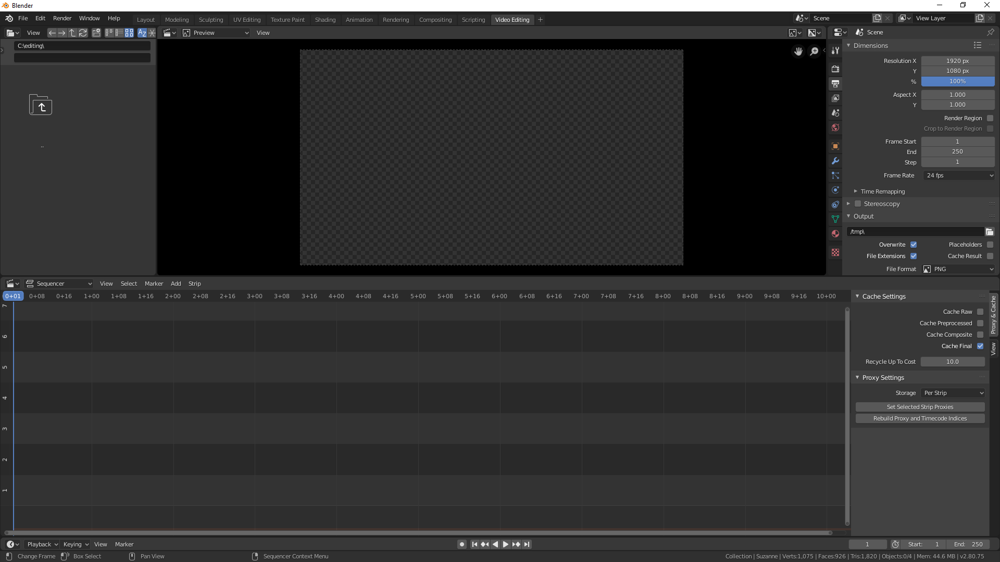
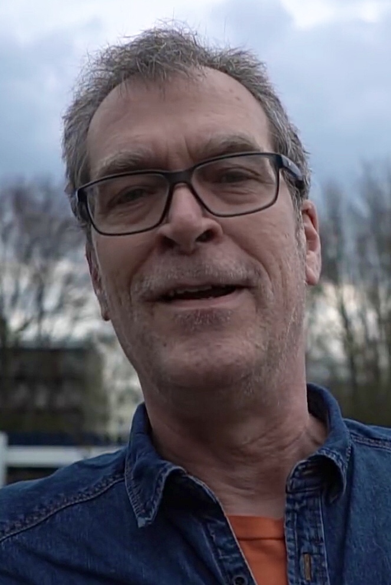
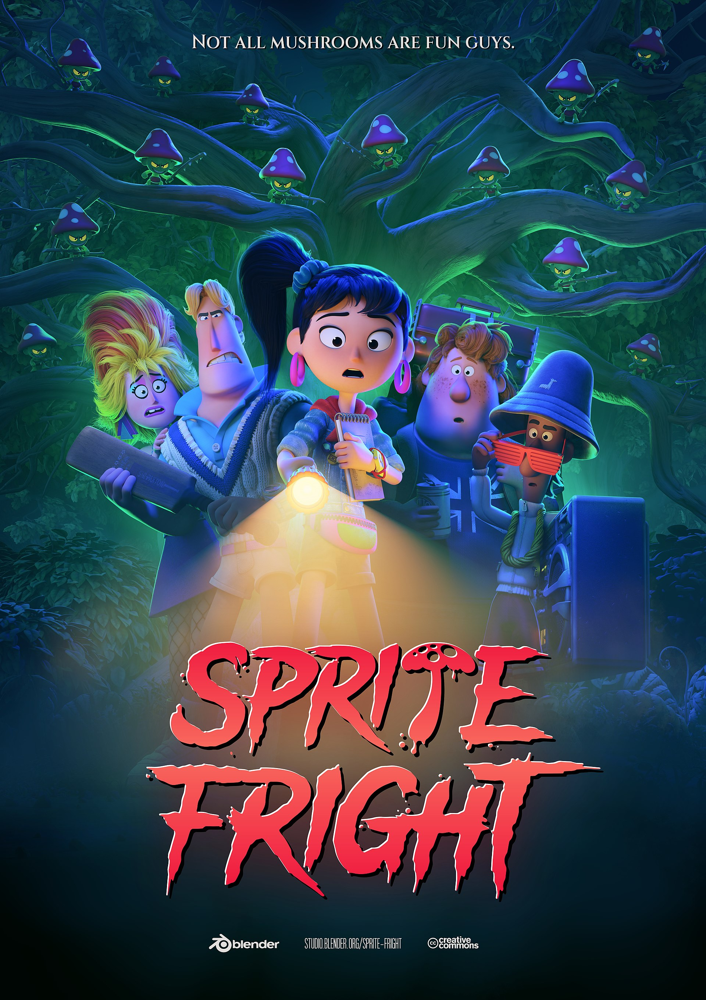
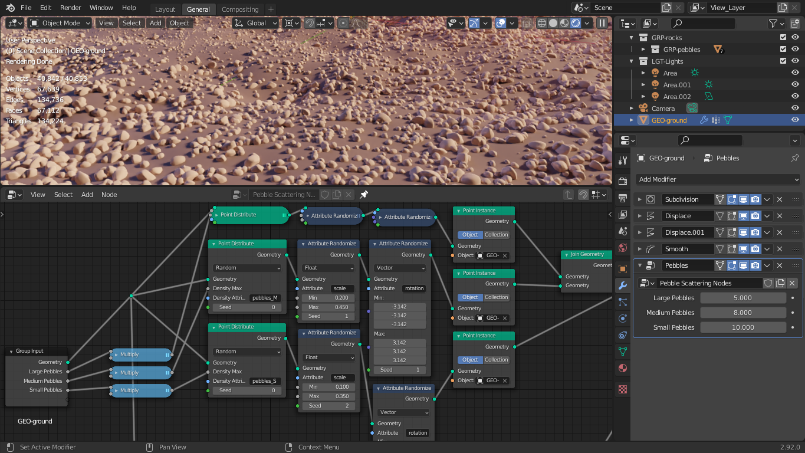
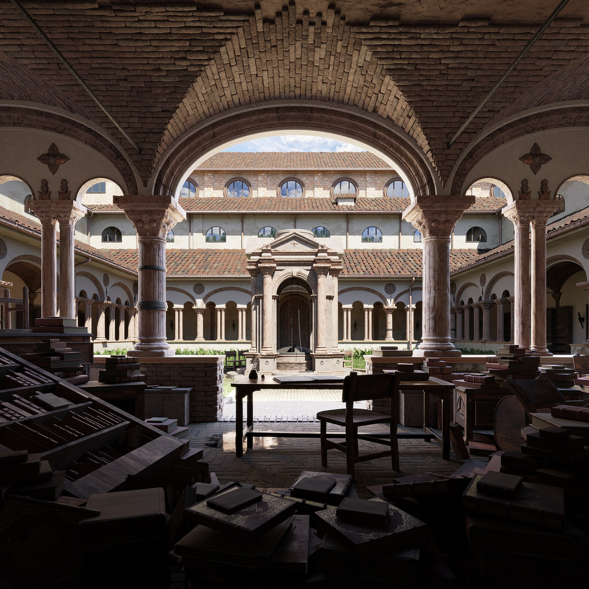
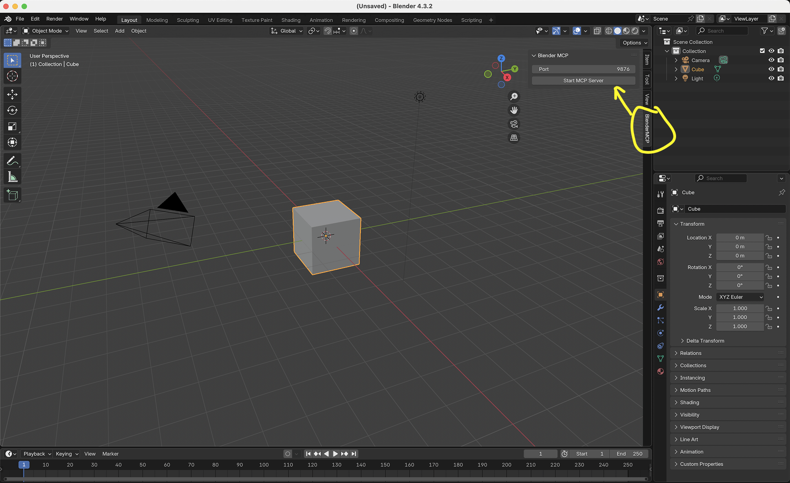

2025 年 3 月，洛杉矶，第 97 届奥斯卡颁奖礼。最佳动画长片颁给了拉脱维亚的《Flow》（猫猫的奇幻漂流）——一个小团队、低成本做出来的电影。有一个技术细节容易被忽略：**它全程在 Blender 里制作，渲染用的是 Blender 自带的实时引擎 EEVEE**，不是渲染农场里跑几十小时的路径追踪，是游戏级的实时渲染。

差不多同一时期，AI 圈里另一个和 Blender 有关的东西也在涨：blender-mcp，一个把 Blender 变成 AI 助手可操控工具的开源项目，如今 GitHub 星数超过 2.8 万。

一部奥斯卡获奖电影，和一个 AI Agent 工具链，选了同一款免费软件。这篇文章回答三个问题：Blender 是什么、它为什么好、以及它为什么恰好站在了 AI 的位置上。先说结论：**它的赢法不是"免费打败收费"，而是三件事的叠加——一个不追求租金的基金会、三次把能力拉平的技术解锁，以及一套恰好为 AI Agent 准备好的架构。**

## 一、一个应用，就是一整条管线

先看主流 3D 制作的工作方式：Maya 管建模动画，ZBrush 管雕刻，Substance 管贴图，After Effects 管合成——一条管线由四五个付费软件拼起来。Blender 走的是相反的路，把全部环节装进同一个应用：

- **建模与雕刻**：多边形建模、雕刻模式（4.x 版本大幅重写）、重拓扑；
- **UV 与纹理**：UV 编辑、程序化纹理节点；
- **绑定与动画**：骨骼、约束、驱动器、非线性动画编辑器；
- **物理模拟**：流体、烟雾、布料、毛发、刚体；
- **渲染**：Cycles（路径追踪，2011 年起）与 EEVEE（实时渲染，2019 年起）双引擎；
- **后期**：合成器、视频剪辑、运动跟踪；
- **2D 动画**：Grease Pencil——正是《蜘蛛侠：纵横宇宙》用来处理线稿的工具。

*▲ Blender 的工作区：3D 视口、大纲视图、属性面板、时间线同屏。顶部标签栏本身就是一份流程清单——建模、雕刻、渲染、合成、脚本、视频剪辑都在同一个应用里。图：Ogat / Wikimedia Commons（GPL）*

一体化带来的真正价值是环节之间不丢信息。在 Blender 里改了模型的拓扑，UV 和材质自动跟着走，不需要导出导入、不需要对版本、不需要在四个软件之间来回搬运资产。

两个渲染器值得单独说。**Cycles 是路径追踪器**，负责"照片级"，2011 年随 2.61 版本加入；**EEVEE 是实时渲染器**，负责"秒出"，随 2019 年的 2.8 版本登场，2024 年的 4.2 LTS 把它重写为 EEVEE Next，实时渲染第一次有了可用的全局光照——《Flow》全片用的就是它。

## 二、为什么免费还能做到这个水平

Blender 的起点是破产。1998 年 Ton Roosendaal 创立 NaN 公司开发 Blender，2002 年公司经营失败进入清算，Blender 差点作为资产被卖掉。Roosendaal 先成立非营利的 Blender Foundation，然后在当年 7 月 18 日发起「Free Blender」行动：向社区募资 10 万欧元，一次性付给债权人，换取源码以 GPL 协议开源。**7 周，钱凑齐了。2002 年 9 月 7 日，Blender 正式开源。**

*▲ Ton Roosendaal，Blender 创始人与 Blender Foundation 主席，摄于 2018 年。2002 年他发起众筹，用 10 万欧元把 Blender 的源码从破产清算里赎了出来。图：Blender / Wikimedia Commons（CC BY 3.0）*

这个故事决定了此后二十年的一切。因为 GPL 加非营利基金会，Blender 没有股东要回报、没有订阅要续费、也没有"把基础功能拆出来单独收费"的动机。它的钱来自 **Blender Development Fund**——一种订阅制资助：个人按月捐，企业按档赞助，NVIDIA、AMD、Intel、Meta、Epic 等公司长期在名单上。维基百科口径下，Blender Institute 的规模是 26 名全职员工加 12 名自由职业者。

这个体量在大厂眼里不值一提，但它二十年只做一件事：把 3D 全流程做进同一个免费应用。对比之下，Maya 的订阅一年要上千美元，而 Blender 从建模到渲染到剪辑一分钱不花。对个人创作者和中小团队，"免费"不是省钱——它决定的是项目能不能启动。

基金模式还有一个副产品：Blender Studio 用"做电影来磨工具"。从 2008 年的《Big Buck Bunny》到 2021 年的《Sprite Fright》，每一部开放电影都是新功能的试验场，成片和工程文件全部开源，反哺社区教程和素材库。

*▲ Blender Studio 的开放电影《Sprite Fright》（2021）海报。Blender 用真实制作推动引擎和工具开发，成片与资产全部开源。图：Blender Studio / Wikimedia Commons（CC BY 4.0）*

## 三、三次解锁：从能用，到好用，到工业级

免费只是入场券。"开源软件难用"的标签，是 Blender 自己花十几年撕掉的。

| 时间 | 版本 | 解锁了什么 |
|------|------|-----------|
| 2019 年 7 月 | 2.80 | 界面重做、左键选择、行业兼容键位、EEVEE 实时渲染登场 |
| 2021 年 2 月 | 2.92 | Geometry Nodes 几何节点，程序化建模免费化 |
| 2025 年 11 月 | 5.0 | ACES 色彩管线、HDR、NanoVDB 体积渲染、材质编译提速 4 倍 |

**2019 年的 2.8，把"难用"改掉了。** 在此之前，Blender 的键位和交互是自成一体的体系，新用户的第一道门槛不是建模而是适应界面。2.8 一次性对齐了行业惯例——左键选择、兼容键位、重新设计的界面，并让实时渲染器 EEVEE 首次登场。这是它从"能用"走向"好用"的起点。

**2021 年的 Geometry Nodes，把 Houdini 的能力免费化了。** 2.92 引入的几何节点让程序化建模——散布、阵列、非破坏性修改——变成连节点就能完成的事。这是影视和游戏里最贵的一类技能，此前基本是 Houdini 的专属领地。

*▲ Blender 2.92 的 Geometry Nodes 编辑器，正在演示石子散布（Pebble Scattering）。程序化建模从数千美元一年的软件专属能力，变成了免费功能。图：Simon Thommes / Wikimedia Commons（CC BY 4.0）*

**2025 年的 5.0，把色彩和渲染追上了工业标准。** 2025 年 11 月 18 日发布的 [Blender 5.0](https://www.blender.org/press/blender-5-0-release/) 补齐了影视工业最挑剔的两块短板：原生支持 ACES 色彩管线与 HDR 广色域，以及用 NanoVDB 重构的体积渲染——烟雾、火焰的内存占用大幅下降。同期 EEVEE 的材质编译速度最高提升 4 倍。

工业界的接受度有一条清晰的证据链：《Next Gen》（2018）由 Tangent Animation 全流程用 Blender 制作；《蜘蛛侠：纵横宇宙》（2023）用 Grease Pencil 处理线稿；《RRR》的 VFX 团队 Makuta VFX 是 Blender 用户；Ubisoft 动画工作室宣布自 2020 年起转向 Blender。到[《Flow》](https://en.wikipedia.org/wiki/Flow_(2024_film))拿下奥斯卡最佳动画长片，这条链条闭了环。

*▲ 用 Cycles 渲染器渲染的 Lone Monk 演示场景（Blender 2.92 官方演示文件）。路径追踪让"照片级"渲染跑在了消费级显卡上。图：Carlo Bergonzini / Monorender，PantheraLeo135953 渲染 / Wikimedia Commons（CC BY 4.0）*

## 四、AI 为什么说它"用起来方便"

Blender 在 AI 圈的走红，有它自己独立的逻辑，和它在传统 3D 圈的积累不是一回事。把"AI 用 Blender"拆开看，是四个具体机制在起作用。

**它把点击任务降级成了代码任务。** Blender 的 Python API（bpy）覆盖了界面上几乎每一个操作。对语言模型来说这是本质区别：**写 Python 是主场能力，点击 GUI 不是**。用 Blender，Agent 不需要"看"界面、算坐标、点按钮，直接输出脚本——等于绕开了 computer-use 最难的两个环节：像素观察和坐标点击。

**观察便宜，验证干净。** `blender --background --python script.py` 全程无 GUI，Agent 的观察通道是 stdout 和 `bpy.data` 里的结构化场景数据，不是截图。这带来两个好处：一个脚本可以批量完成几十个操作，一次工具调用搞定；验证变成"读数据"——`bpy.data.objects['Cube'].location` 是精确、可复现的验证态，不存在"两张截图看起来一样但其实状态变了"的模糊地带。

**几乎没有反自动化摩擦。** 免费、开源、无许可证服务器、无加密狗、可容器化。更关键的是从 3.4 版本起 [`pip install bpy`](https://wiki.blender.org/wiki/Reference/Release_Notes/3.4/Python_API)——Blender 本身就是一个 Python 依赖包，Agent 调它和调 numpy 没有区别。Maya 做不到：需要运行实例加授权激活。

**语料的正反馈。** 网上有海量的 Blender Python 代码——教程、插件、问答，模型的先验很强，生成脚本成功率高；用的人越多，语料越多。这个循环闭源商业软件很难复制。

生态层面，[blender-mcp](https://github.com/ahujasid/blender-mcp) 把 MCP 协议桥接进了 Blender 侧边栏：装好插件，Claude 这类 AI 助手可以通过自然语言直接建模、改材质、跑渲染。

*▲ Blender 侧边栏里的 BlenderMCP 面板（Port 9876）。启动服务后，AI 助手通过 MCP 协议直接驱动 Blender 执行建模、材质和渲染操作。图：ahujasid/blender-mcp（MIT）*

2026 年这套模式已经铺开——Unity MCP、UnrealClaude、Cocos Creator MCP 都进入可用状态。Agent 的角色也在变：当下的实践是把整条管线交给 Agent 调度（概念生成 → 3D 重建 → 自动绑定 → Blender 导入清理 → 动画驱动 → 导出引擎格式），Blender 当落地执行的那个节点。

有一个坑值得单独提醒：`bpy.ops` 加 `mode_set` 是一套上下文状态机——必须先切到正确模式（比如 POSE）才能操作骨骼，否则 operator 直接失败。这是 Agent 写 Blender 脚本最常见的故障。好的一面是报错是文本，能进自我修复循环；换成 GUI 点击，失败往往是静默的，没法自动修。

## 五、AI+3D 管线里的位置

"AI 用 Blender"要分成两件事：一是生成式 AI 直接产出 3D 资产（Tripo、Meshy 这类模型），Blender 做精修和落地；二是 Agent 操控 Blender（上一节）。前者在 2026 年出现了一个关键变化。

**拓扑瓶颈被突破。** 2026 年 9 月 1 日，VAST 发布 3D 基础模型 [Tripo P2.0](https://kfqgw.beijing.gov.cn/ywdt/kjcgzhgd/kjqy/202609/t20260909_4856670.html)——据北京经开区官网报道，这是全球首个原生生成四边面拓扑网格的 3D 基座模型，最多 25k 四边面或 50k 三角面，边缘流更合理、大平面更干净、支持自动分件。这件事的分量在于：此前 AI 生成的是三角面汤，重拓扑成本和重新建模差不多，所以只能做静态背景道具；**原生四边面意味着生成结果可以直接进游戏引擎和动画绑定管线**——AI 3D 从玩具变成生产工具的分界线，就在这里。

国内大厂已经在跑工业化管线。腾讯光子内部打磨 4 年的 [Light AI](https://ol.3dmgame.com/news/202606/42992.html) 于 2026 年 6 月对外亮相，把"概念探索 → 2D 三视图 → 3D 白模 → 材质 → 骨骼动作迁移"整合成一套平台；腾讯 [VISVISE](https://news.17173.com/content/03162026/200403001.shtml) 的动作生成能力已用在 90 多款游戏里（含《和平精英》《王者荣耀》），支持文生动画和"3-5 个关键帧生成 10 秒动画"。

成本侧的数据同样直白：摩根士丹利测算生成式 AI 可削减 3A 游戏开发成本约 44%（投行测算，当量级参考）；国内游戏研发端的 AI 普及率已达 86.36%（音数协口径）。

Blender 在这条管线里的位置由此清晰：免费让它没有授权摩擦，headless 让它能进服务器批处理，bpy 让它能被脚本和 Agent 驱动。**它就是那个"AI 生成 → 自动清理 → 导出引擎格式"的落地中枢**——决定这个位置的是它的架构，而不是某个新功能。

## 六、它不强的部分

把话说全，Blender 的短板同样明确：

- **大规模角色动画与绑定**，Maya 仍是行业标准，Blender 在复杂角色管线上的工具链还不够顺；
- **高端雕刻**，ZBrush 仍是天花板，Blender 的雕刻模式进步很大但没有到取代的程度；
- **CAD 精度**（NURBS、参数化实体建模）基本没有，这块要交给 Fusion、Rhino、Plasticity；
- **大而全本身也是代价**——每一项都不是同类最强，专业环节的团队依然会配置专业软件；
- **硬件门槛在提高**：5.0 起不再支持老 GPU（GeForce 900 系之前、GCN 4 之前、Kaby Lake 之前）。

还有一个容易被 AI 叙事掩盖的风险：制作端省钱不等于市场端接受。据 [Game Oracle 统计](https://www.jiemian.com/article/14579362.html)，明确声明使用 AI 的游戏发售首月评论数平均减少 52.6%。AI 管线降低的是生产成本，不是市场风险。

## 七、我的判断

Blender 火过两次，逻辑是同一件事：**它把 3D 生产的成本结构改了。** 第一次对内——免费和一体化解决了"能不能做"；第二次对外——它的架构（bpy 全覆盖、headless、pip 可安装、无授权摩擦）恰好是 AI Agent 时代最需要的形态。

这个判断成立的前提是：Blender 保持基金会治理和 GPL。只要这个前提在，它在"AI 3D 落地点"这个位置上的优势就是结构性的，不是某个模型升级能带走的。真正的变量在 AI 生成质量那一侧——如果生成的模型哪天真的开箱即用，精修环节会缩水；但"谁来批量调度、自动清理、导出管线"这个问题，仍然需要一个 Blender 这样的中枢。

## 总结

- Blender 用基金会 + GPL 的模式，把建模到渲染到剪辑的全流程做进了同一个免费应用，这是它二十年最大的结构性优势；
- 2019 的 2.8、2021 的 Geometry Nodes、2025 的 5.0 三次解锁，让它从"能用"走到"工业级"，《Flow》拿下奥斯卡是这条链条的闭环时刻；
- 对 AI Agent 而言，它的核心价值是 bpy 全覆盖、headless 执行、`pip install bpy` 和可读的验证态——把"点击任务"变成了"代码任务"，而后者正是大模型的主场；
- 想上手：从 [Blender 官网](https://www.blender.org/download/) 下载 4.2 LTS 或 5.0，跟着一个甜甜圈教程走完全流程，就能体会"一个应用一条管线"的含义；想玩 AI 驱动，装 blender-mcp 加 Claude，从让它改一个材质开始。