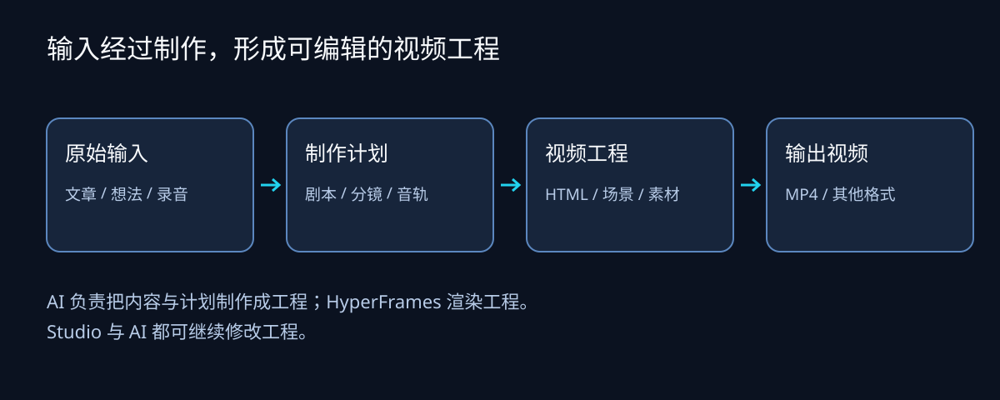
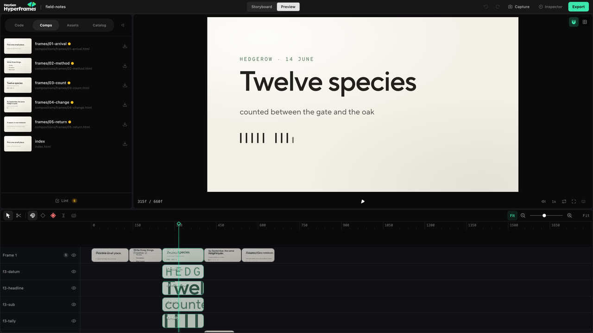
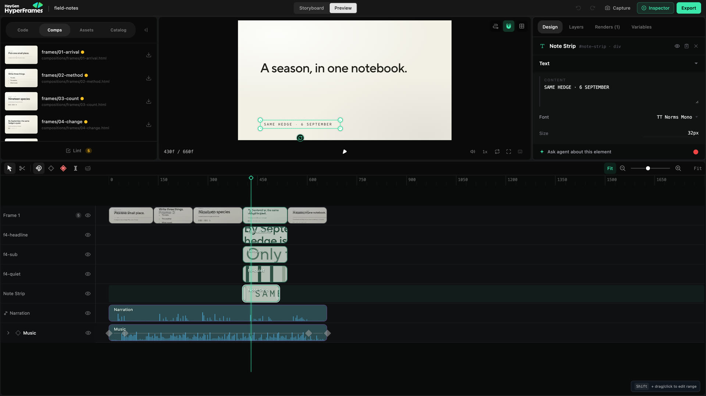
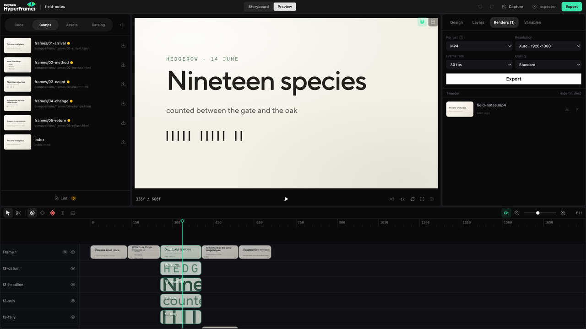
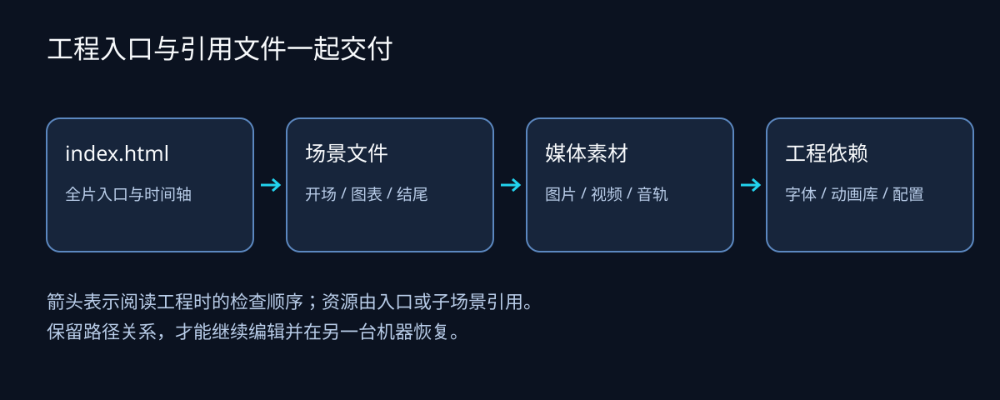
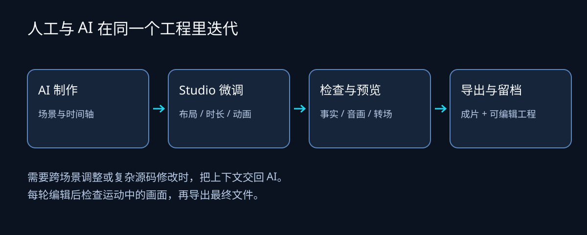

给 AI 一篇文章，希望它做成视频，接下来会得到什么？如果走 HyperFrames 的本地制作路径，交付物可以是一个视频工程文件夹：画面、场景、音频、图片和字体都留在里面。你可以继续让 AI 修改，也可以打开 Studio 调整，再导出成片。

HyperFrames 值得关注的地方，是把 AI 编写画面、人工二次编辑和程序化渲染接在同一份工程上。是否适合你，要看你想做的内容、需要保留哪些编辑能力，以及愿意自己维护多少制作过程。这篇文章先梳理当前功能，再给出上手路径与版本跟进；完整参数和操作细节留给官方文档。

本文资料检查日期为 **2026-10-07**。发布跟进以 [v0.8.139](https://github.com/heygen-com/hyperframes/releases/tag/v0.8.139) 为基线；功能全景同时参考当日官方文档与[主干快照 `1e711b087`](https://github.com/heygen-com/hyperframes/tree/1e711b087dca254fa021f0c16006197c138d1884)。主干与在线文档可能领先于发布版，因此这份全景不是 v0.8.139 的逐项兼容保证，使用前应核对安装版本。

## 1. HyperFrames 是什么，适合谁

HyperFrames 用 HTML、CSS、媒体和可定位到指定时间的动画描述视频。渲染器让浏览器计算每一帧，再把画面与音轨编码成文件。它的工程入口通常是 `index.html`，可以引用多个子场景和本地资源。[官方项目说明](https://github.com/heygen-com/hyperframes)

几部分工具各有职责：CLI 创建、检查和渲染工程；Studio 提供可视编辑；Agent skills 指导 AI 组织制作过程与编写工程；底层渲染包供应用或自动化系统调用。选择本地路径时，AI 和人可以轮流修改同一份源文件。



*▲ 输入材料经制作成为可编辑工程；Studio 与 AI 修改工程，渲染器输出成片。图：本文自绘。*

从这种工程形态判断，它尤其适合解释视频、产品展示、数据动画，以及需要持续改文案、复用场景或批量输出的内容。已有实拍视频也可以接入；如果主要工作是筛选大量素材或做长片精剪，我会先用一个真实场景验证编辑体验，再决定承担多大比例的制作任务。

## 2. 当前功能全景

下面按使用任务整理主要能力。表格用于定位，后文解释具体用途与边界；这些类别包含既有能力，不只列本次新增功能。

| 功能领域 | 具体能做什么 | 典型用途 | 条件与边界 |
|---|---|---|---|
| AI 制作工作流 | 按输入选择分镜、素材和工程制作路径 | 文章解释、网站展示、PR 解读 | 需要支持 skills 的 Agent；素材服务另行配置 |
| 画面与动画 | 组合文字、图表、媒体、转场和多种动画运行时 | 图解机制、产品动效、短片包装 | 动画需支持时间定位，导入不等于逐层可编辑 |
| Studio 编辑 | 改布局、片段时间和支持的动画属性 | 修改标题、节奏、轨道与关键帧 | 可安全回写的范围取决于元素及代码结构 |
| 音频与字幕 | 混音、效果处理、转写与字幕呈现 | 旁白配乐、口播字幕 | 识别结果需校对，部分字幕调整只用于预览 |
| 素材与积木 | 导入媒体、复用场景组件、接入设计稿 | 统一品牌、复用图表和视觉效果 | 外部资产、生成服务与 GPU 有各自条件 |
| 渲染与自动化 | 检查、导出、变量模板、批量与云端渲染 | 系列视频、应用后台、CI | 云端账户与资源独立配置和计费 |

### 2.1 AI 制作：不同输入有不同工作流

“让 AI 做视频”覆盖的任务差别很大。HyperFrames 的 skills 将输入与目标对应到制作工作流：

- **文章与概念解释**：把文章、笔记或主题组织成旁白和场景，画面可以由文字、图形、机制示意与数据动画构成。没有现场素材时，也能围绕论点设计视觉表达。
- **产品与网站展示**：以产品地址或发布需求为起点，围绕产品画面制作介绍、功能展示或网站导览。展示实际行为与生成装饰画面应分清。
- **代码变化解读**：读取 GitHub PR，围绕问题、代码差异和使用影响组织视频。适合功能发布或修复说明，技术判断仍需核验。
- **已有口播包装**：可以添加字幕，或叠加标题、数据提示、侧栏和画中画。添加包装与剪改原有讲话内容是不同任务，不能默认混用。
- **音乐与短动效**：音乐驱动视频围绕节拍组织素材；短动效用于标题、图表、标志动画或透明叠加片段。
- **演示与迁移**：交互式演示支持逐步显现、分支、热点和演讲者视图；另有将 Remotion 源工程迁移到 HyperFrames 的工作流。

这些是 Agent 的制作流程，不能理解为渲染器直接读取文章就能自行生成完整视频。以一篇技术文章为例，仍需决定讲哪些论点、用什么视觉解释、怎样配旁白，再生成可渲染工程。[官方工作流](https://github.com/heygen-com/hyperframes#creation-workflows)

交互式演示的交付物是可导航的演示工程。官方当前说明，它还不能直接导出为完整的线性 MP4；对 deck 运行普通渲染可能只得到第一页。需要连续播放的视频，应一开始就选视频工作流。[演示工作流与导出边界](https://hyperframes.heygen.com/guides/slideshow)

### 2.2 画面与动画：从图表到自定义场景

HTML 和 CSS 负责元素与样式，时间属性决定出现区间，动画运行时决定属性如何变化。常见用途包括标题入场、数字变化、图表展开、界面状态切换，以及场景之间的转场。

GSAP 是常用路径，官方还提供 Lottie、Three.js、Anime.js、CSS、Web Animations API 和 TypeGPU 等运行时的相关适配。选择哪种，取决于已有素材和场景需求：已有动画文件、真正的三维场景、代码绘制效果，需要的实现方式不同。[动画运行时说明](https://github.com/heygen-com/hyperframes#domain-skills-loaded-on-demand)

已有自绘引擎时，可以把场景注册成“时间 → 画面”的帧源，由 HyperFrames 定位并采集。它也提供针对特定影片 HTML 协议的桥接。这些能力让已有场景进入渲染流程，但不会自动把内部代码变成 Studio 的可编辑图层；具体契约放在本文的进阶章节。[帧源文档](https://hyperframes.heygen.com/guides/frame-sources)

### 2.3 Studio：能手动编辑到什么程度

Studio 打开本地工程，可以在画布、图层、时间轴和属性面板之间选择元素。文字与布局调整、片段移动与裁剪、支持元素的切分，是日常修改的主要入口。[画布编辑](https://hyperframes.heygen.com/studio/canvas)、[时间轴编辑](https://hyperframes.heygen.com/studio/timeline)



*▲ 左侧选择场景，中央查看画面，底部安排片段与轨道。图：HeyGen / HyperFrames 官方文档示例，非本文实测。*

动画方面，可以添加或删除支持的关键帧、调整时刻和值、修改缓动和运动路径，也可以录制手势作为运动起点。例如标题进入太慢，可以先缩短关键帧间距，再检查是否仍留有足够阅读时间。[动画编辑文档](https://hyperframes.heygen.com/studio/animation)

这里有两个重要边界。自动关键帧在当前文档中默认开启；只想永久修改布局时，应先关闭它。循环、helper 或运行时表达式生成的动画也未必能安全回写：支持的结构可以展开后编辑，计算值可能仍需修改源码或交回 Agent。



*▲ 画布、属性与时间轴共同呈现选中元素；旁白和音乐轨道提供对齐参照。图：HeyGen / HyperFrames 官方文档示例。*

本地 Studio 的 Ask agent / Copy to Agent 用于把上下文交回 Agent，不应当作内置对话助手。官方桌面应用则另有 Framey 对话编辑路径；选择桌面应用时，先看其当前支持的平台与 Agent 连接方式。[桌面应用](https://hyperframes.heygen.com/studio-app/index)

### 2.4 音频与字幕：生成、识别、混音分别处理

配音可以来自自录音轨或生成服务，音乐和音效也可以使用已有文件。素材准备与时间轴上的混音是两层工作，选用生成服务时还需账户、授权和费用条件。

Studio 的音轨效果链可以处理频率、动态、音色和空间，例如削减低频杂音、均衡响度、加压缩或混响；音量及效果参数也可以随时间变化。旁白与音乐互相遮挡时，官方提供 voiceover carve，在音乐里为人声占用的频段让出空间。它能改善关系，但不能把有底噪的录音自动恢复成干净录音。[音轨效果](https://hyperframes.heygen.com/studio/audio-effects)、[旁白与音乐处理](https://hyperframes.heygen.com/studio/voiceover-carve)

转写把已有音频或视频变成带时间信息的文字，也能导入 SRT、VTT 或受支持的 JSON。这样可以根据真实说话时间安排字幕和视觉变化，而不只靠估算旁白长度。[语音与字幕](https://hyperframes.heygen.com/guides/voice-and-audio)

字幕编辑尤其要分清保存范围：当前 Studio 可以保存词级位置、缩放、旋转及部分样式覆盖；时间调整、分组切分和 Animation 面板中的一些调整仍属于预览工具，重载后不会保留。需要持久修改文字、时间和结构时，应改字幕源或让 Agent 更新。[字幕保存边界](https://hyperframes.heygen.com/studio/captions)

### 2.5 素材与积木：复用现成画面，也接入已有设计

媒体可以从工程目录、上传文件或网站采集进入项目。可以导入、摆放、裁切、替换图片与视频，也有抠背景、调色、LUT 和视觉处理的工作路径。涉及预处理或生成时，要区分最终使用的本地文件与依赖的外部工具。[媒体使用指南](https://hyperframes.heygen.com/guides/media)

Catalog 提供可安装的 block 与 component，用于复用场景、图表、字幕、转场和效果。需要一个现成图表或背景时，可以先找积木，再替换数据、文字和时间，而不用从零编写全部画面。

```bash
npx hyperframes catalog
npx hyperframes add data-chart
```

在现有工程目录执行；具体选项以安装版本为准。[积木目录](https://hyperframes.heygen.com/catalog)

Figma 等设计工具可以提供品牌值、素材和场景参考。静止的图标或插画可以保留为图片，需要单独变化的文字、布局和状态则要重建成可编辑结构。导入设计稿不等于自动获得全部原生编辑能力。[设计交接指南](https://hyperframes.heygen.com/guides/design-tools)

使用 WebGPU 效果还需确认浏览器与机器条件。看到效果示例，并不意味着当前机器一定能同样渲染；先做一个短样验证比直接整片套用更可靠。

### 2.6 渲染与自动化：一条片子之外还能做什么

普通创作可以通过 Studio 或 CLI 输出视频，官方列出 MP4、WebM 和 MOV（ProRes）等导出选项，也支持图像序列。CLI 提供结构检查、浏览器检查、指定时刻截图和诊断，帮助发现工程问题。[导出文档](https://hyperframes.heygen.com/studio/export)、[CLI 指南](https://hyperframes.heygen.com/developers/cli)



*▲ 选择输出规格并管理渲染任务；截图中的参数是官方示例，不是本文推荐的固定设置。图：HeyGen / HyperFrames。*

变量模板和批量渲染用于重复任务。例如每日生成同一种数据简报，可以把标题、数值和图片做成变量，用不同记录输出多个视频，复用已确认的布局。[变量与模板](https://hyperframes.heygen.com/prompting/variables-and-templating)

需要接入产品后台时，Producer 提供完整可编程渲染管线，Engine 提供更底层的画面采集控制，Player 用于嵌入播放。托管 Cloud、AWS Lambda 与 Google Cloud Run 则提供不同的运行位置；账户、资源与部署责任各不相同。[渲染路径](https://hyperframes.heygen.com/deploy/overview)、[官方包列表](https://github.com/heygen-com/hyperframes#packages)

## 3. 用一个任务串起完整流程

假设目标是把一篇技术文章做成 30 秒解释视频，这是一种可采用的制作安排，不是本次实测记录：

1. **确定讲什么**：从文章中选一个问题与结论，核实关键事实，写出能朗读的旁白。
2. **安排画面**：把旁白分成场景，决定哪些用图解、代码、图表或已有素材支撑。
3. **编写工程**：Agent 创建 HTML 与子场景，放入音频、图片和字体，安排出现时间与动画。
4. **人工调整**：在 Studio 看完整预览，修改标题、画面位置和节奏；复杂跨场景修改交回 Agent。
5. **检查交付**：检查工程，导出短样，核对实际字幕与声音，再保存成片和完整源工程。



*▲ 分享可编辑工程时，HTML、场景与被引用的素材要一起保留。图：本文自绘。*

MP4 适合上传和播放，源工程才保留分别修改文字、场景和音轨的条件。把成片重新导入为视频素材，不会自动恢复它原来的文字层。

## 4. 能力边界与费用

本地编码 Agent、托管 AI chat、设计工具交接和 HeyGen Video Agent 是不同入口。希望保留工程并在本机继续修改，优先选择本地工程路径；托管连接器通过 HeyGen 账户制作和渲染，不能据此假定也会交付同样的本地工程与 Studio 流程。[创建路径比较](https://hyperframes.heygen.com/guides/choose-creation-path)

本地渲染不消耗 HeyGen credits，但 Agent、生成素材、配音、数字人和云端基础设施可能另有费用。开源渲染框架与整条制作链的费用需要分别考虑。

可视编辑也有范围：自定义帧源、iframe 内部内容、复杂计算动画，以及当前尚未持久保存的字幕调整，都不能仅凭“能预览”推断“能手工修改并保存”。检查通过则只说明相应检查项通过，事实、审美、节奏和音量仍需人工判断。

## 5. 最短上手路径

### 5.1 创建工程与准备 Agent

普通 CLI 使用者先确认 Node.js 22+ 与 FFmpeg，不需要为做视频去构建整个源码仓库。[官方环境要求](https://github.com/heygen-com/hyperframes#manually-with-the-cli)

```bash
node --version
ffmpeg -version
npx hyperframes init my-video
cd my-video
npx hyperframes preview
```

已安装插件时沿用插件技能与启动方式；独立 skills 环境可用下面的命令准备核心技能，再按宿主要求重新加载。[官方快速入门](https://hyperframes.heygen.com/quickstart)

```bash
npx hyperframes skills update
```

交给 Agent 的任务可以这样写：

```text
使用 HyperFrames，把我提供的文章制作成 30 秒中文解释视频。
受众是第一次接触该概念的人，画幅 1920×1080。
先给我旁白、分镜和画面草稿，确认后再制作。
配音和素材服务沿用项目已有选择。
保留完整可编辑工程，打开本地 Studio 让我调整。
```

### 5.2 修改、检查与导出

暂停到目标元素出现的时刻，再从画布或图层选择它。布局修改前检查自动关键帧；调整时间后同时看相邻场景、字幕和音轨。每轮修改都重新播放前后区间。



*▲ 局部修改手工完成，复杂修改交回 Agent，每轮回到预览检查。图：本文自绘。*

```bash
npx hyperframes lint
npx hyperframes check
npx hyperframes snapshot --at 0,2,5
npx hyperframes render --output output.mp4
```

截图时间按真实场景选择。命令用于说明操作路径，参数先用安装版本的 `--help` 核对。导出后打开文件本身检查首尾、转场、字幕和声音；必要时用 FFprobe 核对参数。[CLI 指南](https://hyperframes.heygen.com/developers/cli)

```bash
ffprobe -v error -show_format -show_streams output.mp4
```

## 6. 本次跟进：v0.8.139 的重要变化

这部分只讨论 [v0.8.138 → v0.8.139](https://github.com/heygen-com/hyperframes/compare/v0.8.138...v0.8.139) 的发布变化，不把前面的全景都算成本次新增。Release 页面显示的北京时间发布日期为 10 月 7 日早晨，说明正文使用的日期是 10 月 6 日。[发布记录](https://github.com/heygen-com/hyperframes/releases/tag/v0.8.139)

### 6.1 转写可以更早向脚本提供词级结果

`transcribe --json` 新增随着识别进度输出已听到词的能力，官方明确注明 `parakeet-mlx` 不在这一流式行为范围内。同时修复内置转写在 Electron 桌面应用中的运行问题。[流式输出改动](https://github.com/heygen-com/hyperframes/pull/5127)、[桌面转写修复](https://github.com/heygen-com/hyperframes/pull/5129)

它影响需要边识别边处理结果的脚本，以及使用桌面应用内置转写的人。已有脚本要确认实际引擎、进度事件与最终结果的处理方式，不能把一次进度事件直接当成完整转写文件。

### 6.2 Studio 拖动与动画渲染的一致性修复

发布说明记录了缩放、撤销或重载后拖动落点的修复，也修复了根场景没有时间线时嵌套场景拖动的位置问题。另一个修复涉及 GSAP `fromTo` 中仅存在于起始状态的属性，确保渲染从相应起始帧保留这些值。[拖动修复](https://github.com/heygen-com/hyperframes/pull/5088)、[嵌套场景修复](https://github.com/heygen-com/hyperframes/pull/5115)、[动画起始值修复](https://github.com/heygen-com/hyperframes/pull/5125)

使用这些编辑路径或动画写法的工程值得做升级短样：重做一次相关拖动，采样动画开始前后，比较位置与属性。没有涉及这些场景的用户，不必把每条修复都当成迁移任务。

### 6.3 新增 gooey-split 积木

本版加入带黏连效果和方向性动态模糊的 `gooey-split` block。它适合需要这种视觉语言的转场或场景，不代表所有片子都应改用该效果。[积木改动](https://github.com/heygen-com/hyperframes/pull/5123)

下一轮值得继续观察字幕持久编辑和复杂动画回写的覆盖范围，以及主干能力何时进入发布版。这些进展将直接影响人工修改后能否顺利保存和再次交付。

## 7. 进阶：工程、时间线与外部场景

### 7.1 读懂工程的时间信息

常见属性包括尺寸 `data-width` / `data-height`、起始时间 `data-start`、持续时间 `data-duration`、轨道 `data-track-index` 与场景标识 `data-composition-id`。它们安排元素的时间和归属；画面位置及层叠仍由布局设计控制。[时间属性参考](https://hyperframes.heygen.com/concepts/data-attributes)

GSAP 路径要求场景提供可定位的暂停时间线，并按标识注册。媒体播放由框架管理，工程也应避免依赖无种子随机数和当前时钟，保证定位到某一时刻时能够得到稳定画面。[GSAP 契约](https://hyperframes.heygen.com/guides/gsap-animation)

### 7.2 帧源与已有影片 HTML

帧源通过 `window.__hyperframes.registerFrameSource` 接入自己的绘制函数。每次收到时间，函数绘制该时刻的画面；异步绘制需要返回可等待的结果。不注册时间线的宿主和根场景按文档声明 `data-no-timeline`，不要为了通过检查造空时间线。[固定主干的帧源说明](https://github.com/heygen-com/hyperframes/blob/1e711b087dca254fa021f0c16006197c138d1884/docs/guides/frame-sources.md)

已有影片 HTML 的桥接目前针对 Claude Motion 导出使用的 `appifact-film:` 协议。它保留 runner 和场景模块，用 iframe 与明确消息桥接控制时间并采集像素；不是任意网页动画的通用转换器。独立宿主可提供场景级移动、裁剪与变速，但内部文字、颜色及动画仍需回原模块修改。[固定主干的导入边界](https://github.com/heygen-com/hyperframes/blob/1e711b087dca254fa021f0c16006197c138d1884/docs/guides/imported-film-html.md)

### 7.3 遇到问题先定位哪一层

| 现象 | 优先检查 | 下一步 |
|---|---|---|
| 中文缺字 | 字体、路径与字形覆盖 | 为实际文字准备字体 |
| 无声音或截断 | 音轨路径、起点与真实长度 | 对照素材和输出文件 |
| 改位置产生动画 | 自动关键帧状态 | 区分布局修改和动画修改 |
| 预览能改，重载后丢失 | 相应编辑是否支持保存 | 将调整落实到源码 |
| GPU 效果缺失或渲染失败 | GPU、浏览器与效果要求 | 先验证最小场景 |
| 渲染内存不足 | 素材、并发与机器资源 | 用 doctor / benchmark 定位 |

这是排查建议，不是本文复现记录。完整恢复步骤见[官方排障](https://hyperframes.heygen.com/guides/troubleshooting)。

## 8. 可选工作流：与 Voiceframe 配合

Voiceframe 可以组织旁白、分镜、设计与跨应用制作计划，再让 HyperFrames 实现画面工程。例如 `BRIEF.md` 记录目标，`SCRIPT.md` 保存旁白，`STORYBOARD.md` 安排场景，`PRODUCTION.md` 说明工具与交接。这些是制作文档，不能当成 HyperFrames 渲染器的必需输入。

同样，Voiceframe 生成的 `audio_meta.json` 是音轨路径与时间计划，仍需落实到 HTML 或目标编辑应用的时间安排；使用它的适配模板，也不等于执行过 `hyperframes init` 或已下载全部依赖。Voiceframe 的具体脚本和配音配置应按它自己的版本说明使用。

配音可以沿用百炼、其他服务或自录音轨，HyperFrames 接收最终媒体。建议先完成一个场景：让 Agent 建工程，在 Studio 改标题和时长，再导出并保留源文件。这个闭环可以检验你真正需要的二次编辑能力。

我的判断是：需要持续修改或复用的视频，值得先验证 HyperFrames 的源工程交付；工具选择最终应落在你能否顺利完成下一轮修改上。

## 官方资料入口

- [GitHub 与包列表](https://github.com/heygen-com/hyperframes)：项目组成、制作工作流与源码。
- [快速入门](https://hyperframes.heygen.com/quickstart)：首次制作。
- [官方文档索引](https://hyperframes.mintlify.app/llms.txt)：主要功能与专题文档。
- [Studio 工作区](https://hyperframes.heygen.com/studio/index)：可视编辑入口。
- [CLI 完整参考](https://hyperframes.heygen.com/packages/cli)：命令、参数与环境配置。
- [渲染路径](https://hyperframes.heygen.com/deploy/overview)：本地、应用后台与云端。
- [发布版 v0.8.139](https://github.com/heygen-com/hyperframes/releases/tag/v0.8.139)：本次更新依据。

继续阅读：[用 AI 把文章做成口播视频]()。
