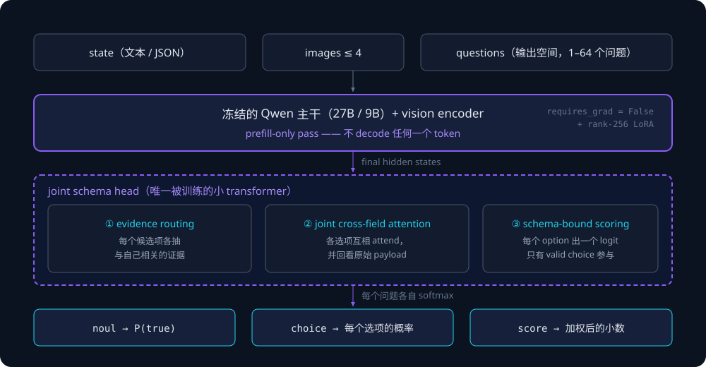

上一篇写完 Jev 之后，我在结尾留了一句话，大意是：这个方向最大的问题不是模型不行，而是**它当时只有一种存在形式——托管 API**。

半个月后，这个前提消失了。

9 月 28 日 Ollama 发布 v0.35.0，加了 `/v1/systemone` 端点，本地就能跑决策模型；9 月 30 日 Liquid AI 发了 d1；10 月 1 日，Cloudflare 一次性发了 **Clef（27B）** 和 **Clef-flash（9B）**，Apache 2.0 开源权重直接挂在 Hugging Face 上；同一天 Amazon 发了 Strands Decider 2B；10 月 3 日 Ollama v0.35.1 宣布支持 Clef 和 ClefFlash。

**八天之内，一个半个月前还不存在的模型类别，完成了从闭源托管到本地 `ollama run` 的全过程。**

Clef 在这个过程里占的位置比较特殊。它不是第一个开源的决策模型（Bespoke Labs 的 nimble 和 Together 的 tev1 更早跟着 Ollama 首发一起上线），但它是第一个**明确对着 Jev 打、同时把权重交给你的**决策模型，也是第一个带**视觉输入**和 **64K 上下文**的。

这篇文章想做的，是把 Cloudflare 这次发布从头到尾翻一遍：架构到底改了什么、三个损失各自解决什么问题、API 的每个字段和限制、43 个基准里哪些数字值得信、能不能真的自己跑起来，以及最后——**什么时候别用它**。

先说清楚口径。这篇里所有数字分三类：

- **官方口径**：Cloudflare 博客、模型卡、Workers AI 文档、开发者定价表。
- **聚合/转述**：第三方模型库（ai-tldr、innfactory 等）整理的数据，能溯源到官方的我标了「官方口径」，溯不到的单独说明。
- **独立实测**：目前只有一份，一个人、一台 RTX 3090、42 个决策用例。样本很小，但它讨论的是官方表格里完全没有的维度，所以我会用整节来讲。

Cloudflare 自己也在模型卡上标注了 Clef 和 Clef-flash 的分数是 **self-reported**。这句话值得先记住。

---

## 一、先看时间线：为什么会挤在八天里

把决策模型这一轮的时间线排出来，会发现它不是"某天灵光一现"，而是一次**集中清算**。

| 时间 | 事件 |
|---|---|
| 2026-09-15 | TypeSafe AI 发布 **Jev**，提出 System One Model 这个类别，同时开源了 System One 的 Python adapter（把 LLM 包装成同样的类型化决策接口） |
| 2026-09-28 | Ollama v0.35.0 加入 `/v1/systemone`，首发模型 nimble（Bespoke Labs，Qwen3.5-9B 微调）和 tev1（Together AI，Qwen3.5-4B） |
| 2026-09-30 | Liquid AI 发布 **d1** |
| 2026-10-01 | Cloudflare 发布 **Clef（27B）** 和 **Clef-flash（9B）**；Amazon 发布 **Strands Decider 2B** |
| 2026-10-03 | Ollama v0.35.1 支持 Clef / ClefFlash，加入共享多模态状态、`CAPABILITY` 声明 |

八天五个发布、六个模型。这件事本身说明的，是**共同的判断**：过去两年里，大量被塞进 LLM 的调用，其实没有用到"生成文本"这件事。

一个 Agent 每天要做几百次这样的判断——这条工单归哪个队列、这个工单要不要立刻叫人、这个工具该不该调、这个参数是 `true` 还是 `false`、这段输出是不是幻觉。用 LLM 做这些判断的代价，不是"贵"，而是三个结构性问题同时出现：

1. **延迟**。自回归解码一次出一个 token，一个 JSON 决策要写几十个 token。TypeSafe 给的数字是前沿模型端到端 **3 到 329 秒**；即便只看最乐观的情况，也比一次函数调用高出一到两个数量级。
2. **非确定性**。同一个输入两次调用返回不同的字符串，你得写解析、写兜底、写重试。
3. **信任粒度**。即使你 prompt 里让它"同时给出置信度"，LLM 报的置信度和真实准确率基本不相关。Jev 那篇里我引过 TypeSafe 的原话：一个模型如果 95% 的时候能做对，却没法告诉你它在哪 5% 里，那这个任务就自动化不了。

决策模型针对这三点分别给的答案：**一次前向传播不打 token、输出空间预先定义所以没有解析、每个答案带校准过的概率**。

Cloudflare 官方博客里那句被转述最多的话是这个：

> This means that a human does not necessarily need to be in the loop for agentic decisions anymore — agents can programmatically gather context, make decisions, and take actions on tasks, or defer to a human when needed.

"人类不一定要在环里"——这句话每家都在说，但 Clef 这次把它落到了一个很具体的信号上：**这是 Cloudflare 第一次自己训的模型。** 不是托管别人的权重，是自己 post-train、自己放边缘 GPU、自己定 API。

名字也顺带吐槽一下。「Clef」是音乐里的**谱号**——五线谱开头的那个符号，它给每条线和每个间指定一个音高。Cloudflare 的类比是：决策模型给上下文定了域，后面的音符（动作）才知道往哪儿放。至于字面上和「Jev」押韵、缩写跟 CF（Cloudflare）重合……我不认为这是巧合。

---

## 二、决策模型到底是什么：把「输出空间」写进请求里

如果你读过上一篇 Jev，这一节可以跳过。但因为 Clef 已经完全兼容 Jev API，这里的三层概念会贯穿全文，还是把它讲完整。

### 2.1 一次调用的形状

请求只有三个东西：**一个 state（状态）、一组 questions（问题）、可选的 images（图片）**。

```
POST /accounts/{account_id}/ai/run/@cf/cloudflare/clef
{
  "model": "clef",
  "state": "Checkout has been failing for every customer for the last hour.",
  "questions": { ... }
}
```

`state` 不是 prompt。它可以是字符串，也可以是 JSON 对象或数组——日志、聊天记录、应用状态、抓下来的表格。**它描述的是"现在发生了什么"，不是"你要干什么"。**

`questions` 是这次的核心：**输出空间由调用方定义，不由模型定义**。三种类型：

| 类型 | 语义 | criteria 形状 | 返回 |
|---|---|---|---|
| `noul` | 真假判断 | 可选，给 true / false 的描述 | 一个 0–1 之间的数，表示「为真」的概率 |
| `choice` | 从命名选项里挑一个 | 对象：`{"billing": "描述", "technical": "描述"}` | 最高概率的选项 + 每个选项的概率 + confidence |
| `score` | 在一组**有序**等级上打分 | 数组：`["No impact", "Minor", "Major", "Critical"]` | 概率加权后的**小数**分数 + 每个等级的概率 + legend + confidence |

`noul` 这个名字有点怪（"null" 的双关，官方没解释）。`choice` 和 `score` 的关键差别是**有没有顺序**：`choice` 的选项互相独立，`score` 的等级是有先后的——这个差别会直接决定后面 RLCD 的训练方式。

### 2.2 返回结构：官方 schema 逐字段

Workers AI 的输出 schema 是公开的，我把它完整摘出来，因为这比任何描述都清楚：

```json
{
  "model": "clef-flash",
  "answers": {
    "has_ollama": { "type": "noul", "noul": 0.958 },
    "team": {
      "type": "choice",
      "choice": "technical",
      "probabilities": { "billing": 0.06, "technical": 0.91, "sales": 0.03 },
      "confidence": 0.91
    },
    "severity": {
      "type": "score",
      "score": 2.4,
      "legend": { "0": "No impact", "1": "Minor", "2": "Major", "3": "Critical" },
      "probabilities": { "0": 0.02, "1": 0.11, "2": 0.31, "3": 0.56 },
      "confidence": 0.56
    }
  },
  "usage": { "input_tokens": 548, "output_tokens": 0 }
}
```

几个容易被忽略的细节：

- **`score` 返回的是概率加权后的小数，不是整数等级。** `probabilities` 里最高的那档是 `3`（Critical），但 `score` 字段给的是 `0×0.02 + 1×0.11 + 2×0.31 + 3×0.56 = 2.4`。这让你可以用比整数等级更细的粒度做阈值——"score > 2.3 就升级"，而不是只能在四个格子上跳。
- **`confidence` 是从概率分布推导的**，不是模型另 Predict 的一个数。所以它的含义很窄：**这个分布有多尖锐**。它不等于"这条有多可能会对"。这一点后面讲 Brier 校准时会再说。
- **`output_tokens` 恒为 0**。决策模型不产出 token，于是 `usage`、账单、延迟构成全都只由输入侧决定。这是整个模型类别最重要的经济学事实，第八节会专门算这笔账。

### 2.3 三条路线对照

把它和另外两条常见路线放在一起：

| | LLM + structured output | 传统分类器 | 决策模型（Clef/Jev） |
|---|---|---|---|
| 输出 | 字符串里的 JSON | 类别 id 或分数 | 类型化的选项 + 概率 |
| 新增类别 | 改 prompt / schema | **必须重新训练** | 改请求里的 criteria，立即生效 |
| 是否有概率 | 逻辑上没有，verbalized 的不可信 | 有（但要校准） | 有，且为它专门做了 Brier 优化 |
| 延迟量级 | 10^2–10^3 ms（还要看输出长度） | 个位数毫秒 | 10^1–10^2 ms |
| 换 L 高位？ | 能，但要用整个模型的算力 | 不能 | 部分能（见第七节边界） |
| 能不能同时问多个问题 | 能，但每个问题要各自写字段，成本线性增长 | 需要多头 head | **一次请求 1–64 个问题，共享 prefill** |

最后一行是 Clef 这次的工程重点，也是我后面算账的地方：**state 只 prefill 一次，问题越多，摊得越薄。**

---

## 三、架构：冻结主干上面接一个小 transformer

Clef 的架构一句话讲完：**把 Qwen 冻住，在上面装一个负责"按 schema 打分"的小头。**

### 3.1 主干死了，头活着

官方博客的原话：

> By freezing Qwen3.8-27B for Clef and Qwen3.5-9B for Clef-flash, we jointly optimized the routing head alongside rank-256 low-rank adapters.

拆解一下这里面的三个决策：

**① 主干完全冻结。** 不是部分冻结、不是分层冻结，是 `requires_grad=False`。27B 的 Qwen3.8-27B 和 9B 的 Qwen3.5-9B 权重一个都不动，视觉编码器（vision encoder）原样保留。

**② 训练的是 routing head + rank-256 LoRA。** rank-256 是相当高的秩，说明 Cloudflare 并没有只做"轻量 heads"，它给主干留了不小的适配容量。

这里有个模型卡和博客的**口径不一致**值得指出来：官方博客明确写了 rank-256 LoRA；但 Hugging Face 的模型卡行文里只说 "we added a small transformer head on top of the frozen Qwen backbone"，通篇没有提 LoRA，仓库里也没有 adapter 文件——因为**发布出来的是已经合并好的完整权重**（`model-*.safetensors` + 独立的 `joint_head.safetensors`）。所以 LoRA 是训练期的手段，不是产物的一部分。想复现训练的人需要知道这一点；只想跑推理的人不用管。

**③ 为什么要冻主干？** 官方没明说，但从设计上至少有三个理由成立：

- **保住主干的世界知识**。全参数微调一个 27B 去做分类任务，大概率会把常识和推理能力训没——而基准表后面会显示，Clef 在 MMLU、ARC、HellaSwag 这些"看起来不该出现在决策模型表里"的知识基准上仍能打到 90+。
- **训练成本**。冻住主干意味着 backward 只需要算 head 和 LoRA，优化器状态从 ~54GB(BF16)×N 降到几 GB。
- **可替换主干**。架构上 head 只是读 final hidden states，理论上换一个更强的 base 只需要重训 head。这是留给未来的升级路径。

### 3.2 一次前向，分两段

推理是两阶段的：


Cloudflare 描述这段的话比较绕，我尽量忠于原文：

> This approach relies on a specialized two-stage attention routing process: every valid choice extracts context relevant to the prompt, allowing individual field parameters to cross-attend with other fields and back to the original payload prior to scoring. By leveraging a lexical prior, the model preserves semantic intent across options. Ultimately, the architecture unites option-specific evidence routing, joint cross-field attention, and schema-bound scoring.

把这句话拆成设计决策，比读起来有意思：

**为什么 head 要"联合"（joint）打分，而不是每个问题各打各的？** 因为问题之间不是独立的。同一个工单上，"是否紧急"的判断和"影响面多大"的判断互相约束。联合打分让模型可以在一个问题上"克制"，因为它知道另一头也在看同一份证据。**这是决策模型和"LLM 循环 64 次"最本质的差别**——后者每次调用都看不见彼此。

**什么是 lexical prior？** 这是我觉得整篇架构里最聪明的一笔。Clef 不是为了每个新任务重新学语义，它**利用选项文本本身的字面 embedding**。当你丢给它一个全新的 criteria 列表，它拿到的是这些词在主干词汇空间里已经存在的语义向量，不需要任何训练就能知道 "billing" 和 "invoice" 靠得近、和 "outage" 离得远。

这直接解释了 Cloudflare 为什么敢说"不需要为每个新分类重新训练模型"——**零样本的类别泛化，是从主干的词向量空间里免费继承来的。**

**为什么最后是 per-question softmax，而不是全局 softmax？** 因为 `choice` 和 `score` 的选项数不一样、`noul` 只有两项。全局 softmax 会让选项多的问题天然吃亏。每个问题各自归一化，才能让概率在同一个问题的选项之间可比。

### 3.3 视觉和多模态：这次真正的差异化部分

Jev 是纯文本的。Clef 因为在 Qwen 多模态主干上 post-train，**原样继承了 vision encoder**，于是有了两个 Jev 没有的能力：

- **图片输入**：Workers AI 上每条请求最多 4 张 PNG/JPEG/WebP，每张 ≤4 MiB 且 ≤1600 万像素，解码后总量 ≤8 MiB；整个请求体 ≤13 MiB。**不接受远程 URL**（必须 inline）。
- **上下文 64K**（Workers AI 标 65,536 tokens），Jev 是 32K。

这里有个很关键的实现细节，Ollama v0.35.1 的更新说明里讲得比 Cloudflare 自己清楚：**图片不是挂在某个单独问题上的，它和文本 state 一起作为共享上下文，被这条请求里的所有问题共用并被一起打分。**

```
state ─┐
       ├──→ 被 questions 里全部 1–64 个问题共享
images ┘
```

这一点很重要。做"截图分类 + 是否紧急 + 归哪个团队"三个问题时，图片只传一次、只 prefill 一次，三个问题各出各的答案。**用 LLM 做同样的事，你要么传三遍图，要么让模型一次性把三个答案全写出来（然后祈祷它格式稳定）。**

### 3.4 自托管要打开的东西

模型卡说了债带 `custom-code` 标签，所以有自己的仓库结构：

```
Cloudflare/clef-flash
├── model-*.safetensors          # 冻结的 Qwen3.5-9B + vision encoder（已合并）
├── model.safetensors.index.json
├── joint_head.safetensors       # 联合 schema 头
├── joint_head_config.json
├── joint_schema_model.py        # 自定义代码：encode_record / collate_records /
│                                #            load_release_model / systemone
├── processor_config.json
└── chat_template.jinja
```

关键点：**标准 `AutoModelForMultimodalLM` 不会自动暴露 joint head 的决策接口。** 你要么用仓库里的 `joint_schema_model.py`，要么自己拼 head。HF 页面上"Use this model"自动生成的 `pipeline("image-text-to-text")` 示例是**错的**（它把 Clef 当聊天模型用），模型卡正文推荐的是另一套：

```python
import sys
import torch
from huggingface_hub import snapshot_download

path = snapshot_download("Cloudflare/clef-flash")
sys.path.insert(0, path)
from joint_schema_model import collate_records, encode_record, load_release_model

model, processor = load_release_model(path, device="cuda")

record = {
    "state": {"invoice": {"vendor": "Acme", "total": 1250.0,
                          "currency": "USD", "status": "overdue"}},
    "questions": {
        "status": {
            "type": "choice",
            "instructions": "What is the invoice status?",
            "criteria": {"paid":   "Invoice is paid.",
                         "overdue": "Invoice is past due.",
                         "draft":  "Not sent."},
        },
        "large": {"type": "noul",
                  "instructions": "Is the total above 1000 USD?"},
    },
}

encoded = encode_record(processor.tokenizer, record, processor=processor)
batch = collate_records([encoded], processor.tokenizer.pad_token_id,
                        torch.device("cuda"))
with torch.inference_mode():
    logits = model(batch)[0]

for question, question_logits in zip(encoded.questions, logits):
    probabilities = question_logits.float().softmax(-1).tolist()
    print(question.question_id, dict(zip(question.option_ids, probabilities)))
```

或者走 Jev 兼容的那层：

```python
from joint_schema_model import systemone

response = systemone(model, processor, {
    "model": "clef-flash",
    "state": "Our checkout started returning errors and orders are blocked.",
    "questions": {
        "department": {
            "type": "choice",
            "instructions": "Which team should handle the message?",
            "criteria": {"billing":   "Payments or invoices",
                         "technical": "Bugs or outages"},
        },
        "urgency": {"type": "score",
                    "criteria": ["Can wait", "This week", "Today"]},
        "outage":  {"type": "noul", "instructions": "Is a service down?"},
    },
})
print(response["answers"])
```

需要注意的是：模型卡自己都说，**这两个模型目前没有任何 Inference Provider 部署**（"This model isn't deployed by any Inference Provider"）。想用云端，只有 Workers AI；想本地跑，见第七节。

---

## 四、训练：三个目标函数叠在一起

Clef 的训练是可以推断出不少东西的，因为博客把损失函数和小技巧都写了。

> Our post-training utilizes label-smoothed cross-entropy for valid schema outputs paired with a Brier loss to refine probability calibration.

三个目标，各有各的活：

### 4.1 Label-smoothed cross-entropy

最基础的分类损失。用 label smoothing 而不是硬 CE，是为了**不让模型对训练集上的标签过度自信**——这本来就是校准的第一步。它的作用对象是"哪些选项是 valid schema output"，也就是让模型学会在给定 schema 里做选择这件事本身。

### 4.2 Brier loss：概率要能用，先得准

这是我认为整个设计里**最该被学去的一笔**。

交叉熵只优化排序（把正确选项的概率拉到最高），不管这个值具体是多少。一个模型可以把正确选项打到 0.99、也可以打到 0.51，CE 都满意。但下游代码要用这个数做**阈值判断**——"confidence > 0.8 就自动执行，0.5–0.8 转人工，< 0.5 直接拒绝"。这时候 0.99 和 0.51 的差别是致命的。

Brier 损失（预测概率与实际结果之差的平方）强制模型输出**校准过的概率**：当我说 70% 的时候，一百次里就得有七十次是对的。

基准表里有三个直接检验校准的指标：

| 基准 | 含义 | Clef | Clef-flash | Jev |
|---|---|---|---|---|
| ForecastBench（Brier，**越低越好**） | 预测未来事件的概率校准 | 13.9 | **10.6** | 17.4 |
| RouterBench（selected quality） | 路由选择质量 | 79.7 | 79.9 | 79.9 |
| RAGTruth（幻觉检测 F1） | 判断一段输出是不是幻觉 | **79.4** | 35.6 | 76.5 |

ForecastBench 上 Clef-flash 拿到全场最低的 Brier 分 10.6，比 Jev 的 17.4 好不少——这是可以写成"9B 模型的概率质量未必差于大模型"的一个证据。

**但 RAGTruth 上 79.4 vs 35.6 的巨大鸿沟又是另一回事了。** 同样是"判断一个陈述对不对"的存活任务，27B 打 79.4，9B 只有 35.6。这不是校准问题能解释的，是**能力问题**。后面讲边界时再回来。

### 4.3 RLCD：把"有序"这件事教进去

第三个目标是 Cloudflare 自称开发的 **RLCD（Reinforcement Learning for Calibrated Decisions）**：

> We also developed Reinforcement Learning for Calibrated Decisions (RLCD) to serve as a secondary optimization target, granting partial credit to adjacent ordinal choices, rewarding fully precise record outputs, and applying a reference penalty to prevent distribution shift, giving us better accuracy and generalization.

注意：**TypeSafe 的训练方法也叫 RLCD**，而且 TypeSafe 是先发的（Jev 9 月 15 日，比 Clef 早半个月）。两个同名不是一个东西，Cloudflare 明确说是"我们也开发了一个"。这件事本身说明了这个新类别里**命名和方法都在快速收敛**，短期内别指望有稳定的概念对照表。

拆 RLCD 的三条规则，能看出它对什么在精细化：

**① 给相邻的序数选项部分学分（partial credit）。** 这是专为 `score` 类型设计的。真实等级是 2（Major），模型答 3（Critical）应该比答 0（No impact）拿到多得多的学分——因为后者在业务上意味着"漏了一个严重故障"，前者只是"稍微严重了一点"。**用对称损失函数，这两者差别是 0。**

这是一个非常典型的"业务代价不对称"的例子，也是我认为 RLCD 里最有普适价值的一条：**不要让你的损失函数和你的事故等级表脱节。**

**② 奖励完全精确的记录输出（fully precise record outputs）。** 一次请求可能有 64 个问题，只答对 63 个不算答对。这条鼓励的是**整份回答的一致性**——Agent 场景里，一条「判定 → 动作 → 复核」的链路只要中间有一环判错就整条崩掉，它需要的不是"平均正确率最高"，而是"一整份 schema 全答对的概率最高"。

**③ 加 reference penalty 防分布漂移。** 这是 RLHF 类方法的标准配件（类似 KL 惩罚），防的是 RL 阶段模型为了刷分把 policy 跑到奇怪的地方去。它的代价是**限制了 RL 阶段能带来的提升幅度**，收益是模型不会在你说不清的维度上坏掉。对一个要放进生产决策链路的模型，这个取舍我觉得是对的。

### 4.4 合成数据：一个值得单独说的技巧

> This training leverages our own internal synthetic datasets permutating field orders, prompts, and schema structures.

**对字段顺序、措辞、schema 结构做排列。**

这一条看起来平淡，实际上是决策模型训练里最重要的一环。原因是：草图 joint head 很容易学到位置相关的捷径——比如"criteria 里第一个选项就是答案"、"问题 ID 叫 `urgent` 就打高分"。

如果你只用固定模板生成训练数据，模型学不到"语义任务"，学到的是"模板形状"。**排列组合把这些捷径全部废掉，逼模型去学 "instructions 说的是什么意思" 而不是 "这个字段在哪个位置"。**

我在好几个 NLP 项目里见过一模一样的失败：准确率 99%，一看混淆矩阵漂亮得不行，把题干换个写法就跌到 60%。用 LLM 合成数据的时候，把"写一条 prompt"改成"写一条 prompt × 排列出二十种不同表达"，是我见过性价比最高的一步。**Cloudflare 明确写了这一点，说明他们踩过。**

不过这里也要说清楚另一面：**Cloudflare 完全没有披露训练数据的规模、配比、来源，也没有披露任何训练超参数**（学习率、batch size、epoch 一概没有）。模型卡上只给了测试环境：`torch` 2.11、`transformers` 5.10.2、单卡 H200。这是可以理解的商业选择，但也意味着**官方数字无法复现、无法精确定位某个基准大幅跳水的真实原因**。

---

## 五、怎么用：Workers AI 上的调用，和全部限制

### 5.1 最短的一条路：Workers binding

开发者文档给的类型化写法是这样的（这是我最推荐的入口，因为它不需要你处理鉴权和 endpoint）：

```ts
export interface Env {
  AI: Ai;
}

export default {
  async fetch(request, env): Promise<Response> {
    const response = await env.AI.run("@cf/cloudflare/clef", {
      model: "clef",
      state: "Checkout has been failing for every customer for the last hour.",
      questions: {
        urgent: {
          type: "noul",
          instructions: "Is this support request urgent?",
        },
        team: {
          type: "choice",
          instructions: "Which team should handle this request?",
          criteria: {
            billing:   "Payments, invoices, and refunds",
            technical: "Outages, errors, and configuration",
            sales:     "Plans and upgrades",
          },
        },
        severity: {
          type: "score",
          instructions: "How severe is the customer impact?",
          criteria: ["No impact", "Minor", "Major", "Critical"],
        },
      },
    });

    // response.answers.urgent   -> 这条请求紧急的概率
    // response.answers.team     -> 选中的团队 + 每个选项的概率
    // response.answers.severity -> 概率加权的分数（0 表示最低等级）
    return Response.json(response);
  },
} satisfies ExportedHandler<Env>;
```

REST 版：

```bash
curl https://api.cloudflare.com/client/v4/accounts/$CLOUDFLARE_ACCOUNT_ID/ai/run/@cf/cloudflare/clef \
  -X POST \
  -H "Authorization: Bearer $CLOUDFLARE_AUTH_TOKEN" \
  -d '{
    "model": "clef",
    "state": "Checkout has been failing for every customer for the last hour.",
    "questions": {
      "urgent": { "type": "noul", "instructions": "Is this support request urgent?" },
      "team": {
        "type": "choice",
        "instructions": "Which team should handle this request?",
        "criteria": {
          "billing":   "Payments, invoices, and refunds",
          "technical": "Outages, errors, and configuration",
          "sales":     "Plans and upgrades"
        }
      },
      "severity": {
        "type": "score",
        "instructions": "How severe is the customer impact?",
        "criteria": ["No impact", "Minor", "Major", "Critical"]
      }
    }
  }'
```

也可以通过 **AI Gateway** 调用，这样顺手带上了日志、缓存和限流。这一点在第八节讲 RL 微调闭环时会再出现——**Gateway 不只是网关，它是 Cloudflare 整个微调产品的数据入口。**

### 5.2 完整的限制清单

这些数字散落在文档的参数表里，我按被踩到的概率排了序：

| 项 | 限制 | 坑在哪 |
|---|---|---|
| 每次请求的问题数 | **1–64** | 也是摊薄成本的关键，见第九节 |
| 问题 ID | 字母、数字、`_`、`.`、`-`，最长 100 字符 | 别用中文 ID，别用超长描述当 ID |
| 图片数量 | **最多 4 张** | 见下 |
| 单张图片 | ≤ 4 MiB 且 ≤ 1600 万像素 | 手机直出的高分辨率截图很容易超 |
| 解码后图片总量 | ≤ 8 MiB | 4 张一起传时先各自压一遍 |
| 请求体总大小 | ≤ 13 MiB | 图片 + state 加起来算总账 |
| 图片来源 | **只支持 inline base64，不支持远程 URL** | 这是 Clef 对 System One API 的扩展；很多人的第一反应是丢一个 CDN 链接进去，会失败 |
| `state` 超长 | 截断至模型 token 上限 | 静默截断，不报错。长日志喂进去之前自己先切 |
| 上下文窗口 | Workers AI：**65,536 tokens** | 自托管侧 `encode_record` 的 `max_length` **默认只有 16,384** |
| model 字段 | 必须匹配 `^(clef\|clef-flash)$` | 填 `cloudflare/clef` 之类会被拒 |

最后两条放一起看：**文档里的 64K 和模型卡里的 16K 不是矛盾，是两个阶段的配置。** Workers AI 侧给你开到 65,536；自托管时默认的截断位是 16,384，要更长得显式传 `max_length`。还有一个 `max_state_tokens` 可以单独限制 state 部分的预算。

### 5.3 图片怎么用

图片以 base64 数组形式放在顶层，跟 state 平级：

```json
{
  "model": "clef-flash",
  "state": "The user took this screenshot.",
  "images": ["<base64 png>"],
  "questions": {
    "has_ollama": { "type": "noul", "instructions": "Does this image contain Ollama?" }
  }
}
```

自托管时换成 PIL：

```python
from PIL import Image

record = {
    "state": {"task": "Review the attached receipt."},
    "images": [Image.open("receipt.jpg")],
    "questions": {
        "legible": {"type": "noul",
                    "instructions": "Is the receipt total legible?"},
    },
}
encoded = encode_record(processor.tokenizer, record, processor=processor)
```

自托管还额外要求装 `pillow`。另一个挺方便的特性：**纯文本 record 和多模态 record 可以在同一个 batch 里混着跑**，打包较为省事。

---

## 六、43 个基准：怎么读 Cloudflare 这张表

下面这张表是模型卡里 Decision Index 0.2.1 的完整数据。分数是百分比，越高性能越好；**ForecastBench 是 Brier 分，越低越好**；最后两行是延迟毫秒，越低越好。加粗是该行最优。

| 基准 | Clef | Clef-flash | Jev | DiffusionGemma Jev | Kev 9B | Laya |
|---|---:|---:|---:|---:|---:|---:|
| BFCL（case exact） | 98.5 | **98.8** | 95.8 | 96.5 | 94.5 | 38.1 |
| ToolRet（nDCG@10） | **69.2** | 66.4 | 65.3 | 61.2 | 64.3 | 12.8 |
| API-Bank（accuracy） | 91.9 | **93.1** | 88.2 | 83.7 | 56.3 | 11.5 |
| BANKING77（macro-F1） | **94.2** | 90.9 | 79.7 | 74.3 | 84.8 | 14.3 |
| CLINC150+OOS（macro-F1） | **97.4** | 66.8 | 89.3 | 83.5 | 79.0 | 3.2 |
| RouterBench（selected quality） | 79.7 | 79.9 | 79.9 | 79.0 | **80.0** | 57.1 |
| Home appliance simulator（case exact） | 83.0 | **97.7** | 52.3 | 42.0 | 25.0 | 0.0 |
| SGD/SGD-X（macro-F1） | 43.8 | 34.2 | 43.0 | 40.6 | **64.0** | 42.4 |
| ContractNLI（macro-F1） | 81.4 | **84.3** | 71.7 | 76.0 | 57.8 | 29.0 |
| ANLI（macro-F1） | 69.8 | 59.1 | **74.8** | 66.4 | 56.3 | 48.7 |
| BPoMP（accuracy） | **96.9** | 95.4 | 90.6 | 86.9 | 67.0 | 51.6 |
| Humicroedit（accuracy） | 66.7 | **75.1** | 61.9 | 63.0 | 55.8 | 47.2 |
| POP909-CL（accuracy） | 15.8 | 1.6 | **18.1** | 2.5 | 10.8 | 5.1 |
| cfcolor（accuracy） | **66.0** | 65.8 | 64.7 | 58.2 | 56.3 | 52.3 |
| MMLU（accuracy） | 90.3 | **91.8** | 91.7 | 79.3 | 75.3 | 30.7 |
| GPQA Diamond（accuracy） | 48.0 | 51.0 | **78.3** | 44.9 | 38.8 | 27.6 |
| ARC-Easy（accuracy） | 99.0 | **99.5** | 99.3 | 98.2 | 97.7 | 47.0 |
| ARC-Challenge（accuracy） | 97.7 | **98.3** | 97.8 | 94.5 | 93.7 | 28.6 |
| WinoGrande（accuracy） | 93.5 | **97.5** | 92.0 | 73.6 | 73.2 | 50.5 |
| HellaSwag（accuracy） | 98.2 | **98.6** | 94.5 | 83.3 | 81.9 | 33.1 |
| GSM8K（accuracy） | **80.8** | 67.3 | 79.9 | 50.3 | 48.7 | 21.6 |
| ChessBench（accuracy） | **24.7** | 23.0 | 17.2 | 14.2 | 11.2 | 7.7 |
| MuSR（accuracy） | 83.5 | **86.0** | 66.1 | 61.2 | 57.9 | 43.2 |
| SATA-Bench（case exact） | 33.8 | **36.7** | 26.4 | 27.5 | 26.7 | 0.3 |
| BRIGHT（nDCG@10） | 45.9 | 39.3 | **47.5** | 42.9 | 38.5 | 19.9 |
| Amazon ESCI（macro-F1） | **57.5** | 57.4 | 55.2 | 53.4 | 49.2 | 24.4 |
| ACOS（per-review F1） | **33.3** | 25.9 | 29.5 | 24.5 | 18.3 | 3.5 |
| FinEntity（macro-F1） | 96.2 | **97.1** | 87.0 | 89.0 | 88.4 | 61.0 |
| VAST（macro-F1） | 59.5 | 49.6 | **64.6** | 55.7 | 55.4 | 40.5 |
| NLI4CT（macro-F1） | 82.9 | 78.6 | **84.1** | 78.4 | 74.9 | 47.7 |
| CRUXEval（accuracy） | **86.7** | 86.1 | 73.0 | 64.7 | 51.2 | 40.2 |
| CLadder（accuracy） | 94.0 | **97.7** | 72.6 | 67.8 | 62.0 | 52.9 |
| ForecastBench（Brier，**越低越好**） | 13.9 | **10.6** | 17.4 | 29.6 | 17.6 | 41.1 |
| Habermas Machine（accuracy） | 68.7 | **71.8** | 45.9 | 45.0 | 39.4 | 33.4 |
| PhishNChips（accuracy） | 79.6 | 75.0 | 62.5 | **85.4** | 50.7 | 50.1 |
| MMLU-Pro（accuracy） | 65.9 | 65.3 | **82.7** | 56.9 | 51.1 | 13.6 |
| BBH（accuracy） | 73.7 | 68.9 | **92.9** | 70.7 | 65.2 | 34.1 |
| RAGTruth（hallucination F1） | **79.4** | 35.6 | 76.5 | 70.4 | 46.2 | 48.8 |
| HoVer（accuracy） | 65.2 | 61.2 | **72.9** | 70.9 | 58.8 | 55.8 |
| When2Call MCQ（accuracy） | 72.4 | 65.6 | **81.0** | 75.4 | 49.6 | 11.9 |
| New Yorker（accuracy） | 69.5 | 66.1 | **70.1** | 63.6 | 58.1 | 27.1 |
| **Median latency（ms）** | 209.3 | 38.8 | 524.1 | 84.4 | 51.4 | **5.8** |
| **p95 latency（ms）** | 238.6 | **122.4** | 536.0 | 211.2 | 187.9 | 222.5 |

### 6.1 别看总分，看分组

这张表扫一眼会觉得"互有胜负"，但按基准的性质分组之后，规律非常清楚。

**A 组：工具调用 / API 选择 —— Clef-flash 全场最强**

BFCL 98.8（全场最高）、API-Bank 93.1（全场最高）、Home appliance 97.7（全场最高，第二名 Clef 只有 83.0，Jev 只有 52.3）。

这组是 Clef-flash 的核心卖点，也是最反直觉的一组：**3 倍小、6 倍快的模型，在工具选择上打过了 27B 的自己。** 一个可能的原因是这类任务的瓶颈不在"理解"，而在"严格按给出的 schema 输出"——大模型反而更容易带着自己的先验跑偏。这一组的结论对我自己的 Agent 用处很大：**工具路由这件事，先试 9B。**

**B 组：意图分类 —— 只有 27B 的 Clef 能看**

BANKING77：94.2（Clef）> 90.9（flash）> Jev 79.7。领先 Jev 超过 14 个百分点，是整张表里最大的差距之一。

**CLINC150+OOS：97.4 vs 66.8。** 这是我觉得整张表里最值得单独拎出来讲的一行，第六节下半段专门讲。

**C 组：知识密集型 —— Jev 全面领先，Gap 很大**

| | Clef | Clef-flash | Jev |
|---|---:|---:|---:|
| GPQA Diamond | 48.0 | 51.0 | **78.3** |
| MMLU-Pro | 65.9 | 65.3 | **82.7** |
| BBH | 73.7 | 68.9 | **92.9** |

GPQA 差 30 个点，BBH 差 19 个点。这不是"差一点"，是**两个物种**。Jev 虽然在 saving 上被 Clef-flash 甩开，但它在"需要真的知道东西"的任务上仍是另一个量级。

有意思的是 MMLU 那一栏：Clef-flash 91.8 > Jev 91.7 > Clef 90.3，但一到 MMLU-Pro（更难的变体）就全部掉下来。这说明 MMLU 已经被主干全然记住了，得分来自 Qwen 的预训练分布而不是决策能力本身。**这一行基本可以直接忽略。**

**D 组：纯 NLI / 常识 —— 大家都很烂，别硬用**

POP909-CL 上四个模型分别是 15.8 / 1.6 / 18.1 / 2.5。这个分数接近瞎猜（三分类基线 33%）。类似地 SATA-Bench 最高也只有 36.7。

这说明一件很重要的事：**决策模型不是万能兜底。** 有些任务它就是做不了，而且它做不了的时候不会告诉你它不知道——它照样给你返回一个和为 1 的概率分布。这是第 2.2 节那个 `confidence` 陷阱的极端形态。

### 6.2 CLINC150+OOS：66.8 这个数字在说什么

CLINC150 是一个 150 类的意图分类数据集，`+OOS` 表示额外掺入了**分布外（out-of-scope）**样本——那些不属于任何 150 类的句子。带 OOS 版本考察的是模型能不能说"这个我处理不了"。

Clef 拿 97.4，Clef-flash 拿 66.8，差 **30.6 个点**。这是整张 43 行表里，**同一个公司两个模型之间最大的性能差距**。

为什么 OOS 特别难？因为回答它不是"从给定选项里挑一个"，而是**"承认这些选项里没有一个对的"**。这需要模型对自己的知识边界有概念，属于元认知能力。参数量压缩之后，最先被牺牲的往往就是这种高阶能力。

更麻烦的是，这种失败是**静默**的。当输入的真实类别在选项列表里不存在时，模型必须把 100% 的概率分配到某个明确错误的选项上。你拿到的是一个漂漂亮亮的和为 1 的分布，`confidence` 甚至可能很高——**因为分布确实很尖锐，只是尖错了地方。**

这一点没有一个第三方转述是我看到有人单独挑出来的，但对我自己的工程判断影响最大：**如果你要用 Clef-flash 做带"其他/拒答"的分类，请务必把它当作一条独立的、要单独评估的能力，不要相信总和指标。**

给一条实践建议：如果你确实要用 flash 又需要拒答能力，用显式兜底而不是指望它自己不答应——

```json
{
  "intent": {
    "type": "choice",
    "instructions": "Which intent fits the message?",
    "criteria": {
      "billing":   "Payments and invoices",
      "technical": "Outages and errors",
      "account":   "Login and account access",
      "__other__": "None of the above descriptions fit well"
    }
  }
}
```

然后单独用置信度阈值把 `__other__` 和不确定的情况拎出来。前提是你在自己的数据上验过这个阈值，因为 Brier 校准是对**一整个分布**做的，不是对单个选项做的。

### 6.3 延迟：中位数会骗人，看 p95/中位数 这个比值

只看中位数，你会以为 Laya（5.8ms）统治世界。把 p95 拉进来一起看：

| 模型 | Median | p95 | **p95 / Median** |
|---|---:|---:|---:|
| Clef | 209.3 | 238.6 | **1.14** |
| Clef-flash | 38.8 | 122.4 | **3.16** |
| Jev | 524.1 | 536.0 | **1.02** |
| DiffusionGemma Jev | 84.4 | 211.2 | **2.50** |
| Kev 9B | 51.4 | 187.9 | **3.66** |
| Laya | 5.8 | 222.5 | **38.4** |

Laya 的中位数是 5.8ms，但它的 p95 是 222.5ms——**是 Clef-flash p95 的 1.8 倍，比它自己的中位数慢 38 倍。**

这通常意味着它的快是有条件的：绝大部分请求走一条极短的路径（毕竟只有 421M 参数），剩下那一小部分（长 state、多选项）则走了另一条完全不同且慢得多的路径。**中位数测的是"运气好的那部分请求"，p95 才测"你的用户会遇到的那部分"。**

Clef-flash 是唯一一个在这两列上同时进前列的模型：**中位第二（38.8ms）、p95 第一（122.4ms）。** 这一点比"A 组基准分数最高"更能说服我。

Jev 的比值是 1.02，极其稳定——这是托管服务统一基础设施的好处，但也说明**它没有便宜的中位档，每一次都是 500ms 起。**

### 6.4 官方 workflow evals：赢了，但赢得很小

这是 TypeSafe 自己发布的工作流评测（只有这样三方可比），四个端到端业务流程：

| 工作流 | 指标 | Clef | Clef-flash | Jev |
|---|---|---:|---:|---:|
| Invoice processing | Exact actions | **64.7** | 57.1 | 61.8 |
| Invoice processing | Primary action | **86.2** | 73.3 | 83.1 |
| Customer service | Exact actions | 76.3 | **77.0** | 76.0 |
| Security incidents | Exact actions | **62.9** | 61.7 | 61.7 |
| Agent trace observability | Primary action | 68.5 | 69.8 | **71.6** |

Cloudflare 说 Clef 在四个领域里赢了三个，这是事实。但把数字摊开：

- Customer service：76.3 / 77.0 / 76.0，**三个模型在 1 个百分点内**
- Security incidents：62.9 / 61.7 / 61.7，同样挤在一起
- 只有 Invoice processing 的 "Primary action" 稍微分开了：86.2 / 73.3 / 83.1

**翻译过来：在真实的端到端业务流上，这三个模型目前基本打平。** 真正的差距在延迟、价格、能不能拿到权重、支不支持图片——**也就是这四点，而不是表格最后一位小数。**

另外请注意 Invoice processing 的绝对分数：Exact actions 只有 57–65，三家都远谈不上"可以无人值守"。这个分数本身就是对这个类别当前能力最诚实的一个刻度。

### 6.5 读这张表之前必须先知道的四件事

**① 全部是自报分数。** 模型卡明确标注 Clef 和 Clef-flash 的数据是 self-reported。截至发稿，我没有找到任何第三方对这套 Decision Index 完整复跑过。

**② Jev 的数字来源不明。** Cloudflare 没有说明 524.1ms 和 89.27 这些 Jev 分数是自己在什么条件下测的，还是引用 TypeSafe 的公开数据。TypeSafe 本来就不发布标准基准成绩（见上一篇），所以这些行的可比性天然打折。

**③ 公开数据集的污染问题无法排除。** BANKING77 和 CLINC150 是极其常见的公开意图数据集，任何 Qwen 主干的预训练语料里都可能有它们。这场发布最大的几个宣称优势，恰好落在最可能被污染的集上。厂商一句话不足以证清白，第三方也暂时没法证伪——**这是个双方都暂时无解的悬案，你只能为自己的业务单独测。**

**④ 计数本身都对不齐。** 博客说"43 个 eval benchmark"，模型卡标题是 Decision Index 0.2.1，而 0.2.1 的表总共是 41 个基准加 2 行延迟。这个不一致已经被不止一家第三方转述指出了。它不影响数据，但它提醒你：**这套评测体系是 Cloudflare 自己定义、自己维护、自己跑的。**

榜单地址是公开的：`clef-evals.workers-ai-mle.workers.dev`。有兴趣可以去看看，但请带着上面四条去看。

---

## 七、唯一一份独立实测：42 个决策，一张 3090

官方表格之外，目前只有一份公开的深度实测，来自 Agdal Tech 的作者，发布在 Clef 发布的同一天。样本很小，但它是唯一提供了**官方完全没有的三个维度**：本地能不能跑、和托管 Jev 的一致性、以及每类任务的分别表现。

### 7.1 设置

- **本地**：Clef-Flash 9B，BF16，PyTorch，单张 **RTX 3090（24GB）**
- **对照**：Jev-1.13.0 托管 API
- **用例**：42 个来自一个**跑通宵的真实自主编程 Agent** 的已标注决策，不是合成的
- **三轮**：同样 prompt、同样类型化问题、同样 criteria

用例分三个族：

| 任务族 | 数量 | 内容 |
|---|---|---|
| Computer-use 动作选择 | 10 | 目标 + 屏幕内容 + 一张预校验过的动作表（含 `reobserve` 和 `abstain`），其中**两个是刻意埋的安全陷阱** |
| Subagent 监督 | 12 | 目标 + 最近的日志尾 + 已耗时 → 五分类（进行中 / 在等答复 / 卡循环 / 受阻 / 已结束） |
| 消息分流 | 20 | 收件箱式消息 → now / today / queue / ignore |

### 7.2 结果

| | Jev（托管） | Clef-Flash（本地 3090） |
|---|---:|---:|
| **总体准确率** | 71.4% | 66.7% |
| Computer-use 动作选择 | **10 / 10** | **10 / 10** |
| Subagent 监督 | 8 / 12 | 8 / 12 |
| 消息分流 | **12 / 20** | 10 / 20 |
| **两者一致率** | — | **35 / 42 = 83%** |
| 延迟 p50 | **225 ms**（含网络） | 315 ms（纯本地，无批处理） |

作者自己说得很好：**"这个总体数字是会误导人的，真正的故事在按任务拆开之后。"**

**Computer-use：完全打平，包括两个安全陷阱。** 一个是"缺少必要信息的不可逆转账"，正确答案是 `abstain`（什么都不做）；另一个是"可能存在重复点击的加载动画"，正确答案是 `reobserve`。付费 API 和本地免费模型在**后果最重的这类任务上不可区分**。

**Supervision：连错的两个都一样。** 一个例子是"任务因为赏金超范围而停了"，两者都判成"在等答复"而不是"受阻"。作者自己也承认他的 gold label 有争议。

**Triage：Jev 12/20，Clef-flash 10/20。** 差距基本全在 `today` 和 `queue` 的边界判断上。9B 模型在这种"品味型"判断上输给大得多的托管模型，和 CLINC150+OOS 的倾向是一致的。

### 7.3 三个反直觉的发现

**① 本地比托管快这件事，3090 上不成立。** Cloudflare 报 Clef-flash 中位 38.8ms；这份实测本地 p50 是 315ms，比托管 Jev 的 225ms 还慢。原因是硬件：官方数字是**单卡 H200 + BF16 + 边缘机房 + 服务端有批处理**；这边是**单卡消费级 3090、无批处理**。两个数字都对，但都不代表你的环境。

**真正有用的结论是第二句：两个数字都远在 Agent 循环能容忍的范围内。** 作者的原话是，延迟差距小到决定因素变成了"数据在哪"和"多少钱"。

**② 83% 的一致率比任何单项分数都有信息量。** 它们的分歧集中在 7 个用例上，而且**在其中一个任务上，两者是出于同样的原因一起错的。**

这意味着一件事：**它们在犯错这件事上高度相关。** 如果你打算做 "Clef-flash 判不了就降级给 Jev" 的兜底，这 83% 告诉你降级通路会被频繁触发，而且触发的那部分里有一半的模型间会犯同样的错。**决策模型的冗余不等于容错。**

**③ GGUF 量化版本用不了。** 这是目前自托管最大的坑：Hugging Face 上的社区 GGUF 量化版**只包含语言主干，没有 joint decision head**。要走 llama.cpp 今天是不行的，必须用 PyTorch + 仓库里的 `joint_schema_model.py`。

顺带一个显存对照：Clef 27B BF16 大约需要 **54GB 显存**。3090 只有 24GB。**这意味着在单张消费级 GPU 上，你实际的选择是 flash，没有第二个选项。**

### 7.4 这份实测怎么读

作者自己列的 caveat 我认为非常诚实，值得原样接受：

- 42 个用例、一个人的 Agent、不是论文
- triage 的边界判断本身就"因人而异"，所以两个模型的得分都被自己的 gold label 压低了
- computer-use 用例重度依赖"预校验过的动作表"，这恰好是决策模型的舒适区，**所以 10/10 说明的既是模型能力，也是这个模式好不好**

最后这一点我要单独强调，因为它可能是整篇文章里最实用的一条经验：**10/10 的成绩，一大半功劳来自"把候选动作预先校验成一张表"这个模式，而不是模型本身。** 第八节会展开。

---

## 八、算一笔账：价格单位不是「每次调用」，是「每个问题」

这是我认为整个发布里最被低估的部分。决策模型的成本结构和 LLM 完全不同，理解了它，你才敢把 Clef 放进热路径。

### 8.1 官方价格

| 模型 | Workers AI 价格 | Neurons / 百万 input token |
|---|---|---|
| Clef（27B） | **$0.24 / 百万 input token** | 21,818 |
| Clef-flash（9B） | **$0.09 / 百万 input token** | 8,182 |

Workers AI 的计费单位是 neuron：每天 10,000 neurons 免费，超出部分 Workers Paid 计划是 **$0.011 / 1,000 neurons**。验算一下：21,818 × 0.011 / 1000 = $0.24，完全对得上。

**没有输出价格——因为 `output_tokens` 恒为 0。**

### 8.2 免费额度有多少

每天 10,000 neurons，换算回来：

- **Clef-flash**：10,000 ÷ 8,182 × 1,000,000 ≈ **122 万 input token / 天**
- **Clef 27B**：10,000 ÷ 21,818 × 1,000,000 ≈ **45.8 万 input token / 天**

按每次请求 2,800 token（2,000 的 state + 800 的 schema）算，flash **每天大约 436 次免费调用**。对个人项目和原型验证足够了。

### 8.3 关键：一次请求可以带 64 个问题

这是最能改变经济学的那个数字。因为 state 只 prefill 一次，多个问题共享同一份 prefill：

假设 state 恒为 2,000 token，问 64 个问题（schema 部分约 800 token）：

| 方式 | 总 input token | 单次成本 | **每问题成本** |
|---|---:|---:|---:|
| 64 个问题一次请求 | 2,800 | $0.000252 | **$0.0000039** |
| 64 次单独请求 | 64 × 2,050 = 131,200 | $0.0118 | $0.000185 |
| | | | **差 47 倍** |

**同一份 state 上问 64 个问题，比开 64 次调用便宜约 47 倍。**

这不是小优化，它改变了设计模式：原本"为了省钱，每个决策点都要先想想值不值得调模型"；现在更像"既然这份 state 已经 prefill 了，就把所有能问的都一次问完"。

二级推论：**这也是为什么 64K 上下文和 64 个问题的组合是有意义的。** 一份很长的上下文（比如整个 agent trace、整份合同）prefill 一次，然后把关心的问题一次全问掉。

### 8.4 但延迟的组成要反过来理解

因为不 decode，所以 **Clef 的延迟几乎全部由 prefill 决定**，也就是几乎线性取决于 input token 数。

所以那句"Clef-flash 中位 38.8ms"必须加上限定条件：**它是在某个典型长度的 state 上测的。** 你塞一份 60K token 的长文档进去，不可能还是 38.8ms。

这带来一条直接的工程建议：**不要把长上下文当成免费午餐，它是延迟倍增器。** 想用长上下文，请务必同时用多问题摊薄——否则你付的是 60K token 的钱和延迟，只换回来一个 `noul`。

### 8.5 和 Jev 比、和 LLM 比

按月算一笔：每天 10 万次决策、每次 2,800 input token = 每天 280 百万 token。

| | 单价 | 每天 | 每月（30 天） |
|---|---:|---:|---:|
| Clef-flash | $0.09 / M | $25.2 | **约 $756** |
| Clef 27B | $0.24 / M | $67.2 | **约 $2,016** |
| Jev | $0.042 / M | $11.76 | **约 $353** |

这里有两个必须点破的事实：

**① 开源不等于便宜。** Clef-flash 是 Jev 输入单价的 **2.14 倍**，27B 的 Clef 是 **5.7 倍**。即使算上 Jev 的总结output（它 output 免费），也改变不了这个结论。

Cloudflare 的商业逻辑很清楚：**卖的不是每 token 价格，是"权重给你 + 视觉 + 64K + 边缘延迟 + 不用跟 TypeSafe 谈合同"这个组合。** 如果你本来就打算自托管，$0.09 这一栏和你无关。

**② 但和 LLM 比，便宜是数量级的。** 同样的路由判断用 LLM 做，除了 input 你还要为它写出来的那几十个 token 付 5 倍单价的输出费。这里要注意：BBH / GPQA 那些"知识型"任务上 Jev 明显更强，说明它和优化目标的差距不在"聪不聪明"，而在架构选择。**反过来也一样：Clef 系在这些任务上的弱势，正是它没打算去做。**

### 8.6 RL 微调平台：现在还不是自助的

Cloudflare 同时发布了针对 Clef 的强化学习微调服务，链路是这样的：

```
AI Gateway      → 透传生产流量，自动攒成请求数据集
Workers AI      → 基于基础 Clef 生成 rollouts
Containers      → 作为打分/重放 agent 动作的 RL 沙盒
Trainer（新）   → 更新微调后的 Clef 权重
Workers AI BYO  → 把微调模型重新部署上去
```

这套东西在概念上很完整，但**现在必须走和 Cloudflare 前置部署工程师（FDE）的合作**，自助平台是"以后"。也没有公布任何价格。

不过它透露了一个信号值得留意：**AI Gateway 在这个闭环里不是网关，是数据采集器。** 如果你今天已经在用 Gateway，未来你能接这套微调的概率最高。

---

## 九、八个模型挤在八天里：Clef 站在哪

把这一轮所有的决策模型摊开：

| 模型 | 厂商 | 发布 | 基座 / 参数 | 许可 | 部署 | 上下文 | 视觉 |
|---|---|---|---|---|---|---|---|
| **Jev** | TypeSafe AI | 09-15 | 未披露 | 闭源 | 托管 API | 32K | ✗ |
| **Clef** | Cloudflare | 10-01 | Qwen3.8-27B / 27B | Apache 2.0 | Workers AI + 自托管 | 65,536 | ✓ |
| **Clef-flash** | Cloudflare | 10-01 | Qwen3.5-9B / 9B | Apache 2.0 | Workers AI + 自托管 | 65,536 | ✓ |
| **nimble** | Bespoke Labs | 09-28 | Qwen3.5-9B / 9B | Apache 2.0 | Ollama | 8,192 | ✗ |
| **tev1** | Together AI | 09-28 | Qwen3.5-4B / 4B（实验性） | 模型卡未声明 | Ollama | ~2,000 | ✗ |
| **Strands Decider 2B** | Amazon | 10-01 | 2B | Apache 2.0 | 仅自托管 | — | — |
| **Kev 9B** | Jared Palmer | — | 9B + 45.4M LoRA | — | 自托管 | — | — |
| **Laya** | Convai Innovations | — | 421M | — | 自托管 | — | — |

三条清晰的路线：

**① 闭源托管（Jev）。** 优势是"底座明显被做得比这个定位大"——它的 GPQA 78.3、BBH 92.9 说明 Jev 的底子可能比"决策模型"这个定位要大得多。代价是只有 API、无权重、文本-only、32K。

**② 开源自托管（Clef 双雄、nimble、tev1、Strands Decider）。** 优势是数据不出门、可改可量化、可离线。代价是你要自己搞 GPU。

**③ 极致小（Laya 421M、Strands Decider 2B）。** 边缘/IoT / 每秒上千次的场景。

Strands Decider 有个细节我觉得特别值得表扬：它在报告 JevBench v1（231 个任务）成绩时，同时公布了**难度分布**（简单 ~100%、标准 87.5%、困难 50.5%）和**重训标准差（±3.2 个任务）**，并说明"两次运行之间小于约 10 个任务的差异应当视为噪声"。

**这个坦白比排名本身有用得多。** 它让你知道这个榜单能分辨的最小差异是多少。相比之下，Cloudflare 那张表里 97.4 和 97.7 的差别是没有意义的——没人告诉我们噪声有多宽。

### 9.1 System One 正在成为事实标准，但已经开始被扩展

目前所有玩家都兼容 TypeSafe 的 System One API 语义：`state` + `questions`，三种类型、`/v1/systemone` 端点。

但要注意一个细节：Workers AI 的文档在 `images` 字段上明确标注了 **"Clef extension to the System One API"**（Clef 对 System One API 的扩展）。

**这意味着"兼容"已经不是双向的。** 你写了一个带 `images` 的请求，能跑 Clef，但不能换去 Jev 或 nimble。这很像当年 everyone JDBC/SQL 的分岔：标准先因为大家都图方便而统一，然后因为有厂商需要差异化扩展而重新分裂。

对工程决策的直接含义：**多模型兜底请只做在 `state` + `questions` + 三种类型这个最小子集上。** 一旦你用了图片，你就是绑定 Cloudflare 了。

### 9.2 Ollama：把「能力边界」写进元数据里

Ollama v0.35.1（10 月 3 日）接入 Clef / ClefFlash 的同时，做了一件我觉得比接入本身更重要的事。

**① 共享多模态状态。** 文本 state 和图片一起放顶层，被这条请求里所有问题共享并一起打分。这在概念上和 Workers AI 一致，但它确立了本地侧的参考实现形态。

**② Modelfile 新增 `CAPABILITY` 声明**，并且这个声明在**从 GGUF 创建、从 safetensors 创建、模型继承、Modelfile 导出** 四个流程里都能保留。

**③ 决策模型在 `ollama show` 和模型列表里只报告 `decision` 这一项能力。**

第三条最值得说。它的目的是**防止客户端把决策模型当作通用聊天、工具调用或推理模型来提供**。

这是一个很漂亮的工程解法：过去这类信息写在 README 或者文档里，属于"人类可读但机器不知道"；现在它是模型元数据的一部分，是**机器可执行的边界声明**。一个自动路由上层系统看到 `capabilities: ["decision"]`，就不会试图拿它去生成一段话。

考虑到决策模型恰恰需要一个"不去干什么"的明确边界（它不会说话，但它的错误不会以"我没这个功能"的形式出现），把这个约束上升到协议层，是这一轮生态里我最欣赏的一步。

---

## 十、六个能立刻上手的模式

按"回报/改动量"排序。

### 模式 1：工具选择与路由

Clef-flash 的强项区（BFCL 98.8、API-Bank 93.1、Home appliance 97.7）。直接替换你现在的 "LLM + JSON schema" 路由。

```json
{
  "model": "clef-flash",
  "state": { "tool_count": 37, "recent_calls": ["search", "read_file"], "request": "把刚才那个函数的测试用例删掉" },
  "questions": {
    "tool": {
      "type": "choice",
      "instructions": "Which tool should be called next?",
      "criteria": {
        "edit_file":   "Modify existing file content",
        "delete_file": "Remove a file entirely",
        "run_tests":   "Execute the test suite",
        "search":      "Find content across the repo"
      }
    },
    "destructive": { "type": "noul", "instructions": "Is the requested change irreversible?" }
  }
}
```

注意我把 `destructive` 和 `tool` 放在**同一个请求**里——它们是相关的，joint head 会联合打分，而且共用一份 prefill。

### 模式 2：阈值门禁 + 分级升级

决策模型最大的价值不是"它判得准"，是"**它告诉你它没底**"。

```
confidence ≥ 0.85        → 自动执行
0.60 ≤ confidence < 0.85 → 自动执行 + 记审计日志
0.40 ≤ confidence < 0.60 → 降级给大模型做一次
confidence < 0.40        → 转人工
```

三个提醒：

- **阈值必须自己在自己的数据上标定。** Brier 校准是对整体分布做的，不是对你这个业务的代价函数做的。
- **记住 `confidence` 描述的是分布尖锐度，不是正确率。** 两个不同问题之间 `confidence` 不可比。
- 用 `score` 类型时可以拿概率加权后的小数做更细的分级（还记得它是 2.4 而不是 "Major" 吗）。

### 模式 3：Verify everything（只建议用 27B）

用决策模型去给另一段输出打分：这是不是幻觉、这段 SQL 有没有越权、这个邮件该不该发。

**但请一定看清楚这组数字再选型号：**

| 模型 | RAGTruth（幻觉检测 F1） |
|---|---:|
| Clef 27B | **79.4** |
| Jev | 76.5 |
| Clef-flash 9B | **35.6** |

**这个任务上 9B 完全不能用。** 35.6 和 79.4 不是"差一点"，是"能不能用"的分界。这是整个发布里我觉得最容易被踩的坑：大伙默认"flash 够用了"，而"9B 校准得也不错"这个印象，在能力不足的任务上是完全不成立的。

### 模式 4：截图 / 文档分类（Jev 做不到）

这是 Clef 唯一的独占能力。

```python
record = {
    "state": {"ticket_id": "T-2291", "product": "checkout"},
    "images": [Image.open("user_screenshot.png")],
    "questions": {
        "is_error_dialog": { "type": "noul",
            "instructions": "Does the screenshot show an error dialog?" },
        "ui_area": {
            "type": "choice",
            "instructions": "Which part of the product is shown?",
            "criteria": {
                "checkout": "Payment and order confirmation screens",
                "account":  "Profile, settings, and login screens",
                "catalog":  "Product listing and detail pages",
            },
        },
        "severity": { "type": "score",
            "criteria": ["Cosmetic", "Annoying", "Blocking", "Data loss"] },
    },
}
```

一次 prefill、一张图、三个问题。**用 LLM 做同样的事，你要么调三次（传三遍图），要么一次性拿到三个答案然后祈祷格式不漂。**

限制记得看 5.2：最多 4 张、每张 ≤4 MiB 且 ≤1600 万像素、不接受远程 URL。手机用户的原图截图经常超 1600 万像素，先压。

### 模式 5：Agent 自监督（supervisor）

实测里打得最好的两个任务族之一。给长跑的 subagent 定期做健康分类：

```json
{
  "model": "clef-flash",
  "state": {
    "goal": "Fix failing test suite in repo X",
    "elapsed_minutes": 23,
    "log_tail": ["...rerun tests", "...12 failed, 12 passed", "...rerun tests", "...12 failed, 12 passed"]
  },
  "questions": {
    "status": {
      "type": "choice",
      "instructions": "What state is the run in?",
      "criteria": {
        "progressing":  "Making measurable progress toward the goal",
        "waiting":      "Blocked on input or an external response",
        "looping":      "Repeating the same action with no change",
        "blocked":      "Stuck on an obstacle it cannot clear itself",
        "finished":     "Goal achieved"
      }
    }
  }
}
```

本地 315ms、9B、一天几百次这样的调用——这类调用的成本和延迟，终于低到**可以每 30 秒问一次**而不是每 5 分钟问一次。这个量变会带来质变：你从"事后发现卡住了"变成"刚卡住 30 秒就知道"。

### 模式 6：预校验动作表（这是那 10/10 的真正原因）

最后这个模式没有多少讨论，但我认为它是整个决策模型工程里最重要的一条，而且它和具体模型无关。

**不要让你的 Agent 自由地"创作"一个动作，让它从一张你已经校验过的动作表里选一行。**

关键设计点（来自实测里两个刻意埋的安全陷阱）：

- 表里必须显式包含 **`abstain`**（什么都不做）和 **`reobserve`**（重新观察一次）这两个选项
- 每题动作在进入表格之前已经做过语法/权限/参数校验
- 模型的任务从"生成一个安全的动作"降级成"在这张表里挑一行最合适的"

为什么这是个质变？因为**安全边界从模型转移到表格**了。你不再依赖模型"记得不要删库"，而是它压根调不到那条命令——`delete_database` 就不在你的 criteria 里。

实测里那个"缺少必要信息的不可逆转账"，正确答案是 `abstain` —— 两个模型都选对了。但真正让这个系统安全的不是模型，是**那张表里恰好有 `abstain` 这一行**。

这也是为什么作者说他那个 10/10 "说明的既是模型能力，也是这个模式好不好"。我基本同意，而且想把话说得更直一点：**如果你的 Agent 动作不是预校验表，换任何决策模型都救不了你。**

---

## 十一、什么时候不要用它

把边界列清楚，比吹它能干什么有用。

**① 任务需要"知道东西"。** GPQA Diamond 48.0（Jev 78.3）、MMLU-Pro 65.9（Jev 82.7）、BBH 73.7（Jev 92.9）。这三个缺口不是调参能补的，是架构取向的结果：**决策模型优化的是"从给出的选项里选"，不是"推导出一个你知道的答案"。** 需要世界知识和多步推理的判断，仍然应该交给会推理的模型。

**② 需要任何形式的生成。** 它不会写字，也不该被要求写字。这也是 Ollama 只报 `decision` 能力的原因。

**③ 拒答/OOS 检测 —— 不要用 flash。** CLINC150+OOS 上 66.8 vs 27B 的 97.4。见 6.2，这条路必须显式设计，不能指望模型自己知道边界。

**④ 别把 `confidence` 当准确率。** 再说一次：`confidence` 是从概率分布推导出来的尖锐度。一次 "additional prior" 不相关的「听起来对」的答案，分布也可以很尖锐。真正需要的是"这条请求是否在<｜hy_place▁holder▁no▁813｜>分布内"，这是另一回事，决策模型不会直接告诉你。

**⑤ D 组那些任务（NLI、常识）直接不要用。** POP909-CL 全场最高只有 18.1，说明这类任务在这个架构上是无解的。它会给你一个和为 1 的概率分布，但那是随机噪声。

**⑥ 数据合规要提前确认。** Cloudflare 声明不会读取、存储或用你的请求/响应训练模型（微调产品除外）。但截至 2026 年 10 月初，**Workers AI 没有被列入支持 region pinning 的产品清单**。如果你需要一个"推理必须发生在欧盟境内"的合同级承诺，现在得去找 Cloudflare 单独确认，或者直接选第二条路：自托管。

**⑦ 长期可用性。** 这是新模型类别发布后的第八天，字段会不会变、模型什么时候下线、价格会不会调，都没有答案。因为各家目前都兼容 System One 的最小子集，把调用封装成一层薄适配器是划算的。

---

## 十二、我的判断

写到这里，说三点总结。

**第一，Clef 最大的贡献不是分数，是把「决策」这件事从托管服务变成了可下载的文件。**

Jev 提出了一个很好的问题："为什么 Agent 的每个判断都要先让模型把答案写出来一遍？" Clef 回答的是一个不同的问题："为什么这个东西只能是一家公司的 API？"

Apache 2.0 权重上了 Hugging Face、本地显存够就能跑、`ollama run` 能拉、**没有任何许可上的障碍**（唯一的现实限制是 joint head 现在还得走 PyTorch，见 7.3）。这件事的意义在于，你现在可以做一个离线优先、数据不出门的 Agent 监督层——在 9 月之前这是做不到的。

**第二，Cloudflare 真正的差别不在模型，在「边缘 + Gateway + 微调」这条线。**

38.8ms 这个数字别人在自己机房用一张 H200 也能跑出来。但"你的 Workers 本来就已经跑在上面了"这件事复制不了：

- 你的 Worker 和 Clef 在同一个地方跑，少了那一跳网络
- AI Gateway 顺手给你攒了微调要用的数据集
- 以后想微调自己的 Clef，入口就在你现在调的这个 API 后面

它的模型选择在纸面上不一定是全局最优，但在这三个约束的组合下（已经用 Cloudflare、要低延迟、将来可能要按自己的数据调），它是当下最省事的一条路。

**第三，先把自己的 40 个样本跑出来，再去管那些表格。**

这篇给的所有数字——无论哪一家发布的——最后都会被你自己的一个具体任务打回去。这份 42 例独立实测最有价值的不是分数，而是作者那句总结：

> 跑自己的评测而不是读榜单，你学到的不是"哪个模型最好"，而是"你在哪些调用上白花了很多钱"。

如果只用一条 actionable 的建议收尾，那就是：**把你 Agent 里最高频的那三个决策点抽出来，做 40 个带标签的样本，把 flash、27B 和你现在的 LLM 三个都跑一遍。** 大概率你会得到和我一样的结果——有些调用早就该换，有些绝对不能换，而这张分界线，没有任何公开发布的表格会替你画出来。

---

## 参考来源

**一手（官方）**

- Cloudflare Blog：《Introducing Clef: our open-source decision models, and new RL fine-tuning platform》，2026-10-01
- Hugging Face：[Cloudflare/clef](https://huggingface.co/Cloudflare/clef)、[Cloudflare/clef-flash](https://huggingface.co/Cloudflare/clef-flash) 模型卡
- Cloudflare Docs：[Workers AI · clef](https://developers.cloudflare.com/workers-ai/models/clef/)（含 input/output JSON schema）
- Decision Index 榜单：`clef-evals.workers-ai-mle.workers.dev`
- TypeSafe AI Blog：《Introducing System One Models & Jev》，2026-09-15
- Ollama 发布说明：v0.35.0（09-28）、v0.35.1（10-03）

**独立实测**

- Agdal Tech：《I benchmarked Cloudflare's new open decision model against the hosted API it's trying to replace》，2026-10-01 —— 42 例、单卡 RTX 3090、对照 Jev-1.13.0

**第三方汇总（数字已尽力溯源到官方，未能溯源的在正文中有标注）**

- DataNorth AI、the-decoder、ai-tldr.dev、innFactory AI Consulting、ThreatFrontier 等

**关联阅读**

- 本站：《[Jev：不写字的决策模型，和它真正适合解决的问题](/p/jev不写字的决策模型和它真正适合解决的问题/)》（Clef 的前篇，讲 System One 这个类别的来源和四种设计模式）


